## 分布式锁


## 项目结构

Eureka注册中

产品服务10000端口

产品服务11000端口

产品feign客户端调用

## 业务场景

通过浏览器或前端测试工具向feign发送请求,产品feign调用2个产品服务进行负载均衡调用,产品业务层Service通过id获取产品,先根据id查询redis缓存层,如果缓存命中则将缓存内数据取出返回,如果缓存没有则查询mysql数据库返回期间还会将mysql执行结果取出进行json处理存储进redis使下次查询时能够正常命中缓存.

```java
/*
    * 根据ID获取产品数据
    * **/
    public ServiceResult<Product> getProduct(Integer id){
        log.info("端口10000执行查询");
        //redis key 
        String key="product:product:"+id;
        //先加载缓存数据
        String productJson=this.redisTemplate.boundValueOps(key).get();
        Product product=null;
        ServiceResult serviceResult=new ServiceResult(ServiceResult.CODE_SUCCESS,ServiceResult.MESSAGE_SUCCESS);
        //判断redis是否存在
        if(productJson!=null){
             product= JSONObject.parseObject(productJson,Product.class);
             serviceResult.setData(product);
             return serviceResult;
        }
        //当redis没有时执行mysql查询
        product=this.productMapper.selectById(id);
        log.info("查询数据库-10000端口");
        //查询mysql结果进行缓存
        productJson=JSONObject.toJSONString(product);
        this.redisTemplate.boundValueOps(key).set(productJson);
        serviceResult.setData(product);
        return serviceResult;
    }
//11000与这边一致 负载均衡
```

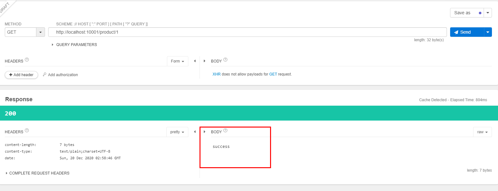

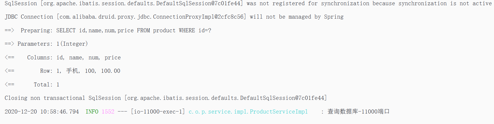


==正常测试请求,没有并发时==

在浏览器手动发送请求结果均为正常显示,第一次缓存不存在则会直接查询数据库,再次出发请求时会执行redis.

压力测试 每秒中200请求压力测试

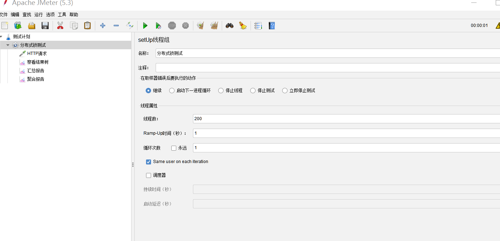


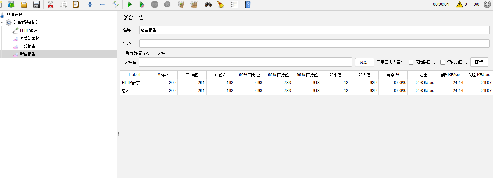

压力测试结果正常,因为在redis中已存在缓存数据所以在控制台打印的结果都不会出现执行mysql查询语句

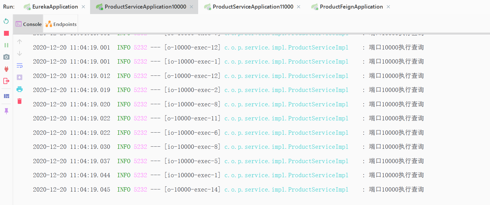

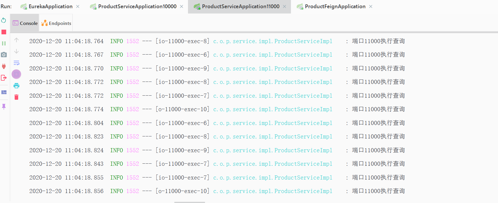

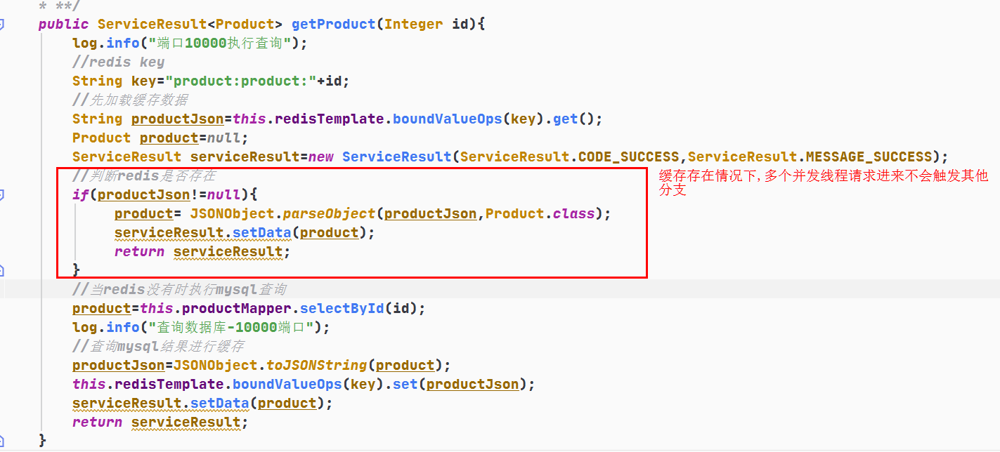

## 并发请求缓存未命中

再次执行压力测试,这次手动将redis刚缓存的数据删除

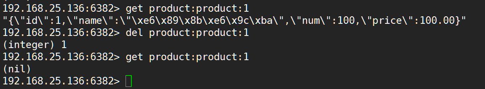

继续执行刚才的压力测试每秒200线程数并发

product10000端口结果:

```
2020-12-20 11:10:50.500  INFO 5232 --- [o-10000-exec-11] c.o.p.service.impl.ProductServiceImpl    : 端口10000执行查询
2020-12-20 11:10:50.501  INFO 5232 --- [io-10000-exec-8] c.o.p.service.impl.ProductServiceImpl    : 端口10000执行查询
2020-12-20 11:10:50.506  INFO 5232 --- [io-10000-exec-4] c.o.p.service.impl.ProductServiceImpl    : 端口10000执行查询
2020-12-20 11:10:50.511  INFO 5232 --- [io-10000-exec-2] c.o.p.service.impl.ProductServiceImpl    : 端口10000执行查询
Creating a new SqlSession
Creating a new SqlSession
Creating a new SqlSession
Creating a new SqlSession
2020-12-20 11:10:50.515  INFO 5232 --- [io-10000-exec-6] c.o.p.service.impl.ProductServiceImpl    : 端口10000执行查询
Creating a new SqlSession
SqlSession [org.apache.ibatis.session.defaults.DefaultSqlSession@7070110d] was not registered for synchronization because synchronization is not active
SqlSession [org.apache.ibatis.session.defaults.DefaultSqlSession@6eb47580] was not registered for synchronization because synchronization is not active
SqlSession [org.apache.ibatis.session.defaults.DefaultSqlSession@7e16bcd] was not registered for synchronization because synchronization is not active
SqlSession [org.apache.ibatis.session.defaults.DefaultSqlSession@1961b641] was not registered for synchronization because synchronization is not active
SqlSession [org.apache.ibatis.session.defaults.DefaultSqlSession@11eff69b] was not registered for synchronization because synchronization is not active
2020-12-20 11:10:50.523  INFO 5232 --- [o-10000-exec-10] c.o.p.service.impl.ProductServiceImpl    : 端口10000执行查询
Creating a new SqlSession
SqlSession [org.apache.ibatis.session.defaults.DefaultSqlSession@1d727a56] was not registered for synchronization because synchronization is not active
2020-12-20 11:10:50.534  INFO 5232 --- [io-10000-exec-5] c.o.p.service.impl.ProductServiceImpl    : 端口10000执行查询
Creating a new SqlSession
SqlSession [org.apache.ibatis.session.defaults.DefaultSqlSession@1c94b845] was not registered for synchronization because synchronization is not active
2020-12-20 11:10:50.542  INFO 5232 --- [io-10000-exec-1] c.o.p.service.impl.ProductServiceImpl    : 端口10000执行查询
Creating a new SqlSession
SqlSession [org.apache.ibatis.session.defaults.DefaultSqlSession@1f3541ad] was not registered for synchronization because synchronization is not active
2020-12-20 11:10:50.553  INFO 5232 --- [io-10000-exec-7] c.o.p.service.impl.ProductServiceImpl    : 端口10000执行查询
Creating a new SqlSession
SqlSession [org.apache.ibatis.session.defaults.DefaultSqlSession@3ffe0cf] was not registered for synchronization because synchronization is not active
2020-12-20 11:10:50.562  INFO 5232 --- [o-10000-exec-14] c.o.p.service.impl.ProductServiceImpl    : 端口10000执行查询
Creating a new SqlSession
SqlSession [org.apache.ibatis.session.defaults.DefaultSqlSession@1a74f14d] was not registered for synchronization because synchronization is not active
JDBC Connection [com.alibaba.druid.proxy.jdbc.ConnectionProxyImpl@677d1644] will not be managed by Spring
JDBC Connection [com.alibaba.druid.proxy.jdbc.ConnectionProxyImpl@54136e51] will not be managed by Spring
JDBC Connection [com.alibaba.druid.proxy.jdbc.ConnectionProxyImpl@4d45bd39] will not be managed by Spring
==>  Preparing: SELECT id,name,num,price FROM product WHERE id=?
==>  Preparing: SELECT id,name,num,price FROM product WHERE id=?
==>  Preparing: SELECT id,name,num,price FROM product WHERE id=?
JDBC Connection [com.alibaba.druid.proxy.jdbc.ConnectionProxyImpl@4ce931ec] will not be managed by Spring
==>  Preparing: SELECT id,name,num,price FROM product WHERE id=?
JDBC Connection [com.alibaba.druid.proxy.jdbc.ConnectionProxyImpl@4796f924] will not be managed by Spring
==>  Preparing: SELECT id,name,num,price FROM product WHERE id=?
2020-12-20 11:10:50.580  INFO 5232 --- [o-10000-exec-15] c.o.p.service.impl.ProductServiceImpl    : 端口10000执行查询
Creating a new SqlSession
SqlSession [org.apache.ibatis.session.defaults.DefaultSqlSession@f0cedaf] was not registered for synchronization because synchronization is not active
JDBC Connection [com.alibaba.druid.proxy.jdbc.ConnectionProxyImpl@31f330dd] will not be managed by Spring
==>  Preparing: SELECT id,name,num,price FROM product WHERE id=?
JDBC Connection [com.alibaba.druid.proxy.jdbc.ConnectionProxyImpl@27832188] will not be managed by Spring
==>  Preparing: SELECT id,name,num,price FROM product WHERE id=?
JDBC Connection [com.alibaba.druid.proxy.jdbc.ConnectionProxyImpl@385f18d3] will not be managed by Spring
==>  Preparing: SELECT id,name,num,price FROM product WHERE id=?
2020-12-20 11:10:50.645  INFO 5232 --- [o-10000-exec-16] c.o.p.service.impl.ProductServiceImpl    : 端口10000执行查询
2020-12-20 11:10:50.650  INFO 5232 --- [o-10000-exec-18] c.o.p.service.impl.ProductServiceImpl    : 端口10000执行查询
2020-12-20 11:10:50.655  INFO 5232 --- [o-10000-exec-19] c.o.p.service.impl.ProductServiceImpl    : 端口10000执行查询
2020-12-20 11:10:50.656  INFO 5232 --- [o-10000-exec-16] c.o.p.service.impl.ProductServiceImpl    : 端口10000执行查询
2020-12-20 11:10:50.677  INFO 5232 --- [o-10000-exec-17] c.o.p.service.impl.ProductServiceImpl    : 端口10000执行查询
2020-12-20 11:10:50.680  INFO 5232 --- [o-10000-exec-19] c.o.p.service.impl.ProductServiceImpl    : 端口10000执行查询
2020-12-20 11:10:50.685  INFO 5232 --- [o-10000-exec-16] c.o.p.service.impl.ProductServiceImpl    : 端口10000执行查询
JDBC Connection [com.alibaba.druid.proxy.jdbc.ConnectionProxyImpl@78931254] will not be managed by Spring
==>  Preparing: SELECT id,name,num,price FROM product WHERE id=?
2020-12-20 11:10:50.688  INFO 5232 --- [o-10000-exec-21] c.o.p.service.impl.ProductServiceImpl    : 端口10000执行查询
2020-12-20 11:10:50.688  INFO 5232 --- [o-10000-exec-20] c.o.p.service.impl.ProductServiceImpl    : 端口10000执行查询
2020-12-20 11:10:50.689  INFO 5232 --- [o-10000-exec-19] c.o.p.service.impl.ProductServiceImpl    : 端口10000执行查询
2020-12-20 11:10:50.702  INFO 5232 --- [o-10000-exec-17] c.o.p.service.impl.ProductServiceImpl    : 端口10000执行查询
JDBC Connection [com.alibaba.druid.proxy.jdbc.ConnectionProxyImpl@14b30c73] will not be managed by Spring
==>  Preparing: SELECT id,name,num,price FROM product WHERE id=?
2020-12-20 11:10:50.708  INFO 5232 --- [o-10000-exec-18] c.o.p.service.impl.ProductServiceImpl    : 端口10000执行查询
2020-12-20 11:10:50.743  INFO 5232 --- [o-10000-exec-16] c.o.p.service.impl.ProductServiceImpl    : 端口10000执行查询
2020-12-20 11:10:50.771  INFO 5232 --- [o-10000-exec-16] c.o.p.service.impl.ProductServiceImpl    : 端口10000执行查询
2020-12-20 11:10:50.784  INFO 5232 --- [o-10000-exec-19] c.o.p.service.impl.ProductServiceImpl    : 端口10000执行查询
JDBC Connection [com.alibaba.druid.proxy.jdbc.ConnectionProxyImpl@1cb123e] will not be managed by Spring
==>  Preparing: SELECT id,name,num,price FROM product WHERE id=?
2020-12-20 11:10:50.790  INFO 5232 --- [o-10000-exec-20] c.o.p.service.impl.ProductServiceImpl    : 端口10000执行查询
2020-12-20 11:10:50.793  INFO 5232 --- [o-10000-exec-17] c.o.p.service.impl.ProductServiceImpl    : 端口10000执行查询
2020-12-20 11:10:50.799  INFO 5232 --- [o-10000-exec-17] c.o.p.service.impl.ProductServiceImpl    : 端口10000执行查询
2020-12-20 11:10:50.802  INFO 5232 --- [o-10000-exec-18] c.o.p.service.impl.ProductServiceImpl    : 端口10000执行查询
2020-12-20 11:10:50.803  INFO 5232 --- [o-10000-exec-17] c.o.p.service.impl.ProductServiceImpl    : 端口10000执行查询
2020-12-20 11:10:50.808  INFO 5232 --- [o-10000-exec-18] c.o.p.service.impl.ProductServiceImpl    : 端口10000执行查询
2020-12-20 11:10:50.808  INFO 5232 --- [o-10000-exec-17] c.o.p.service.impl.ProductServiceImpl    : 端口10000执行查询
2020-12-20 11:10:50.817  INFO 5232 --- [o-10000-exec-18] c.o.p.service.impl.ProductServiceImpl    : 端口10000执行查询
==> Parameters: 1(Integer)
==> Parameters: 1(Integer)
==> Parameters: 1(Integer)
==> Parameters: 1(Integer)
==> Parameters: 1(Integer)
==> Parameters: 1(Integer)
==> Parameters: 1(Integer)
2020-12-20 11:10:50.826  INFO 5232 --- [o-10000-exec-16] c.o.p.service.impl.ProductServiceImpl    : 端口10000执行查询
==> Parameters: 1(Integer)
==> Parameters: 1(Integer)
==> Parameters: 1(Integer)
==> Parameters: 1(Integer)
2020-12-20 11:10:50.836  INFO 5232 --- [o-10000-exec-19] c.o.p.service.impl.ProductServiceImpl    : 端口10000执行查询
<==    Columns: id, name, num, price
<==        Row: 1, 手机, 100, 100.00
<==    Columns: id, name, num, price
<==        Row: 1, 手机, 100, 100.00
<==    Columns: id, name, num, price
<==        Row: 1, 手机, 100, 100.00
<==    Columns: id, name, num, price
<==        Row: 1, 手机, 100, 100.00
2020-12-20 11:10:50.846  INFO 5232 --- [o-10000-exec-20] c.o.p.service.impl.ProductServiceImpl    : 端口10000执行查询
<==      Total: 1
<==      Total: 1
<==      Total: 1
<==      Total: 1
Closing non transactional SqlSession [org.apache.ibatis.session.defaults.DefaultSqlSession@1f3541ad]
Closing non transactional SqlSession [org.apache.ibatis.session.defaults.DefaultSqlSession@1a74f14d]
2020-12-20 11:10:50.848  INFO 5232 --- [io-10000-exec-1] c.o.p.service.impl.ProductServiceImpl    : 查询数据库-10000端口
2020-12-20 11:10:50.848  INFO 5232 --- [o-10000-exec-14] c.o.p.service.impl.ProductServiceImpl    : 查询数据库-10000端口
Closing non transactional SqlSession [org.apache.ibatis.session.defaults.DefaultSqlSession@11eff69b]
Closing non transactional SqlSession [org.apache.ibatis.session.defaults.DefaultSqlSession@1c94b845]
2020-12-20 11:10:50.849  INFO 5232 --- [o-10000-exec-11] c.o.p.service.impl.ProductServiceImpl    : 查询数据库-10000端口
2020-12-20 11:10:50.849  INFO 5232 --- [io-10000-exec-5] c.o.p.service.impl.ProductServiceImpl    : 查询数据库-10000端口
2020-12-20 11:10:50.867  INFO 5232 --- [o-10000-exec-17] c.o.p.service.impl.ProductServiceImpl    : 端口10000执行查询
2020-12-20 11:10:50.869  INFO 5232 --- [o-10000-exec-21] c.o.p.service.impl.ProductServiceImpl    : 端口10000执行查询
2020-12-20 11:10:50.877  INFO 5232 --- [o-10000-exec-14] c.o.p.service.impl.ProductServiceImpl    : 端口10000执行查询
2020-12-20 11:10:50.888  INFO 5232 --- [io-10000-exec-1] c.o.p.service.impl.ProductServiceImpl    : 端口10000执行查询
2020-12-20 11:10:50.892  INFO 5232 --- [o-10000-exec-19] c.o.p.service.impl.ProductServiceImpl    : 端口10000执行查询
2020-12-20 11:10:50.897  INFO 5232 --- [o-10000-exec-20] c.o.p.service.impl.ProductServiceImpl    : 端口10000执行查询
2020-12-20 11:10:50.913  INFO 5232 --- [o-10000-exec-11] c.o.p.service.impl.ProductServiceImpl    : 端口10000执行查询
2020-12-20 11:10:50.917  INFO 5232 --- [io-10000-exec-5] c.o.p.service.impl.ProductServiceImpl    : 端口10000执行查询
<==    Columns: id, name, num, price
<==        Row: 1, 手机, 100, 100.00
<==      Total: 1
Closing non transactional SqlSession [org.apache.ibatis.session.defaults.DefaultSqlSession@3ffe0cf]
2020-12-20 11:10:50.920  INFO 5232 --- [io-10000-exec-7] c.o.p.service.impl.ProductServiceImpl    : 查询数据库-10000端口
<==    Columns: id, name, num, price
<==        Row: 1, 手机, 100, 100.00
<==      Total: 1
<==    Columns: id, name, num, price
Closing non transactional SqlSession [org.apache.ibatis.session.defaults.DefaultSqlSession@1961b641]
<==        Row: 1, 手机, 100, 100.00
2020-12-20 11:10:50.930  INFO 5232 --- [io-10000-exec-2] c.o.p.service.impl.ProductServiceImpl    : 查询数据库-10000端口
<==      Total: 1
Closing non transactional SqlSession [org.apache.ibatis.session.defaults.DefaultSqlSession@f0cedaf]
2020-12-20 11:10:50.930  INFO 5232 --- [o-10000-exec-15] c.o.p.service.impl.ProductServiceImpl    : 查询数据库-10000端口
<==    Columns: id, name, num, price
<==        Row: 1, 手机, 100, 100.00
<==      Total: 1
<==    Columns: id, name, num, price
<==        Row: 1, 手机, 100, 100.00
2020-12-20 11:10:50.933  INFO 5232 --- [o-10000-exec-17] c.o.p.service.impl.ProductServiceImpl    : 端口10000执行查询
<==      Total: 1
Closing non transactional SqlSession [org.apache.ibatis.session.defaults.DefaultSqlSession@6eb47580]
<==    Columns: id, name, num, price
2020-12-20 11:10:50.933  INFO 5232 --- [io-10000-exec-8] c.o.p.service.impl.ProductServiceImpl    : 查询数据库-10000端口
<==        Row: 1, 手机, 100, 100.00
Closing non transactional SqlSession [org.apache.ibatis.session.defaults.DefaultSqlSession@1d727a56]
<==      Total: 1
2020-12-20 11:10:50.934  INFO 5232 --- [o-10000-exec-10] c.o.p.service.impl.ProductServiceImpl    : 查询数据库-10000端口
Closing non transactional SqlSession [org.apache.ibatis.session.defaults.DefaultSqlSession@7e16bcd]
2020-12-20 11:10:50.934  INFO 5232 --- [io-10000-exec-6] c.o.p.service.impl.ProductServiceImpl    : 查询数据库-10000端口
<==    Columns: id, name, num, price
<==        Row: 1, 手机, 100, 100.00
<==      Total: 1
Closing non transactional SqlSession [org.apache.ibatis.session.defaults.DefaultSqlSession@7070110d]
2020-12-20 11:10:50.939  INFO 5232 --- [io-10000-exec-4] c.o.p.service.impl.ProductServiceImpl    : 查询数据库-10000端口
2020-12-20 11:10:50.942  INFO 5232 --- [o-10000-exec-17] c.o.p.service.impl.ProductServiceImpl    : 端口10000执行查询
2020-12-20 11:10:50.958  INFO 5232 --- [o-10000-exec-16] c.o.p.service.impl.ProductServiceImpl    : 端口10000执行查询
2020-12-20 11:10:50.970  INFO 5232 --- [o-10000-exec-14] c.o.p.service.impl.ProductServiceImpl    : 端口10000执行查询
2020-12-20 11:10:50.973  INFO 5232 --- [o-10000-exec-20] c.o.p.service.impl.ProductServiceImpl    : 端口10000执行查询
2020-12-20 11:10:50.987  INFO 5232 --- [o-10000-exec-19] c.o.p.service.impl.ProductServiceImpl    : 端口10000执行查询
2020-12-20 11:10:50.994  INFO 5232 --- [io-10000-exec-1] c.o.p.service.impl.ProductServiceImpl    : 端口10000执行查询
2020-12-20 11:10:51.007  INFO 5232 --- [io-10000-exec-5] c.o.p.service.impl.ProductServiceImpl    : 端口10000执行查询
2020-12-20 11:10:51.014  INFO 5232 --- [o-10000-exec-11] c.o.p.service.impl.ProductServiceImpl    : 端口10000执行查询
2020-12-20 11:10:51.026  INFO 5232 --- [io-10000-exec-7] c.o.p.service.impl.ProductServiceImpl    : 端口10000执行查询
2020-12-20 11:10:51.034  INFO 5232 --- [o-10000-exec-15] c.o.p.service.impl.ProductServiceImpl    : 端口10000执行查询
2020-12-20 11:10:51.047  INFO 5232 --- [io-10000-exec-2] c.o.p.service.impl.ProductServiceImpl    : 端口10000执行查询
2020-12-20 11:10:51.054  INFO 5232 --- [o-10000-exec-21] c.o.p.service.impl.ProductServiceImpl    : 端口10000执行查询
2020-12-20 11:10:51.066  INFO 5232 --- [o-10000-exec-10] c.o.p.service.impl.ProductServiceImpl    : 端口10000执行查询
2020-12-20 11:10:51.072  INFO 5232 --- [io-10000-exec-8] c.o.p.service.impl.ProductServiceImpl    : 端口10000执行查询
2020-12-20 11:10:51.087  INFO 5232 --- [io-10000-exec-4] c.o.p.service.impl.ProductServiceImpl    : 端口10000执行查询
2020-12-20 11:10:51.093  INFO 5232 --- [io-10000-exec-6] c.o.p.service.impl.ProductServiceImpl    : 端口10000执行查询
2020-12-20 11:10:51.106  INFO 5232 --- [o-10000-exec-17] c.o.p.service.impl.ProductServiceImpl    : 端口10000执行查询
2020-12-20 11:10:51.113  INFO 5232 --- [o-10000-exec-18] c.o.p.service.impl.ProductServiceImpl    : 端口10000执行查询
2020-12-20 11:10:51.125  INFO 5232 --- [o-10000-exec-16] c.o.p.service.impl.ProductServiceImpl    : 端口10000执行查询
2020-12-20 11:10:51.134  INFO 5232 --- [o-10000-exec-14] c.o.p.service.impl.ProductServiceImpl    : 端口10000执行查询
2020-12-20 11:10:51.145  INFO 5232 --- [o-10000-exec-20] c.o.p.service.impl.ProductServiceImpl    : 端口10000执行查询
2020-12-20 11:10:51.152  INFO 5232 --- [o-10000-exec-19] c.o.p.service.impl.ProductServiceImpl    : 端口10000执行查询
2020-12-20 11:10:51.164  INFO 5232 --- [io-10000-exec-1] c.o.p.service.impl.ProductServiceImpl    : 端口10000执行查询
2020-12-20 11:10:51.171  INFO 5232 --- [io-10000-exec-5] c.o.p.service.impl.ProductServiceImpl    : 端口10000执行查询
2020-12-20 11:10:51.180  INFO 5232 --- [o-10000-exec-11] c.o.p.service.impl.ProductServiceImpl    : 端口10000执行查询
2020-12-20 11:10:51.192  INFO 5232 --- [io-10000-exec-7] c.o.p.service.impl.ProductServiceImpl    : 端口10000执行查询
2020-12-20 11:10:51.204  INFO 5232 --- [o-10000-exec-15] c.o.p.service.impl.ProductServiceImpl    : 端口10000执行查询
2020-12-20 11:10:51.213  INFO 5232 --- [io-10000-exec-2] c.o.p.service.impl.ProductServiceImpl    : 端口10000执行查询
2020-12-20 11:10:51.220  INFO 5232 --- [o-10000-exec-21] c.o.p.service.impl.ProductServiceImpl    : 端口10000执行查询
2020-12-20 11:10:51.228  INFO 5232 --- [o-10000-exec-10] c.o.p.service.impl.ProductServiceImpl    : 端口10000执行查询
2020-12-20 11:10:51.234  INFO 5232 --- [io-10000-exec-8] c.o.p.service.impl.ProductServiceImpl    : 端口10000执行查询
2020-12-20 11:10:51.243  INFO 5232 --- [io-10000-exec-4] c.o.p.service.impl.ProductServiceImpl    : 端口10000执行查询
2020-12-20 11:10:51.252  INFO 5232 --- [io-10000-exec-6] c.o.p.service.impl.ProductServiceImpl    : 端口10000执行查询
2020-12-20 11:10:51.262  INFO 5232 --- [o-10000-exec-17] c.o.p.service.impl.ProductServiceImpl    : 端口10000执行查询
2020-12-20 11:10:51.272  INFO 5232 --- [o-10000-exec-18] c.o.p.service.impl.ProductServiceImpl    : 端口10000执行查询
2020-12-20 11:10:51.281  INFO 5232 --- [o-10000-exec-16] c.o.p.service.impl.ProductServiceImpl    : 端口10000执行查询
2020-12-20 11:10:51.302  INFO 5232 --- [o-10000-exec-14] c.o.p.service.impl.ProductServiceImpl    : 端口10000执行查询
2020-12-20 11:10:51.307  INFO 5232 --- [o-10000-exec-20] c.o.p.service.impl.ProductServiceImpl    : 端口10000执行查询
2020-12-20 11:10:51.324  INFO 5232 --- [o-10000-exec-19] c.o.p.service.impl.ProductServiceImpl    : 端口10000执行查询
2020-12-20 11:10:51.340  INFO 5232 --- [io-10000-exec-1] c.o.p.service.impl.ProductServiceImpl    : 端口10000执行查询
2020-12-20 11:10:51.346  INFO 5232 --- [io-10000-exec-5] c.o.p.service.impl.ProductServiceImpl    : 端口10000执行查询
2020-12-20 11:10:51.361  INFO 5232 --- [o-10000-exec-11] c.o.p.service.impl.ProductServiceImpl    : 端口10000执行查询
2020-12-20 11:10:51.367  INFO 5232 --- [io-10000-exec-7] c.o.p.service.impl.ProductServiceImpl    : 端口10000执行查询
2020-12-20 11:10:51.387  INFO 5232 --- [o-10000-exec-15] c.o.p.service.impl.ProductServiceImpl    : 端口10000执行查询
2020-12-20 11:10:51.389  INFO 5232 --- [io-10000-exec-2] c.o.p.service.impl.ProductServiceImpl    : 端口10000执行查询
2020-12-20 11:10:51.412  INFO 5232 --- [o-10000-exec-21] c.o.p.service.impl.ProductServiceImpl    : 端口10000执行查询
2020-12-20 11:10:51.414  INFO 5232 --- [o-10000-exec-10] c.o.p.service.impl.ProductServiceImpl    : 端口10000执行查询
2020-12-20 11:10:51.438  INFO 5232 --- [io-10000-exec-8] c.o.p.service.impl.ProductServiceImpl    : 端口10000执行查询
2020-12-20 11:10:51.451  INFO 5232 --- [io-10000-exec-4] c.o.p.service.impl.ProductServiceImpl    : 端口10000执行查询
2020-12-20 11:10:51.455  INFO 5232 --- [io-10000-exec-6] c.o.p.service.impl.ProductServiceImpl    : 端口10000执行查询
2020-12-20 11:10:51.456  INFO 5232 --- [o-10000-exec-17] c.o.p.service.impl.ProductServiceImpl    : 端口10000执行查询
2020-12-20 11:10:51.463  INFO 5232 --- [o-10000-exec-18] c.o.p.service.impl.ProductServiceImpl    : 端口10000执行查询
2020-12-20 11:10:51.466  INFO 5232 --- [o-10000-exec-16] c.o.p.service.impl.ProductServiceImpl    : 端口10000执行查询
2020-12-20 11:10:51.477  INFO 5232 --- [o-10000-exec-14] c.o.p.service.impl.ProductServiceImpl    : 端口10000执行查询

```

product11000结果

```
2020-12-20 11:10:50.498  INFO 1552 --- [io-11000-exec-5] c.o.p.service.impl.ProductServiceImpl    : 端口11000执行查询
2020-12-20 11:10:50.499  INFO 1552 --- [io-11000-exec-4] c.o.p.service.impl.ProductServiceImpl    : 端口11000执行查询
Creating a new SqlSession
SqlSession [org.apache.ibatis.session.defaults.DefaultSqlSession@77a7c03d] was not registered for synchronization because synchronization is not active
Creating a new SqlSession
SqlSession [org.apache.ibatis.session.defaults.DefaultSqlSession@140dfcd5] was not registered for synchronization because synchronization is not active
2020-12-20 11:10:50.505  INFO 1552 --- [io-11000-exec-8] c.o.p.service.impl.ProductServiceImpl    : 端口11000执行查询
2020-12-20 11:10:50.512  INFO 1552 --- [io-11000-exec-7] c.o.p.service.impl.ProductServiceImpl    : 端口11000执行查询
Creating a new SqlSession
SqlSession [org.apache.ibatis.session.defaults.DefaultSqlSession@2981dcea] was not registered for synchronization because synchronization is not active
Creating a new SqlSession
SqlSession [org.apache.ibatis.session.defaults.DefaultSqlSession@21088b75] was not registered for synchronization because synchronization is not active
2020-12-20 11:10:50.518  INFO 1552 --- [io-11000-exec-2] c.o.p.service.impl.ProductServiceImpl    : 端口11000执行查询
Creating a new SqlSession
SqlSession [org.apache.ibatis.session.defaults.DefaultSqlSession@31d0f5b6] was not registered for synchronization because synchronization is not active
2020-12-20 11:10:50.528  INFO 1552 --- [io-11000-exec-9] c.o.p.service.impl.ProductServiceImpl    : 端口11000执行查询
Creating a new SqlSession
SqlSession [org.apache.ibatis.session.defaults.DefaultSqlSession@73e46c82] was not registered for synchronization because synchronization is not active
2020-12-20 11:10:50.538  INFO 1552 --- [io-11000-exec-3] c.o.p.service.impl.ProductServiceImpl    : 端口11000执行查询
Creating a new SqlSession
SqlSession [org.apache.ibatis.session.defaults.DefaultSqlSession@46a2c715] was not registered for synchronization because synchronization is not active
2020-12-20 11:10:50.549  INFO 1552 --- [o-11000-exec-10] c.o.p.service.impl.ProductServiceImpl    : 端口11000执行查询
Creating a new SqlSession
SqlSession [org.apache.ibatis.session.defaults.DefaultSqlSession@12f10978] was not registered for synchronization because synchronization is not active
2020-12-20 11:10:50.558  INFO 1552 --- [io-11000-exec-6] c.o.p.service.impl.ProductServiceImpl    : 端口11000执行查询
Creating a new SqlSession
SqlSession [org.apache.ibatis.session.defaults.DefaultSqlSession@10fabbf9] was not registered for synchronization because synchronization is not active
2020-12-20 11:10:50.566  INFO 1552 --- [io-11000-exec-1] c.o.p.service.impl.ProductServiceImpl    : 端口11000执行查询
Creating a new SqlSession
SqlSession [org.apache.ibatis.session.defaults.DefaultSqlSession@4347a103] was not registered for synchronization because synchronization is not active
JDBC Connection [com.alibaba.druid.proxy.jdbc.ConnectionProxyImpl@108ca45f] will not be managed by Spring
==>  Preparing: SELECT id,name,num,price FROM product WHERE id=?
==> Parameters: 1(Integer)
JDBC Connection [com.alibaba.druid.proxy.jdbc.ConnectionProxyImpl@6b1b60b] will not be managed by Spring
==>  Preparing: SELECT id,name,num,price FROM product WHERE id=?
JDBC Connection [com.alibaba.druid.proxy.jdbc.ConnectionProxyImpl@4d85df70] will not be managed by Spring
==>  Preparing: SELECT id,name,num,price FROM product WHERE id=?
==> Parameters: 1(Integer)
==> Parameters: 1(Integer)
JDBC Connection [com.alibaba.druid.proxy.jdbc.ConnectionProxyImpl@787c9f94] will not be managed by Spring
==>  Preparing: SELECT id,name,num,price FROM product WHERE id=?
==> Parameters: 1(Integer)
JDBC Connection [com.alibaba.druid.proxy.jdbc.ConnectionProxyImpl@21672d9d] will not be managed by Spring
==>  Preparing: SELECT id,name,num,price FROM product WHERE id=?
==> Parameters: 1(Integer)
JDBC Connection [com.alibaba.druid.proxy.jdbc.ConnectionProxyImpl@1ba8882a] will not be managed by Spring
==>  Preparing: SELECT id,name,num,price FROM product WHERE id=?
==> Parameters: 1(Integer)
<==    Columns: id, name, num, price
<==        Row: 1, 手机, 100, 100.00
<==    Columns: id, name, num, price
<==      Total: 1
<==        Row: 1, 手机, 100, 100.00
<==      Total: 1
Closing non transactional SqlSession [org.apache.ibatis.session.defaults.DefaultSqlSession@140dfcd5]
2020-12-20 11:10:50.592  INFO 1552 --- [io-11000-exec-5] c.o.p.service.impl.ProductServiceImpl    : 查询数据库-11000端口
Closing non transactional SqlSession [org.apache.ibatis.session.defaults.DefaultSqlSession@12f10978]
2020-12-20 11:10:50.592  INFO 1552 --- [o-11000-exec-10] c.o.p.service.impl.ProductServiceImpl    : 查询数据库-11000端口
<==    Columns: id, name, num, price
<==        Row: 1, 手机, 100, 100.00
<==    Columns: id, name, num, price
<==        Row: 1, 手机, 100, 100.00
<==    Columns: id, name, num, price
<==      Total: 1
<==        Row: 1, 手机, 100, 100.00
<==      Total: 1
<==      Total: 1
Closing non transactional SqlSession [org.apache.ibatis.session.defaults.DefaultSqlSession@46a2c715]
Closing non transactional SqlSession [org.apache.ibatis.session.defaults.DefaultSqlSession@10fabbf9]
2020-12-20 11:10:50.596  INFO 1552 --- [io-11000-exec-3] c.o.p.service.impl.ProductServiceImpl    : 查询数据库-11000端口
2020-12-20 11:10:50.596  INFO 1552 --- [io-11000-exec-6] c.o.p.service.impl.ProductServiceImpl    : 查询数据库-11000端口
Closing non transactional SqlSession [org.apache.ibatis.session.defaults.DefaultSqlSession@2981dcea]
2020-12-20 11:10:50.597  INFO 1552 --- [io-11000-exec-8] c.o.p.service.impl.ProductServiceImpl    : 查询数据库-11000端口
JDBC Connection [com.alibaba.druid.proxy.jdbc.ConnectionProxyImpl@73e3de3f] will not be managed by Spring
==>  Preparing: SELECT id,name,num,price FROM product WHERE id=?
<==    Columns: id, name, num, price
<==        Row: 1, 手机, 100, 100.00
<==      Total: 1
Closing non transactional SqlSession [org.apache.ibatis.session.defaults.DefaultSqlSession@73e46c82]
2020-12-20 11:10:50.612  INFO 1552 --- [io-11000-exec-9] c.o.p.service.impl.ProductServiceImpl    : 查询数据库-11000端口
2020-12-20 11:10:50.614  INFO 1552 --- [o-11000-exec-10] c.o.p.service.impl.ProductServiceImpl    : 端口11000执行查询
2020-12-20 11:10:50.614  INFO 1552 --- [io-11000-exec-5] c.o.p.service.impl.ProductServiceImpl    : 端口11000执行查询
2020-12-20 11:10:50.616  INFO 1552 --- [o-11000-exec-11] c.o.p.service.impl.ProductServiceImpl    : 端口11000执行查询
==> Parameters: 1(Integer)
2020-12-20 11:10:50.619  INFO 1552 --- [io-11000-exec-3] c.o.p.service.impl.ProductServiceImpl    : 端口11000执行查询
JDBC Connection [com.alibaba.druid.proxy.jdbc.ConnectionProxyImpl@35ef7754] will not be managed by Spring
==>  Preparing: SELECT id,name,num,price FROM product WHERE id=?
==> Parameters: 1(Integer)
<==    Columns: id, name, num, price
<==        Row: 1, 手机, 100, 100.00
2020-12-20 11:10:50.627  INFO 1552 --- [io-11000-exec-6] c.o.p.service.impl.ProductServiceImpl    : 端口11000执行查询
<==      Total: 1
Closing non transactional SqlSession [org.apache.ibatis.session.defaults.DefaultSqlSession@21088b75]
2020-12-20 11:10:50.628  INFO 1552 --- [io-11000-exec-7] c.o.p.service.impl.ProductServiceImpl    : 查询数据库-11000端口
<==    Columns: id, name, num, price
<==        Row: 1, 手机, 100, 100.00
<==      Total: 1
JDBC Connection [com.alibaba.druid.proxy.jdbc.ConnectionProxyImpl@2cfc8c56] will not be managed by Spring
==>  Preparing: SELECT id,name,num,price FROM product WHERE id=?
Closing non transactional SqlSession [org.apache.ibatis.session.defaults.DefaultSqlSession@31d0f5b6]
2020-12-20 11:10:50.629  INFO 1552 --- [io-11000-exec-2] c.o.p.service.impl.ProductServiceImpl    : 查询数据库-11000端口
==> Parameters: 1(Integer)
<==    Columns: id, name, num, price
<==        Row: 1, 手机, 100, 100.00
<==      Total: 1
Closing non transactional SqlSession [org.apache.ibatis.session.defaults.DefaultSqlSession@77a7c03d]
2020-12-20 11:10:50.633  INFO 1552 --- [io-11000-exec-4] c.o.p.service.impl.ProductServiceImpl    : 查询数据库-11000端口
2020-12-20 11:10:50.640  INFO 1552 --- [o-11000-exec-11] c.o.p.service.impl.ProductServiceImpl    : 端口11000执行查询
JDBC Connection [com.alibaba.druid.proxy.jdbc.ConnectionProxyImpl@394ba18d] will not be managed by Spring
==>  Preparing: SELECT id,name,num,price FROM product WHERE id=?
==> Parameters: 1(Integer)
2020-12-20 11:10:50.643  INFO 1552 --- [io-11000-exec-9] c.o.p.service.impl.ProductServiceImpl    : 端口11000执行查询
<==    Columns: id, name, num, price
<==        Row: 1, 手机, 100, 100.00
<==      Total: 1
Closing non transactional SqlSession [org.apache.ibatis.session.defaults.DefaultSqlSession@4347a103]
2020-12-20 11:10:50.649  INFO 1552 --- [io-11000-exec-1] c.o.p.service.impl.ProductServiceImpl    : 查询数据库-11000端口
2020-12-20 11:10:50.666  INFO 1552 --- [io-11000-exec-5] c.o.p.service.impl.ProductServiceImpl    : 端口11000执行查询
2020-12-20 11:10:50.668  INFO 1552 --- [io-11000-exec-3] c.o.p.service.impl.ProductServiceImpl    : 端口11000执行查询
2020-12-20 11:10:50.685  INFO 1552 --- [io-11000-exec-8] c.o.p.service.impl.ProductServiceImpl    : 端口11000执行查询
2020-12-20 11:10:50.686  INFO 1552 --- [io-11000-exec-6] c.o.p.service.impl.ProductServiceImpl    : 端口11000执行查询
2020-12-20 11:10:50.704  INFO 1552 --- [io-11000-exec-7] c.o.p.service.impl.ProductServiceImpl    : 端口11000执行查询
2020-12-20 11:10:50.707  INFO 1552 --- [io-11000-exec-7] c.o.p.service.impl.ProductServiceImpl    : 端口11000执行查询
2020-12-20 11:10:50.727  INFO 1552 --- [io-11000-exec-4] c.o.p.service.impl.ProductServiceImpl    : 端口11000执行查询
2020-12-20 11:10:50.739  INFO 1552 --- [o-11000-exec-10] c.o.p.service.impl.ProductServiceImpl    : 端口11000执行查询
2020-12-20 11:10:50.749  INFO 1552 --- [o-11000-exec-11] c.o.p.service.impl.ProductServiceImpl    : 端口11000执行查询
2020-12-20 11:10:50.751  INFO 1552 --- [io-11000-exec-9] c.o.p.service.impl.ProductServiceImpl    : 端口11000执行查询
2020-12-20 11:10:50.778  INFO 1552 --- [io-11000-exec-1] c.o.p.service.impl.ProductServiceImpl    : 端口11000执行查询
2020-12-20 11:10:50.784  INFO 1552 --- [io-11000-exec-5] c.o.p.service.impl.ProductServiceImpl    : 端口11000执行查询
2020-12-20 11:10:50.789  INFO 1552 --- [io-11000-exec-3] c.o.p.service.impl.ProductServiceImpl    : 端口11000执行查询
2020-12-20 11:10:50.793  INFO 1552 --- [io-11000-exec-8] c.o.p.service.impl.ProductServiceImpl    : 端口11000执行查询
2020-12-20 11:10:50.805  INFO 1552 --- [io-11000-exec-6] c.o.p.service.impl.ProductServiceImpl    : 端口11000执行查询
2020-12-20 11:10:50.806  INFO 1552 --- [io-11000-exec-2] c.o.p.service.impl.ProductServiceImpl    : 端口11000执行查询
2020-12-20 11:10:50.825  INFO 1552 --- [io-11000-exec-7] c.o.p.service.impl.ProductServiceImpl    : 端口11000执行查询
2020-12-20 11:10:50.827  INFO 1552 --- [io-11000-exec-4] c.o.p.service.impl.ProductServiceImpl    : 端口11000执行查询
2020-12-20 11:10:50.836  INFO 1552 --- [o-11000-exec-10] c.o.p.service.impl.ProductServiceImpl    : 端口11000执行查询
2020-12-20 11:10:50.852  INFO 1552 --- [io-11000-exec-9] c.o.p.service.impl.ProductServiceImpl    : 端口11000执行查询
2020-12-20 11:10:50.862  INFO 1552 --- [o-11000-exec-11] c.o.p.service.impl.ProductServiceImpl    : 端口11000执行查询
2020-12-20 11:10:50.867  INFO 1552 --- [io-11000-exec-1] c.o.p.service.impl.ProductServiceImpl    : 端口11000执行查询
2020-12-20 11:10:50.883  INFO 1552 --- [io-11000-exec-5] c.o.p.service.impl.ProductServiceImpl    : 端口11000执行查询
2020-12-20 11:10:50.891  INFO 1552 --- [io-11000-exec-3] c.o.p.service.impl.ProductServiceImpl    : 端口11000执行查询
2020-12-20 11:10:50.897  INFO 1552 --- [io-11000-exec-6] c.o.p.service.impl.ProductServiceImpl    : 端口11000执行查询
2020-12-20 11:10:50.903  INFO 1552 --- [io-11000-exec-2] c.o.p.service.impl.ProductServiceImpl    : 端口11000执行查询
2020-12-20 11:10:50.917  INFO 1552 --- [io-11000-exec-4] c.o.p.service.impl.ProductServiceImpl    : 端口11000执行查询
2020-12-20 11:10:50.924  INFO 1552 --- [io-11000-exec-7] c.o.p.service.impl.ProductServiceImpl    : 端口11000执行查询
2020-12-20 11:10:50.950  INFO 1552 --- [o-11000-exec-10] c.o.p.service.impl.ProductServiceImpl    : 端口11000执行查询
2020-12-20 11:10:50.951  INFO 1552 --- [io-11000-exec-9] c.o.p.service.impl.ProductServiceImpl    : 端口11000执行查询
2020-12-20 11:10:50.959  INFO 1552 --- [io-11000-exec-1] c.o.p.service.impl.ProductServiceImpl    : 端口11000执行查询
2020-12-20 11:10:50.972  INFO 1552 --- [o-11000-exec-11] c.o.p.service.impl.ProductServiceImpl    : 端口11000执行查询
2020-12-20 11:10:50.982  INFO 1552 --- [io-11000-exec-5] c.o.p.service.impl.ProductServiceImpl    : 端口11000执行查询
2020-12-20 11:10:50.992  INFO 1552 --- [io-11000-exec-8] c.o.p.service.impl.ProductServiceImpl    : 端口11000执行查询
2020-12-20 11:10:50.998  INFO 1552 --- [io-11000-exec-3] c.o.p.service.impl.ProductServiceImpl    : 端口11000执行查询
2020-12-20 11:10:51.012  INFO 1552 --- [io-11000-exec-6] c.o.p.service.impl.ProductServiceImpl    : 端口11000执行查询
2020-12-20 11:10:51.020  INFO 1552 --- [io-11000-exec-2] c.o.p.service.impl.ProductServiceImpl    : 端口11000执行查询
2020-12-20 11:10:51.032  INFO 1552 --- [io-11000-exec-4] c.o.p.service.impl.ProductServiceImpl    : 端口11000执行查询
2020-12-20 11:10:51.038  INFO 1552 --- [io-11000-exec-7] c.o.p.service.impl.ProductServiceImpl    : 端口11000执行查询
2020-12-20 11:10:51.054  INFO 1552 --- [o-11000-exec-10] c.o.p.service.impl.ProductServiceImpl    : 端口11000执行查询
2020-12-20 11:10:51.059  INFO 1552 --- [io-11000-exec-1] c.o.p.service.impl.ProductServiceImpl    : 端口11000执行查询
2020-12-20 11:10:51.071  INFO 1552 --- [io-11000-exec-9] c.o.p.service.impl.ProductServiceImpl    : 端口11000执行查询
2020-12-20 11:10:51.080  INFO 1552 --- [o-11000-exec-11] c.o.p.service.impl.ProductServiceImpl    : 端口11000执行查询
2020-12-20 11:10:51.093  INFO 1552 --- [io-11000-exec-5] c.o.p.service.impl.ProductServiceImpl    : 端口11000执行查询
2020-12-20 11:10:51.100  INFO 1552 --- [io-11000-exec-8] c.o.p.service.impl.ProductServiceImpl    : 端口11000执行查询
2020-12-20 11:10:51.113  INFO 1552 --- [io-11000-exec-3] c.o.p.service.impl.ProductServiceImpl    : 端口11000执行查询
2020-12-20 11:10:51.120  INFO 1552 --- [io-11000-exec-6] c.o.p.service.impl.ProductServiceImpl    : 端口11000执行查询
2020-12-20 11:10:51.131  INFO 1552 --- [io-11000-exec-2] c.o.p.service.impl.ProductServiceImpl    : 端口11000执行查询
2020-12-20 11:10:51.140  INFO 1552 --- [io-11000-exec-4] c.o.p.service.impl.ProductServiceImpl    : 端口11000执行查询
2020-12-20 11:10:51.150  INFO 1552 --- [io-11000-exec-7] c.o.p.service.impl.ProductServiceImpl    : 端口11000执行查询
2020-12-20 11:10:51.157  INFO 1552 --- [o-11000-exec-10] c.o.p.service.impl.ProductServiceImpl    : 端口11000执行查询
2020-12-20 11:10:51.168  INFO 1552 --- [io-11000-exec-1] c.o.p.service.impl.ProductServiceImpl    : 端口11000执行查询
2020-12-20 11:10:51.174  INFO 1552 --- [io-11000-exec-9] c.o.p.service.impl.ProductServiceImpl    : 端口11000执行查询
2020-12-20 11:10:51.185  INFO 1552 --- [o-11000-exec-11] c.o.p.service.impl.ProductServiceImpl    : 端口11000执行查询
2020-12-20 11:10:51.199  INFO 1552 --- [io-11000-exec-5] c.o.p.service.impl.ProductServiceImpl    : 端口11000执行查询
2020-12-20 11:10:51.205  INFO 1552 --- [io-11000-exec-8] c.o.p.service.impl.ProductServiceImpl    : 端口11000执行查询
2020-12-20 11:10:51.215  INFO 1552 --- [io-11000-exec-3] c.o.p.service.impl.ProductServiceImpl    : 端口11000执行查询
2020-12-20 11:10:51.222  INFO 1552 --- [io-11000-exec-6] c.o.p.service.impl.ProductServiceImpl    : 端口11000执行查询
2020-12-20 11:10:51.228  INFO 1552 --- [io-11000-exec-2] c.o.p.service.impl.ProductServiceImpl    : 端口11000执行查询
2020-12-20 11:10:51.239  INFO 1552 --- [io-11000-exec-4] c.o.p.service.impl.ProductServiceImpl    : 端口11000执行查询
2020-12-20 11:10:51.247  INFO 1552 --- [io-11000-exec-7] c.o.p.service.impl.ProductServiceImpl    : 端口11000执行查询
2020-12-20 11:10:51.257  INFO 1552 --- [o-11000-exec-10] c.o.p.service.impl.ProductServiceImpl    : 端口11000执行查询
2020-12-20 11:10:51.267  INFO 1552 --- [io-11000-exec-1] c.o.p.service.impl.ProductServiceImpl    : 端口11000执行查询
2020-12-20 11:10:51.276  INFO 1552 --- [io-11000-exec-9] c.o.p.service.impl.ProductServiceImpl    : 端口11000执行查询
2020-12-20 11:10:51.299  INFO 1552 --- [o-11000-exec-11] c.o.p.service.impl.ProductServiceImpl    : 端口11000执行查询
2020-12-20 11:10:51.307  INFO 1552 --- [io-11000-exec-5] c.o.p.service.impl.ProductServiceImpl    : 端口11000执行查询
2020-12-20 11:10:51.320  INFO 1552 --- [io-11000-exec-8] c.o.p.service.impl.ProductServiceImpl    : 端口11000执行查询
2020-12-20 11:10:51.326  INFO 1552 --- [io-11000-exec-3] c.o.p.service.impl.ProductServiceImpl    : 端口11000执行查询
2020-12-20 11:10:51.340  INFO 1552 --- [io-11000-exec-6] c.o.p.service.impl.ProductServiceImpl    : 端口11000执行查询
2020-12-20 11:10:51.346  INFO 1552 --- [io-11000-exec-2] c.o.p.service.impl.ProductServiceImpl    : 端口11000执行查询
2020-12-20 11:10:51.362  INFO 1552 --- [io-11000-exec-4] c.o.p.service.impl.ProductServiceImpl    : 端口11000执行查询
2020-12-20 11:10:51.368  INFO 1552 --- [io-11000-exec-7] c.o.p.service.impl.ProductServiceImpl    : 端口11000执行查询
2020-12-20 11:10:51.401  INFO 1552 --- [o-11000-exec-10] c.o.p.service.impl.ProductServiceImpl    : 端口11000执行查询
2020-12-20 11:10:51.408  INFO 1552 --- [io-11000-exec-1] c.o.p.service.impl.ProductServiceImpl    : 端口11000执行查询
2020-12-20 11:10:51.412  INFO 1552 --- [io-11000-exec-1] c.o.p.service.impl.ProductServiceImpl    : 端口11000执行查询
2020-12-20 11:10:51.444  INFO 1552 --- [io-11000-exec-5] c.o.p.service.impl.ProductServiceImpl    : 端口11000执行查询
2020-12-20 11:10:51.446  INFO 1552 --- [o-11000-exec-11] c.o.p.service.impl.ProductServiceImpl    : 端口11000执行查询
2020-12-20 11:10:51.453  INFO 1552 --- [io-11000-exec-8] c.o.p.service.impl.ProductServiceImpl    : 端口11000执行查询
2020-12-20 11:10:51.453  INFO 1552 --- [io-11000-exec-3] c.o.p.service.impl.ProductServiceImpl    : 端口11000执行查询
2020-12-20 11:10:51.455  INFO 1552 --- [io-11000-exec-6] c.o.p.service.impl.ProductServiceImpl    : 端口11000执行查询
2020-12-20 11:10:51.464  INFO 1552 --- [io-11000-exec-2] c.o.p.service.impl.ProductServiceImpl    : 端口11000执行查询
2020-12-20 11:10:51.467  INFO 1552 --- [io-11000-exec-4] c.o.p.service.impl.ProductServiceImpl    : 端口11000执行查询
2020-12-20 11:10:51.482  INFO 1552 --- [io-11000-exec-7] c.o.p.service.impl.ProductServiceImpl    : 端口11000执行查询
```

执行结果可以看出当并发情况下业务层代码出现了问题,本来缓存没有去查询一次数据库即可,但是现在发现查询了很多次

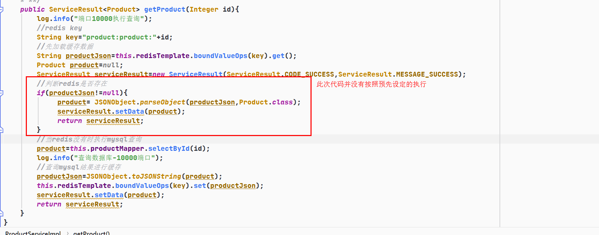

​	其实这个并不是没有执行,而是多个线程都会执行同一段代码,假设这里有100个线程(2台服务方每台100个线程)都在交替执行这个判断,线程1号发现缓存没有就去执行下面的代码,但是redis现在就是没有数据而同时执行判断缓存是否命中的线程不是只有一个,所有线程都要执行那段代码,所以在redis没有结果返回前所有执行过判断的线程都会认为redis没数据要向下执行.所以这就是导致执行mysql查询的多次的原因,也就是他们说的缓存击穿导致mysql压力骤增.所以我就说过线上业务缓存没有直接打回不会落库去执行.

### 

​	在实际场景是如果能够调用这个方法就意味着你的这个数据肯定有缓存,没有缓存的数据怎么能在前端业务中出现口子放进来的?!这个不排除有人就是恶意攻击所以会直接返回null不会让代码出现业务分支还去查询数据库,这就是为何在项目中我要创建一个缓存中心服务,每个查询业务服务不会像单体应用那样先查redis再查mysql的,都是先经过缓存中心获取数据,如果没有就是返回空值.

1.数据添加MySQL后如果是常被使用的一定要缓存,并且不设置过期时间

2.查询缓存后没有直接返回null,不让去查询数据库

## 使用分布式锁解决这个问题

==如果在缓存设计上想先查redis没有在查询mysql并将结果缓存也可以,就是利用锁的机制来完成.这也就是说我们要在业务层的代码中加入锁,谁拿到锁谁执行,没有拿到锁的就要等待,也就是说这个锁必须是公共的且只有一把锁才行.==

## 实现

redis的setnx实现

之前的课上提过这个命令,忘记的去自己看看命令或查查资料

setNX，是set if not exists 的缩写，也就是只有不存在的时候才设置, 设置成功时返回 1 ， 设置失败时返回 0 


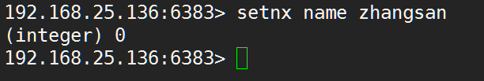

我们利用setnx的这个机制来完成对锁的控制,同时redis本身是单例队列处理的，你再多高并发请求获取锁都是排队进行，也就是只有前边第一个获取成功，后边的都获取失败 既SetNX是原子操作命令

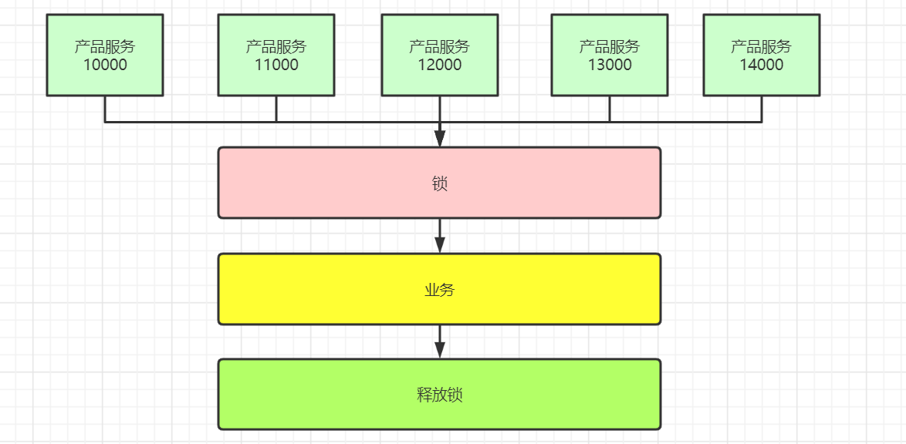

### 加锁释放锁思路

```java
在正常执行业务时要先对代码进行加锁,这把锁是唯一的,不管有多少线程请求进来都是一把,并且只能一个线程获取到锁,其他的线程没有获取到的只能就是等待锁的释放.哪个线程拿到了,哪个线程才有权利执行.加锁时我们注意就是一定要原子操作不能分开,且一定要加过期时间,不能出现死锁的现象.
```

### 官方文档对于解锁

value的值必须是随机数主要是为了更安全的释放锁，释放锁的时候使用脚本告诉Redis:只有key存在并且存储的值和我指定的值一样才能告诉我删除成功。可以通过以下Lua脚本实现：

```
if redis.call("get",KEYS[1]) == ARGV[1] then
    return redis.call("del",KEYS[1])
else
    return 0
end
```

使用这种方式释放锁可以避免删除别的客户端获取成功的锁。举个例子：客户端A取得资源锁，但是紧接着被一个其他操作阻塞了，当客户端A运行完毕其他操作后要释放锁时，原来的锁早已超时并且被Redis自动释放，并且在这期间资源锁又被客户端B再次获取到。如果仅使用DEL命令将key删除，那么这种情况就会把客户端B的锁给删除掉。使用Lua脚本就不会存在这种情况，因为脚本仅会删除value等于客户端A的value的key（value相当于客户端的一个签名）。

这个随机字符串应该怎么设置？我认为它应该是从/dev/urandom产生的一个20字节随机数，但是我想你可以找到比这种方法代价更小的方法，只要这个数在你的任务中是唯一的就行。例如一种安全可行的方法是使用/dev/urandom作为RC4的种子和源产生一个伪随机流;一种更简单的方法是把以毫秒为单位的unix时间和客户端ID拼接起来，理论上不是完全安全，但是在多数情况下可以满足需求.

key的失效时间，被称作“锁定有效期”。它不仅是key自动失效时间，而且还是一个客户端持有锁多长时间后可以被另外一个客户端重新获得。

加锁压测结果:

```
2020-12-20 14:36:09.789  INFO 18376 --- [io-10000-exec-3] c.o.p.service.impl.ProductServiceImpl    : 端口10000执行查询
2020-12-20 14:36:09.789  INFO 18376 --- [o-10000-exec-33] c.o.p.service.impl.ProductServiceImpl    : 端口10000执行查询
2020-12-20 14:36:09.789  INFO 18376 --- [o-10000-exec-48] c.o.p.service.impl.ProductServiceImpl    : 端口10000执行查询
2020-12-20 14:36:09.789  INFO 18376 --- [o-10000-exec-31] c.o.p.service.impl.ProductServiceImpl    : 端口10000执行查询
2020-12-20 14:36:09.790  INFO 18376 --- [o-10000-exec-20] c.o.p.service.impl.ProductServiceImpl    : 端口10000执行查询
2020-12-20 14:36:09.790  INFO 18376 --- [o-10000-exec-35] c.o.p.service.impl.ProductServiceImpl    : 端口10000执行查询
2020-12-20 14:36:09.789  INFO 18376 --- [o-10000-exec-51] c.o.p.service.impl.ProductServiceImpl    : 端口10000执行查询
2020-12-20 14:36:09.789  INFO 18376 --- [o-10000-exec-38] c.o.p.service.impl.ProductServiceImpl    : 端口10000执行查询
2020-12-20 14:36:09.790  INFO 18376 --- [o-10000-exec-56] c.o.p.service.impl.ProductServiceImpl    : 端口10000执行查询
2020-12-20 14:36:09.790  INFO 18376 --- [o-10000-exec-42] c.o.p.service.impl.ProductServiceImpl    : 端口10000执行查询
2020-12-20 14:36:09.790  INFO 18376 --- [o-10000-exec-44] c.o.p.service.impl.ProductServiceImpl    : 端口10000执行查询
2020-12-20 14:36:09.790  INFO 18376 --- [io-10000-exec-7] c.o.p.service.impl.ProductServiceImpl    : 端口10000执行查询
2020-12-20 14:36:09.790  INFO 18376 --- [io-10000-exec-8] c.o.p.service.impl.ProductServiceImpl    : 端口10000执行查询
2020-12-20 14:36:09.790  INFO 18376 --- [o-10000-exec-30] c.o.p.service.impl.ProductServiceImpl    : 端口10000执行查询
2020-12-20 14:36:09.790  INFO 18376 --- [io-10000-exec-2] c.o.p.service.impl.ProductServiceImpl    : 端口10000执行查询
2020-12-20 14:36:09.790  INFO 18376 --- [o-10000-exec-34] c.o.p.service.impl.ProductServiceImpl    : 端口10000执行查询
2020-12-20 14:36:09.791  INFO 18376 --- [o-10000-exec-47] c.o.p.service.impl.ProductServiceImpl    : 端口10000执行查询
2020-12-20 14:36:09.789  INFO 18376 --- [o-10000-exec-40] c.o.p.service.impl.ProductServiceImpl    : 端口10000执行查询
2020-12-20 14:36:09.790  INFO 18376 --- [o-10000-exec-57] c.o.p.service.impl.ProductServiceImpl    : 端口10000执行查询
2020-12-20 14:36:09.791  INFO 18376 --- [o-10000-exec-60] c.o.p.service.impl.ProductServiceImpl    : 端口10000执行查询
2020-12-20 14:36:09.791  INFO 18376 --- [io-10000-exec-1] c.o.p.service.impl.ProductServiceImpl    : 端口10000执行查询
2020-12-20 14:36:09.791  INFO 18376 --- [o-10000-exec-49] c.o.p.service.impl.ProductServiceImpl    : 端口10000执行查询
2020-12-20 14:36:09.791  INFO 18376 --- [o-10000-exec-18] c.o.p.service.impl.ProductServiceImpl    : 端口10000执行查询
2020-12-20 14:36:09.791  INFO 18376 --- [o-10000-exec-25] c.o.p.service.impl.ProductServiceImpl    : 端口10000执行查询
2020-12-20 14:36:09.791  INFO 18376 --- [o-10000-exec-37] c.o.p.service.impl.ProductServiceImpl    : 端口10000执行查询
2020-12-20 14:36:09.791  INFO 18376 --- [o-10000-exec-15] c.o.p.service.impl.ProductServiceImpl    : 端口10000执行查询
2020-12-20 14:36:09.791  INFO 18376 --- [o-10000-exec-19] c.o.p.service.impl.ProductServiceImpl    : 端口10000执行查询
2020-12-20 14:36:09.791  INFO 18376 --- [o-10000-exec-21] c.o.p.service.impl.ProductServiceImpl    : 端口10000执行查询
2020-12-20 14:36:09.791  INFO 18376 --- [o-10000-exec-59] c.o.p.service.impl.ProductServiceImpl    : 端口10000执行查询
2020-12-20 14:36:09.791  INFO 18376 --- [o-10000-exec-16] c.o.p.service.impl.ProductServiceImpl    : 端口10000执行查询
2020-12-20 14:36:09.792  INFO 18376 --- [o-10000-exec-50] c.o.p.service.impl.ProductServiceImpl    : 端口10000执行查询
2020-12-20 14:36:09.792  INFO 18376 --- [o-10000-exec-45] c.o.p.service.impl.ProductServiceImpl    : 端口10000执行查询
2020-12-20 14:36:09.791  INFO 18376 --- [o-10000-exec-55] c.o.p.service.impl.ProductServiceImpl    : 端口10000执行查询
2020-12-20 14:36:09.791  INFO 18376 --- [io-10000-exec-9] c.o.p.service.impl.ProductServiceImpl    : 端口10000执行查询
2020-12-20 14:36:09.792  INFO 18376 --- [io-10000-exec-4] c.o.p.service.impl.ProductServiceImpl    : 端口10000执行查询
2020-12-20 14:36:09.793  INFO 18376 --- [o-10000-exec-10] c.o.p.service.impl.ProductServiceImpl    : 端口10000执行查询
2020-12-20 14:36:09.793  INFO 18376 --- [o-10000-exec-53] c.o.p.service.impl.ProductServiceImpl    : 端口10000执行查询
2020-12-20 14:36:09.793  INFO 18376 --- [o-10000-exec-32] c.o.p.service.impl.ProductServiceImpl    : 端口10000执行查询
2020-12-20 14:36:09.792  INFO 18376 --- [o-10000-exec-28] c.o.p.service.impl.ProductServiceImpl    : 端口10000执行查询
2020-12-20 14:36:09.792  INFO 18376 --- [o-10000-exec-12] c.o.p.service.impl.ProductServiceImpl    : 端口10000执行查询
2020-12-20 14:36:09.793  INFO 18376 --- [o-10000-exec-43] c.o.p.service.impl.ProductServiceImpl    : 端口10000执行查询
2020-12-20 14:36:09.793  INFO 18376 --- [o-10000-exec-17] c.o.p.service.impl.ProductServiceImpl    : 端口10000执行查询
2020-12-20 14:36:09.793  INFO 18376 --- [o-10000-exec-58] c.o.p.service.impl.ProductServiceImpl    : 端口10000执行查询
2020-12-20 14:36:09.793  INFO 18376 --- [o-10000-exec-11] c.o.p.service.impl.ProductServiceImpl    : 端口10000执行查询
2020-12-20 14:36:09.793  INFO 18376 --- [o-10000-exec-14] c.o.p.service.impl.ProductServiceImpl    : 端口10000执行查询
2020-12-20 14:36:09.793  INFO 18376 --- [o-10000-exec-46] c.o.p.service.impl.ProductServiceImpl    : 端口10000执行查询
2020-12-20 14:36:09.792  INFO 18376 --- [io-10000-exec-5] c.o.p.service.impl.ProductServiceImpl    : 端口10000执行查询
2020-12-20 14:36:09.793  INFO 18376 --- [o-10000-exec-22] c.o.p.service.impl.ProductServiceImpl    : 端口10000执行查询
2020-12-20 14:36:09.793  INFO 18376 --- [o-10000-exec-29] c.o.p.service.impl.ProductServiceImpl    : 端口10000执行查询
2020-12-20 14:36:09.793  INFO 18376 --- [o-10000-exec-41] c.o.p.service.impl.ProductServiceImpl    : 端口10000执行查询
2020-12-20 14:36:09.792  INFO 18376 --- [o-10000-exec-24] c.o.p.service.impl.ProductServiceImpl    : 端口10000执行查询
2020-12-20 14:36:09.793  INFO 18376 --- [o-10000-exec-39] c.o.p.service.impl.ProductServiceImpl    : 端口10000执行查询
2020-12-20 14:36:09.793  INFO 18376 --- [o-10000-exec-23] c.o.p.service.impl.ProductServiceImpl    : 端口10000执行查询
2020-12-20 14:36:09.793  INFO 18376 --- [o-10000-exec-26] c.o.p.service.impl.ProductServiceImpl    : 端口10000执行查询
2020-12-20 14:36:09.794  INFO 18376 --- [o-10000-exec-52] c.o.p.service.impl.ProductServiceImpl    : 端口10000执行查询
2020-12-20 14:36:09.794  INFO 18376 --- [io-10000-exec-6] c.o.p.service.impl.ProductServiceImpl    : 端口10000执行查询
2020-12-20 14:36:09.794  INFO 18376 --- [o-10000-exec-36] c.o.p.service.impl.ProductServiceImpl    : 端口10000执行查询
2020-12-20 14:36:09.793  INFO 18376 --- [o-10000-exec-27] c.o.p.service.impl.ProductServiceImpl    : 端口10000执行查询
2020-12-20 14:36:09.793  INFO 18376 --- [o-10000-exec-54] c.o.p.service.impl.ProductServiceImpl    : 端口10000执行查询
2020-12-20 14:36:09.793  INFO 18376 --- [o-10000-exec-13] c.o.p.service.impl.ProductServiceImpl    : 端口10000执行查询
2020-12-20 14:36:09.802  INFO 18376 --- [o-10000-exec-61] c.o.p.service.impl.ProductServiceImpl    : 端口10000执行查询
2020-12-20 14:36:09.813  INFO 18376 --- [o-10000-exec-62] c.o.p.service.impl.ProductServiceImpl    : 端口10000执行查询
true
2020-12-20 14:36:09.815  INFO 18376 --- [io-10000-exec-5] c.o.p.service.impl.ProductServiceImpl    : 获取锁
false
false
false
false
false
false
false
false
false
false
false
false
false
false
false
false
false
false
false
false
false
false
false
false
false
false
false
false
false
false
false
false
false
2020-12-20 14:36:09.826  INFO 18376 --- [o-10000-exec-63] c.o.p.service.impl.ProductServiceImpl    : 端口10000执行查询
false
false
false
false
false
false
false
false
false
false
false
false
false
false
false
false
false
false
false
false
false
false
false
false
Creating a new SqlSession
false
false
false
false
false
SqlSession [org.apache.ibatis.session.defaults.DefaultSqlSession@6c79758d] was not registered for synchronization because synchronization is not active
2020-12-20 14:36:09.840  INFO 18376 --- [o-10000-exec-64] c.o.p.service.impl.ProductServiceImpl    : 端口10000执行查询
2020-12-20 14:36:09.841  INFO 18376 --- [o-10000-exec-65] c.o.p.service.impl.ProductServiceImpl    : 端口10000执行查询
false
false
2020-12-20 14:36:09.846  INFO 18376 --- [o-10000-exec-66] c.o.p.service.impl.ProductServiceImpl    : 端口10000执行查询
false
2020-12-20 14:36:09.851  INFO 18376 --- [o-10000-exec-67] c.o.p.service.impl.ProductServiceImpl    : 端口10000执行查询
false
JDBC Connection [com.alibaba.druid.proxy.jdbc.ConnectionProxyImpl@12232c30] will not be managed by Spring
==>  Preparing: SELECT id,name,num,price FROM product WHERE id=?
2020-12-20 14:36:09.861  INFO 18376 --- [o-10000-exec-68] c.o.p.service.impl.ProductServiceImpl    : 端口10000执行查询
false
2020-12-20 14:36:09.870  INFO 18376 --- [o-10000-exec-69] c.o.p.service.impl.ProductServiceImpl    : 端口10000执行查询
false
2020-12-20 14:36:09.879  INFO 18376 --- [o-10000-exec-70] c.o.p.service.impl.ProductServiceImpl    : 端口10000执行查询
false
2020-12-20 14:36:09.889  INFO 18376 --- [o-10000-exec-71] c.o.p.service.impl.ProductServiceImpl    : 端口10000执行查询
false
2020-12-20 14:36:09.900  INFO 18376 --- [o-10000-exec-72] c.o.p.service.impl.ProductServiceImpl    : 端口10000执行查询
false
==> Parameters: 1(Integer)
2020-12-20 14:36:09.910  INFO 18376 --- [o-10000-exec-73] c.o.p.service.impl.ProductServiceImpl    : 端口10000执行查询
false
<==    Columns: id, name, num, price
<==        Row: 1, 手机, 100, 100.00
<==      Total: 1
Closing non transactional SqlSession [org.apache.ibatis.session.defaults.DefaultSqlSession@6c79758d]
2020-12-20 14:36:09.915  INFO 18376 --- [io-10000-exec-5] c.o.p.service.impl.ProductServiceImpl    : 查询数据库-10000端口
2020-12-20 14:36:09.920  INFO 18376 --- [o-10000-exec-74] c.o.p.service.impl.ProductServiceImpl    : 端口10000执行查询
false
2020-12-20 14:36:09.931  INFO 18376 --- [o-10000-exec-75] c.o.p.service.impl.ProductServiceImpl    : 端口10000执行查询
false
2020-12-20 14:36:09.940  INFO 18376 --- [o-10000-exec-76] c.o.p.service.impl.ProductServiceImpl    : 端口10000执行查询
false
2020-12-20 14:36:09.949  INFO 18376 --- [o-10000-exec-77] c.o.p.service.impl.ProductServiceImpl    : 端口10000执行查询
false
2020-12-20 14:36:09.960  INFO 18376 --- [o-10000-exec-78] c.o.p.service.impl.ProductServiceImpl    : 端口10000执行查询
false
2020-12-20 14:36:09.971  INFO 18376 --- [o-10000-exec-79] c.o.p.service.impl.ProductServiceImpl    : 端口10000执行查询
false
2020-12-20 14:36:09.980  INFO 18376 --- [o-10000-exec-80] c.o.p.service.impl.ProductServiceImpl    : 端口10000执行查询
false
2020-12-20 14:36:09.992  INFO 18376 --- [io-10000-exec-5] c.o.p.service.impl.ProductServiceImpl    : 端口10000执行查询
false
2020-12-20 14:36:10.001  INFO 18376 --- [o-10000-exec-81] c.o.p.service.impl.ProductServiceImpl    : 端口10000执行查询
true
2020-12-20 14:36:10.002  INFO 18376 --- [o-10000-exec-81] c.o.p.service.impl.ProductServiceImpl    : 获取锁
2020-12-20 14:36:10.022  INFO 18376 --- [o-10000-exec-81] c.o.p.service.impl.ProductServiceImpl    : 端口10000执行查询
true
2020-12-20 14:36:10.023  INFO 18376 --- [o-10000-exec-81] c.o.p.service.impl.ProductServiceImpl    : 获取锁
2020-12-20 14:36:10.028  INFO 18376 --- [o-10000-exec-81] c.o.p.service.impl.ProductServiceImpl    : 端口10000执行查询
true
2020-12-20 14:36:10.029  INFO 18376 --- [o-10000-exec-81] c.o.p.service.impl.ProductServiceImpl    : 获取锁
2020-12-20 14:36:10.041  INFO 18376 --- [o-10000-exec-81] c.o.p.service.impl.ProductServiceImpl    : 端口10000执行查询
true
2020-12-20 14:36:10.042  INFO 18376 --- [o-10000-exec-81] c.o.p.service.impl.ProductServiceImpl    : 获取锁
2020-12-20 14:36:10.048  INFO 18376 --- [o-10000-exec-82] c.o.p.service.impl.ProductServiceImpl    : 端口10000执行查询
true
2020-12-20 14:36:10.050  INFO 18376 --- [o-10000-exec-82] c.o.p.service.impl.ProductServiceImpl    : 获取锁
2020-12-20 14:36:10.062  INFO 18376 --- [o-10000-exec-81] c.o.p.service.impl.ProductServiceImpl    : 端口10000执行查询
true
2020-12-20 14:36:10.063  INFO 18376 --- [o-10000-exec-81] c.o.p.service.impl.ProductServiceImpl    : 获取锁
2020-12-20 14:36:10.071  INFO 18376 --- [o-10000-exec-82] c.o.p.service.impl.ProductServiceImpl    : 端口10000执行查询
true
2020-12-20 14:36:10.072  INFO 18376 --- [o-10000-exec-82] c.o.p.service.impl.ProductServiceImpl    : 获取锁
2020-12-20 14:36:10.074  INFO 18376 --- [o-10000-exec-81] c.o.p.service.impl.ProductServiceImpl    : 端口10000执行查询
true
2020-12-20 14:36:10.075  INFO 18376 --- [o-10000-exec-81] c.o.p.service.impl.ProductServiceImpl    : 获取锁
2020-12-20 14:36:10.082  INFO 18376 --- [o-10000-exec-82] c.o.p.service.impl.ProductServiceImpl    : 端口10000执行查询
true
2020-12-20 14:36:10.082  INFO 18376 --- [o-10000-exec-82] c.o.p.service.impl.ProductServiceImpl    : 获取锁
2020-12-20 14:36:10.097  INFO 18376 --- [o-10000-exec-82] c.o.p.service.impl.ProductServiceImpl    : 端口10000执行查询
true
2020-12-20 14:36:10.098  INFO 18376 --- [o-10000-exec-82] c.o.p.service.impl.ProductServiceImpl    : 获取锁
2020-12-20 14:36:10.100  INFO 18376 --- [o-10000-exec-81] c.o.p.service.impl.ProductServiceImpl    : 端口10000执行查询
true
2020-12-20 14:36:10.101  INFO 18376 --- [o-10000-exec-81] c.o.p.service.impl.ProductServiceImpl    : 获取锁
2020-12-20 14:36:10.114  INFO 18376 --- [o-10000-exec-82] c.o.p.service.impl.ProductServiceImpl    : 端口10000执行查询
true
2020-12-20 14:36:10.115  INFO 18376 --- [o-10000-exec-82] c.o.p.service.impl.ProductServiceImpl    : 获取锁
2020-12-20 14:36:10.116  INFO 18376 --- [o-10000-exec-17] c.o.p.service.impl.ProductServiceImpl    : 端口10000执行查询
2020-12-20 14:36:10.116  INFO 18376 --- [o-10000-exec-62] c.o.p.service.impl.ProductServiceImpl    : 端口10000执行查询
2020-12-20 14:36:10.116  INFO 18376 --- [o-10000-exec-37] c.o.p.service.impl.ProductServiceImpl    : 端口10000执行查询
2020-12-20 14:36:10.116  INFO 18376 --- [o-10000-exec-57] c.o.p.service.impl.ProductServiceImpl    : 端口10000执行查询
2020-12-20 14:36:10.117  INFO 18376 --- [o-10000-exec-39] c.o.p.service.impl.ProductServiceImpl    : 端口10000执行查询
2020-12-20 14:36:10.117  INFO 18376 --- [o-10000-exec-28] c.o.p.service.impl.ProductServiceImpl    : 端口10000执行查询
2020-12-20 14:36:10.117  INFO 18376 --- [o-10000-exec-11] c.o.p.service.impl.ProductServiceImpl    : 端口10000执行查询
2020-12-20 14:36:10.117  INFO 18376 --- [io-10000-exec-3] c.o.p.service.impl.ProductServiceImpl    : 端口10000执行查询
false
true
false
false
2020-12-20 14:36:10.118  INFO 18376 --- [o-10000-exec-62] c.o.p.service.impl.ProductServiceImpl    : 获取锁
false
false
false
false
2020-12-20 14:36:10.120  INFO 18376 --- [o-10000-exec-34] c.o.p.service.impl.ProductServiceImpl    : 端口10000执行查询
2020-12-20 14:36:10.120  INFO 18376 --- [o-10000-exec-44] c.o.p.service.impl.ProductServiceImpl    : 端口10000执行查询
true
false
2020-12-20 14:36:10.121  INFO 18376 --- [o-10000-exec-34] c.o.p.service.impl.ProductServiceImpl    : 获取锁
2020-12-20 14:36:10.122  INFO 18376 --- [io-10000-exec-7] c.o.p.service.impl.ProductServiceImpl    : 端口10000执行查询
2020-12-20 14:36:10.122  INFO 18376 --- [o-10000-exec-54] c.o.p.service.impl.ProductServiceImpl    : 端口10000执行查询
2020-12-20 14:36:10.122  INFO 18376 --- [o-10000-exec-55] c.o.p.service.impl.ProductServiceImpl    : 端口10000执行查询
2020-12-20 14:36:10.122  INFO 18376 --- [o-10000-exec-27] c.o.p.service.impl.ProductServiceImpl    : 端口10000执行查询
2020-12-20 14:36:10.123  INFO 18376 --- [o-10000-exec-30] c.o.p.service.impl.ProductServiceImpl    : 端口10000执行查询
2020-12-20 14:36:10.123  INFO 18376 --- [o-10000-exec-50] c.o.p.service.impl.ProductServiceImpl    : 端口10000执行查询
2020-12-20 14:36:10.123  INFO 18376 --- [o-10000-exec-61] c.o.p.service.impl.ProductServiceImpl    : 端口10000执行查询
2020-12-20 14:36:10.123  INFO 18376 --- [o-10000-exec-40] c.o.p.service.impl.ProductServiceImpl    : 端口10000执行查询
2020-12-20 14:36:10.123  INFO 18376 --- [o-10000-exec-51] c.o.p.service.impl.ProductServiceImpl    : 端口10000执行查询
false
false
false
false
false
true
false
2020-12-20 14:36:10.124  INFO 18376 --- [o-10000-exec-54] c.o.p.service.impl.ProductServiceImpl    : 获取锁
false
2020-12-20 14:36:10.126  INFO 18376 --- [o-10000-exec-21] c.o.p.service.impl.ProductServiceImpl    : 端口10000执行查询
2020-12-20 14:36:10.127  INFO 18376 --- [o-10000-exec-42] c.o.p.service.impl.ProductServiceImpl    : 端口10000执行查询
2020-12-20 14:36:10.126  INFO 18376 --- [o-10000-exec-10] c.o.p.service.impl.ProductServiceImpl    : 端口10000执行查询
2020-12-20 14:36:10.127  INFO 18376 --- [o-10000-exec-14] c.o.p.service.impl.ProductServiceImpl    : 端口10000执行查询
2020-12-20 14:36:10.127  INFO 18376 --- [io-10000-exec-2] c.o.p.service.impl.ProductServiceImpl    : 端口10000执行查询
false
2020-12-20 14:36:10.127  INFO 18376 --- [io-10000-exec-4] c.o.p.service.impl.ProductServiceImpl    : 端口10000执行查询
2020-12-20 14:36:10.127  INFO 18376 --- [io-10000-exec-9] c.o.p.service.impl.ProductServiceImpl    : 端口10000执行查询
2020-12-20 14:36:10.124  INFO 18376 --- [o-10000-exec-31] c.o.p.service.impl.ProductServiceImpl    : 端口10000执行查询
2020-12-20 14:36:10.127  INFO 18376 --- [o-10000-exec-60] c.o.p.service.impl.ProductServiceImpl    : 端口10000执行查询
false
false
false
false
2020-12-20 14:36:10.128  INFO 18376 --- [o-10000-exec-53] c.o.p.service.impl.ProductServiceImpl    : 端口10000执行查询
2020-12-20 14:36:10.128  INFO 18376 --- [o-10000-exec-24] c.o.p.service.impl.ProductServiceImpl    : 端口10000执行查询
2020-12-20 14:36:10.124  INFO 18376 --- [o-10000-exec-47] c.o.p.service.impl.ProductServiceImpl    : 端口10000执行查询
false
false
2020-12-20 14:36:10.124  INFO 18376 --- [o-10000-exec-19] c.o.p.service.impl.ProductServiceImpl    : 端口10000执行查询
false
false
false
false
2020-12-20 14:36:10.126  INFO 18376 --- [o-10000-exec-58] c.o.p.service.impl.ProductServiceImpl    : 端口10000执行查询
2020-12-20 14:36:10.129  INFO 18376 --- [o-10000-exec-43] c.o.p.service.impl.ProductServiceImpl    : 端口10000执行查询
2020-12-20 14:36:10.129  INFO 18376 --- [o-10000-exec-49] c.o.p.service.impl.ProductServiceImpl    : 端口10000执行查询
2020-12-20 14:36:10.132  INFO 18376 --- [o-10000-exec-56] c.o.p.service.impl.ProductServiceImpl    : 端口10000执行查询
2020-12-20 14:36:10.132  INFO 18376 --- [o-10000-exec-15] c.o.p.service.impl.ProductServiceImpl    : 端口10000执行查询
2020-12-20 14:36:10.133  INFO 18376 --- [o-10000-exec-36] c.o.p.service.impl.ProductServiceImpl    : 端口10000执行查询
false
false
false
false
false
2020-12-20 14:36:10.133  INFO 18376 --- [o-10000-exec-25] c.o.p.service.impl.ProductServiceImpl    : 端口10000执行查询
2020-12-20 14:36:10.133  INFO 18376 --- [o-10000-exec-22] c.o.p.service.impl.ProductServiceImpl    : 端口10000执行查询
2020-12-20 14:36:10.133  INFO 18376 --- [o-10000-exec-81] c.o.p.service.impl.ProductServiceImpl    : 端口10000执行查询
2020-12-20 14:36:10.129  INFO 18376 --- [o-10000-exec-46] c.o.p.service.impl.ProductServiceImpl    : 端口10000执行查询
2020-12-20 14:36:10.131  INFO 18376 --- [o-10000-exec-45] c.o.p.service.impl.ProductServiceImpl    : 端口10000执行查询
2020-12-20 14:36:10.131  INFO 18376 --- [o-10000-exec-33] c.o.p.service.impl.ProductServiceImpl    : 端口10000执行查询
2020-12-20 14:36:10.131  INFO 18376 --- [o-10000-exec-38] c.o.p.service.impl.ProductServiceImpl    : 端口10000执行查询
2020-12-20 14:36:10.134  INFO 18376 --- [o-10000-exec-26] c.o.p.service.impl.ProductServiceImpl    : 端口10000执行查询
2020-12-20 14:36:10.134  INFO 18376 --- [o-10000-exec-52] c.o.p.service.impl.ProductServiceImpl    : 端口10000执行查询
false
false
false
false
false
2020-12-20 14:36:10.135  INFO 18376 --- [o-10000-exec-13] c.o.p.service.impl.ProductServiceImpl    : 端口10000执行查询
false
false
2020-12-20 14:36:10.135  INFO 18376 --- [io-10000-exec-1] c.o.p.service.impl.ProductServiceImpl    : 端口10000执行查询
2020-12-20 14:36:10.135  INFO 18376 --- [o-10000-exec-18] c.o.p.service.impl.ProductServiceImpl    : 端口10000执行查询
2020-12-20 14:36:10.131  INFO 18376 --- [o-10000-exec-20] c.o.p.service.impl.ProductServiceImpl    : 端口10000执行查询
2020-12-20 14:36:10.130  INFO 18376 --- [o-10000-exec-23] c.o.p.service.impl.ProductServiceImpl    : 端口10000执行查询
2020-12-20 14:36:10.130  INFO 18376 --- [o-10000-exec-29] c.o.p.service.impl.ProductServiceImpl    : 端口10000执行查询
2020-12-20 14:36:10.135  INFO 18376 --- [o-10000-exec-16] c.o.p.service.impl.ProductServiceImpl    : 端口10000执行查询
2020-12-20 14:36:10.130  INFO 18376 --- [o-10000-exec-48] c.o.p.service.impl.ProductServiceImpl    : 端口10000执行查询
2020-12-20 14:36:10.130  INFO 18376 --- [io-10000-exec-6] c.o.p.service.impl.ProductServiceImpl    : 端口10000执行查询
false
false
false
2020-12-20 14:36:10.130  INFO 18376 --- [o-10000-exec-63] c.o.p.service.impl.ProductServiceImpl    : 端口10000执行查询
false
false
false
false
2020-12-20 14:36:10.130  INFO 18376 --- [o-10000-exec-35] c.o.p.service.impl.ProductServiceImpl    : 端口10000执行查询
2020-12-20 14:36:10.130  INFO 18376 --- [o-10000-exec-59] c.o.p.service.impl.ProductServiceImpl    : 端口10000执行查询
2020-12-20 14:36:10.130  INFO 18376 --- [io-10000-exec-8] c.o.p.service.impl.ProductServiceImpl    : 端口10000执行查询
2020-12-20 14:36:10.130  INFO 18376 --- [o-10000-exec-41] c.o.p.service.impl.ProductServiceImpl    : 端口10000执行查询
2020-12-20 14:36:10.135  INFO 18376 --- [o-10000-exec-12] c.o.p.service.impl.ProductServiceImpl    : 端口10000执行查询
false
false
false
2020-12-20 14:36:10.134  INFO 18376 --- [o-10000-exec-32] c.o.p.service.impl.ProductServiceImpl    : 端口10000执行查询
false
false
false
false
false
false
false
false
false
false
false
false
2020-12-20 14:36:10.143  INFO 18376 --- [o-10000-exec-64] c.o.p.service.impl.ProductServiceImpl    : 端口10000执行查询
false
2020-12-20 14:36:10.144  INFO 18376 --- [o-10000-exec-65] c.o.p.service.impl.ProductServiceImpl    : 端口10000执行查询
true
2020-12-20 14:36:10.145  INFO 18376 --- [o-10000-exec-65] c.o.p.service.impl.ProductServiceImpl    : 获取锁
2020-12-20 14:36:10.147  INFO 18376 --- [o-10000-exec-66] c.o.p.service.impl.ProductServiceImpl    : 端口10000执行查询
2020-12-20 14:36:10.147  INFO 18376 --- [o-10000-exec-82] c.o.p.service.impl.ProductServiceImpl    : 端口10000执行查询
false
false
2020-12-20 14:36:10.153  INFO 18376 --- [o-10000-exec-67] c.o.p.service.impl.ProductServiceImpl    : 端口10000执行查询
true
2020-12-20 14:36:10.154  INFO 18376 --- [o-10000-exec-67] c.o.p.service.impl.ProductServiceImpl    : 获取锁
2020-12-20 14:36:10.162  INFO 18376 --- [o-10000-exec-68] c.o.p.service.impl.ProductServiceImpl    : 端口10000执行查询
true
2020-12-20 14:36:10.162  INFO 18376 --- [o-10000-exec-68] c.o.p.service.impl.ProductServiceImpl    : 获取锁
2020-12-20 14:36:10.170  INFO 18376 --- [o-10000-exec-62] c.o.p.service.impl.ProductServiceImpl    : 端口10000执行查询
2020-12-20 14:36:10.171  INFO 18376 --- [o-10000-exec-69] c.o.p.service.impl.ProductServiceImpl    : 端口10000执行查询
true
2020-12-20 14:36:10.171  INFO 18376 --- [o-10000-exec-62] c.o.p.service.impl.ProductServiceImpl    : 获取锁
false
2020-12-20 14:36:10.174  INFO 18376 --- [o-10000-exec-34] c.o.p.service.impl.ProductServiceImpl    : 端口10000执行查询
false
2020-12-20 14:36:10.181  INFO 18376 --- [o-10000-exec-70] c.o.p.service.impl.ProductServiceImpl    : 端口10000执行查询
true
2020-12-20 14:36:10.183  INFO 18376 --- [o-10000-exec-70] c.o.p.service.impl.ProductServiceImpl    : 获取锁
2020-12-20 14:36:10.184  INFO 18376 --- [o-10000-exec-54] c.o.p.service.impl.ProductServiceImpl    : 端口10000执行查询
2020-12-20 14:36:10.184  INFO 18376 --- [o-10000-exec-65] c.o.p.service.impl.ProductServiceImpl    : 端口10000执行查询
true
2020-12-20 14:36:10.185  INFO 18376 --- [o-10000-exec-65] c.o.p.service.impl.ProductServiceImpl    : 获取锁
false
2020-12-20 14:36:10.191  INFO 18376 --- [o-10000-exec-71] c.o.p.service.impl.ProductServiceImpl    : 端口10000执行查询
true
2020-12-20 14:36:10.191  INFO 18376 --- [o-10000-exec-71] c.o.p.service.impl.ProductServiceImpl    : 获取锁
2020-12-20 14:36:10.200  INFO 18376 --- [o-10000-exec-67] c.o.p.service.impl.ProductServiceImpl    : 端口10000执行查询
2020-12-20 14:36:10.201  INFO 18376 --- [o-10000-exec-72] c.o.p.service.impl.ProductServiceImpl    : 端口10000执行查询
true
2020-12-20 14:36:10.201  INFO 18376 --- [o-10000-exec-67] c.o.p.service.impl.ProductServiceImpl    : 获取锁
false
2020-12-20 14:36:10.211  INFO 18376 --- [o-10000-exec-73] c.o.p.service.impl.ProductServiceImpl    : 端口10000执行查询
true
2020-12-20 14:36:10.211  INFO 18376 --- [o-10000-exec-73] c.o.p.service.impl.ProductServiceImpl    : 获取锁
2020-12-20 14:36:10.221  INFO 18376 --- [o-10000-exec-74] c.o.p.service.impl.ProductServiceImpl    : 端口10000执行查询
true
2020-12-20 14:36:10.223  INFO 18376 --- [o-10000-exec-74] c.o.p.service.impl.ProductServiceImpl    : 获取锁
2020-12-20 14:36:10.232  INFO 18376 --- [o-10000-exec-75] c.o.p.service.impl.ProductServiceImpl    : 端口10000执行查询
true
2020-12-20 14:36:10.232  INFO 18376 --- [o-10000-exec-75] c.o.p.service.impl.ProductServiceImpl    : 获取锁
2020-12-20 14:36:10.240  INFO 18376 --- [o-10000-exec-76] c.o.p.service.impl.ProductServiceImpl    : 端口10000执行查询
true
2020-12-20 14:36:10.240  INFO 18376 --- [o-10000-exec-76] c.o.p.service.impl.ProductServiceImpl    : 获取锁
2020-12-20 14:36:10.251  INFO 18376 --- [o-10000-exec-77] c.o.p.service.impl.ProductServiceImpl    : 端口10000执行查询
true
2020-12-20 14:36:10.251  INFO 18376 --- [o-10000-exec-77] c.o.p.service.impl.ProductServiceImpl    : 获取锁
2020-12-20 14:36:10.262  INFO 18376 --- [o-10000-exec-78] c.o.p.service.impl.ProductServiceImpl    : 端口10000执行查询
true
2020-12-20 14:36:10.262  INFO 18376 --- [o-10000-exec-78] c.o.p.service.impl.ProductServiceImpl    : 获取锁
2020-12-20 14:36:10.272  INFO 18376 --- [o-10000-exec-79] c.o.p.service.impl.ProductServiceImpl    : 端口10000执行查询
true
2020-12-20 14:36:10.272  INFO 18376 --- [o-10000-exec-79] c.o.p.service.impl.ProductServiceImpl    : 获取锁
2020-12-20 14:36:10.282  INFO 18376 --- [o-10000-exec-80] c.o.p.service.impl.ProductServiceImpl    : 端口10000执行查询
true
2020-12-20 14:36:10.282  INFO 18376 --- [o-10000-exec-80] c.o.p.service.impl.ProductServiceImpl    : 获取锁
2020-12-20 14:36:10.294  INFO 18376 --- [io-10000-exec-5] c.o.p.service.impl.ProductServiceImpl    : 端口10000执行查询
true
2020-12-20 14:36:10.294  INFO 18376 --- [io-10000-exec-5] c.o.p.service.impl.ProductServiceImpl    : 获取锁
2020-12-20 14:36:10.418  INFO 18376 --- [o-10000-exec-28] c.o.p.service.impl.ProductServiceImpl    : 端口10000执行查询
2020-12-20 14:36:10.418  INFO 18376 --- [o-10000-exec-57] c.o.p.service.impl.ProductServiceImpl    : 端口10000执行查询
2020-12-20 14:36:10.418  INFO 18376 --- [o-10000-exec-17] c.o.p.service.impl.ProductServiceImpl    : 端口10000执行查询
2020-12-20 14:36:10.418  INFO 18376 --- [o-10000-exec-37] c.o.p.service.impl.ProductServiceImpl    : 端口10000执行查询
false
false
false
true
2020-12-20 14:36:10.419  INFO 18376 --- [o-10000-exec-11] c.o.p.service.impl.ProductServiceImpl    : 端口10000执行查询
2020-12-20 14:36:10.419  INFO 18376 --- [io-10000-exec-3] c.o.p.service.impl.ProductServiceImpl    : 端口10000执行查询
2020-12-20 14:36:10.419  INFO 18376 --- [o-10000-exec-28] c.o.p.service.impl.ProductServiceImpl    : 获取锁
2020-12-20 14:36:10.419  INFO 18376 --- [o-10000-exec-39] c.o.p.service.impl.ProductServiceImpl    : 端口10000执行查询
false
false
false
2020-12-20 14:36:10.421  INFO 18376 --- [o-10000-exec-44] c.o.p.service.impl.ProductServiceImpl    : 端口10000执行查询
true
2020-12-20 14:36:10.422  INFO 18376 --- [o-10000-exec-44] c.o.p.service.impl.ProductServiceImpl    : 获取锁
2020-12-20 14:36:10.424  INFO 18376 --- [o-10000-exec-27] c.o.p.service.impl.ProductServiceImpl    : 端口10000执行查询
2020-12-20 14:36:10.424  INFO 18376 --- [o-10000-exec-50] c.o.p.service.impl.ProductServiceImpl    : 端口10000执行查询
2020-12-20 14:36:10.424  INFO 18376 --- [o-10000-exec-30] c.o.p.service.impl.ProductServiceImpl    : 端口10000执行查询
2020-12-20 14:36:10.424  INFO 18376 --- [o-10000-exec-61] c.o.p.service.impl.ProductServiceImpl    : 端口10000执行查询
2020-12-20 14:36:10.424  INFO 18376 --- [o-10000-exec-55] c.o.p.service.impl.ProductServiceImpl    : 端口10000执行查询
2020-12-20 14:36:10.425  INFO 18376 --- [io-10000-exec-7] c.o.p.service.impl.ProductServiceImpl    : 端口10000执行查询
true
false
2020-12-20 14:36:10.426  INFO 18376 --- [o-10000-exec-27] c.o.p.service.impl.ProductServiceImpl    : 获取锁
false
false
false
false
2020-12-20 14:36:10.427  INFO 18376 --- [o-10000-exec-40] c.o.p.service.impl.ProductServiceImpl    : 端口10000执行查询
2020-12-20 14:36:10.427  INFO 18376 --- [o-10000-exec-51] c.o.p.service.impl.ProductServiceImpl    : 端口10000执行查询
false
true
2020-12-20 14:36:10.427  INFO 18376 --- [o-10000-exec-40] c.o.p.service.impl.ProductServiceImpl    : 获取锁
2020-12-20 14:36:10.428  INFO 18376 --- [o-10000-exec-42] c.o.p.service.impl.ProductServiceImpl    : 端口10000执行查询
2020-12-20 14:36:10.428  INFO 18376 --- [o-10000-exec-10] c.o.p.service.impl.ProductServiceImpl    : 端口10000执行查询
2020-12-20 14:36:10.428  INFO 18376 --- [io-10000-exec-2] c.o.p.service.impl.ProductServiceImpl    : 端口10000执行查询
2020-12-20 14:36:10.428  INFO 18376 --- [o-10000-exec-14] c.o.p.service.impl.ProductServiceImpl    : 端口10000执行查询
false
true
2020-12-20 14:36:10.429  INFO 18376 --- [io-10000-exec-2] c.o.p.service.impl.ProductServiceImpl    : 获取锁
false
false
2020-12-20 14:36:10.430  INFO 18376 --- [o-10000-exec-31] c.o.p.service.impl.ProductServiceImpl    : 端口10000执行查询
2020-12-20 14:36:10.430  INFO 18376 --- [io-10000-exec-4] c.o.p.service.impl.ProductServiceImpl    : 端口10000执行查询
2020-12-20 14:36:10.430  INFO 18376 --- [o-10000-exec-60] c.o.p.service.impl.ProductServiceImpl    : 端口10000执行查询
2020-12-20 14:36:10.431  INFO 18376 --- [o-10000-exec-53] c.o.p.service.impl.ProductServiceImpl    : 端口10000执行查询
2020-12-20 14:36:10.431  INFO 18376 --- [io-10000-exec-9] c.o.p.service.impl.ProductServiceImpl    : 端口10000执行查询
2020-12-20 14:36:10.431  INFO 18376 --- [o-10000-exec-21] c.o.p.service.impl.ProductServiceImpl    : 端口10000执行查询
false
false
true
false
2020-12-20 14:36:10.435  INFO 18376 --- [o-10000-exec-31] c.o.p.service.impl.ProductServiceImpl    : 获取锁
2020-12-20 14:36:10.435  INFO 18376 --- [o-10000-exec-36] c.o.p.service.impl.ProductServiceImpl    : 端口10000执行查询
2020-12-20 14:36:10.433  INFO 18376 --- [o-10000-exec-19] c.o.p.service.impl.ProductServiceImpl    : 端口10000执行查询
2020-12-20 14:36:10.433  INFO 18376 --- [o-10000-exec-43] c.o.p.service.impl.ProductServiceImpl    : 端口10000执行查询
2020-12-20 14:36:10.435  INFO 18376 --- [o-10000-exec-15] c.o.p.service.impl.ProductServiceImpl    : 端口10000执行查询
2020-12-20 14:36:10.435  INFO 18376 --- [o-10000-exec-56] c.o.p.service.impl.ProductServiceImpl    : 端口10000执行查询
2020-12-20 14:36:10.433  INFO 18376 --- [o-10000-exec-24] c.o.p.service.impl.ProductServiceImpl    : 端口10000执行查询
2020-12-20 14:36:10.433  INFO 18376 --- [o-10000-exec-47] c.o.p.service.impl.ProductServiceImpl    : 端口10000执行查询
false
false
false
2020-12-20 14:36:10.436  INFO 18376 --- [o-10000-exec-81] c.o.p.service.impl.ProductServiceImpl    : 端口10000执行查询
2020-12-20 14:36:10.434  INFO 18376 --- [o-10000-exec-58] c.o.p.service.impl.ProductServiceImpl    : 端口10000执行查询
false
false
2020-12-20 14:36:10.436  INFO 18376 --- [io-10000-exec-1] c.o.p.service.impl.ProductServiceImpl    : 端口10000执行查询
2020-12-20 14:36:10.434  INFO 18376 --- [o-10000-exec-22] c.o.p.service.impl.ProductServiceImpl    : 端口10000执行查询
2020-12-20 14:36:10.435  INFO 18376 --- [o-10000-exec-46] c.o.p.service.impl.ProductServiceImpl    : 端口10000执行查询
2020-12-20 14:36:10.436  INFO 18376 --- [o-10000-exec-49] c.o.p.service.impl.ProductServiceImpl    : 端口10000执行查询
2020-12-20 14:36:10.436  INFO 18376 --- [o-10000-exec-26] c.o.p.service.impl.ProductServiceImpl    : 端口10000执行查询
2020-12-20 14:36:10.436  INFO 18376 --- [o-10000-exec-38] c.o.p.service.impl.ProductServiceImpl    : 端口10000执行查询
2020-12-20 14:36:10.436  INFO 18376 --- [o-10000-exec-25] c.o.p.service.impl.ProductServiceImpl    : 端口10000执行查询
2020-12-20 14:36:10.436  INFO 18376 --- [o-10000-exec-18] c.o.p.service.impl.ProductServiceImpl    : 端口10000执行查询
2020-12-20 14:36:10.436  INFO 18376 --- [o-10000-exec-33] c.o.p.service.impl.ProductServiceImpl    : 端口10000执行查询
2020-12-20 14:36:10.436  INFO 18376 --- [o-10000-exec-45] c.o.p.service.impl.ProductServiceImpl    : 端口10000执行查询
false
false
false
false
2020-12-20 14:36:10.437  INFO 18376 --- [o-10000-exec-23] c.o.p.service.impl.ProductServiceImpl    : 端口10000执行查询
false
true
false
2020-12-20 14:36:10.437  INFO 18376 --- [o-10000-exec-58] c.o.p.service.impl.ProductServiceImpl    : 获取锁
2020-12-20 14:36:10.437  INFO 18376 --- [io-10000-exec-6] c.o.p.service.impl.ProductServiceImpl    : 端口10000执行查询
2020-12-20 14:36:10.437  INFO 18376 --- [o-10000-exec-20] c.o.p.service.impl.ProductServiceImpl    : 端口10000执行查询
2020-12-20 14:36:10.437  INFO 18376 --- [o-10000-exec-35] c.o.p.service.impl.ProductServiceImpl    : 端口10000执行查询
2020-12-20 14:36:10.437  INFO 18376 --- [o-10000-exec-52] c.o.p.service.impl.ProductServiceImpl    : 端口10000执行查询
2020-12-20 14:36:10.437  INFO 18376 --- [o-10000-exec-63] c.o.p.service.impl.ProductServiceImpl    : 端口10000执行查询
2020-12-20 14:36:10.437  INFO 18376 --- [o-10000-exec-16] c.o.p.service.impl.ProductServiceImpl    : 端口10000执行查询
2020-12-20 14:36:10.437  INFO 18376 --- [o-10000-exec-32] c.o.p.service.impl.ProductServiceImpl    : 端口10000执行查询
2020-12-20 14:36:10.437  INFO 18376 --- [o-10000-exec-48] c.o.p.service.impl.ProductServiceImpl    : 端口10000执行查询
2020-12-20 14:36:10.437  INFO 18376 --- [o-10000-exec-29] c.o.p.service.impl.ProductServiceImpl    : 端口10000执行查询
2020-12-20 14:36:10.437  INFO 18376 --- [o-10000-exec-13] c.o.p.service.impl.ProductServiceImpl    : 端口10000执行查询
false
false
false
false
2020-12-20 14:36:10.438  INFO 18376 --- [io-10000-exec-8] c.o.p.service.impl.ProductServiceImpl    : 端口10000执行查询
2020-12-20 14:36:10.438  INFO 18376 --- [o-10000-exec-59] c.o.p.service.impl.ProductServiceImpl    : 端口10000执行查询
false
false
2020-12-20 14:36:10.438  INFO 18376 --- [o-10000-exec-41] c.o.p.service.impl.ProductServiceImpl    : 端口10000执行查询
false
2020-12-20 14:36:10.438  INFO 18376 --- [o-10000-exec-12] c.o.p.service.impl.ProductServiceImpl    : 端口10000执行查询
false
false
false
false
false
false
false
false
false
false
false
false
false
false
false
false
false
2020-12-20 14:36:10.444  INFO 18376 --- [o-10000-exec-64] c.o.p.service.impl.ProductServiceImpl    : 端口10000执行查询
false
2020-12-20 14:36:10.448  INFO 18376 --- [o-10000-exec-82] c.o.p.service.impl.ProductServiceImpl    : 端口10000执行查询
2020-12-20 14:36:10.448  INFO 18376 --- [o-10000-exec-66] c.o.p.service.impl.ProductServiceImpl    : 端口10000执行查询
false
false
2020-12-20 14:36:10.471  INFO 18376 --- [o-10000-exec-69] c.o.p.service.impl.ProductServiceImpl    : 端口10000执行查询
true
2020-12-20 14:36:10.471  INFO 18376 --- [o-10000-exec-69] c.o.p.service.impl.ProductServiceImpl    : 获取锁
2020-12-20 14:36:10.476  INFO 18376 --- [o-10000-exec-34] c.o.p.service.impl.ProductServiceImpl    : 端口10000执行查询
true
2020-12-20 14:36:10.477  INFO 18376 --- [o-10000-exec-34] c.o.p.service.impl.ProductServiceImpl    : 获取锁
2020-12-20 14:36:10.485  INFO 18376 --- [o-10000-exec-54] c.o.p.service.impl.ProductServiceImpl    : 端口10000执行查询
true
2020-12-20 14:36:10.485  INFO 18376 --- [o-10000-exec-54] c.o.p.service.impl.ProductServiceImpl    : 获取锁
2020-12-20 14:36:10.503  INFO 18376 --- [o-10000-exec-72] c.o.p.service.impl.ProductServiceImpl    : 端口10000执行查询
true
2020-12-20 14:36:10.503  INFO 18376 --- [o-10000-exec-72] c.o.p.service.impl.ProductServiceImpl    : 获取锁
2020-12-20 14:36:10.607  INFO 18376 --- [o-10000-exec-67] c.o.p.service.impl.ProductServiceImpl    : 端口10000执行查询
2020-12-20 14:36:10.607  INFO 18376 --- [o-10000-exec-73] c.o.p.service.impl.ProductServiceImpl    : 端口10000执行查询
false
true
2020-12-20 14:36:10.608  INFO 18376 --- [o-10000-exec-73] c.o.p.service.impl.ProductServiceImpl    : 获取锁
2020-12-20 14:36:10.609  INFO 18376 --- [o-10000-exec-62] c.o.p.service.impl.ProductServiceImpl    : 端口10000执行查询
false
2020-12-20 14:36:10.635  INFO 18376 --- [o-10000-exec-68] c.o.p.service.impl.ProductServiceImpl    : 端口10000执行查询
false
2020-12-20 14:36:10.645  INFO 18376 --- [o-10000-exec-74] c.o.p.service.impl.ProductServiceImpl    : 端口10000执行查询
2020-12-20 14:36:10.646  INFO 18376 --- [o-10000-exec-70] c.o.p.service.impl.ProductServiceImpl    : 端口10000执行查询
false
true
2020-12-20 14:36:10.648  INFO 18376 --- [o-10000-exec-74] c.o.p.service.impl.ProductServiceImpl    : 获取锁
2020-12-20 14:36:10.650  INFO 18376 --- [o-10000-exec-75] c.o.p.service.impl.ProductServiceImpl    : 端口10000执行查询
2020-12-20 14:36:10.650  INFO 18376 --- [o-10000-exec-76] c.o.p.service.impl.ProductServiceImpl    : 端口10000执行查询
2020-12-20 14:36:10.651  INFO 18376 --- [o-10000-exec-78] c.o.p.service.impl.ProductServiceImpl    : 端口10000执行查询
2020-12-20 14:36:10.652  INFO 18376 --- [o-10000-exec-77] c.o.p.service.impl.ProductServiceImpl    : 端口10000执行查询
false
false
true
2020-12-20 14:36:10.653  INFO 18376 --- [o-10000-exec-76] c.o.p.service.impl.ProductServiceImpl    : 获取锁
false
2020-12-20 14:36:10.657  INFO 18376 --- [o-10000-exec-74] c.o.p.service.impl.ProductServiceImpl    : 端口10000执行查询
true
2020-12-20 14:36:10.659  INFO 18376 --- [o-10000-exec-74] c.o.p.service.impl.ProductServiceImpl    : 获取锁
2020-12-20 14:36:10.664  INFO 18376 --- [o-10000-exec-76] c.o.p.service.impl.ProductServiceImpl    : 端口10000执行查询
false
2020-12-20 14:36:10.668  INFO 18376 --- [o-10000-exec-79] c.o.p.service.impl.ProductServiceImpl    : 端口10000执行查询
false
2020-12-20 14:36:10.672  INFO 18376 --- [o-10000-exec-80] c.o.p.service.impl.ProductServiceImpl    : 端口10000执行查询
2020-12-20 14:36:10.672  INFO 18376 --- [io-10000-exec-5] c.o.p.service.impl.ProductServiceImpl    : 端口10000执行查询
2020-12-20 14:36:10.673  INFO 18376 --- [o-10000-exec-74] c.o.p.service.impl.ProductServiceImpl    : 端口10000执行查询
2020-12-20 14:36:10.673  INFO 18376 --- [o-10000-exec-28] c.o.p.service.impl.ProductServiceImpl    : 端口10000执行查询
false
false
2020-12-20 14:36:10.674  INFO 18376 --- [o-10000-exec-27] c.o.p.service.impl.ProductServiceImpl    : 端口10000执行查询
2020-12-20 14:36:10.673  INFO 18376 --- [o-10000-exec-44] c.o.p.service.impl.ProductServiceImpl    : 端口10000执行查询
2020-12-20 14:36:10.674  INFO 18376 --- [o-10000-exec-65] c.o.p.service.impl.ProductServiceImpl    : 端口10000执行查询
2020-12-20 14:36:10.675  INFO 18376 --- [o-10000-exec-40] c.o.p.service.impl.ProductServiceImpl    : 端口10000执行查询
false
2020-12-20 14:36:10.676  INFO 18376 --- [io-10000-exec-2] c.o.p.service.impl.ProductServiceImpl    : 端口10000执行查询
2020-12-20 14:36:10.676  INFO 18376 --- [o-10000-exec-31] c.o.p.service.impl.ProductServiceImpl    : 端口10000执行查询
false
false
true
false
2020-12-20 14:36:10.677  INFO 18376 --- [o-10000-exec-28] c.o.p.service.impl.ProductServiceImpl    : 获取锁
false
false
2020-12-20 14:36:10.677  INFO 18376 --- [o-10000-exec-58] c.o.p.service.impl.ProductServiceImpl    : 端口10000执行查询
2020-12-20 14:36:10.677  INFO 18376 --- [o-10000-exec-69] c.o.p.service.impl.ProductServiceImpl    : 端口10000执行查询
2020-12-20 14:36:10.679  INFO 18376 --- [o-10000-exec-34] c.o.p.service.impl.ProductServiceImpl    : 端口10000执行查询
false
false
false
2020-12-20 14:36:10.679  INFO 18376 --- [o-10000-exec-54] c.o.p.service.impl.ProductServiceImpl    : 端口10000执行查询
2020-12-20 14:36:10.681  INFO 18376 --- [o-10000-exec-71] c.o.p.service.impl.ProductServiceImpl    : 端口10000执行查询
2020-12-20 14:36:10.681  INFO 18376 --- [o-10000-exec-72] c.o.p.service.impl.ProductServiceImpl    : 端口10000执行查询
false
true
2020-12-20 14:36:10.681  INFO 18376 --- [o-10000-exec-34] c.o.p.service.impl.ProductServiceImpl    : 获取锁
false
false
2020-12-20 14:36:10.686  INFO 18376 --- [o-10000-exec-85] c.o.p.service.impl.ProductServiceImpl    : 端口10000执行查询
2020-12-20 14:36:10.687  INFO 18376 --- [o-10000-exec-28] c.o.p.service.impl.ProductServiceImpl    : 端口10000执行查询
2020-12-20 14:36:10.689  INFO 18376 --- [o-10000-exec-84] c.o.p.service.impl.ProductServiceImpl    : 端口10000执行查询
true
2020-12-20 14:36:10.690  INFO 18376 --- [o-10000-exec-85] c.o.p.service.impl.ProductServiceImpl    : 获取锁
false
false
2020-12-20 14:36:10.687  INFO 18376 --- [o-10000-exec-88] c.o.p.service.impl.ProductServiceImpl    : 端口10000执行查询
2020-12-20 14:36:10.691  INFO 18376 --- [o-10000-exec-73] c.o.p.service.impl.ProductServiceImpl    : 端口10000执行查询
2020-12-20 14:36:10.687  INFO 18376 --- [o-10000-exec-87] c.o.p.service.impl.ProductServiceImpl    : 端口10000执行查询
2020-12-20 14:36:10.689  INFO 18376 --- [o-10000-exec-86] c.o.p.service.impl.ProductServiceImpl    : 端口10000执行查询
2020-12-20 14:36:10.691  INFO 18376 --- [o-10000-exec-89] c.o.p.service.impl.ProductServiceImpl    : 端口10000执行查询
2020-12-20 14:36:10.693  INFO 18376 --- [o-10000-exec-90] c.o.p.service.impl.ProductServiceImpl    : 端口10000执行查询
false
true
false
false
false
2020-12-20 14:36:10.693  INFO 18376 --- [o-10000-exec-83] c.o.p.service.impl.ProductServiceImpl    : 端口10000执行查询
2020-12-20 14:36:10.693  INFO 18376 --- [o-10000-exec-73] c.o.p.service.impl.ProductServiceImpl    : 获取锁
false
false
2020-12-20 14:36:10.699  INFO 18376 --- [o-10000-exec-85] c.o.p.service.impl.ProductServiceImpl    : 端口10000执行查询
2020-12-20 14:36:10.699  INFO 18376 --- [o-10000-exec-94] c.o.p.service.impl.ProductServiceImpl    : 端口10000执行查询
2020-12-20 14:36:10.699  INFO 18376 --- [o-10000-exec-34] c.o.p.service.impl.ProductServiceImpl    : 端口10000执行查询
true
false
2020-12-20 14:36:10.700  INFO 18376 --- [o-10000-exec-85] c.o.p.service.impl.ProductServiceImpl    : 获取锁
2020-12-20 14:36:10.700  INFO 18376 --- [o-10000-exec-93] c.o.p.service.impl.ProductServiceImpl    : 端口10000执行查询
false
2020-12-20 14:36:10.701  INFO 18376 --- [o-10000-exec-91] c.o.p.service.impl.ProductServiceImpl    : 端口10000执行查询
2020-12-20 14:36:10.701  INFO 18376 --- [o-10000-exec-92] c.o.p.service.impl.ProductServiceImpl    : 端口10000执行查询
false
false
true
2020-12-20 14:36:10.703  INFO 18376 --- [o-10000-exec-91] c.o.p.service.impl.ProductServiceImpl    : 获取锁
2020-12-20 14:36:10.703  INFO 18376 --- [o-10000-exec-73] c.o.p.service.impl.ProductServiceImpl    : 端口10000执行查询
2020-12-20 14:36:10.704  INFO 18376 --- [-10000-exec-101] c.o.p.service.impl.ProductServiceImpl    : 端口10000执行查询
2020-12-20 14:36:10.704  INFO 18376 --- [o-10000-exec-97] c.o.p.service.impl.ProductServiceImpl    : 端口10000执行查询
2020-12-20 14:36:10.704  INFO 18376 --- [o-10000-exec-98] c.o.p.service.impl.ProductServiceImpl    : 端口10000执行查询
2020-12-20 14:36:10.704  INFO 18376 --- [o-10000-exec-95] c.o.p.service.impl.ProductServiceImpl    : 端口10000执行查询
false
false
false
false
true
2020-12-20 14:36:10.706  INFO 18376 --- [o-10000-exec-95] c.o.p.service.impl.ProductServiceImpl    : 获取锁
2020-12-20 14:36:10.706  INFO 18376 --- [o-10000-exec-85] c.o.p.service.impl.ProductServiceImpl    : 端口10000执行查询
2020-12-20 14:36:10.706  INFO 18376 --- [o-10000-exec-96] c.o.p.service.impl.ProductServiceImpl    : 端口10000执行查询
false
false
2020-12-20 14:36:10.712  INFO 18376 --- [o-10000-exec-99] c.o.p.service.impl.ProductServiceImpl    : 端口10000执行查询
2020-12-20 14:36:10.712  INFO 18376 --- [o-10000-exec-91] c.o.p.service.impl.ProductServiceImpl    : 端口10000执行查询
false
true
2020-12-20 14:36:10.713  INFO 18376 --- [-10000-exec-102] c.o.p.service.impl.ProductServiceImpl    : 端口10000执行查询
2020-12-20 14:36:10.713  INFO 18376 --- [o-10000-exec-99] c.o.p.service.impl.ProductServiceImpl    : 获取锁
2020-12-20 14:36:10.714  INFO 18376 --- [-10000-exec-100] c.o.p.service.impl.ProductServiceImpl    : 端口10000执行查询
false
true
2020-12-20 14:36:10.715  INFO 18376 --- [-10000-exec-100] c.o.p.service.impl.ProductServiceImpl    : 获取锁
2020-12-20 14:36:10.716  INFO 18376 --- [-10000-exec-103] c.o.p.service.impl.ProductServiceImpl    : 端口10000执行查询
2020-12-20 14:36:10.719  INFO 18376 --- [o-10000-exec-57] c.o.p.service.impl.ProductServiceImpl    : 端口10000执行查询
2020-12-20 14:36:10.719  INFO 18376 --- [o-10000-exec-37] c.o.p.service.impl.ProductServiceImpl    : 端口10000执行查询
2020-12-20 14:36:10.719  INFO 18376 --- [o-10000-exec-17] c.o.p.service.impl.ProductServiceImpl    : 端口10000执行查询
true
2020-12-20 14:36:10.719  INFO 18376 --- [-10000-exec-103] c.o.p.service.impl.ProductServiceImpl    : 获取锁
2020-12-20 14:36:10.720  INFO 18376 --- [o-10000-exec-95] c.o.p.service.impl.ProductServiceImpl    : 端口10000执行查询
2020-12-20 14:36:10.720  INFO 18376 --- [-10000-exec-104] c.o.p.service.impl.ProductServiceImpl    : 端口10000执行查询
false
false
false
false
false
2020-12-20 14:36:10.722  INFO 18376 --- [o-10000-exec-39] c.o.p.service.impl.ProductServiceImpl    : 端口10000执行查询
2020-12-20 14:36:10.729  INFO 18376 --- [o-10000-exec-10] c.o.p.service.impl.ProductServiceImpl    : 端口10000执行查询
2020-12-20 14:36:10.729  INFO 18376 --- [o-10000-exec-42] c.o.p.service.impl.ProductServiceImpl    : 端口10000执行查询
2020-12-20 14:36:10.729  INFO 18376 --- [o-10000-exec-14] c.o.p.service.impl.ProductServiceImpl    : 端口10000执行查询
2020-12-20 14:36:10.729  INFO 18376 --- [o-10000-exec-61] c.o.p.service.impl.ProductServiceImpl    : 端口10000执行查询
2020-12-20 14:36:10.729  INFO 18376 --- [io-10000-exec-7] c.o.p.service.impl.ProductServiceImpl    : 端口10000执行查询
2020-12-20 14:36:10.729  INFO 18376 --- [o-10000-exec-50] c.o.p.service.impl.ProductServiceImpl    : 端口10000执行查询
2020-12-20 14:36:10.729  INFO 18376 --- [o-10000-exec-30] c.o.p.service.impl.ProductServiceImpl    : 端口10000执行查询
2020-12-20 14:36:10.729  INFO 18376 --- [o-10000-exec-55] c.o.p.service.impl.ProductServiceImpl    : 端口10000执行查询
2020-12-20 14:36:10.730  INFO 18376 --- [io-10000-exec-3] c.o.p.service.impl.ProductServiceImpl    : 端口10000执行查询
true
2020-12-20 14:36:10.730  INFO 18376 --- [o-10000-exec-39] c.o.p.service.impl.ProductServiceImpl    : 获取锁
2020-12-20 14:36:10.730  INFO 18376 --- [-10000-exec-105] c.o.p.service.impl.ProductServiceImpl    : 端口10000执行查询
false
false
false
false
false
false
false
2020-12-20 14:36:10.722  INFO 18376 --- [o-10000-exec-11] c.o.p.service.impl.ProductServiceImpl    : 端口10000执行查询
2020-12-20 14:36:10.734  INFO 18376 --- [o-10000-exec-60] c.o.p.service.impl.ProductServiceImpl    : 端口10000执行查询
false
false
2020-12-20 14:36:10.729  INFO 18376 --- [o-10000-exec-51] c.o.p.service.impl.ProductServiceImpl    : 端口10000执行查询
false
2020-12-20 14:36:10.734  INFO 18376 --- [io-10000-exec-9] c.o.p.service.impl.ProductServiceImpl    : 端口10000执行查询
2020-12-20 14:36:10.734  INFO 18376 --- [-10000-exec-106] c.o.p.service.impl.ProductServiceImpl    : 端口10000执行查询
2020-12-20 14:36:10.734  INFO 18376 --- [o-10000-exec-99] c.o.p.service.impl.ProductServiceImpl    : 端口10000执行查询
2020-12-20 14:36:10.734  INFO 18376 --- [-10000-exec-107] c.o.p.service.impl.ProductServiceImpl    : 端口10000执行查询
2020-12-20 14:36:10.735  INFO 18376 --- [io-10000-exec-4] c.o.p.service.impl.ProductServiceImpl    : 端口10000执行查询
2020-12-20 14:36:10.735  INFO 18376 --- [-10000-exec-103] c.o.p.service.impl.ProductServiceImpl    : 端口10000执行查询
false
false
true
false
2020-12-20 14:36:10.735  INFO 18376 --- [o-10000-exec-51] c.o.p.service.impl.ProductServiceImpl    : 获取锁
false
2020-12-20 14:36:10.736  INFO 18376 --- [o-10000-exec-43] c.o.p.service.impl.ProductServiceImpl    : 端口10000执行查询
false
false
2020-12-20 14:36:10.736  INFO 18376 --- [o-10000-exec-36] c.o.p.service.impl.ProductServiceImpl    : 端口10000执行查询
2020-12-20 14:36:10.736  INFO 18376 --- [o-10000-exec-21] c.o.p.service.impl.ProductServiceImpl    : 端口10000执行查询
2020-12-20 14:36:10.736  INFO 18376 --- [o-10000-exec-19] c.o.p.service.impl.ProductServiceImpl    : 端口10000执行查询
2020-12-20 14:36:10.736  INFO 18376 --- [o-10000-exec-53] c.o.p.service.impl.ProductServiceImpl    : 端口10000执行查询
false
false
false
false
false
false
2020-12-20 14:36:10.737  INFO 18376 --- [o-10000-exec-81] c.o.p.service.impl.ProductServiceImpl    : 端口10000执行查询
2020-12-20 14:36:10.737  INFO 18376 --- [o-10000-exec-56] c.o.p.service.impl.ProductServiceImpl    : 端口10000执行查询
2020-12-20 14:36:10.737  INFO 18376 --- [o-10000-exec-47] c.o.p.service.impl.ProductServiceImpl    : 端口10000执行查询
2020-12-20 14:36:10.737  INFO 18376 --- [o-10000-exec-24] c.o.p.service.impl.ProductServiceImpl    : 端口10000执行查询
2020-12-20 14:36:10.737  INFO 18376 --- [o-10000-exec-15] c.o.p.service.impl.ProductServiceImpl    : 端口10000执行查询
2020-12-20 14:36:10.737  INFO 18376 --- [io-10000-exec-1] c.o.p.service.impl.ProductServiceImpl    : 端口10000执行查询
false
true
2020-12-20 14:36:10.738  INFO 18376 --- [o-10000-exec-81] c.o.p.service.impl.ProductServiceImpl    : 获取锁
2020-12-20 14:36:10.738  INFO 18376 --- [-10000-exec-100] c.o.p.service.impl.ProductServiceImpl    : 端口10000执行查询
2020-12-20 14:36:10.738  INFO 18376 --- [o-10000-exec-25] c.o.p.service.impl.ProductServiceImpl    : 端口10000执行查询
false
2020-12-20 14:36:10.738  INFO 18376 --- [o-10000-exec-22] c.o.p.service.impl.ProductServiceImpl    : 端口10000执行查询
2020-12-20 14:36:10.739  INFO 18376 --- [o-10000-exec-49] c.o.p.service.impl.ProductServiceImpl    : 端口10000执行查询
2020-12-20 14:36:10.739  INFO 18376 --- [o-10000-exec-46] c.o.p.service.impl.ProductServiceImpl    : 端口10000执行查询
false
false
false
false
false
false
false
false
2020-12-20 14:36:10.740  INFO 18376 --- [o-10000-exec-59] c.o.p.service.impl.ProductServiceImpl    : 端口10000执行查询
2020-12-20 14:36:10.740  INFO 18376 --- [io-10000-exec-8] c.o.p.service.impl.ProductServiceImpl    : 端口10000执行查询
2020-12-20 14:36:10.740  INFO 18376 --- [o-10000-exec-23] c.o.p.service.impl.ProductServiceImpl    : 端口10000执行查询
2020-12-20 14:36:10.740  INFO 18376 --- [o-10000-exec-45] c.o.p.service.impl.ProductServiceImpl    : 端口10000执行查询
2020-12-20 14:36:10.740  INFO 18376 --- [o-10000-exec-38] c.o.p.service.impl.ProductServiceImpl    : 端口10000执行查询
2020-12-20 14:36:10.740  INFO 18376 --- [o-10000-exec-26] c.o.p.service.impl.ProductServiceImpl    : 端口10000执行查询
2020-12-20 14:36:10.740  INFO 18376 --- [o-10000-exec-41] c.o.p.service.impl.ProductServiceImpl    : 端口10000执行查询
2020-12-20 14:36:10.740  INFO 18376 --- [io-10000-exec-6] c.o.p.service.impl.ProductServiceImpl    : 端口10000执行查询
true
2020-12-20 14:36:10.740  INFO 18376 --- [o-10000-exec-46] c.o.p.service.impl.ProductServiceImpl    : 获取锁
false
false
2020-12-20 14:36:10.743  INFO 18376 --- [o-10000-exec-18] c.o.p.service.impl.ProductServiceImpl    : 端口10000执行查询
2020-12-20 14:36:10.743  INFO 18376 --- [o-10000-exec-48] c.o.p.service.impl.ProductServiceImpl    : 端口10000执行查询
2020-12-20 14:36:10.743  INFO 18376 --- [o-10000-exec-63] c.o.p.service.impl.ProductServiceImpl    : 端口10000执行查询
2020-12-20 14:36:10.743  INFO 18376 --- [o-10000-exec-16] c.o.p.service.impl.ProductServiceImpl    : 端口10000执行查询
2020-12-20 14:36:10.743  INFO 18376 --- [o-10000-exec-12] c.o.p.service.impl.ProductServiceImpl    : 端口10000执行查询
2020-12-20 14:36:10.743  INFO 18376 --- [o-10000-exec-52] c.o.p.service.impl.ProductServiceImpl    : 端口10000执行查询
2020-12-20 14:36:10.743  INFO 18376 --- [o-10000-exec-32] c.o.p.service.impl.ProductServiceImpl    : 端口10000执行查询
2020-12-20 14:36:10.744  INFO 18376 --- [o-10000-exec-13] c.o.p.service.impl.ProductServiceImpl    : 端口10000执行查询
false
2020-12-20 14:36:10.744  INFO 18376 --- [o-10000-exec-29] c.o.p.service.impl.ProductServiceImpl    : 端口10000执行查询
false
false
false
false
false
false
false
2020-12-20 14:36:10.744  INFO 18376 --- [o-10000-exec-33] c.o.p.service.impl.ProductServiceImpl    : 端口10000执行查询
2020-12-20 14:36:10.748  INFO 18376 --- [o-10000-exec-39] c.o.p.service.impl.ProductServiceImpl    : 端口10000执行查询
2020-12-20 14:36:10.748  INFO 18376 --- [o-10000-exec-64] c.o.p.service.impl.ProductServiceImpl    : 端口10000执行查询
false
false
2020-12-20 14:36:10.749  INFO 18376 --- [o-10000-exec-35] c.o.p.service.impl.ProductServiceImpl    : 端口10000执行查询
2020-12-20 14:36:10.748  INFO 18376 --- [o-10000-exec-20] c.o.p.service.impl.ProductServiceImpl    : 端口10000执行查询
2020-12-20 14:36:10.749  INFO 18376 --- [o-10000-exec-51] c.o.p.service.impl.ProductServiceImpl    : 端口10000执行查询
2020-12-20 14:36:10.749  INFO 18376 --- [o-10000-exec-81] c.o.p.service.impl.ProductServiceImpl    : 端口10000执行查询
2020-12-20 14:36:10.750  INFO 18376 --- [o-10000-exec-66] c.o.p.service.impl.ProductServiceImpl    : 端口10000执行查询
false
false
false
false
false
false
2020-12-20 14:36:10.750  INFO 18376 --- [o-10000-exec-82] c.o.p.service.impl.ProductServiceImpl    : 端口10000执行查询
false
false
false
false
false
false
false
2020-12-20 14:36:10.753  INFO 18376 --- [-10000-exec-109] c.o.p.service.impl.ProductServiceImpl    : 端口10000执行查询
2020-12-20 14:36:10.754  INFO 18376 --- [-10000-exec-108] c.o.p.service.impl.ProductServiceImpl    : 端口10000执行查询
2020-12-20 14:36:10.754  INFO 18376 --- [-10000-exec-110] c.o.p.service.impl.ProductServiceImpl    : 端口10000执行查询
false
false
false
false
2020-12-20 14:36:10.757  INFO 18376 --- [-10000-exec-111] c.o.p.service.impl.ProductServiceImpl    : 端口10000执行查询
true
2020-12-20 14:36:10.758  INFO 18376 --- [-10000-exec-111] c.o.p.service.impl.ProductServiceImpl    : 获取锁
2020-12-20 14:36:10.764  INFO 18376 --- [o-10000-exec-46] c.o.p.service.impl.ProductServiceImpl    : 端口10000执行查询
true
2020-12-20 14:36:10.765  INFO 18376 --- [o-10000-exec-46] c.o.p.service.impl.ProductServiceImpl    : 获取锁
2020-12-20 14:36:10.785  INFO 18376 --- [-10000-exec-111] c.o.p.service.impl.ProductServiceImpl    : 端口10000执行查询
false
2020-12-20 14:36:10.787  INFO 18376 --- [o-10000-exec-46] c.o.p.service.impl.ProductServiceImpl    : 端口10000执行查询
false
2020-12-20 14:36:10.792  INFO 18376 --- [-10000-exec-112] c.o.p.service.impl.ProductServiceImpl    : 端口10000执行查询
false
2020-12-20 14:36:10.908  INFO 18376 --- [o-10000-exec-67] c.o.p.service.impl.ProductServiceImpl    : 端口10000执行查询
true
2020-12-20 14:36:10.909  INFO 18376 --- [o-10000-exec-62] c.o.p.service.impl.ProductServiceImpl    : 端口10000执行查询
2020-12-20 14:36:10.909  INFO 18376 --- [o-10000-exec-67] c.o.p.service.impl.ProductServiceImpl    : 获取锁
false
2020-12-20 14:36:10.937  INFO 18376 --- [o-10000-exec-68] c.o.p.service.impl.ProductServiceImpl    : 端口10000执行查询
true
2020-12-20 14:36:10.937  INFO 18376 --- [o-10000-exec-68] c.o.p.service.impl.ProductServiceImpl    : 获取锁
2020-12-20 14:36:10.949  INFO 18376 --- [o-10000-exec-70] c.o.p.service.impl.ProductServiceImpl    : 端口10000执行查询
false
2020-12-20 14:36:10.954  INFO 18376 --- [o-10000-exec-75] c.o.p.service.impl.ProductServiceImpl    : 端口10000执行查询
2020-12-20 14:36:10.954  INFO 18376 --- [o-10000-exec-78] c.o.p.service.impl.ProductServiceImpl    : 端口10000执行查询
false
false
2020-12-20 14:36:10.955  INFO 18376 --- [o-10000-exec-77] c.o.p.service.impl.ProductServiceImpl    : 端口10000执行查询
false
2020-12-20 14:36:10.967  INFO 18376 --- [o-10000-exec-76] c.o.p.service.impl.ProductServiceImpl    : 端口10000执行查询
false
2020-12-20 14:36:10.970  INFO 18376 --- [o-10000-exec-79] c.o.p.service.impl.ProductServiceImpl    : 端口10000执行查询
true
2020-12-20 14:36:10.970  INFO 18376 --- [o-10000-exec-79] c.o.p.service.impl.ProductServiceImpl    : 获取锁
2020-12-20 14:36:10.975  INFO 18376 --- [o-10000-exec-80] c.o.p.service.impl.ProductServiceImpl    : 端口10000执行查询
2020-12-20 14:36:10.975  INFO 18376 --- [io-10000-exec-5] c.o.p.service.impl.ProductServiceImpl    : 端口10000执行查询
false
true
2020-12-20 14:36:10.975  INFO 18376 --- [o-10000-exec-80] c.o.p.service.impl.ProductServiceImpl    : 获取锁
2020-12-20 14:36:10.977  INFO 18376 --- [o-10000-exec-65] c.o.p.service.impl.ProductServiceImpl    : 端口10000执行查询
true
2020-12-20 14:36:10.977  INFO 18376 --- [o-10000-exec-65] c.o.p.service.impl.ProductServiceImpl    : 获取锁
2020-12-20 14:36:10.984  INFO 18376 --- [o-10000-exec-40] c.o.p.service.impl.ProductServiceImpl    : 端口10000执行查询
2020-12-20 14:36:10.984  INFO 18376 --- [o-10000-exec-74] c.o.p.service.impl.ProductServiceImpl    : 端口10000执行查询
2020-12-20 14:36:10.985  INFO 18376 --- [o-10000-exec-54] c.o.p.service.impl.ProductServiceImpl    : 端口10000执行查询
2020-12-20 14:36:10.981  INFO 18376 --- [o-10000-exec-58] c.o.p.service.impl.ProductServiceImpl    : 端口10000执行查询
2020-12-20 14:36:10.981  INFO 18376 --- [o-10000-exec-69] c.o.p.service.impl.ProductServiceImpl    : 端口10000执行查询
2020-12-20 14:36:10.984  INFO 18376 --- [o-10000-exec-27] c.o.p.service.impl.ProductServiceImpl    : 端口10000执行查询
2020-12-20 14:36:10.985  INFO 18376 --- [o-10000-exec-44] c.o.p.service.impl.ProductServiceImpl    : 端口10000执行查询
2020-12-20 14:36:10.981  INFO 18376 --- [o-10000-exec-31] c.o.p.service.impl.ProductServiceImpl    : 端口10000执行查询
2020-12-20 14:36:10.981  INFO 18376 --- [io-10000-exec-2] c.o.p.service.impl.ProductServiceImpl    : 端口10000执行查询
false
true
false
2020-12-20 14:36:10.985  INFO 18376 --- [o-10000-exec-58] c.o.p.service.impl.ProductServiceImpl    : 获取锁
false
false
false
false
false
false
2020-12-20 14:36:10.988  INFO 18376 --- [o-10000-exec-71] c.o.p.service.impl.ProductServiceImpl    : 端口10000执行查询
true
2020-12-20 14:36:10.988  INFO 18376 --- [o-10000-exec-71] c.o.p.service.impl.ProductServiceImpl    : 获取锁
2020-12-20 14:36:10.989  INFO 18376 --- [o-10000-exec-72] c.o.p.service.impl.ProductServiceImpl    : 端口10000执行查询
false
2020-12-20 14:36:10.991  INFO 18376 --- [o-10000-exec-28] c.o.p.service.impl.ProductServiceImpl    : 端口10000执行查询
2020-12-20 14:36:10.992  INFO 18376 --- [o-10000-exec-84] c.o.p.service.impl.ProductServiceImpl    : 端口10000执行查询
true
false
2020-12-20 14:36:10.992  INFO 18376 --- [o-10000-exec-28] c.o.p.service.impl.ProductServiceImpl    : 获取锁
2020-12-20 14:36:10.997  INFO 18376 --- [o-10000-exec-88] c.o.p.service.impl.ProductServiceImpl    : 端口10000执行查询
2020-12-20 14:36:10.998  INFO 18376 --- [o-10000-exec-90] c.o.p.service.impl.ProductServiceImpl    : 端口10000执行查询
2020-12-20 14:36:10.998  INFO 18376 --- [o-10000-exec-89] c.o.p.service.impl.ProductServiceImpl    : 端口10000执行查询
2020-12-20 14:36:10.997  INFO 18376 --- [o-10000-exec-86] c.o.p.service.impl.ProductServiceImpl    : 端口10000执行查询
2020-12-20 14:36:10.998  INFO 18376 --- [o-10000-exec-87] c.o.p.service.impl.ProductServiceImpl    : 端口10000执行查询
2020-12-20 14:36:10.999  INFO 18376 --- [o-10000-exec-83] c.o.p.service.impl.ProductServiceImpl    : 端口10000执行查询
false
false
false
true
false
2020-12-20 14:36:10.999  INFO 18376 --- [o-10000-exec-88] c.o.p.service.impl.ProductServiceImpl    : 获取锁
false
2020-12-20 14:36:11.001  INFO 18376 --- [o-10000-exec-94] c.o.p.service.impl.ProductServiceImpl    : 端口10000执行查询
true
2020-12-20 14:36:11.002  INFO 18376 --- [o-10000-exec-94] c.o.p.service.impl.ProductServiceImpl    : 获取锁
2020-12-20 14:36:11.002  INFO 18376 --- [o-10000-exec-34] c.o.p.service.impl.ProductServiceImpl    : 端口10000执行查询
false
2020-12-20 14:36:11.003  INFO 18376 --- [o-10000-exec-93] c.o.p.service.impl.ProductServiceImpl    : 端口10000执行查询
false
2020-12-20 14:36:11.004  INFO 18376 --- [o-10000-exec-92] c.o.p.service.impl.ProductServiceImpl    : 端口10000执行查询
true
2020-12-20 14:36:11.004  INFO 18376 --- [o-10000-exec-92] c.o.p.service.impl.ProductServiceImpl    : 获取锁
2020-12-20 14:36:11.006  INFO 18376 --- [o-10000-exec-73] c.o.p.service.impl.ProductServiceImpl    : 端口10000执行查询
2020-12-20 14:36:11.006  INFO 18376 --- [o-10000-exec-98] c.o.p.service.impl.ProductServiceImpl    : 端口10000执行查询
2020-12-20 14:36:11.006  INFO 18376 --- [o-10000-exec-97] c.o.p.service.impl.ProductServiceImpl    : 端口10000执行查询
2020-12-20 14:36:11.006  INFO 18376 --- [-10000-exec-101] c.o.p.service.impl.ProductServiceImpl    : 端口10000执行查询
false
false
false
true
2020-12-20 14:36:11.007  INFO 18376 --- [o-10000-exec-97] c.o.p.service.impl.ProductServiceImpl    : 获取锁
2020-12-20 14:36:11.008  INFO 18376 --- [o-10000-exec-85] c.o.p.service.impl.ProductServiceImpl    : 端口10000执行查询
2020-12-20 14:36:11.008  INFO 18376 --- [o-10000-exec-96] c.o.p.service.impl.ProductServiceImpl    : 端口10000执行查询
false
false
2020-12-20 14:36:11.013  INFO 18376 --- [o-10000-exec-91] c.o.p.service.impl.ProductServiceImpl    : 端口10000执行查询
true
2020-12-20 14:36:11.014  INFO 18376 --- [o-10000-exec-91] c.o.p.service.impl.ProductServiceImpl    : 获取锁
2020-12-20 14:36:11.014  INFO 18376 --- [-10000-exec-102] c.o.p.service.impl.ProductServiceImpl    : 端口10000执行查询
false
2020-12-20 14:36:11.022  INFO 18376 --- [o-10000-exec-37] c.o.p.service.impl.ProductServiceImpl    : 端口10000执行查询
2020-12-20 14:36:11.022  INFO 18376 --- [o-10000-exec-57] c.o.p.service.impl.ProductServiceImpl    : 端口10000执行查询
2020-12-20 14:36:11.022  INFO 18376 --- [-10000-exec-104] c.o.p.service.impl.ProductServiceImpl    : 端口10000执行查询
2020-12-20 14:36:11.022  INFO 18376 --- [o-10000-exec-95] c.o.p.service.impl.ProductServiceImpl    : 端口10000执行查询
2020-12-20 14:36:11.022  INFO 18376 --- [o-10000-exec-17] c.o.p.service.impl.ProductServiceImpl    : 端口10000执行查询
false
false
false
false
false
2020-12-20 14:36:11.031  INFO 18376 --- [o-10000-exec-42] c.o.p.service.impl.ProductServiceImpl    : 端口10000执行查询
2020-12-20 14:36:11.031  INFO 18376 --- [o-10000-exec-10] c.o.p.service.impl.ProductServiceImpl    : 端口10000执行查询
2020-12-20 14:36:11.031  INFO 18376 --- [o-10000-exec-14] c.o.p.service.impl.ProductServiceImpl    : 端口10000执行查询
2020-12-20 14:36:11.031  INFO 18376 --- [o-10000-exec-61] c.o.p.service.impl.ProductServiceImpl    : 端口10000执行查询
2020-12-20 14:36:11.031  INFO 18376 --- [o-10000-exec-50] c.o.p.service.impl.ProductServiceImpl    : 端口10000执行查询
false
false
false
false
true
2020-12-20 14:36:11.032  INFO 18376 --- [o-10000-exec-61] c.o.p.service.impl.ProductServiceImpl    : 获取锁
2020-12-20 14:36:11.033  INFO 18376 --- [o-10000-exec-55] c.o.p.service.impl.ProductServiceImpl    : 端口10000执行查询
true
2020-12-20 14:36:11.034  INFO 18376 --- [io-10000-exec-3] c.o.p.service.impl.ProductServiceImpl    : 端口10000执行查询
2020-12-20 14:36:11.034  INFO 18376 --- [o-10000-exec-30] c.o.p.service.impl.ProductServiceImpl    : 端口10000执行查询
2020-12-20 14:36:11.034  INFO 18376 --- [o-10000-exec-55] c.o.p.service.impl.ProductServiceImpl    : 获取锁
2020-12-20 14:36:11.034  INFO 18376 --- [io-10000-exec-7] c.o.p.service.impl.ProductServiceImpl    : 端口10000执行查询
false
false
false
2020-12-20 14:36:11.035  INFO 18376 --- [o-10000-exec-60] c.o.p.service.impl.ProductServiceImpl    : 端口10000执行查询
2020-12-20 14:36:11.035  INFO 18376 --- [-10000-exec-105] c.o.p.service.impl.ProductServiceImpl    : 端口10000执行查询
2020-12-20 14:36:11.035  INFO 18376 --- [o-10000-exec-11] c.o.p.service.impl.ProductServiceImpl    : 端口10000执行查询
false
false
true
2020-12-20 14:36:11.035  INFO 18376 --- [o-10000-exec-11] c.o.p.service.impl.ProductServiceImpl    : 获取锁
2020-12-20 14:36:11.036  INFO 18376 --- [-10000-exec-106] c.o.p.service.impl.ProductServiceImpl    : 端口10000执行查询
2020-12-20 14:36:11.036  INFO 18376 --- [o-10000-exec-99] c.o.p.service.impl.ProductServiceImpl    : 端口10000执行查询
2020-12-20 14:36:11.036  INFO 18376 --- [io-10000-exec-9] c.o.p.service.impl.ProductServiceImpl    : 端口10000执行查询
2020-12-20 14:36:11.036  INFO 18376 --- [-10000-exec-107] c.o.p.service.impl.ProductServiceImpl    : 端口10000执行查询
false
false
false
false
2020-12-20 14:36:11.037  INFO 18376 --- [o-10000-exec-43] c.o.p.service.impl.ProductServiceImpl    : 端口10000执行查询
2020-12-20 14:36:11.037  INFO 18376 --- [o-10000-exec-21] c.o.p.service.impl.ProductServiceImpl    : 端口10000执行查询
2020-12-20 14:36:11.037  INFO 18376 --- [o-10000-exec-19] c.o.p.service.impl.ProductServiceImpl    : 端口10000执行查询
2020-12-20 14:36:11.037  INFO 18376 --- [o-10000-exec-36] c.o.p.service.impl.ProductServiceImpl    : 端口10000执行查询
2020-12-20 14:36:11.037  INFO 18376 --- [io-10000-exec-4] c.o.p.service.impl.ProductServiceImpl    : 端口10000执行查询
2020-12-20 14:36:11.037  INFO 18376 --- [-10000-exec-103] c.o.p.service.impl.ProductServiceImpl    : 端口10000执行查询
false
false
false
false
false
true
2020-12-20 14:36:11.037  INFO 18376 --- [o-10000-exec-43] c.o.p.service.impl.ProductServiceImpl    : 获取锁
2020-12-20 14:36:11.038  INFO 18376 --- [o-10000-exec-53] c.o.p.service.impl.ProductServiceImpl    : 端口10000执行查询
2020-12-20 14:36:11.038  INFO 18376 --- [o-10000-exec-56] c.o.p.service.impl.ProductServiceImpl    : 端口10000执行查询
false
false
2020-12-20 14:36:11.039  INFO 18376 --- [o-10000-exec-49] c.o.p.service.impl.ProductServiceImpl    : 端口10000执行查询
2020-12-20 14:36:11.039  INFO 18376 --- [o-10000-exec-22] c.o.p.service.impl.ProductServiceImpl    : 端口10000执行查询
2020-12-20 14:36:11.039  INFO 18376 --- [o-10000-exec-25] c.o.p.service.impl.ProductServiceImpl    : 端口10000执行查询
false
false
true
2020-12-20 14:36:11.039  INFO 18376 --- [o-10000-exec-49] c.o.p.service.impl.ProductServiceImpl    : 获取锁
2020-12-20 14:36:11.040  INFO 18376 --- [o-10000-exec-47] c.o.p.service.impl.ProductServiceImpl    : 端口10000执行查询
2020-12-20 14:36:11.040  INFO 18376 --- [o-10000-exec-15] c.o.p.service.impl.ProductServiceImpl    : 端口10000执行查询
2020-12-20 14:36:11.040  INFO 18376 --- [-10000-exec-100] c.o.p.service.impl.ProductServiceImpl    : 端口10000执行查询
2020-12-20 14:36:11.040  INFO 18376 --- [o-10000-exec-24] c.o.p.service.impl.ProductServiceImpl    : 端口10000执行查询
2020-12-20 14:36:11.040  INFO 18376 --- [io-10000-exec-1] c.o.p.service.impl.ProductServiceImpl    : 端口10000执行查询
false
false
false
true
false
2020-12-20 14:36:11.041  INFO 18376 --- [o-10000-exec-24] c.o.p.service.impl.ProductServiceImpl    : 获取锁
2020-12-20 14:36:11.041  INFO 18376 --- [o-10000-exec-38] c.o.p.service.impl.ProductServiceImpl    : 端口10000执行查询
false
2020-12-20 14:36:11.043  INFO 18376 --- [o-10000-exec-45] c.o.p.service.impl.ProductServiceImpl    : 端口10000执行查询
false
2020-12-20 14:36:11.044  INFO 18376 --- [o-10000-exec-26] c.o.p.service.impl.ProductServiceImpl    : 端口10000执行查询
true
2020-12-20 14:36:11.044  INFO 18376 --- [o-10000-exec-26] c.o.p.service.impl.ProductServiceImpl    : 获取锁
2020-12-20 14:36:11.045  INFO 18376 --- [o-10000-exec-18] c.o.p.service.impl.ProductServiceImpl    : 端口10000执行查询
2020-12-20 14:36:11.045  INFO 18376 --- [io-10000-exec-6] c.o.p.service.impl.ProductServiceImpl    : 端口10000执行查询
2020-12-20 14:36:11.045  INFO 18376 --- [o-10000-exec-41] c.o.p.service.impl.ProductServiceImpl    : 端口10000执行查询
2020-12-20 14:36:11.045  INFO 18376 --- [o-10000-exec-59] c.o.p.service.impl.ProductServiceImpl    : 端口10000执行查询
false
false
false
false
2020-12-20 14:36:11.046  INFO 18376 --- [o-10000-exec-63] c.o.p.service.impl.ProductServiceImpl    : 端口10000执行查询
2020-12-20 14:36:11.046  INFO 18376 --- [o-10000-exec-48] c.o.p.service.impl.ProductServiceImpl    : 端口10000执行查询
false
false
2020-12-20 14:36:11.047  INFO 18376 --- [o-10000-exec-13] c.o.p.service.impl.ProductServiceImpl    : 端口10000执行查询
true
2020-12-20 14:36:11.047  INFO 18376 --- [o-10000-exec-13] c.o.p.service.impl.ProductServiceImpl    : 获取锁
2020-12-20 14:36:11.049  INFO 18376 --- [io-10000-exec-8] c.o.p.service.impl.ProductServiceImpl    : 端口10000执行查询
2020-12-20 14:36:11.049  INFO 18376 --- [o-10000-exec-23] c.o.p.service.impl.ProductServiceImpl    : 端口10000执行查询
false
true
2020-12-20 14:36:11.049  INFO 18376 --- [io-10000-exec-8] c.o.p.service.impl.ProductServiceImpl    : 获取锁
2020-12-20 14:36:11.050  INFO 18376 --- [o-10000-exec-39] c.o.p.service.impl.ProductServiceImpl    : 端口10000执行查询
2020-12-20 14:36:11.050  INFO 18376 --- [o-10000-exec-12] c.o.p.service.impl.ProductServiceImpl    : 端口10000执行查询
2020-12-20 14:36:11.050  INFO 18376 --- [o-10000-exec-64] c.o.p.service.impl.ProductServiceImpl    : 端口10000执行查询
2020-12-20 14:36:11.050  INFO 18376 --- [o-10000-exec-16] c.o.p.service.impl.ProductServiceImpl    : 端口10000执行查询
false
false
true
false
2020-12-20 14:36:11.051  INFO 18376 --- [o-10000-exec-64] c.o.p.service.impl.ProductServiceImpl    : 获取锁
2020-12-20 14:36:11.052  INFO 18376 --- [o-10000-exec-51] c.o.p.service.impl.ProductServiceImpl    : 端口10000执行查询
2020-12-20 14:36:11.052  INFO 18376 --- [o-10000-exec-35] c.o.p.service.impl.ProductServiceImpl    : 端口10000执行查询
2020-12-20 14:36:11.052  INFO 18376 --- [o-10000-exec-20] c.o.p.service.impl.ProductServiceImpl    : 端口10000执行查询
2020-12-20 14:36:11.052  INFO 18376 --- [o-10000-exec-33] c.o.p.service.impl.ProductServiceImpl    : 端口10000执行查询
2020-12-20 14:36:11.053  INFO 18376 --- [o-10000-exec-52] c.o.p.service.impl.ProductServiceImpl    : 端口10000执行查询
2020-12-20 14:36:11.053  INFO 18376 --- [o-10000-exec-32] c.o.p.service.impl.ProductServiceImpl    : 端口10000执行查询
false
false
2020-12-20 14:36:11.053  INFO 18376 --- [o-10000-exec-29] c.o.p.service.impl.ProductServiceImpl    : 端口10000执行查询
false
false
false
false
false
2020-12-20 14:36:11.054  INFO 18376 --- [o-10000-exec-81] c.o.p.service.impl.ProductServiceImpl    : 端口10000执行查询
2020-12-20 14:36:11.054  INFO 18376 --- [o-10000-exec-82] c.o.p.service.impl.ProductServiceImpl    : 端口10000执行查询
false
false
2020-12-20 14:36:11.055  INFO 18376 --- [-10000-exec-109] c.o.p.service.impl.ProductServiceImpl    : 端口10000执行查询
2020-12-20 14:36:11.055  INFO 18376 --- [o-10000-exec-66] c.o.p.service.impl.ProductServiceImpl    : 端口10000执行查询
2020-12-20 14:36:11.056  INFO 18376 --- [-10000-exec-110] c.o.p.service.impl.ProductServiceImpl    : 端口10000执行查询
2020-12-20 14:36:11.056  INFO 18376 --- [-10000-exec-108] c.o.p.service.impl.ProductServiceImpl    : 端口10000执行查询
false
true
2020-12-20 14:36:11.056  INFO 18376 --- [-10000-exec-109] c.o.p.service.impl.ProductServiceImpl    : 获取锁
false
false
2020-12-20 14:36:11.087  INFO 18376 --- [-10000-exec-111] c.o.p.service.impl.ProductServiceImpl    : 端口10000执行查询
true
2020-12-20 14:36:11.087  INFO 18376 --- [-10000-exec-111] c.o.p.service.impl.ProductServiceImpl    : 获取锁
2020-12-20 14:36:11.089  INFO 18376 --- [o-10000-exec-46] c.o.p.service.impl.ProductServiceImpl    : 端口10000执行查询
true
2020-12-20 14:36:11.090  INFO 18376 --- [o-10000-exec-46] c.o.p.service.impl.ProductServiceImpl    : 获取锁
2020-12-20 14:36:11.094  INFO 18376 --- [-10000-exec-112] c.o.p.service.impl.ProductServiceImpl    : 端口10000执行查询
true
2020-12-20 14:36:11.094  INFO 18376 --- [-10000-exec-112] c.o.p.service.impl.ProductServiceImpl    : 获取锁
2020-12-20 14:36:11.139  INFO 18376 --- [o-10000-exec-65] c.o.p.service.impl.ProductServiceImpl    : 端口10000执行查询
true
2020-12-20 14:36:11.139  INFO 18376 --- [o-10000-exec-65] c.o.p.service.impl.ProductServiceImpl    : 获取锁
2020-12-20 14:36:11.210  INFO 18376 --- [o-10000-exec-62] c.o.p.service.impl.ProductServiceImpl    : 端口10000执行查询
false
2020-12-20 14:36:11.249  INFO 18376 --- [o-10000-exec-70] c.o.p.service.impl.ProductServiceImpl    : 端口10000执行查询
true
2020-12-20 14:36:11.249  INFO 18376 --- [o-10000-exec-70] c.o.p.service.impl.ProductServiceImpl    : 获取锁
2020-12-20 14:36:11.254  INFO 18376 --- [o-10000-exec-75] c.o.p.service.impl.ProductServiceImpl    : 端口10000执行查询
2020-12-20 14:36:11.255  INFO 18376 --- [o-10000-exec-78] c.o.p.service.impl.ProductServiceImpl    : 端口10000执行查询
2020-12-20 14:36:11.255  INFO 18376 --- [o-10000-exec-77] c.o.p.service.impl.ProductServiceImpl    : 端口10000执行查询
true
false
2020-12-20 14:36:11.255  INFO 18376 --- [o-10000-exec-75] c.o.p.service.impl.ProductServiceImpl    : 获取锁
false
2020-12-20 14:36:11.267  INFO 18376 --- [o-10000-exec-76] c.o.p.service.impl.ProductServiceImpl    : 端口10000执行查询
true
2020-12-20 14:36:11.267  INFO 18376 --- [o-10000-exec-76] c.o.p.service.impl.ProductServiceImpl    : 获取锁
2020-12-20 14:36:11.275  INFO 18376 --- [io-10000-exec-5] c.o.p.service.impl.ProductServiceImpl    : 端口10000执行查询
true
2020-12-20 14:36:11.276  INFO 18376 --- [io-10000-exec-5] c.o.p.service.impl.ProductServiceImpl    : 获取锁
2020-12-20 14:36:11.285  INFO 18376 --- [o-10000-exec-69] c.o.p.service.impl.ProductServiceImpl    : 端口10000执行查询
true
2020-12-20 14:36:11.285  INFO 18376 --- [o-10000-exec-69] c.o.p.service.impl.ProductServiceImpl    : 获取锁
2020-12-20 14:36:11.286  INFO 18376 --- [o-10000-exec-31] c.o.p.service.impl.ProductServiceImpl    : 端口10000执行查询
2020-12-20 14:36:11.286  INFO 18376 --- [o-10000-exec-74] c.o.p.service.impl.ProductServiceImpl    : 端口10000执行查询
2020-12-20 14:36:11.286  INFO 18376 --- [o-10000-exec-44] c.o.p.service.impl.ProductServiceImpl    : 端口10000执行查询
2020-12-20 14:36:11.286  INFO 18376 --- [io-10000-exec-2] c.o.p.service.impl.ProductServiceImpl    : 端口10000执行查询
2020-12-20 14:36:11.286  INFO 18376 --- [o-10000-exec-54] c.o.p.service.impl.ProductServiceImpl    : 端口10000执行查询
2020-12-20 14:36:11.286  INFO 18376 --- [o-10000-exec-27] c.o.p.service.impl.ProductServiceImpl    : 端口10000执行查询
2020-12-20 14:36:11.286  INFO 18376 --- [o-10000-exec-40] c.o.p.service.impl.ProductServiceImpl    : 端口10000执行查询
false
false
false
true
false
false
2020-12-20 14:36:11.287  INFO 18376 --- [o-10000-exec-44] c.o.p.service.impl.ProductServiceImpl    : 获取锁
false
2020-12-20 14:36:11.289  INFO 18376 --- [o-10000-exec-72] c.o.p.service.impl.ProductServiceImpl    : 端口10000执行查询
true
2020-12-20 14:36:11.289  INFO 18376 --- [o-10000-exec-72] c.o.p.service.impl.ProductServiceImpl    : 获取锁
2020-12-20 14:36:11.292  INFO 18376 --- [o-10000-exec-84] c.o.p.service.impl.ProductServiceImpl    : 端口10000执行查询
true
2020-12-20 14:36:11.293  INFO 18376 --- [o-10000-exec-84] c.o.p.service.impl.ProductServiceImpl    : 获取锁
2020-12-20 14:36:11.299  INFO 18376 --- [o-10000-exec-90] c.o.p.service.impl.ProductServiceImpl    : 端口10000执行查询
2020-12-20 14:36:11.299  INFO 18376 --- [o-10000-exec-89] c.o.p.service.impl.ProductServiceImpl    : 端口10000执行查询
2020-12-20 14:36:11.299  INFO 18376 --- [o-10000-exec-86] c.o.p.service.impl.ProductServiceImpl    : 端口10000执行查询
2020-12-20 14:36:11.299  INFO 18376 --- [o-10000-exec-83] c.o.p.service.impl.ProductServiceImpl    : 端口10000执行查询
2020-12-20 14:36:11.299  INFO 18376 --- [o-10000-exec-87] c.o.p.service.impl.ProductServiceImpl    : 端口10000执行查询
false
false
false
false
true
2020-12-20 14:36:11.299  INFO 18376 --- [o-10000-exec-87] c.o.p.service.impl.ProductServiceImpl    : 获取锁
2020-12-20 14:36:11.303  INFO 18376 --- [o-10000-exec-34] c.o.p.service.impl.ProductServiceImpl    : 端口10000执行查询
true
2020-12-20 14:36:11.303  INFO 18376 --- [o-10000-exec-34] c.o.p.service.impl.ProductServiceImpl    : 获取锁
2020-12-20 14:36:11.304  INFO 18376 --- [o-10000-exec-93] c.o.p.service.impl.ProductServiceImpl    : 端口10000执行查询
false
2020-12-20 14:36:11.307  INFO 18376 --- [-10000-exec-101] c.o.p.service.impl.ProductServiceImpl    : 端口10000执行查询
2020-12-20 14:36:11.307  INFO 18376 --- [o-10000-exec-73] c.o.p.service.impl.ProductServiceImpl    : 端口10000执行查询
2020-12-20 14:36:11.307  INFO 18376 --- [o-10000-exec-98] c.o.p.service.impl.ProductServiceImpl    : 端口10000执行查询
false
false
true
2020-12-20 14:36:11.308  INFO 18376 --- [o-10000-exec-98] c.o.p.service.impl.ProductServiceImpl    : 获取锁
2020-12-20 14:36:11.310  INFO 18376 --- [o-10000-exec-85] c.o.p.service.impl.ProductServiceImpl    : 端口10000执行查询
2020-12-20 14:36:11.310  INFO 18376 --- [o-10000-exec-96] c.o.p.service.impl.ProductServiceImpl    : 端口10000执行查询
false
true
2020-12-20 14:36:11.311  INFO 18376 --- [o-10000-exec-85] c.o.p.service.impl.ProductServiceImpl    : 获取锁
2020-12-20 14:36:11.314  INFO 18376 --- [-10000-exec-102] c.o.p.service.impl.ProductServiceImpl    : 端口10000执行查询
true
2020-12-20 14:36:11.315  INFO 18376 --- [-10000-exec-102] c.o.p.service.impl.ProductServiceImpl    : 获取锁
2020-12-20 14:36:11.322  INFO 18376 --- [-10000-exec-104] c.o.p.service.impl.ProductServiceImpl    : 端口10000执行查询
2020-12-20 14:36:11.322  INFO 18376 --- [o-10000-exec-57] c.o.p.service.impl.ProductServiceImpl    : 端口10000执行查询
2020-12-20 14:36:11.322  INFO 18376 --- [o-10000-exec-37] c.o.p.service.impl.ProductServiceImpl    : 端口10000执行查询
2020-12-20 14:36:11.322  INFO 18376 --- [o-10000-exec-95] c.o.p.service.impl.ProductServiceImpl    : 端口10000执行查询
2020-12-20 14:36:11.322  INFO 18376 --- [o-10000-exec-17] c.o.p.service.impl.ProductServiceImpl    : 端口10000执行查询
false
false
false
false
true
2020-12-20 14:36:11.323  INFO 18376 --- [o-10000-exec-37] c.o.p.service.impl.ProductServiceImpl    : 获取锁
2020-12-20 14:36:11.332  INFO 18376 --- [o-10000-exec-50] c.o.p.service.impl.ProductServiceImpl    : 端口10000执行查询
2020-12-20 14:36:11.332  INFO 18376 --- [o-10000-exec-42] c.o.p.service.impl.ProductServiceImpl    : 端口10000执行查询
2020-12-20 14:36:11.332  INFO 18376 --- [o-10000-exec-14] c.o.p.service.impl.ProductServiceImpl    : 端口10000执行查询
false
false
true
2020-12-20 14:36:11.333  INFO 18376 --- [o-10000-exec-42] c.o.p.service.impl.ProductServiceImpl    : 获取锁
2020-12-20 14:36:11.333  INFO 18376 --- [o-10000-exec-10] c.o.p.service.impl.ProductServiceImpl    : 端口10000执行查询
false
2020-12-20 14:36:11.335  INFO 18376 --- [io-10000-exec-7] c.o.p.service.impl.ProductServiceImpl    : 端口10000执行查询
2020-12-20 14:36:11.335  INFO 18376 --- [o-10000-exec-30] c.o.p.service.impl.ProductServiceImpl    : 端口10000执行查询
2020-12-20 14:36:11.335  INFO 18376 --- [io-10000-exec-3] c.o.p.service.impl.ProductServiceImpl    : 端口10000执行查询
false
true
2020-12-20 14:36:11.336  INFO 18376 --- [io-10000-exec-7] c.o.p.service.impl.ProductServiceImpl    : 获取锁
false
2020-12-20 14:36:11.336  INFO 18376 --- [-10000-exec-105] c.o.p.service.impl.ProductServiceImpl    : 端口10000执行查询
2020-12-20 14:36:11.336  INFO 18376 --- [o-10000-exec-60] c.o.p.service.impl.ProductServiceImpl    : 端口10000执行查询
false
false
2020-12-20 14:36:11.337  INFO 18376 --- [-10000-exec-107] c.o.p.service.impl.ProductServiceImpl    : 端口10000执行查询
2020-12-20 14:36:11.337  INFO 18376 --- [-10000-exec-106] c.o.p.service.impl.ProductServiceImpl    : 端口10000执行查询
2020-12-20 14:36:11.337  INFO 18376 --- [o-10000-exec-99] c.o.p.service.impl.ProductServiceImpl    : 端口10000执行查询
2020-12-20 14:36:11.337  INFO 18376 --- [io-10000-exec-9] c.o.p.service.impl.ProductServiceImpl    : 端口10000执行查询
false
false
false
true
2020-12-20 14:36:11.337  INFO 18376 --- [-10000-exec-107] c.o.p.service.impl.ProductServiceImpl    : 获取锁
2020-12-20 14:36:11.338  INFO 18376 --- [o-10000-exec-21] c.o.p.service.impl.ProductServiceImpl    : 端口10000执行查询
2020-12-20 14:36:11.338  INFO 18376 --- [io-10000-exec-4] c.o.p.service.impl.ProductServiceImpl    : 端口10000执行查询
2020-12-20 14:36:11.338  INFO 18376 --- [o-10000-exec-19] c.o.p.service.impl.ProductServiceImpl    : 端口10000执行查询
2020-12-20 14:36:11.338  INFO 18376 --- [o-10000-exec-36] c.o.p.service.impl.ProductServiceImpl    : 端口10000执行查询
2020-12-20 14:36:11.338  INFO 18376 --- [-10000-exec-103] c.o.p.service.impl.ProductServiceImpl    : 端口10000执行查询
true
2020-12-20 14:36:11.338  INFO 18376 --- [-10000-exec-103] c.o.p.service.impl.ProductServiceImpl    : 获取锁
false
false
false
false
2020-12-20 14:36:11.339  INFO 18376 --- [o-10000-exec-56] c.o.p.service.impl.ProductServiceImpl    : 端口10000执行查询
2020-12-20 14:36:11.339  INFO 18376 --- [o-10000-exec-53] c.o.p.service.impl.ProductServiceImpl    : 端口10000执行查询
false
2020-12-20 14:36:11.340  INFO 18376 --- [o-10000-exec-22] c.o.p.service.impl.ProductServiceImpl    : 端口10000执行查询
2020-12-20 14:36:11.340  INFO 18376 --- [o-10000-exec-25] c.o.p.service.impl.ProductServiceImpl    : 端口10000执行查询
false
false
true
2020-12-20 14:36:11.340  INFO 18376 --- [o-10000-exec-25] c.o.p.service.impl.ProductServiceImpl    : 获取锁
2020-12-20 14:36:11.341  INFO 18376 --- [o-10000-exec-47] c.o.p.service.impl.ProductServiceImpl    : 端口10000执行查询
2020-12-20 14:36:11.341  INFO 18376 --- [o-10000-exec-15] c.o.p.service.impl.ProductServiceImpl    : 端口10000执行查询
2020-12-20 14:36:11.341  INFO 18376 --- [-10000-exec-100] c.o.p.service.impl.ProductServiceImpl    : 端口10000执行查询
2020-12-20 14:36:11.342  INFO 18376 --- [o-10000-exec-38] c.o.p.service.impl.ProductServiceImpl    : 端口10000执行查询
2020-12-20 14:36:11.342  INFO 18376 --- [io-10000-exec-1] c.o.p.service.impl.ProductServiceImpl    : 端口10000执行查询
false
true
false
false
2020-12-20 14:36:11.343  INFO 18376 --- [-10000-exec-100] c.o.p.service.impl.ProductServiceImpl    : 获取锁
false
2020-12-20 14:36:11.344  INFO 18376 --- [o-10000-exec-45] c.o.p.service.impl.ProductServiceImpl    : 端口10000执行查询
false
2020-12-20 14:36:11.346  INFO 18376 --- [o-10000-exec-18] c.o.p.service.impl.ProductServiceImpl    : 端口10000执行查询
2020-12-20 14:36:11.346  INFO 18376 --- [o-10000-exec-59] c.o.p.service.impl.ProductServiceImpl    : 端口10000执行查询
2020-12-20 14:36:11.346  INFO 18376 --- [io-10000-exec-6] c.o.p.service.impl.ProductServiceImpl    : 端口10000执行查询
false
false
true
2020-12-20 14:36:11.346  INFO 18376 --- [o-10000-exec-18] c.o.p.service.impl.ProductServiceImpl    : 获取锁
2020-12-20 14:36:11.347  INFO 18376 --- [o-10000-exec-41] c.o.p.service.impl.ProductServiceImpl    : 端口10000执行查询
2020-12-20 14:36:11.347  INFO 18376 --- [o-10000-exec-63] c.o.p.service.impl.ProductServiceImpl    : 端口10000执行查询
false
false
2020-12-20 14:36:11.348  INFO 18376 --- [o-10000-exec-48] c.o.p.service.impl.ProductServiceImpl    : 端口10000执行查询
false
2020-12-20 14:36:11.350  INFO 18376 --- [o-10000-exec-23] c.o.p.service.impl.ProductServiceImpl    : 端口10000执行查询
true
2020-12-20 14:36:11.350  INFO 18376 --- [o-10000-exec-23] c.o.p.service.impl.ProductServiceImpl    : 获取锁
2020-12-20 14:36:11.352  INFO 18376 --- [o-10000-exec-16] c.o.p.service.impl.ProductServiceImpl    : 端口10000执行查询
2020-12-20 14:36:11.352  INFO 18376 --- [o-10000-exec-39] c.o.p.service.impl.ProductServiceImpl    : 端口10000执行查询
2020-12-20 14:36:11.352  INFO 18376 --- [o-10000-exec-12] c.o.p.service.impl.ProductServiceImpl    : 端口10000执行查询
false
true
2020-12-20 14:36:11.353  INFO 18376 --- [o-10000-exec-16] c.o.p.service.impl.ProductServiceImpl    : 获取锁
false
2020-12-20 14:36:11.354  INFO 18376 --- [o-10000-exec-51] c.o.p.service.impl.ProductServiceImpl    : 端口10000执行查询
2020-12-20 14:36:11.354  INFO 18376 --- [o-10000-exec-33] c.o.p.service.impl.ProductServiceImpl    : 端口10000执行查询
2020-12-20 14:36:11.354  INFO 18376 --- [o-10000-exec-20] c.o.p.service.impl.ProductServiceImpl    : 端口10000执行查询
2020-12-20 14:36:11.354  INFO 18376 --- [o-10000-exec-35] c.o.p.service.impl.ProductServiceImpl    : 端口10000执行查询
false
false
false
false
2020-12-20 14:36:11.355  INFO 18376 --- [o-10000-exec-29] c.o.p.service.impl.ProductServiceImpl    : 端口10000执行查询
2020-12-20 14:36:11.355  INFO 18376 --- [o-10000-exec-82] c.o.p.service.impl.ProductServiceImpl    : 端口10000执行查询
2020-12-20 14:36:11.355  INFO 18376 --- [o-10000-exec-81] c.o.p.service.impl.ProductServiceImpl    : 端口10000执行查询
2020-12-20 14:36:11.355  INFO 18376 --- [o-10000-exec-32] c.o.p.service.impl.ProductServiceImpl    : 端口10000执行查询
2020-12-20 14:36:11.355  INFO 18376 --- [o-10000-exec-52] c.o.p.service.impl.ProductServiceImpl    : 端口10000执行查询
false
false
false
false
true
2020-12-20 14:36:11.356  INFO 18376 --- [o-10000-exec-32] c.o.p.service.impl.ProductServiceImpl    : 获取锁
2020-12-20 14:36:11.357  INFO 18376 --- [-10000-exec-108] c.o.p.service.impl.ProductServiceImpl    : 端口10000执行查询
2020-12-20 14:36:11.357  INFO 18376 --- [-10000-exec-110] c.o.p.service.impl.ProductServiceImpl    : 端口10000执行查询
2020-12-20 14:36:11.357  INFO 18376 --- [o-10000-exec-66] c.o.p.service.impl.ProductServiceImpl    : 端口10000执行查询
false
false
false
2020-12-20 14:36:11.511  INFO 18376 --- [o-10000-exec-62] c.o.p.service.impl.ProductServiceImpl    : 端口10000执行查询
false
2020-12-20 14:36:11.556  INFO 18376 --- [o-10000-exec-78] c.o.p.service.impl.ProductServiceImpl    : 端口10000执行查询
2020-12-20 14:36:11.556  INFO 18376 --- [o-10000-exec-77] c.o.p.service.impl.ProductServiceImpl    : 端口10000执行查询
false
true
2020-12-20 14:36:11.557  INFO 18376 --- [o-10000-exec-78] c.o.p.service.impl.ProductServiceImpl    : 获取锁
2020-12-20 14:36:11.587  INFO 18376 --- [o-10000-exec-54] c.o.p.service.impl.ProductServiceImpl    : 端口10000执行查询
2020-12-20 14:36:11.587  INFO 18376 --- [o-10000-exec-74] c.o.p.service.impl.ProductServiceImpl    : 端口10000执行查询
2020-12-20 14:36:11.587  INFO 18376 --- [o-10000-exec-27] c.o.p.service.impl.ProductServiceImpl    : 端口10000执行查询
2020-12-20 14:36:11.587  INFO 18376 --- [o-10000-exec-31] c.o.p.service.impl.ProductServiceImpl    : 端口10000执行查询
2020-12-20 14:36:11.587  INFO 18376 --- [o-10000-exec-40] c.o.p.service.impl.ProductServiceImpl    : 端口10000执行查询
2020-12-20 14:36:11.587  INFO 18376 --- [io-10000-exec-2] c.o.p.service.impl.ProductServiceImpl    : 端口10000执行查询
false
false
false
false
false
true
2020-12-20 14:36:11.588  INFO 18376 --- [o-10000-exec-27] c.o.p.service.impl.ProductServiceImpl    : 获取锁
2020-12-20 14:36:11.600  INFO 18376 --- [o-10000-exec-89] c.o.p.service.impl.ProductServiceImpl    : 端口10000执行查询
2020-12-20 14:36:11.600  INFO 18376 --- [o-10000-exec-86] c.o.p.service.impl.ProductServiceImpl    : 端口10000执行查询
2020-12-20 14:36:11.600  INFO 18376 --- [o-10000-exec-83] c.o.p.service.impl.ProductServiceImpl    : 端口10000执行查询
2020-12-20 14:36:11.600  INFO 18376 --- [o-10000-exec-90] c.o.p.service.impl.ProductServiceImpl    : 端口10000执行查询
false
false
false
true
2020-12-20 14:36:11.600  INFO 18376 --- [o-10000-exec-89] c.o.p.service.impl.ProductServiceImpl    : 获取锁
2020-12-20 14:36:11.605  INFO 18376 --- [o-10000-exec-93] c.o.p.service.impl.ProductServiceImpl    : 端口10000执行查询
true
2020-12-20 14:36:11.605  INFO 18376 --- [o-10000-exec-93] c.o.p.service.impl.ProductServiceImpl    : 获取锁
2020-12-20 14:36:11.609  INFO 18376 --- [-10000-exec-101] c.o.p.service.impl.ProductServiceImpl    : 端口10000执行查询
2020-12-20 14:36:11.609  INFO 18376 --- [o-10000-exec-73] c.o.p.service.impl.ProductServiceImpl    : 端口10000执行查询
false
true
2020-12-20 14:36:11.609  INFO 18376 --- [-10000-exec-101] c.o.p.service.impl.ProductServiceImpl    : 获取锁
2020-12-20 14:36:11.611  INFO 18376 --- [o-10000-exec-96] c.o.p.service.impl.ProductServiceImpl    : 端口10000执行查询
true
2020-12-20 14:36:11.612  INFO 18376 --- [o-10000-exec-96] c.o.p.service.impl.ProductServiceImpl    : 获取锁
2020-12-20 14:36:11.623  INFO 18376 --- [-10000-exec-104] c.o.p.service.impl.ProductServiceImpl    : 端口10000执行查询
2020-12-20 14:36:11.623  INFO 18376 --- [o-10000-exec-57] c.o.p.service.impl.ProductServiceImpl    : 端口10000执行查询
2020-12-20 14:36:11.623  INFO 18376 --- [o-10000-exec-17] c.o.p.service.impl.ProductServiceImpl    : 端口10000执行查询
2020-12-20 14:36:11.623  INFO 18376 --- [o-10000-exec-95] c.o.p.service.impl.ProductServiceImpl    : 端口10000执行查询
false
false
false
true
2020-12-20 14:36:11.624  INFO 18376 --- [o-10000-exec-57] c.o.p.service.impl.ProductServiceImpl    : 获取锁
2020-12-20 14:36:11.633  INFO 18376 --- [o-10000-exec-14] c.o.p.service.impl.ProductServiceImpl    : 端口10000执行查询
true
2020-12-20 14:36:11.633  INFO 18376 --- [o-10000-exec-14] c.o.p.service.impl.ProductServiceImpl    : 获取锁
2020-12-20 14:36:11.634  INFO 18376 --- [o-10000-exec-10] c.o.p.service.impl.ProductServiceImpl    : 端口10000执行查询
2020-12-20 14:36:11.634  INFO 18376 --- [o-10000-exec-50] c.o.p.service.impl.ProductServiceImpl    : 端口10000执行查询
false
false
2020-12-20 14:36:11.636  INFO 18376 --- [o-10000-exec-30] c.o.p.service.impl.ProductServiceImpl    : 端口10000执行查询
false
2020-12-20 14:36:11.637  INFO 18376 --- [o-10000-exec-60] c.o.p.service.impl.ProductServiceImpl    : 端口10000执行查询
2020-12-20 14:36:11.637  INFO 18376 --- [io-10000-exec-3] c.o.p.service.impl.ProductServiceImpl    : 端口10000执行查询
2020-12-20 14:36:11.637  INFO 18376 --- [-10000-exec-105] c.o.p.service.impl.ProductServiceImpl    : 端口10000执行查询
2020-12-20 14:36:11.638  INFO 18376 --- [io-10000-exec-9] c.o.p.service.impl.ProductServiceImpl    : 端口10000执行查询
2020-12-20 14:36:11.638  INFO 18376 --- [-10000-exec-106] c.o.p.service.impl.ProductServiceImpl    : 端口10000执行查询
2020-12-20 14:36:11.638  INFO 18376 --- [o-10000-exec-99] c.o.p.service.impl.ProductServiceImpl    : 端口10000执行查询
2020-12-20 14:36:11.639  INFO 18376 --- [o-10000-exec-36] c.o.p.service.impl.ProductServiceImpl    : 端口10000执行查询
false
false
true
2020-12-20 14:36:11.639  INFO 18376 --- [o-10000-exec-60] c.o.p.service.impl.ProductServiceImpl    : 获取锁
false
false
false
false
2020-12-20 14:36:11.640  INFO 18376 --- [o-10000-exec-21] c.o.p.service.impl.ProductServiceImpl    : 端口10000执行查询
2020-12-20 14:36:11.640  INFO 18376 --- [io-10000-exec-4] c.o.p.service.impl.ProductServiceImpl    : 端口10000执行查询
2020-12-20 14:36:11.640  INFO 18376 --- [o-10000-exec-19] c.o.p.service.impl.ProductServiceImpl    : 端口10000执行查询
false
false
true
2020-12-20 14:36:11.640  INFO 18376 --- [io-10000-exec-4] c.o.p.service.impl.ProductServiceImpl    : 获取锁
2020-12-20 14:36:11.641  INFO 18376 --- [o-10000-exec-53] c.o.p.service.impl.ProductServiceImpl    : 端口10000执行查询
2020-12-20 14:36:11.641  INFO 18376 --- [o-10000-exec-56] c.o.p.service.impl.ProductServiceImpl    : 端口10000执行查询
2020-12-20 14:36:11.641  INFO 18376 --- [o-10000-exec-22] c.o.p.service.impl.ProductServiceImpl    : 端口10000执行查询
false
false
false
2020-12-20 14:36:11.644  INFO 18376 --- [io-10000-exec-1] c.o.p.service.impl.ProductServiceImpl    : 端口10000执行查询
true
2020-12-20 14:36:11.645  INFO 18376 --- [io-10000-exec-1] c.o.p.service.impl.ProductServiceImpl    : 获取锁
2020-12-20 14:36:11.645  INFO 18376 --- [o-10000-exec-38] c.o.p.service.impl.ProductServiceImpl    : 端口10000执行查询
2020-12-20 14:36:11.645  INFO 18376 --- [o-10000-exec-47] c.o.p.service.impl.ProductServiceImpl    : 端口10000执行查询
false
2020-12-20 14:36:11.646  INFO 18376 --- [o-10000-exec-45] c.o.p.service.impl.ProductServiceImpl    : 端口10000执行查询
2020-12-20 14:36:11.645  INFO 18376 --- [o-10000-exec-15] c.o.p.service.impl.ProductServiceImpl    : 端口10000执行查询
true
2020-12-20 14:36:11.646  INFO 18376 --- [o-10000-exec-45] c.o.p.service.impl.ProductServiceImpl    : 获取锁
false
2020-12-20 14:36:11.647  INFO 18376 --- [o-10000-exec-59] c.o.p.service.impl.ProductServiceImpl    : 端口10000执行查询
false
2020-12-20 14:36:11.647  INFO 18376 --- [io-10000-exec-6] c.o.p.service.impl.ProductServiceImpl    : 端口10000执行查询
2020-12-20 14:36:11.648  INFO 18376 --- [o-10000-exec-41] c.o.p.service.impl.ProductServiceImpl    : 端口10000执行查询
2020-12-20 14:36:11.648  INFO 18376 --- [o-10000-exec-63] c.o.p.service.impl.ProductServiceImpl    : 端口10000执行查询
2020-12-20 14:36:11.649  INFO 18376 --- [o-10000-exec-48] c.o.p.service.impl.ProductServiceImpl    : 端口10000执行查询
false
false
true
2020-12-20 14:36:11.649  INFO 18376 --- [o-10000-exec-41] c.o.p.service.impl.ProductServiceImpl    : 获取锁
false
false
2020-12-20 14:36:11.654  INFO 18376 --- [o-10000-exec-12] c.o.p.service.impl.ProductServiceImpl    : 端口10000执行查询
2020-12-20 14:36:11.654  INFO 18376 --- [o-10000-exec-39] c.o.p.service.impl.ProductServiceImpl    : 端口10000执行查询
2020-12-20 14:36:11.655  INFO 18376 --- [o-10000-exec-33] c.o.p.service.impl.ProductServiceImpl    : 端口10000执行查询
false
false
false
2020-12-20 14:36:11.657  INFO 18376 --- [o-10000-exec-81] c.o.p.service.impl.ProductServiceImpl    : 端口10000执行查询
2020-12-20 14:36:11.658  INFO 18376 --- [o-10000-exec-82] c.o.p.service.impl.ProductServiceImpl    : 端口10000执行查询
false
2020-12-20 14:36:11.658  INFO 18376 --- [o-10000-exec-29] c.o.p.service.impl.ProductServiceImpl    : 端口10000执行查询
2020-12-20 14:36:11.659  INFO 18376 --- [o-10000-exec-20] c.o.p.service.impl.ProductServiceImpl    : 端口10000执行查询
2020-12-20 14:36:11.660  INFO 18376 --- [o-10000-exec-35] c.o.p.service.impl.ProductServiceImpl    : 端口10000执行查询
false
2020-12-20 14:36:11.660  INFO 18376 --- [o-10000-exec-51] c.o.p.service.impl.ProductServiceImpl    : 端口10000执行查询
2020-12-20 14:36:11.660  INFO 18376 --- [o-10000-exec-52] c.o.p.service.impl.ProductServiceImpl    : 端口10000执行查询
2020-12-20 14:36:11.660  INFO 18376 --- [-10000-exec-108] c.o.p.service.impl.ProductServiceImpl    : 端口10000执行查询
2020-12-20 14:36:11.661  INFO 18376 --- [-10000-exec-110] c.o.p.service.impl.ProductServiceImpl    : 端口10000执行查询
2020-12-20 14:36:11.661  INFO 18376 --- [o-10000-exec-66] c.o.p.service.impl.ProductServiceImpl    : 端口10000执行查询
false
true
2020-12-20 14:36:11.662  INFO 18376 --- [o-10000-exec-52] c.o.p.service.impl.ProductServiceImpl    : 获取锁
false
false
false
false
false
false
2020-12-20 14:36:11.812  INFO 18376 --- [o-10000-exec-62] c.o.p.service.impl.ProductServiceImpl    : 端口10000执行查询
true
2020-12-20 14:36:11.813  INFO 18376 --- [o-10000-exec-62] c.o.p.service.impl.ProductServiceImpl    : 获取锁
2020-12-20 14:36:11.857  INFO 18376 --- [o-10000-exec-77] c.o.p.service.impl.ProductServiceImpl    : 端口10000执行查询
false
2020-12-20 14:36:11.888  INFO 18376 --- [o-10000-exec-31] c.o.p.service.impl.ProductServiceImpl    : 端口10000执行查询
2020-12-20 14:36:11.888  INFO 18376 --- [o-10000-exec-54] c.o.p.service.impl.ProductServiceImpl    : 端口10000执行查询
2020-12-20 14:36:11.888  INFO 18376 --- [o-10000-exec-40] c.o.p.service.impl.ProductServiceImpl    : 端口10000执行查询
false
false
true
2020-12-20 14:36:11.888  INFO 18376 --- [o-10000-exec-54] c.o.p.service.impl.ProductServiceImpl    : 获取锁
2020-12-20 14:36:11.889  INFO 18376 --- [o-10000-exec-74] c.o.p.service.impl.ProductServiceImpl    : 端口10000执行查询
2020-12-20 14:36:11.889  INFO 18376 --- [io-10000-exec-2] c.o.p.service.impl.ProductServiceImpl    : 端口10000执行查询
false
false
2020-12-20 14:36:11.900  INFO 18376 --- [o-10000-exec-90] c.o.p.service.impl.ProductServiceImpl    : 端口10000执行查询
2020-12-20 14:36:11.900  INFO 18376 --- [o-10000-exec-86] c.o.p.service.impl.ProductServiceImpl    : 端口10000执行查询
2020-12-20 14:36:11.900  INFO 18376 --- [o-10000-exec-83] c.o.p.service.impl.ProductServiceImpl    : 端口10000执行查询
false
false
true
2020-12-20 14:36:11.900  INFO 18376 --- [o-10000-exec-90] c.o.p.service.impl.ProductServiceImpl    : 获取锁
2020-12-20 14:36:11.909  INFO 18376 --- [o-10000-exec-73] c.o.p.service.impl.ProductServiceImpl    : 端口10000执行查询
true
2020-12-20 14:36:11.909  INFO 18376 --- [o-10000-exec-73] c.o.p.service.impl.ProductServiceImpl    : 获取锁
2020-12-20 14:36:11.925  INFO 18376 --- [o-10000-exec-17] c.o.p.service.impl.ProductServiceImpl    : 端口10000执行查询
2020-12-20 14:36:11.925  INFO 18376 --- [-10000-exec-104] c.o.p.service.impl.ProductServiceImpl    : 端口10000执行查询
2020-12-20 14:36:11.925  INFO 18376 --- [o-10000-exec-95] c.o.p.service.impl.ProductServiceImpl    : 端口10000执行查询
false
false
true
2020-12-20 14:36:11.925  INFO 18376 --- [o-10000-exec-95] c.o.p.service.impl.ProductServiceImpl    : 获取锁
2020-12-20 14:36:11.934  INFO 18376 --- [o-10000-exec-50] c.o.p.service.impl.ProductServiceImpl    : 端口10000执行查询
2020-12-20 14:36:11.934  INFO 18376 --- [o-10000-exec-10] c.o.p.service.impl.ProductServiceImpl    : 端口10000执行查询
false
false
2020-12-20 14:36:11.936  INFO 18376 --- [o-10000-exec-30] c.o.p.service.impl.ProductServiceImpl    : 端口10000执行查询
true
2020-12-20 14:36:11.936  INFO 18376 --- [o-10000-exec-30] c.o.p.service.impl.ProductServiceImpl    : 获取锁
2020-12-20 14:36:11.939  INFO 18376 --- [-10000-exec-106] c.o.p.service.impl.ProductServiceImpl    : 端口10000执行查询
2020-12-20 14:36:11.939  INFO 18376 --- [io-10000-exec-9] c.o.p.service.impl.ProductServiceImpl    : 端口10000执行查询
2020-12-20 14:36:11.939  INFO 18376 --- [o-10000-exec-36] c.o.p.service.impl.ProductServiceImpl    : 端口10000执行查询
2020-12-20 14:36:11.939  INFO 18376 --- [io-10000-exec-3] c.o.p.service.impl.ProductServiceImpl    : 端口10000执行查询
2020-12-20 14:36:11.939  INFO 18376 --- [o-10000-exec-99] c.o.p.service.impl.ProductServiceImpl    : 端口10000执行查询
2020-12-20 14:36:11.939  INFO 18376 --- [-10000-exec-105] c.o.p.service.impl.ProductServiceImpl    : 端口10000执行查询
2020-12-20 14:36:11.940  INFO 18376 --- [o-10000-exec-21] c.o.p.service.impl.ProductServiceImpl    : 端口10000执行查询
2020-12-20 14:36:11.940  INFO 18376 --- [o-10000-exec-19] c.o.p.service.impl.ProductServiceImpl    : 端口10000执行查询
false
false
false
false
false
true
2020-12-20 14:36:11.940  INFO 18376 --- [io-10000-exec-9] c.o.p.service.impl.ProductServiceImpl    : 获取锁
false
false
2020-12-20 14:36:11.942  INFO 18376 --- [o-10000-exec-22] c.o.p.service.impl.ProductServiceImpl    : 端口10000执行查询
2020-12-20 14:36:11.942  INFO 18376 --- [o-10000-exec-53] c.o.p.service.impl.ProductServiceImpl    : 端口10000执行查询
false
true
2020-12-20 14:36:11.942  INFO 18376 --- [o-10000-exec-22] c.o.p.service.impl.ProductServiceImpl    : 获取锁
2020-12-20 14:36:11.943  INFO 18376 --- [o-10000-exec-56] c.o.p.service.impl.ProductServiceImpl    : 端口10000执行查询
false
2020-12-20 14:36:11.945  INFO 18376 --- [o-10000-exec-38] c.o.p.service.impl.ProductServiceImpl    : 端口10000执行查询
true
2020-12-20 14:36:11.945  INFO 18376 --- [o-10000-exec-38] c.o.p.service.impl.ProductServiceImpl    : 获取锁
2020-12-20 14:36:11.946  INFO 18376 --- [o-10000-exec-47] c.o.p.service.impl.ProductServiceImpl    : 端口10000执行查询
false
2020-12-20 14:36:11.947  INFO 18376 --- [o-10000-exec-15] c.o.p.service.impl.ProductServiceImpl    : 端口10000执行查询
true
2020-12-20 14:36:11.947  INFO 18376 --- [o-10000-exec-15] c.o.p.service.impl.ProductServiceImpl    : 获取锁
2020-12-20 14:36:11.949  INFO 18376 --- [o-10000-exec-59] c.o.p.service.impl.ProductServiceImpl    : 端口10000执行查询
2020-12-20 14:36:11.949  INFO 18376 --- [io-10000-exec-6] c.o.p.service.impl.ProductServiceImpl    : 端口10000执行查询
false
true
2020-12-20 14:36:11.949  INFO 18376 --- [o-10000-exec-59] c.o.p.service.impl.ProductServiceImpl    : 获取锁
2020-12-20 14:36:11.950  INFO 18376 --- [o-10000-exec-48] c.o.p.service.impl.ProductServiceImpl    : 端口10000执行查询
2020-12-20 14:36:11.950  INFO 18376 --- [o-10000-exec-63] c.o.p.service.impl.ProductServiceImpl    : 端口10000执行查询
true
2020-12-20 14:36:11.950  INFO 18376 --- [o-10000-exec-63] c.o.p.service.impl.ProductServiceImpl    : 获取锁
false
2020-12-20 14:36:11.955  INFO 18376 --- [o-10000-exec-12] c.o.p.service.impl.ProductServiceImpl    : 端口10000执行查询
2020-12-20 14:36:11.955  INFO 18376 --- [o-10000-exec-39] c.o.p.service.impl.ProductServiceImpl    : 端口10000执行查询
false
true
2020-12-20 14:36:11.956  INFO 18376 --- [o-10000-exec-12] c.o.p.service.impl.ProductServiceImpl    : 获取锁
2020-12-20 14:36:11.956  INFO 18376 --- [o-10000-exec-33] c.o.p.service.impl.ProductServiceImpl    : 端口10000执行查询
false
2020-12-20 14:36:11.959  INFO 18376 --- [o-10000-exec-81] c.o.p.service.impl.ProductServiceImpl    : 端口10000执行查询
true
2020-12-20 14:36:11.959  INFO 18376 --- [o-10000-exec-81] c.o.p.service.impl.ProductServiceImpl    : 获取锁
2020-12-20 14:36:11.960  INFO 18376 --- [o-10000-exec-82] c.o.p.service.impl.ProductServiceImpl    : 端口10000执行查询
false
2020-12-20 14:36:11.962  INFO 18376 --- [o-10000-exec-51] c.o.p.service.impl.ProductServiceImpl    : 端口10000执行查询
2020-12-20 14:36:11.962  INFO 18376 --- [-10000-exec-108] c.o.p.service.impl.ProductServiceImpl    : 端口10000执行查询
false
false
2020-12-20 14:36:11.963  INFO 18376 --- [o-10000-exec-35] c.o.p.service.impl.ProductServiceImpl    : 端口10000执行查询
2020-12-20 14:36:11.963  INFO 18376 --- [o-10000-exec-66] c.o.p.service.impl.ProductServiceImpl    : 端口10000执行查询
2020-12-20 14:36:11.963  INFO 18376 --- [o-10000-exec-29] c.o.p.service.impl.ProductServiceImpl    : 端口10000执行查询
2020-12-20 14:36:11.963  INFO 18376 --- [o-10000-exec-20] c.o.p.service.impl.ProductServiceImpl    : 端口10000执行查询
2020-12-20 14:36:11.963  INFO 18376 --- [-10000-exec-110] c.o.p.service.impl.ProductServiceImpl    : 端口10000执行查询
false
false
false
false
false
2020-12-20 14:36:12.158  INFO 18376 --- [o-10000-exec-77] c.o.p.service.impl.ProductServiceImpl    : 端口10000执行查询
false
2020-12-20 14:36:12.188  INFO 18376 --- [o-10000-exec-40] c.o.p.service.impl.ProductServiceImpl    : 端口10000执行查询
2020-12-20 14:36:12.188  INFO 18376 --- [o-10000-exec-31] c.o.p.service.impl.ProductServiceImpl    : 端口10000执行查询
false
true
2020-12-20 14:36:12.188  INFO 18376 --- [o-10000-exec-31] c.o.p.service.impl.ProductServiceImpl    : 获取锁
2020-12-20 14:36:12.189  INFO 18376 --- [io-10000-exec-2] c.o.p.service.impl.ProductServiceImpl    : 端口10000执行查询
2020-12-20 14:36:12.189  INFO 18376 --- [o-10000-exec-74] c.o.p.service.impl.ProductServiceImpl    : 端口10000执行查询
false
false
2020-12-20 14:36:12.200  INFO 18376 --- [o-10000-exec-83] c.o.p.service.impl.ProductServiceImpl    : 端口10000执行查询
2020-12-20 14:36:12.200  INFO 18376 --- [o-10000-exec-86] c.o.p.service.impl.ProductServiceImpl    : 端口10000执行查询
false
true
2020-12-20 14:36:12.200  INFO 18376 --- [o-10000-exec-83] c.o.p.service.impl.ProductServiceImpl    : 获取锁
2020-12-20 14:36:12.225  INFO 18376 --- [-10000-exec-104] c.o.p.service.impl.ProductServiceImpl    : 端口10000执行查询
2020-12-20 14:36:12.225  INFO 18376 --- [o-10000-exec-17] c.o.p.service.impl.ProductServiceImpl    : 端口10000执行查询
false
true
2020-12-20 14:36:12.226  INFO 18376 --- [o-10000-exec-17] c.o.p.service.impl.ProductServiceImpl    : 获取锁
2020-12-20 14:36:12.235  INFO 18376 --- [o-10000-exec-50] c.o.p.service.impl.ProductServiceImpl    : 端口10000执行查询
2020-12-20 14:36:12.235  INFO 18376 --- [o-10000-exec-10] c.o.p.service.impl.ProductServiceImpl    : 端口10000执行查询
false
true
2020-12-20 14:36:12.236  INFO 18376 --- [o-10000-exec-50] c.o.p.service.impl.ProductServiceImpl    : 获取锁
2020-12-20 14:36:12.241  INFO 18376 --- [-10000-exec-106] c.o.p.service.impl.ProductServiceImpl    : 端口10000执行查询
2020-12-20 14:36:12.241  INFO 18376 --- [o-10000-exec-21] c.o.p.service.impl.ProductServiceImpl    : 端口10000执行查询
2020-12-20 14:36:12.241  INFO 18376 --- [o-10000-exec-36] c.o.p.service.impl.ProductServiceImpl    : 端口10000执行查询
2020-12-20 14:36:12.241  INFO 18376 --- [-10000-exec-105] c.o.p.service.impl.ProductServiceImpl    : 端口10000执行查询
2020-12-20 14:36:12.241  INFO 18376 --- [o-10000-exec-99] c.o.p.service.impl.ProductServiceImpl    : 端口10000执行查询
2020-12-20 14:36:12.241  INFO 18376 --- [io-10000-exec-3] c.o.p.service.impl.ProductServiceImpl    : 端口10000执行查询
2020-12-20 14:36:12.241  INFO 18376 --- [o-10000-exec-19] c.o.p.service.impl.ProductServiceImpl    : 端口10000执行查询
false
false
false
false
false
false
false
2020-12-20 14:36:12.243  INFO 18376 --- [o-10000-exec-53] c.o.p.service.impl.ProductServiceImpl    : 端口10000执行查询
false
2020-12-20 14:36:12.244  INFO 18376 --- [o-10000-exec-56] c.o.p.service.impl.ProductServiceImpl    : 端口10000执行查询
false
2020-12-20 14:36:12.247  INFO 18376 --- [o-10000-exec-47] c.o.p.service.impl.ProductServiceImpl    : 端口10000执行查询
false
2020-12-20 14:36:12.250  INFO 18376 --- [io-10000-exec-6] c.o.p.service.impl.ProductServiceImpl    : 端口10000执行查询
false
2020-12-20 14:36:12.251  INFO 18376 --- [o-10000-exec-48] c.o.p.service.impl.ProductServiceImpl    : 端口10000执行查询
false
2020-12-20 14:36:12.255  INFO 18376 --- [o-10000-exec-39] c.o.p.service.impl.ProductServiceImpl    : 端口10000执行查询
false
2020-12-20 14:36:12.256  INFO 18376 --- [o-10000-exec-33] c.o.p.service.impl.ProductServiceImpl    : 端口10000执行查询
false
2020-12-20 14:36:12.261  INFO 18376 --- [o-10000-exec-82] c.o.p.service.impl.ProductServiceImpl    : 端口10000执行查询
true
2020-12-20 14:36:12.261  INFO 18376 --- [o-10000-exec-82] c.o.p.service.impl.ProductServiceImpl    : 获取锁
2020-12-20 14:36:12.262  INFO 18376 --- [-10000-exec-108] c.o.p.service.impl.ProductServiceImpl    : 端口10000执行查询
2020-12-20 14:36:12.262  INFO 18376 --- [o-10000-exec-51] c.o.p.service.impl.ProductServiceImpl    : 端口10000执行查询
false
true
2020-12-20 14:36:12.262  INFO 18376 --- [-10000-exec-108] c.o.p.service.impl.ProductServiceImpl    : 获取锁
2020-12-20 14:36:12.263  INFO 18376 --- [-10000-exec-110] c.o.p.service.impl.ProductServiceImpl    : 端口10000执行查询
2020-12-20 14:36:12.263  INFO 18376 --- [o-10000-exec-20] c.o.p.service.impl.ProductServiceImpl    : 端口10000执行查询
2020-12-20 14:36:12.263  INFO 18376 --- [o-10000-exec-66] c.o.p.service.impl.ProductServiceImpl    : 端口10000执行查询
2020-12-20 14:36:12.263  INFO 18376 --- [o-10000-exec-35] c.o.p.service.impl.ProductServiceImpl    : 端口10000执行查询
2020-12-20 14:36:12.263  INFO 18376 --- [o-10000-exec-29] c.o.p.service.impl.ProductServiceImpl    : 端口10000执行查询
false
false
false
false
false
2020-12-20 14:36:12.459  INFO 18376 --- [o-10000-exec-77] c.o.p.service.impl.ProductServiceImpl    : 端口10000执行查询
true
2020-12-20 14:36:12.460  INFO 18376 --- [o-10000-exec-77] c.o.p.service.impl.ProductServiceImpl    : 获取锁
2020-12-20 14:36:12.488  INFO 18376 --- [o-10000-exec-40] c.o.p.service.impl.ProductServiceImpl    : 端口10000执行查询
true
2020-12-20 14:36:12.488  INFO 18376 --- [o-10000-exec-40] c.o.p.service.impl.ProductServiceImpl    : 获取锁
2020-12-20 14:36:12.489  INFO 18376 --- [o-10000-exec-74] c.o.p.service.impl.ProductServiceImpl    : 端口10000执行查询
2020-12-20 14:36:12.489  INFO 18376 --- [io-10000-exec-2] c.o.p.service.impl.ProductServiceImpl    : 端口10000执行查询
false
true
2020-12-20 14:36:12.489  INFO 18376 --- [o-10000-exec-74] c.o.p.service.impl.ProductServiceImpl    : 获取锁
2020-12-20 14:36:12.500  INFO 18376 --- [o-10000-exec-86] c.o.p.service.impl.ProductServiceImpl    : 端口10000执行查询
true
2020-12-20 14:36:12.501  INFO 18376 --- [o-10000-exec-86] c.o.p.service.impl.ProductServiceImpl    : 获取锁
2020-12-20 14:36:12.527  INFO 18376 --- [-10000-exec-104] c.o.p.service.impl.ProductServiceImpl    : 端口10000执行查询
true
2020-12-20 14:36:12.527  INFO 18376 --- [-10000-exec-104] c.o.p.service.impl.ProductServiceImpl    : 获取锁
2020-12-20 14:36:12.536  INFO 18376 --- [o-10000-exec-10] c.o.p.service.impl.ProductServiceImpl    : 端口10000执行查询
true
2020-12-20 14:36:12.537  INFO 18376 --- [o-10000-exec-10] c.o.p.service.impl.ProductServiceImpl    : 获取锁
2020-12-20 14:36:12.542  INFO 18376 --- [o-10000-exec-21] c.o.p.service.impl.ProductServiceImpl    : 端口10000执行查询
2020-12-20 14:36:12.542  INFO 18376 --- [o-10000-exec-19] c.o.p.service.impl.ProductServiceImpl    : 端口10000执行查询
2020-12-20 14:36:12.542  INFO 18376 --- [-10000-exec-106] c.o.p.service.impl.ProductServiceImpl    : 端口10000执行查询
2020-12-20 14:36:12.542  INFO 18376 --- [o-10000-exec-99] c.o.p.service.impl.ProductServiceImpl    : 端口10000执行查询
2020-12-20 14:36:12.542  INFO 18376 --- [-10000-exec-105] c.o.p.service.impl.ProductServiceImpl    : 端口10000执行查询
2020-12-20 14:36:12.542  INFO 18376 --- [o-10000-exec-36] c.o.p.service.impl.ProductServiceImpl    : 端口10000执行查询
2020-12-20 14:36:12.542  INFO 18376 --- [io-10000-exec-3] c.o.p.service.impl.ProductServiceImpl    : 端口10000执行查询
2020-12-20 14:36:12.543  INFO 18376 --- [o-10000-exec-53] c.o.p.service.impl.ProductServiceImpl    : 端口10000执行查询
false
false
false
false
false
false
true
2020-12-20 14:36:12.544  INFO 18376 --- [o-10000-exec-56] c.o.p.service.impl.ProductServiceImpl    : 端口10000执行查询
2020-12-20 14:36:12.544  INFO 18376 --- [o-10000-exec-19] c.o.p.service.impl.ProductServiceImpl    : 获取锁
false
false
2020-12-20 14:36:12.547  INFO 18376 --- [o-10000-exec-47] c.o.p.service.impl.ProductServiceImpl    : 端口10000执行查询
true
2020-12-20 14:36:12.548  INFO 18376 --- [o-10000-exec-47] c.o.p.service.impl.ProductServiceImpl    : 获取锁
2020-12-20 14:36:12.551  INFO 18376 --- [io-10000-exec-6] c.o.p.service.impl.ProductServiceImpl    : 端口10000执行查询
2020-12-20 14:36:12.551  INFO 18376 --- [o-10000-exec-48] c.o.p.service.impl.ProductServiceImpl    : 端口10000执行查询
false
true
2020-12-20 14:36:12.551  INFO 18376 --- [o-10000-exec-48] c.o.p.service.impl.ProductServiceImpl    : 获取锁
2020-12-20 14:36:12.557  INFO 18376 --- [o-10000-exec-39] c.o.p.service.impl.ProductServiceImpl    : 端口10000执行查询
2020-12-20 14:36:12.557  INFO 18376 --- [o-10000-exec-33] c.o.p.service.impl.ProductServiceImpl    : 端口10000执行查询
false
true
2020-12-20 14:36:12.558  INFO 18376 --- [o-10000-exec-39] c.o.p.service.impl.ProductServiceImpl    : 获取锁
2020-12-20 14:36:12.563  INFO 18376 --- [o-10000-exec-51] c.o.p.service.impl.ProductServiceImpl    : 端口10000执行查询
false
2020-12-20 14:36:12.564  INFO 18376 --- [o-10000-exec-35] c.o.p.service.impl.ProductServiceImpl    : 端口10000执行查询
2020-12-20 14:36:12.564  INFO 18376 --- [-10000-exec-110] c.o.p.service.impl.ProductServiceImpl    : 端口10000执行查询
2020-12-20 14:36:12.564  INFO 18376 --- [o-10000-exec-20] c.o.p.service.impl.ProductServiceImpl    : 端口10000执行查询
2020-12-20 14:36:12.564  INFO 18376 --- [o-10000-exec-29] c.o.p.service.impl.ProductServiceImpl    : 端口10000执行查询
2020-12-20 14:36:12.564  INFO 18376 --- [o-10000-exec-66] c.o.p.service.impl.ProductServiceImpl    : 端口10000执行查询
false
false
false
false
false
2020-12-20 14:36:12.790  INFO 18376 --- [io-10000-exec-2] c.o.p.service.impl.ProductServiceImpl    : 端口10000执行查询
true
2020-12-20 14:36:12.791  INFO 18376 --- [io-10000-exec-2] c.o.p.service.impl.ProductServiceImpl    : 获取锁
2020-12-20 14:36:12.843  INFO 18376 --- [o-10000-exec-36] c.o.p.service.impl.ProductServiceImpl    : 端口10000执行查询
2020-12-20 14:36:12.843  INFO 18376 --- [o-10000-exec-99] c.o.p.service.impl.ProductServiceImpl    : 端口10000执行查询
2020-12-20 14:36:12.843  INFO 18376 --- [-10000-exec-105] c.o.p.service.impl.ProductServiceImpl    : 端口10000执行查询
2020-12-20 14:36:12.843  INFO 18376 --- [o-10000-exec-21] c.o.p.service.impl.ProductServiceImpl    : 端口10000执行查询
false
false
false
false
2020-12-20 14:36:12.844  INFO 18376 --- [io-10000-exec-3] c.o.p.service.impl.ProductServiceImpl    : 端口10000执行查询
2020-12-20 14:36:12.844  INFO 18376 --- [o-10000-exec-53] c.o.p.service.impl.ProductServiceImpl    : 端口10000执行查询
2020-12-20 14:36:12.844  INFO 18376 --- [o-10000-exec-56] c.o.p.service.impl.ProductServiceImpl    : 端口10000执行查询
2020-12-20 14:36:12.844  INFO 18376 --- [-10000-exec-106] c.o.p.service.impl.ProductServiceImpl    : 端口10000执行查询
false
false
false
false
2020-12-20 14:36:12.851  INFO 18376 --- [io-10000-exec-6] c.o.p.service.impl.ProductServiceImpl    : 端口10000执行查询
false
2020-12-20 14:36:12.857  INFO 18376 --- [o-10000-exec-33] c.o.p.service.impl.ProductServiceImpl    : 端口10000执行查询
false
2020-12-20 14:36:12.864  INFO 18376 --- [o-10000-exec-35] c.o.p.service.impl.ProductServiceImpl    : 端口10000执行查询
2020-12-20 14:36:12.864  INFO 18376 --- [o-10000-exec-66] c.o.p.service.impl.ProductServiceImpl    : 端口10000执行查询
2020-12-20 14:36:12.864  INFO 18376 --- [-10000-exec-110] c.o.p.service.impl.ProductServiceImpl    : 端口10000执行查询
2020-12-20 14:36:12.864  INFO 18376 --- [o-10000-exec-29] c.o.p.service.impl.ProductServiceImpl    : 端口10000执行查询
2020-12-20 14:36:12.864  INFO 18376 --- [o-10000-exec-20] c.o.p.service.impl.ProductServiceImpl    : 端口10000执行查询
2020-12-20 14:36:12.864  INFO 18376 --- [o-10000-exec-51] c.o.p.service.impl.ProductServiceImpl    : 端口10000执行查询
false
false
false
true
false
2020-12-20 14:36:12.865  INFO 18376 --- [o-10000-exec-35] c.o.p.service.impl.ProductServiceImpl    : 获取锁
false
2020-12-20 14:36:13.144  INFO 18376 --- [o-10000-exec-99] c.o.p.service.impl.ProductServiceImpl    : 端口10000执行查询
2020-12-20 14:36:13.144  INFO 18376 --- [o-10000-exec-21] c.o.p.service.impl.ProductServiceImpl    : 端口10000执行查询
2020-12-20 14:36:13.144  INFO 18376 --- [io-10000-exec-3] c.o.p.service.impl.ProductServiceImpl    : 端口10000执行查询
2020-12-20 14:36:13.144  INFO 18376 --- [-10000-exec-105] c.o.p.service.impl.ProductServiceImpl    : 端口10000执行查询
false
true
2020-12-20 14:36:13.144  INFO 18376 --- [-10000-exec-106] c.o.p.service.impl.ProductServiceImpl    : 端口10000执行查询
2020-12-20 14:36:13.144  INFO 18376 --- [o-10000-exec-53] c.o.p.service.impl.ProductServiceImpl    : 端口10000执行查询
2020-12-20 14:36:13.144  INFO 18376 --- [o-10000-exec-56] c.o.p.service.impl.ProductServiceImpl    : 端口10000执行查询
2020-12-20 14:36:13.144  INFO 18376 --- [o-10000-exec-21] c.o.p.service.impl.ProductServiceImpl    : 获取锁
2020-12-20 14:36:13.144  INFO 18376 --- [o-10000-exec-36] c.o.p.service.impl.ProductServiceImpl    : 端口10000执行查询
false
false
false
false
false
false
2020-12-20 14:36:13.153  INFO 18376 --- [io-10000-exec-6] c.o.p.service.impl.ProductServiceImpl    : 端口10000执行查询
true
2020-12-20 14:36:13.153  INFO 18376 --- [io-10000-exec-6] c.o.p.service.impl.ProductServiceImpl    : 获取锁
2020-12-20 14:36:13.159  INFO 18376 --- [o-10000-exec-33] c.o.p.service.impl.ProductServiceImpl    : 端口10000执行查询
true
2020-12-20 14:36:13.160  INFO 18376 --- [o-10000-exec-33] c.o.p.service.impl.ProductServiceImpl    : 获取锁
2020-12-20 14:36:13.166  INFO 18376 --- [o-10000-exec-29] c.o.p.service.impl.ProductServiceImpl    : 端口10000执行查询
2020-12-20 14:36:13.166  INFO 18376 --- [o-10000-exec-51] c.o.p.service.impl.ProductServiceImpl    : 端口10000执行查询
2020-12-20 14:36:13.166  INFO 18376 --- [o-10000-exec-20] c.o.p.service.impl.ProductServiceImpl    : 端口10000执行查询
2020-12-20 14:36:13.166  INFO 18376 --- [o-10000-exec-66] c.o.p.service.impl.ProductServiceImpl    : 端口10000执行查询
2020-12-20 14:36:13.166  INFO 18376 --- [-10000-exec-110] c.o.p.service.impl.ProductServiceImpl    : 端口10000执行查询
false
false
false
false
true
2020-12-20 14:36:13.167  INFO 18376 --- [o-10000-exec-29] c.o.p.service.impl.ProductServiceImpl    : 获取锁
2020-12-20 14:36:13.445  INFO 18376 --- [-10000-exec-105] c.o.p.service.impl.ProductServiceImpl    : 端口10000执行查询
2020-12-20 14:36:13.445  INFO 18376 --- [o-10000-exec-99] c.o.p.service.impl.ProductServiceImpl    : 端口10000执行查询
2020-12-20 14:36:13.445  INFO 18376 --- [o-10000-exec-36] c.o.p.service.impl.ProductServiceImpl    : 端口10000执行查询
2020-12-20 14:36:13.445  INFO 18376 --- [io-10000-exec-3] c.o.p.service.impl.ProductServiceImpl    : 端口10000执行查询
2020-12-20 14:36:13.445  INFO 18376 --- [o-10000-exec-56] c.o.p.service.impl.ProductServiceImpl    : 端口10000执行查询
2020-12-20 14:36:13.445  INFO 18376 --- [o-10000-exec-53] c.o.p.service.impl.ProductServiceImpl    : 端口10000执行查询
false
2020-12-20 14:36:13.445  INFO 18376 --- [-10000-exec-106] c.o.p.service.impl.ProductServiceImpl    : 端口10000执行查询
false
false
false
false
false
false
2020-12-20 14:36:13.467  INFO 18376 --- [o-10000-exec-66] c.o.p.service.impl.ProductServiceImpl    : 端口10000执行查询
2020-12-20 14:36:13.467  INFO 18376 --- [o-10000-exec-51] c.o.p.service.impl.ProductServiceImpl    : 端口10000执行查询
2020-12-20 14:36:13.467  INFO 18376 --- [o-10000-exec-20] c.o.p.service.impl.ProductServiceImpl    : 端口10000执行查询
2020-12-20 14:36:13.467  INFO 18376 --- [-10000-exec-110] c.o.p.service.impl.ProductServiceImpl    : 端口10000执行查询
false
false
false
false
2020-12-20 14:36:13.746  INFO 18376 --- [o-10000-exec-99] c.o.p.service.impl.ProductServiceImpl    : 端口10000执行查询
2020-12-20 14:36:13.746  INFO 18376 --- [-10000-exec-105] c.o.p.service.impl.ProductServiceImpl    : 端口10000执行查询
false
2020-12-20 14:36:13.747  INFO 18376 --- [o-10000-exec-53] c.o.p.service.impl.ProductServiceImpl    : 端口10000执行查询
true
2020-12-20 14:36:13.747  INFO 18376 --- [-10000-exec-106] c.o.p.service.impl.ProductServiceImpl    : 端口10000执行查询
2020-12-20 14:36:13.747  INFO 18376 --- [io-10000-exec-3] c.o.p.service.impl.ProductServiceImpl    : 端口10000执行查询
2020-12-20 14:36:13.747  INFO 18376 --- [o-10000-exec-56] c.o.p.service.impl.ProductServiceImpl    : 端口10000执行查询
2020-12-20 14:36:13.747  INFO 18376 --- [o-10000-exec-36] c.o.p.service.impl.ProductServiceImpl    : 端口10000执行查询
2020-12-20 14:36:13.747  INFO 18376 --- [-10000-exec-105] c.o.p.service.impl.ProductServiceImpl    : 获取锁
false
false
false
false
false
2020-12-20 14:36:13.769  INFO 18376 --- [o-10000-exec-20] c.o.p.service.impl.ProductServiceImpl    : 端口10000执行查询
2020-12-20 14:36:13.769  INFO 18376 --- [-10000-exec-110] c.o.p.service.impl.ProductServiceImpl    : 端口10000执行查询
2020-12-20 14:36:13.769  INFO 18376 --- [o-10000-exec-66] c.o.p.service.impl.ProductServiceImpl    : 端口10000执行查询
2020-12-20 14:36:13.769  INFO 18376 --- [o-10000-exec-51] c.o.p.service.impl.ProductServiceImpl    : 端口10000执行查询
false
false
false
false
2020-12-20 14:36:14.048  INFO 18376 --- [o-10000-exec-99] c.o.p.service.impl.ProductServiceImpl    : 端口10000执行查询
2020-12-20 14:36:14.049  INFO 18376 --- [io-10000-exec-3] c.o.p.service.impl.ProductServiceImpl    : 端口10000执行查询
2020-12-20 14:36:14.049  INFO 18376 --- [o-10000-exec-56] c.o.p.service.impl.ProductServiceImpl    : 端口10000执行查询
2020-12-20 14:36:14.049  INFO 18376 --- [-10000-exec-106] c.o.p.service.impl.ProductServiceImpl    : 端口10000执行查询
2020-12-20 14:36:14.049  INFO 18376 --- [o-10000-exec-36] c.o.p.service.impl.ProductServiceImpl    : 端口10000执行查询
2020-12-20 14:36:14.049  INFO 18376 --- [o-10000-exec-53] c.o.p.service.impl.ProductServiceImpl    : 端口10000执行查询
false
false
false
false
false
false
2020-12-20 14:36:14.070  INFO 18376 --- [o-10000-exec-66] c.o.p.service.impl.ProductServiceImpl    : 端口10000执行查询
2020-12-20 14:36:14.070  INFO 18376 --- [o-10000-exec-20] c.o.p.service.impl.ProductServiceImpl    : 端口10000执行查询
2020-12-20 14:36:14.070  INFO 18376 --- [-10000-exec-110] c.o.p.service.impl.ProductServiceImpl    : 端口10000执行查询
2020-12-20 14:36:14.070  INFO 18376 --- [o-10000-exec-51] c.o.p.service.impl.ProductServiceImpl    : 端口10000执行查询
false
true
2020-12-20 14:36:14.070  INFO 18376 --- [o-10000-exec-20] c.o.p.service.impl.ProductServiceImpl    : 获取锁
false
false
2020-12-20 14:36:14.349  INFO 18376 --- [o-10000-exec-99] c.o.p.service.impl.ProductServiceImpl    : 端口10000执行查询
2020-12-20 14:36:14.350  INFO 18376 --- [o-10000-exec-36] c.o.p.service.impl.ProductServiceImpl    : 端口10000执行查询
2020-12-20 14:36:14.350  INFO 18376 --- [o-10000-exec-53] c.o.p.service.impl.ProductServiceImpl    : 端口10000执行查询
2020-12-20 14:36:14.350  INFO 18376 --- [io-10000-exec-3] c.o.p.service.impl.ProductServiceImpl    : 端口10000执行查询
2020-12-20 14:36:14.350  INFO 18376 --- [-10000-exec-106] c.o.p.service.impl.ProductServiceImpl    : 端口10000执行查询
2020-12-20 14:36:14.350  INFO 18376 --- [o-10000-exec-56] c.o.p.service.impl.ProductServiceImpl    : 端口10000执行查询
false
false
false
false
false
false
2020-12-20 14:36:14.371  INFO 18376 --- [o-10000-exec-51] c.o.p.service.impl.ProductServiceImpl    : 端口10000执行查询
2020-12-20 14:36:14.371  INFO 18376 --- [o-10000-exec-66] c.o.p.service.impl.ProductServiceImpl    : 端口10000执行查询
2020-12-20 14:36:14.371  INFO 18376 --- [-10000-exec-110] c.o.p.service.impl.ProductServiceImpl    : 端口10000执行查询
false
false
true
2020-12-20 14:36:14.372  INFO 18376 --- [o-10000-exec-51] c.o.p.service.impl.ProductServiceImpl    : 获取锁
2020-12-20 14:36:14.650  INFO 18376 --- [o-10000-exec-53] c.o.p.service.impl.ProductServiceImpl    : 端口10000执行查询
2020-12-20 14:36:14.650  INFO 18376 --- [-10000-exec-106] c.o.p.service.impl.ProductServiceImpl    : 端口10000执行查询
2020-12-20 14:36:14.650  INFO 18376 --- [o-10000-exec-36] c.o.p.service.impl.ProductServiceImpl    : 端口10000执行查询
2020-12-20 14:36:14.650  INFO 18376 --- [io-10000-exec-3] c.o.p.service.impl.ProductServiceImpl    : 端口10000执行查询
2020-12-20 14:36:14.650  INFO 18376 --- [o-10000-exec-56] c.o.p.service.impl.ProductServiceImpl    : 端口10000执行查询
2020-12-20 14:36:14.650  INFO 18376 --- [o-10000-exec-99] c.o.p.service.impl.ProductServiceImpl    : 端口10000执行查询
false
false
false
false
false
true
2020-12-20 14:36:14.651  INFO 18376 --- [-10000-exec-106] c.o.p.service.impl.ProductServiceImpl    : 获取锁
2020-12-20 14:36:14.672  INFO 18376 --- [o-10000-exec-66] c.o.p.service.impl.ProductServiceImpl    : 端口10000执行查询
2020-12-20 14:36:14.672  INFO 18376 --- [-10000-exec-110] c.o.p.service.impl.ProductServiceImpl    : 端口10000执行查询
false
false
2020-12-20 14:36:14.952  INFO 18376 --- [o-10000-exec-36] c.o.p.service.impl.ProductServiceImpl    : 端口10000执行查询
2020-12-20 14:36:14.952  INFO 18376 --- [o-10000-exec-53] c.o.p.service.impl.ProductServiceImpl    : 端口10000执行查询
2020-12-20 14:36:14.952  INFO 18376 --- [io-10000-exec-3] c.o.p.service.impl.ProductServiceImpl    : 端口10000执行查询
2020-12-20 14:36:14.952  INFO 18376 --- [o-10000-exec-56] c.o.p.service.impl.ProductServiceImpl    : 端口10000执行查询
2020-12-20 14:36:14.952  INFO 18376 --- [o-10000-exec-99] c.o.p.service.impl.ProductServiceImpl    : 端口10000执行查询
false
false
false
false
true
2020-12-20 14:36:14.954  INFO 18376 --- [io-10000-exec-3] c.o.p.service.impl.ProductServiceImpl    : 获取锁
2020-12-20 14:36:14.974  INFO 18376 --- [o-10000-exec-66] c.o.p.service.impl.ProductServiceImpl    : 端口10000执行查询
2020-12-20 14:36:14.974  INFO 18376 --- [-10000-exec-110] c.o.p.service.impl.ProductServiceImpl    : 端口10000执行查询
false
true
2020-12-20 14:36:14.975  INFO 18376 --- [o-10000-exec-66] c.o.p.service.impl.ProductServiceImpl    : 获取锁
2020-12-20 14:36:15.253  INFO 18376 --- [o-10000-exec-99] c.o.p.service.impl.ProductServiceImpl    : 端口10000执行查询
2020-12-20 14:36:15.253  INFO 18376 --- [o-10000-exec-56] c.o.p.service.impl.ProductServiceImpl    : 端口10000执行查询
2020-12-20 14:36:15.253  INFO 18376 --- [o-10000-exec-53] c.o.p.service.impl.ProductServiceImpl    : 端口10000执行查询
2020-12-20 14:36:15.254  INFO 18376 --- [o-10000-exec-36] c.o.p.service.impl.ProductServiceImpl    : 端口10000执行查询
false
true
2020-12-20 14:36:15.254  INFO 18376 --- [o-10000-exec-99] c.o.p.service.impl.ProductServiceImpl    : 获取锁
false
false
2020-12-20 14:36:15.275  INFO 18376 --- [-10000-exec-110] c.o.p.service.impl.ProductServiceImpl    : 端口10000执行查询
false
2020-12-20 14:36:15.554  INFO 18376 --- [o-10000-exec-53] c.o.p.service.impl.ProductServiceImpl    : 端口10000执行查询
2020-12-20 14:36:15.554  INFO 18376 --- [o-10000-exec-36] c.o.p.service.impl.ProductServiceImpl    : 端口10000执行查询
2020-12-20 14:36:15.554  INFO 18376 --- [o-10000-exec-56] c.o.p.service.impl.ProductServiceImpl    : 端口10000执行查询
false
false
true
2020-12-20 14:36:15.555  INFO 18376 --- [o-10000-exec-36] c.o.p.service.impl.ProductServiceImpl    : 获取锁
2020-12-20 14:36:15.575  INFO 18376 --- [-10000-exec-110] c.o.p.service.impl.ProductServiceImpl    : 端口10000执行查询
true
2020-12-20 14:36:15.576  INFO 18376 --- [-10000-exec-110] c.o.p.service.impl.ProductServiceImpl    : 获取锁
2020-12-20 14:36:15.856  INFO 18376 --- [o-10000-exec-56] c.o.p.service.impl.ProductServiceImpl    : 端口10000执行查询
2020-12-20 14:36:15.856  INFO 18376 --- [o-10000-exec-53] c.o.p.service.impl.ProductServiceImpl    : 端口10000执行查询
false
false
2020-12-20 14:36:16.157  INFO 18376 --- [o-10000-exec-56] c.o.p.service.impl.ProductServiceImpl    : 端口10000执行查询
2020-12-20 14:36:16.157  INFO 18376 --- [o-10000-exec-53] c.o.p.service.impl.ProductServiceImpl    : 端口10000执行查询
false
false
2020-12-20 14:36:16.458  INFO 18376 --- [o-10000-exec-53] c.o.p.service.impl.ProductServiceImpl    : 端口10000执行查询
2020-12-20 14:36:16.458  INFO 18376 --- [o-10000-exec-56] c.o.p.service.impl.ProductServiceImpl    : 端口10000执行查询
false
false
2020-12-20 14:36:16.760  INFO 18376 --- [o-10000-exec-56] c.o.p.service.impl.ProductServiceImpl    : 端口10000执行查询
2020-12-20 14:36:16.760  INFO 18376 --- [o-10000-exec-53] c.o.p.service.impl.ProductServiceImpl    : 端口10000执行查询
false
true
2020-12-20 14:36:16.760  INFO 18376 --- [o-10000-exec-56] c.o.p.service.impl.ProductServiceImpl    : 获取锁
2020-12-20 14:36:17.061  INFO 18376 --- [o-10000-exec-53] c.o.p.service.impl.ProductServiceImpl    : 端口10000执行查询
false
2020-12-20 14:36:17.362  INFO 18376 --- [o-10000-exec-53] c.o.p.service.impl.ProductServiceImpl    : 端口10000执行查询
false
2020-12-20 14:36:17.663  INFO 18376 --- [o-10000-exec-53] c.o.p.service.impl.ProductServiceImpl    : 端口10000执行查询
false
2020-12-20 14:36:17.964  INFO 18376 --- [o-10000-exec-53] c.o.p.service.impl.ProductServiceImpl    : 端口10000执行查询
false
2020-12-20 14:36:18.265  INFO 18376 --- [o-10000-exec-53] c.o.p.service.impl.ProductServiceImpl    : 端口10000执行查询
false
2020-12-20 14:36:18.565  INFO 18376 --- [o-10000-exec-53] c.o.p.service.impl.ProductServiceImpl    : 端口10000执行查询
true
2020-12-20 14:36:18.566  INFO 18376 --- [o-10000-exec-53] c.o.p.service.impl.ProductServiceImpl    : 获取锁

```


```
2020-12-20 14:36:09.794  INFO 4380 --- [o-11000-exec-58] c.o.p.service.impl.ProductServiceImpl    : 端口10000执行查询
2020-12-20 14:36:09.794  INFO 4380 --- [io-11000-exec-8] c.o.p.service.impl.ProductServiceImpl    : 端口10000执行查询
2020-12-20 14:36:09.794  INFO 4380 --- [o-11000-exec-57] c.o.p.service.impl.ProductServiceImpl    : 端口10000执行查询
2020-12-20 14:36:09.794  INFO 4380 --- [o-11000-exec-59] c.o.p.service.impl.ProductServiceImpl    : 端口10000执行查询
2020-12-20 14:36:09.794  INFO 4380 --- [o-11000-exec-34] c.o.p.service.impl.ProductServiceImpl    : 端口10000执行查询
2020-12-20 14:36:09.795  INFO 4380 --- [o-11000-exec-54] c.o.p.service.impl.ProductServiceImpl    : 端口10000执行查询
2020-12-20 14:36:09.795  INFO 4380 --- [o-11000-exec-27] c.o.p.service.impl.ProductServiceImpl    : 端口10000执行查询
2020-12-20 14:36:09.795  INFO 4380 --- [o-11000-exec-46] c.o.p.service.impl.ProductServiceImpl    : 端口10000执行查询
2020-12-20 14:36:09.795  INFO 4380 --- [o-11000-exec-33] c.o.p.service.impl.ProductServiceImpl    : 端口10000执行查询
2020-12-20 14:36:09.795  INFO 4380 --- [o-11000-exec-16] c.o.p.service.impl.ProductServiceImpl    : 端口10000执行查询
2020-12-20 14:36:09.795  INFO 4380 --- [o-11000-exec-56] c.o.p.service.impl.ProductServiceImpl    : 端口10000执行查询
2020-12-20 14:36:09.795  INFO 4380 --- [o-11000-exec-35] c.o.p.service.impl.ProductServiceImpl    : 端口10000执行查询
2020-12-20 14:36:09.796  INFO 4380 --- [io-11000-exec-9] c.o.p.service.impl.ProductServiceImpl    : 端口10000执行查询
2020-12-20 14:36:09.796  INFO 4380 --- [o-11000-exec-38] c.o.p.service.impl.ProductServiceImpl    : 端口10000执行查询
2020-12-20 14:36:09.796  INFO 4380 --- [o-11000-exec-25] c.o.p.service.impl.ProductServiceImpl    : 端口10000执行查询
2020-12-20 14:36:09.796  INFO 4380 --- [o-11000-exec-37] c.o.p.service.impl.ProductServiceImpl    : 端口10000执行查询
2020-12-20 14:36:09.796  INFO 4380 --- [o-11000-exec-14] c.o.p.service.impl.ProductServiceImpl    : 端口10000执行查询
2020-12-20 14:36:09.796  INFO 4380 --- [o-11000-exec-60] c.o.p.service.impl.ProductServiceImpl    : 端口10000执行查询
2020-12-20 14:36:09.796  INFO 4380 --- [o-11000-exec-52] c.o.p.service.impl.ProductServiceImpl    : 端口10000执行查询
2020-12-20 14:36:09.796  INFO 4380 --- [io-11000-exec-5] c.o.p.service.impl.ProductServiceImpl    : 端口10000执行查询
2020-12-20 14:36:09.796  INFO 4380 --- [io-11000-exec-1] c.o.p.service.impl.ProductServiceImpl    : 端口10000执行查询
2020-12-20 14:36:09.796  INFO 4380 --- [o-11000-exec-47] c.o.p.service.impl.ProductServiceImpl    : 端口10000执行查询
2020-12-20 14:36:09.796  INFO 4380 --- [o-11000-exec-20] c.o.p.service.impl.ProductServiceImpl    : 端口10000执行查询
2020-12-20 14:36:09.796  INFO 4380 --- [io-11000-exec-6] c.o.p.service.impl.ProductServiceImpl    : 端口10000执行查询
2020-12-20 14:36:09.796  INFO 4380 --- [o-11000-exec-21] c.o.p.service.impl.ProductServiceImpl    : 端口10000执行查询
2020-12-20 14:36:09.796  INFO 4380 --- [o-11000-exec-12] c.o.p.service.impl.ProductServiceImpl    : 端口10000执行查询
2020-12-20 14:36:09.796  INFO 4380 --- [o-11000-exec-48] c.o.p.service.impl.ProductServiceImpl    : 端口10000执行查询
2020-12-20 14:36:09.796  INFO 4380 --- [o-11000-exec-39] c.o.p.service.impl.ProductServiceImpl    : 端口10000执行查询
2020-12-20 14:36:09.796  INFO 4380 --- [o-11000-exec-49] c.o.p.service.impl.ProductServiceImpl    : 端口10000执行查询
2020-12-20 14:36:09.796  INFO 4380 --- [o-11000-exec-29] c.o.p.service.impl.ProductServiceImpl    : 端口10000执行查询
2020-12-20 14:36:09.796  INFO 4380 --- [o-11000-exec-50] c.o.p.service.impl.ProductServiceImpl    : 端口10000执行查询
2020-12-20 14:36:09.796  INFO 4380 --- [o-11000-exec-11] c.o.p.service.impl.ProductServiceImpl    : 端口10000执行查询
2020-12-20 14:36:09.796  INFO 4380 --- [o-11000-exec-13] c.o.p.service.impl.ProductServiceImpl    : 端口10000执行查询
2020-12-20 14:36:09.796  INFO 4380 --- [o-11000-exec-44] c.o.p.service.impl.ProductServiceImpl    : 端口10000执行查询
2020-12-20 14:36:09.797  INFO 4380 --- [o-11000-exec-19] c.o.p.service.impl.ProductServiceImpl    : 端口10000执行查询
2020-12-20 14:36:09.797  INFO 4380 --- [o-11000-exec-17] c.o.p.service.impl.ProductServiceImpl    : 端口10000执行查询
2020-12-20 14:36:09.797  INFO 4380 --- [o-11000-exec-22] c.o.p.service.impl.ProductServiceImpl    : 端口10000执行查询
2020-12-20 14:36:09.797  INFO 4380 --- [o-11000-exec-10] c.o.p.service.impl.ProductServiceImpl    : 端口10000执行查询
2020-12-20 14:36:09.797  INFO 4380 --- [o-11000-exec-53] c.o.p.service.impl.ProductServiceImpl    : 端口10000执行查询
2020-12-20 14:36:09.797  INFO 4380 --- [io-11000-exec-2] c.o.p.service.impl.ProductServiceImpl    : 端口10000执行查询
2020-12-20 14:36:09.797  INFO 4380 --- [io-11000-exec-3] c.o.p.service.impl.ProductServiceImpl    : 端口10000执行查询
2020-12-20 14:36:09.797  INFO 4380 --- [io-11000-exec-7] c.o.p.service.impl.ProductServiceImpl    : 端口10000执行查询
2020-12-20 14:36:09.797  INFO 4380 --- [o-11000-exec-24] c.o.p.service.impl.ProductServiceImpl    : 端口10000执行查询
2020-12-20 14:36:09.797  INFO 4380 --- [o-11000-exec-31] c.o.p.service.impl.ProductServiceImpl    : 端口10000执行查询
2020-12-20 14:36:09.797  INFO 4380 --- [o-11000-exec-32] c.o.p.service.impl.ProductServiceImpl    : 端口10000执行查询
2020-12-20 14:36:09.797  INFO 4380 --- [o-11000-exec-41] c.o.p.service.impl.ProductServiceImpl    : 端口10000执行查询
2020-12-20 14:36:09.797  INFO 4380 --- [io-11000-exec-4] c.o.p.service.impl.ProductServiceImpl    : 端口10000执行查询
2020-12-20 14:36:09.797  INFO 4380 --- [o-11000-exec-26] c.o.p.service.impl.ProductServiceImpl    : 端口10000执行查询
2020-12-20 14:36:09.797  INFO 4380 --- [o-11000-exec-40] c.o.p.service.impl.ProductServiceImpl    : 端口10000执行查询
2020-12-20 14:36:09.797  INFO 4380 --- [o-11000-exec-36] c.o.p.service.impl.ProductServiceImpl    : 端口10000执行查询
2020-12-20 14:36:09.797  INFO 4380 --- [o-11000-exec-45] c.o.p.service.impl.ProductServiceImpl    : 端口10000执行查询
2020-12-20 14:36:09.797  INFO 4380 --- [o-11000-exec-42] c.o.p.service.impl.ProductServiceImpl    : 端口10000执行查询
2020-12-20 14:36:09.797  INFO 4380 --- [o-11000-exec-23] c.o.p.service.impl.ProductServiceImpl    : 端口10000执行查询
2020-12-20 14:36:09.797  INFO 4380 --- [o-11000-exec-18] c.o.p.service.impl.ProductServiceImpl    : 端口10000执行查询
2020-12-20 14:36:09.797  INFO 4380 --- [o-11000-exec-51] c.o.p.service.impl.ProductServiceImpl    : 端口10000执行查询
2020-12-20 14:36:09.797  INFO 4380 --- [o-11000-exec-30] c.o.p.service.impl.ProductServiceImpl    : 端口10000执行查询
2020-12-20 14:36:09.797  INFO 4380 --- [o-11000-exec-15] c.o.p.service.impl.ProductServiceImpl    : 端口10000执行查询
2020-12-20 14:36:09.797  INFO 4380 --- [o-11000-exec-28] c.o.p.service.impl.ProductServiceImpl    : 端口10000执行查询
2020-12-20 14:36:09.797  INFO 4380 --- [o-11000-exec-55] c.o.p.service.impl.ProductServiceImpl    : 端口10000执行查询
2020-12-20 14:36:09.797  INFO 4380 --- [o-11000-exec-43] c.o.p.service.impl.ProductServiceImpl    : 端口10000执行查询
2020-12-20 14:36:09.808  INFO 4380 --- [o-11000-exec-61] c.o.p.service.impl.ProductServiceImpl    : 端口10000执行查询
2020-12-20 14:36:09.819  INFO 4380 --- [o-11000-exec-62] c.o.p.service.impl.ProductServiceImpl    : 端口10000执行查询
false
false
false
false
false
false
false
false
false
false
false
false
false
false
2020-12-20 14:36:09.829  INFO 4380 --- [o-11000-exec-63] c.o.p.service.impl.ProductServiceImpl    : 端口10000执行查询
false
false
false
false
false
false
false
false
false
false
false
false
false
false
false
false
false
false
false
false
false
false
false
false
false
false
false
false
false
false
false
false
false
false
false
false
false
false
false
false
false
false
false
false
false
false
false
false
false
2020-12-20 14:36:09.839  INFO 4380 --- [o-11000-exec-64] c.o.p.service.impl.ProductServiceImpl    : 端口10000执行查询
false
2020-12-20 14:36:09.845  INFO 4380 --- [o-11000-exec-65] c.o.p.service.impl.ProductServiceImpl    : 端口10000执行查询
false
2020-12-20 14:36:09.848  INFO 4380 --- [o-11000-exec-66] c.o.p.service.impl.ProductServiceImpl    : 端口10000执行查询
false
2020-12-20 14:36:09.856  INFO 4380 --- [o-11000-exec-67] c.o.p.service.impl.ProductServiceImpl    : 端口10000执行查询
false
2020-12-20 14:36:09.865  INFO 4380 --- [o-11000-exec-68] c.o.p.service.impl.ProductServiceImpl    : 端口10000执行查询
false
2020-12-20 14:36:09.875  INFO 4380 --- [o-11000-exec-69] c.o.p.service.impl.ProductServiceImpl    : 端口10000执行查询
false
2020-12-20 14:36:09.884  INFO 4380 --- [o-11000-exec-70] c.o.p.service.impl.ProductServiceImpl    : 端口10000执行查询
false
2020-12-20 14:36:09.895  INFO 4380 --- [o-11000-exec-71] c.o.p.service.impl.ProductServiceImpl    : 端口10000执行查询
false
2020-12-20 14:36:09.904  INFO 4380 --- [o-11000-exec-72] c.o.p.service.impl.ProductServiceImpl    : 端口10000执行查询
false
2020-12-20 14:36:09.915  INFO 4380 --- [o-11000-exec-73] c.o.p.service.impl.ProductServiceImpl    : 端口10000执行查询
false
2020-12-20 14:36:09.926  INFO 4380 --- [o-11000-exec-74] c.o.p.service.impl.ProductServiceImpl    : 端口10000执行查询
false
2020-12-20 14:36:09.936  INFO 4380 --- [o-11000-exec-75] c.o.p.service.impl.ProductServiceImpl    : 端口10000执行查询
false
2020-12-20 14:36:09.945  INFO 4380 --- [o-11000-exec-76] c.o.p.service.impl.ProductServiceImpl    : 端口10000执行查询
false
2020-12-20 14:36:09.955  INFO 4380 --- [o-11000-exec-77] c.o.p.service.impl.ProductServiceImpl    : 端口10000执行查询
true
2020-12-20 14:36:09.956  INFO 4380 --- [o-11000-exec-77] c.o.p.service.impl.ProductServiceImpl    : 获取锁
2020-12-20 14:36:09.965  INFO 4380 --- [o-11000-exec-78] c.o.p.service.impl.ProductServiceImpl    : 端口10000执行查询
false
2020-12-20 14:36:09.975  INFO 4380 --- [o-11000-exec-79] c.o.p.service.impl.ProductServiceImpl    : 端口10000执行查询
false
2020-12-20 14:36:09.985  INFO 4380 --- [o-11000-exec-80] c.o.p.service.impl.ProductServiceImpl    : 端口10000执行查询
false
2020-12-20 14:36:09.996  INFO 4380 --- [o-11000-exec-81] c.o.p.service.impl.ProductServiceImpl    : 端口10000执行查询
false
2020-12-20 14:36:10.001  INFO 4380 --- [o-11000-exec-77] c.o.p.service.impl.ProductServiceImpl    : 释放锁
2020-12-20 14:36:10.008  INFO 4380 --- [o-11000-exec-82] c.o.p.service.impl.ProductServiceImpl    : 端口10000执行查询
false
2020-12-20 14:36:10.029  INFO 4380 --- [o-11000-exec-83] c.o.p.service.impl.ProductServiceImpl    : 端口10000执行查询
false
2020-12-20 14:36:10.032  INFO 4380 --- [o-11000-exec-84] c.o.p.service.impl.ProductServiceImpl    : 端口10000执行查询
true
2020-12-20 14:36:10.033  INFO 4380 --- [o-11000-exec-84] c.o.p.service.impl.ProductServiceImpl    : 获取锁
2020-12-20 14:36:10.037  INFO 4380 --- [o-11000-exec-84] c.o.p.service.impl.ProductServiceImpl    : 释放锁
2020-12-20 14:36:10.052  INFO 4380 --- [o-11000-exec-86] c.o.p.service.impl.ProductServiceImpl    : 端口10000执行查询
2020-12-20 14:36:10.053  INFO 4380 --- [o-11000-exec-85] c.o.p.service.impl.ProductServiceImpl    : 端口10000执行查询
true
2020-12-20 14:36:10.054  INFO 4380 --- [o-11000-exec-86] c.o.p.service.impl.ProductServiceImpl    : 获取锁
false
2020-12-20 14:36:10.054  INFO 4380 --- [o-11000-exec-86] c.o.p.service.impl.ProductServiceImpl    : 释放锁
2020-12-20 14:36:10.072  INFO 4380 --- [o-11000-exec-77] c.o.p.service.impl.ProductServiceImpl    : 端口10000执行查询
2020-12-20 14:36:10.072  INFO 4380 --- [o-11000-exec-84] c.o.p.service.impl.ProductServiceImpl    : 端口10000执行查询
false
false
2020-12-20 14:36:10.078  INFO 4380 --- [o-11000-exec-86] c.o.p.service.impl.ProductServiceImpl    : 端口10000执行查询
true
2020-12-20 14:36:10.079  INFO 4380 --- [o-11000-exec-86] c.o.p.service.impl.ProductServiceImpl    : 获取锁
2020-12-20 14:36:10.082  INFO 4380 --- [o-11000-exec-86] c.o.p.service.impl.ProductServiceImpl    : 释放锁
2020-12-20 14:36:10.091  INFO 4380 --- [o-11000-exec-86] c.o.p.service.impl.ProductServiceImpl    : 端口10000执行查询
true
2020-12-20 14:36:10.092  INFO 4380 --- [o-11000-exec-86] c.o.p.service.impl.ProductServiceImpl    : 获取锁
2020-12-20 14:36:10.094  INFO 4380 --- [o-11000-exec-86] c.o.p.service.impl.ProductServiceImpl    : 释放锁
2020-12-20 14:36:10.097  INFO 4380 --- [o-11000-exec-86] c.o.p.service.impl.ProductServiceImpl    : 端口10000执行查询
false
2020-12-20 14:36:10.106  INFO 4380 --- [o-11000-exec-87] c.o.p.service.impl.ProductServiceImpl    : 端口10000执行查询
true
2020-12-20 14:36:10.107  INFO 4380 --- [o-11000-exec-87] c.o.p.service.impl.ProductServiceImpl    : 获取锁
2020-12-20 14:36:10.108  INFO 4380 --- [o-11000-exec-87] c.o.p.service.impl.ProductServiceImpl    : 释放锁
2020-12-20 14:36:10.118  INFO 4380 --- [o-11000-exec-87] c.o.p.service.impl.ProductServiceImpl    : 端口10000执行查询
false
2020-12-20 14:36:10.125  INFO 4380 --- [o-11000-exec-30] c.o.p.service.impl.ProductServiceImpl    : 端口10000执行查询
2020-12-20 14:36:10.126  INFO 4380 --- [o-11000-exec-10] c.o.p.service.impl.ProductServiceImpl    : 端口10000执行查询
2020-12-20 14:36:10.128  INFO 4380 --- [o-11000-exec-48] c.o.p.service.impl.ProductServiceImpl    : 端口10000执行查询
2020-12-20 14:36:10.128  INFO 4380 --- [o-11000-exec-52] c.o.p.service.impl.ProductServiceImpl    : 端口10000执行查询
2020-12-20 14:36:10.129  INFO 4380 --- [o-11000-exec-17] c.o.p.service.impl.ProductServiceImpl    : 端口10000执行查询
2020-12-20 14:36:10.129  INFO 4380 --- [o-11000-exec-29] c.o.p.service.impl.ProductServiceImpl    : 端口10000执行查询
2020-12-20 14:36:10.129  INFO 4380 --- [o-11000-exec-21] c.o.p.service.impl.ProductServiceImpl    : 端口10000执行查询
2020-12-20 14:36:10.129  INFO 4380 --- [io-11000-exec-9] c.o.p.service.impl.ProductServiceImpl    : 端口10000执行查询
2020-12-20 14:36:10.129  INFO 4380 --- [o-11000-exec-24] c.o.p.service.impl.ProductServiceImpl    : 端口10000执行查询
2020-12-20 14:36:10.129  INFO 4380 --- [io-11000-exec-6] c.o.p.service.impl.ProductServiceImpl    : 端口10000执行查询
2020-12-20 14:36:10.129  INFO 4380 --- [o-11000-exec-11] c.o.p.service.impl.ProductServiceImpl    : 端口10000执行查询
2020-12-20 14:36:10.129  INFO 4380 --- [o-11000-exec-60] c.o.p.service.impl.ProductServiceImpl    : 端口10000执行查询
2020-12-20 14:36:10.129  INFO 4380 --- [o-11000-exec-23] c.o.p.service.impl.ProductServiceImpl    : 端口10000执行查询
2020-12-20 14:36:10.130  INFO 4380 --- [o-11000-exec-53] c.o.p.service.impl.ProductServiceImpl    : 端口10000执行查询
2020-12-20 14:36:10.130  INFO 4380 --- [io-11000-exec-1] c.o.p.service.impl.ProductServiceImpl    : 端口10000执行查询
false
false
false
false
2020-12-20 14:36:10.130  INFO 4380 --- [o-11000-exec-19] c.o.p.service.impl.ProductServiceImpl    : 端口10000执行查询
false
false
false
false
false
false
false
true
2020-12-20 14:36:10.131  INFO 4380 --- [o-11000-exec-63] c.o.p.service.impl.ProductServiceImpl    : 端口10000执行查询
2020-12-20 14:36:10.131  INFO 4380 --- [io-11000-exec-9] c.o.p.service.impl.ProductServiceImpl    : 获取锁
2020-12-20 14:36:10.131  INFO 4380 --- [o-11000-exec-25] c.o.p.service.impl.ProductServiceImpl    : 端口10000执行查询
2020-12-20 14:36:10.132  INFO 4380 --- [o-11000-exec-36] c.o.p.service.impl.ProductServiceImpl    : 端口10000执行查询
2020-12-20 14:36:10.132  INFO 4380 --- [o-11000-exec-31] c.o.p.service.impl.ProductServiceImpl    : 端口10000执行查询
2020-12-20 14:36:10.132  INFO 4380 --- [o-11000-exec-22] c.o.p.service.impl.ProductServiceImpl    : 端口10000执行查询
false
false
false
false
false
2020-12-20 14:36:10.138  INFO 4380 --- [io-11000-exec-7] c.o.p.service.impl.ProductServiceImpl    : 端口10000执行查询
false
2020-12-20 14:36:10.132  INFO 4380 --- [o-11000-exec-14] c.o.p.service.impl.ProductServiceImpl    : 端口10000执行查询
2020-12-20 14:36:10.138  INFO 4380 --- [o-11000-exec-61] c.o.p.service.impl.ProductServiceImpl    : 端口10000执行查询
2020-12-20 14:36:10.138  INFO 4380 --- [io-11000-exec-5] c.o.p.service.impl.ProductServiceImpl    : 端口10000执行查询
2020-12-20 14:36:10.138  INFO 4380 --- [o-11000-exec-56] c.o.p.service.impl.ProductServiceImpl    : 端口10000执行查询
2020-12-20 14:36:10.138  INFO 4380 --- [o-11000-exec-49] c.o.p.service.impl.ProductServiceImpl    : 端口10000执行查询
2020-12-20 14:36:10.138  INFO 4380 --- [o-11000-exec-28] c.o.p.service.impl.ProductServiceImpl    : 端口10000执行查询
2020-12-20 14:36:10.138  INFO 4380 --- [o-11000-exec-41] c.o.p.service.impl.ProductServiceImpl    : 端口10000执行查询
2020-12-20 14:36:10.138  INFO 4380 --- [o-11000-exec-45] c.o.p.service.impl.ProductServiceImpl    : 端口10000执行查询
2020-12-20 14:36:10.138  INFO 4380 --- [io-11000-exec-8] c.o.p.service.impl.ProductServiceImpl    : 端口10000执行查询
2020-12-20 14:36:10.138  INFO 4380 --- [o-11000-exec-20] c.o.p.service.impl.ProductServiceImpl    : 端口10000执行查询
2020-12-20 14:36:10.138  INFO 4380 --- [io-11000-exec-4] c.o.p.service.impl.ProductServiceImpl    : 端口10000执行查询
2020-12-20 14:36:10.138  INFO 4380 --- [o-11000-exec-44] c.o.p.service.impl.ProductServiceImpl    : 端口10000执行查询
2020-12-20 14:36:10.138  INFO 4380 --- [o-11000-exec-13] c.o.p.service.impl.ProductServiceImpl    : 端口10000执行查询
2020-12-20 14:36:10.138  INFO 4380 --- [o-11000-exec-16] c.o.p.service.impl.ProductServiceImpl    : 端口10000执行查询
false
false
true
false
2020-12-20 14:36:10.140  INFO 4380 --- [io-11000-exec-6] c.o.p.service.impl.ProductServiceImpl    : 获取锁
2020-12-20 14:36:10.138  INFO 4380 --- [o-11000-exec-43] c.o.p.service.impl.ProductServiceImpl    : 端口10000执行查询
2020-12-20 14:36:10.138  INFO 4380 --- [o-11000-exec-42] c.o.p.service.impl.ProductServiceImpl    : 端口10000执行查询
2020-12-20 14:36:10.138  INFO 4380 --- [io-11000-exec-2] c.o.p.service.impl.ProductServiceImpl    : 端口10000执行查询
2020-12-20 14:36:10.138  INFO 4380 --- [o-11000-exec-39] c.o.p.service.impl.ProductServiceImpl    : 端口10000执行查询
2020-12-20 14:36:10.138  INFO 4380 --- [o-11000-exec-51] c.o.p.service.impl.ProductServiceImpl    : 端口10000执行查询
2020-12-20 14:36:10.138  INFO 4380 --- [o-11000-exec-27] c.o.p.service.impl.ProductServiceImpl    : 端口10000执行查询
2020-12-20 14:36:10.138  INFO 4380 --- [o-11000-exec-59] c.o.p.service.impl.ProductServiceImpl    : 端口10000执行查询
2020-12-20 14:36:10.138  INFO 4380 --- [o-11000-exec-26] c.o.p.service.impl.ProductServiceImpl    : 端口10000执行查询
false
2020-12-20 14:36:10.138  INFO 4380 --- [o-11000-exec-38] c.o.p.service.impl.ProductServiceImpl    : 端口10000执行查询
false
false
false
false
false
2020-12-20 14:36:10.138  INFO 4380 --- [o-11000-exec-46] c.o.p.service.impl.ProductServiceImpl    : 端口10000执行查询
2020-12-20 14:36:10.141  INFO 4380 --- [o-11000-exec-64] c.o.p.service.impl.ProductServiceImpl    : 端口10000执行查询
false
2020-12-20 14:36:10.138  INFO 4380 --- [o-11000-exec-58] c.o.p.service.impl.ProductServiceImpl    : 端口10000执行查询
2020-12-20 14:36:10.138  INFO 4380 --- [o-11000-exec-62] c.o.p.service.impl.ProductServiceImpl    : 端口10000执行查询
2020-12-20 14:36:10.138  INFO 4380 --- [o-11000-exec-18] c.o.p.service.impl.ProductServiceImpl    : 端口10000执行查询
2020-12-20 14:36:10.138  INFO 4380 --- [o-11000-exec-55] c.o.p.service.impl.ProductServiceImpl    : 端口10000执行查询
false
2020-12-20 14:36:10.138  INFO 4380 --- [o-11000-exec-54] c.o.p.service.impl.ProductServiceImpl    : 端口10000执行查询
2020-12-20 14:36:10.138  INFO 4380 --- [o-11000-exec-37] c.o.p.service.impl.ProductServiceImpl    : 端口10000执行查询
2020-12-20 14:36:10.138  INFO 4380 --- [o-11000-exec-50] c.o.p.service.impl.ProductServiceImpl    : 端口10000执行查询
2020-12-20 14:36:10.138  INFO 4380 --- [o-11000-exec-15] c.o.p.service.impl.ProductServiceImpl    : 端口10000执行查询
2020-12-20 14:36:10.138  INFO 4380 --- [o-11000-exec-47] c.o.p.service.impl.ProductServiceImpl    : 端口10000执行查询
2020-12-20 14:36:10.138  INFO 4380 --- [io-11000-exec-9] c.o.p.service.impl.ProductServiceImpl    : 释放锁
2020-12-20 14:36:10.138  INFO 4380 --- [o-11000-exec-34] c.o.p.service.impl.ProductServiceImpl    : 端口10000执行查询
2020-12-20 14:36:10.139  INFO 4380 --- [o-11000-exec-40] c.o.p.service.impl.ProductServiceImpl    : 端口10000执行查询
2020-12-20 14:36:10.139  INFO 4380 --- [o-11000-exec-32] c.o.p.service.impl.ProductServiceImpl    : 端口10000执行查询
2020-12-20 14:36:10.139  INFO 4380 --- [o-11000-exec-57] c.o.p.service.impl.ProductServiceImpl    : 端口10000执行查询
2020-12-20 14:36:10.139  INFO 4380 --- [o-11000-exec-12] c.o.p.service.impl.ProductServiceImpl    : 端口10000执行查询
2020-12-20 14:36:10.139  INFO 4380 --- [o-11000-exec-33] c.o.p.service.impl.ProductServiceImpl    : 端口10000执行查询
false
2020-12-20 14:36:10.139  INFO 4380 --- [io-11000-exec-3] c.o.p.service.impl.ProductServiceImpl    : 端口10000执行查询
false
false
2020-12-20 14:36:10.142  INFO 4380 --- [io-11000-exec-6] c.o.p.service.impl.ProductServiceImpl    : 释放锁
false
false
false
2020-12-20 14:36:10.139  INFO 4380 --- [o-11000-exec-35] c.o.p.service.impl.ProductServiceImpl    : 端口10000执行查询
true
2020-12-20 14:36:10.143  INFO 4380 --- [io-11000-exec-4] c.o.p.service.impl.ProductServiceImpl    : 获取锁
2020-12-20 14:36:10.143  INFO 4380 --- [o-11000-exec-88] c.o.p.service.impl.ProductServiceImpl    : 端口10000执行查询
false
false
false
false
false
false
false
false
false
false
false
false
false
false
2020-12-20 14:36:10.145  INFO 4380 --- [io-11000-exec-4] c.o.p.service.impl.ProductServiceImpl    : 释放锁
false
false
false
false
false
false
false
false
false
2020-12-20 14:36:10.147  INFO 4380 --- [o-11000-exec-65] c.o.p.service.impl.ProductServiceImpl    : 端口10000执行查询
false
false
false
false
false
false
2020-12-20 14:36:10.149  INFO 4380 --- [o-11000-exec-66] c.o.p.service.impl.ProductServiceImpl    : 端口10000执行查询
true
2020-12-20 14:36:10.150  INFO 4380 --- [o-11000-exec-66] c.o.p.service.impl.ProductServiceImpl    : 获取锁
2020-12-20 14:36:10.151  INFO 4380 --- [o-11000-exec-66] c.o.p.service.impl.ProductServiceImpl    : 释放锁
2020-12-20 14:36:10.157  INFO 4380 --- [o-11000-exec-67] c.o.p.service.impl.ProductServiceImpl    : 端口10000执行查询
2020-12-20 14:36:10.157  INFO 4380 --- [io-11000-exec-9] c.o.p.service.impl.ProductServiceImpl    : 端口10000执行查询
true
2020-12-20 14:36:10.158  INFO 4380 --- [o-11000-exec-67] c.o.p.service.impl.ProductServiceImpl    : 获取锁
false
2020-12-20 14:36:10.160  INFO 4380 --- [o-11000-exec-67] c.o.p.service.impl.ProductServiceImpl    : 释放锁
2020-12-20 14:36:10.167  INFO 4380 --- [o-11000-exec-68] c.o.p.service.impl.ProductServiceImpl    : 端口10000执行查询
true
2020-12-20 14:36:10.167  INFO 4380 --- [o-11000-exec-68] c.o.p.service.impl.ProductServiceImpl    : 获取锁
2020-12-20 14:36:10.169  INFO 4380 --- [o-11000-exec-68] c.o.p.service.impl.ProductServiceImpl    : 释放锁
2020-12-20 14:36:10.173  INFO 4380 --- [io-11000-exec-6] c.o.p.service.impl.ProductServiceImpl    : 端口10000执行查询
true
2020-12-20 14:36:10.176  INFO 4380 --- [io-11000-exec-6] c.o.p.service.impl.ProductServiceImpl    : 获取锁
2020-12-20 14:36:10.177  INFO 4380 --- [o-11000-exec-69] c.o.p.service.impl.ProductServiceImpl    : 端口10000执行查询
2020-12-20 14:36:10.177  INFO 4380 --- [io-11000-exec-4] c.o.p.service.impl.ProductServiceImpl    : 端口10000执行查询
2020-12-20 14:36:10.177  INFO 4380 --- [io-11000-exec-6] c.o.p.service.impl.ProductServiceImpl    : 释放锁
false
true
2020-12-20 14:36:10.177  INFO 4380 --- [io-11000-exec-4] c.o.p.service.impl.ProductServiceImpl    : 获取锁
2020-12-20 14:36:10.180  INFO 4380 --- [io-11000-exec-4] c.o.p.service.impl.ProductServiceImpl    : 释放锁
2020-12-20 14:36:10.186  INFO 4380 --- [o-11000-exec-70] c.o.p.service.impl.ProductServiceImpl    : 端口10000执行查询
2020-12-20 14:36:10.186  INFO 4380 --- [o-11000-exec-66] c.o.p.service.impl.ProductServiceImpl    : 端口10000执行查询
true
2020-12-20 14:36:10.186  INFO 4380 --- [o-11000-exec-70] c.o.p.service.impl.ProductServiceImpl    : 获取锁
false
2020-12-20 14:36:10.189  INFO 4380 --- [o-11000-exec-70] c.o.p.service.impl.ProductServiceImpl    : 释放锁
2020-12-20 14:36:10.191  INFO 4380 --- [o-11000-exec-67] c.o.p.service.impl.ProductServiceImpl    : 端口10000执行查询
false
2020-12-20 14:36:10.196  INFO 4380 --- [o-11000-exec-71] c.o.p.service.impl.ProductServiceImpl    : 端口10000执行查询
true
2020-12-20 14:36:10.196  INFO 4380 --- [o-11000-exec-71] c.o.p.service.impl.ProductServiceImpl    : 获取锁
2020-12-20 14:36:10.197  INFO 4380 --- [o-11000-exec-68] c.o.p.service.impl.ProductServiceImpl    : 端口10000执行查询
true
2020-12-20 14:36:10.198  INFO 4380 --- [o-11000-exec-68] c.o.p.service.impl.ProductServiceImpl    : 获取锁
2020-12-20 14:36:10.198  INFO 4380 --- [o-11000-exec-71] c.o.p.service.impl.ProductServiceImpl    : 释放锁
2020-12-20 14:36:10.199  INFO 4380 --- [o-11000-exec-68] c.o.p.service.impl.ProductServiceImpl    : 释放锁
2020-12-20 14:36:10.206  INFO 4380 --- [o-11000-exec-72] c.o.p.service.impl.ProductServiceImpl    : 端口10000执行查询
true
2020-12-20 14:36:10.206  INFO 4380 --- [o-11000-exec-72] c.o.p.service.impl.ProductServiceImpl    : 获取锁
2020-12-20 14:36:10.207  INFO 4380 --- [o-11000-exec-72] c.o.p.service.impl.ProductServiceImpl    : 释放锁
2020-12-20 14:36:10.216  INFO 4380 --- [o-11000-exec-73] c.o.p.service.impl.ProductServiceImpl    : 端口10000执行查询
true
2020-12-20 14:36:10.216  INFO 4380 --- [o-11000-exec-73] c.o.p.service.impl.ProductServiceImpl    : 获取锁
2020-12-20 14:36:10.217  INFO 4380 --- [o-11000-exec-73] c.o.p.service.impl.ProductServiceImpl    : 释放锁
2020-12-20 14:36:10.227  INFO 4380 --- [o-11000-exec-74] c.o.p.service.impl.ProductServiceImpl    : 端口10000执行查询
true
2020-12-20 14:36:10.227  INFO 4380 --- [o-11000-exec-74] c.o.p.service.impl.ProductServiceImpl    : 获取锁
2020-12-20 14:36:10.229  INFO 4380 --- [o-11000-exec-74] c.o.p.service.impl.ProductServiceImpl    : 释放锁
2020-12-20 14:36:10.237  INFO 4380 --- [o-11000-exec-75] c.o.p.service.impl.ProductServiceImpl    : 端口10000执行查询
true
2020-12-20 14:36:10.237  INFO 4380 --- [o-11000-exec-75] c.o.p.service.impl.ProductServiceImpl    : 获取锁
2020-12-20 14:36:10.238  INFO 4380 --- [o-11000-exec-75] c.o.p.service.impl.ProductServiceImpl    : 释放锁
2020-12-20 14:36:10.246  INFO 4380 --- [o-11000-exec-76] c.o.p.service.impl.ProductServiceImpl    : 端口10000执行查询
true
2020-12-20 14:36:10.246  INFO 4380 --- [o-11000-exec-76] c.o.p.service.impl.ProductServiceImpl    : 获取锁
2020-12-20 14:36:10.247  INFO 4380 --- [o-11000-exec-76] c.o.p.service.impl.ProductServiceImpl    : 释放锁
2020-12-20 14:36:10.267  INFO 4380 --- [o-11000-exec-78] c.o.p.service.impl.ProductServiceImpl    : 端口10000执行查询
true
2020-12-20 14:36:10.267  INFO 4380 --- [o-11000-exec-78] c.o.p.service.impl.ProductServiceImpl    : 获取锁
2020-12-20 14:36:10.268  INFO 4380 --- [o-11000-exec-78] c.o.p.service.impl.ProductServiceImpl    : 释放锁
2020-12-20 14:36:10.277  INFO 4380 --- [o-11000-exec-79] c.o.p.service.impl.ProductServiceImpl    : 端口10000执行查询
true
2020-12-20 14:36:10.277  INFO 4380 --- [o-11000-exec-79] c.o.p.service.impl.ProductServiceImpl    : 获取锁
2020-12-20 14:36:10.278  INFO 4380 --- [o-11000-exec-79] c.o.p.service.impl.ProductServiceImpl    : 释放锁
2020-12-20 14:36:10.287  INFO 4380 --- [o-11000-exec-80] c.o.p.service.impl.ProductServiceImpl    : 端口10000执行查询
true
2020-12-20 14:36:10.287  INFO 4380 --- [o-11000-exec-80] c.o.p.service.impl.ProductServiceImpl    : 获取锁
2020-12-20 14:36:10.288  INFO 4380 --- [o-11000-exec-80] c.o.p.service.impl.ProductServiceImpl    : 释放锁
2020-12-20 14:36:10.298  INFO 4380 --- [o-11000-exec-81] c.o.p.service.impl.ProductServiceImpl    : 端口10000执行查询
true
2020-12-20 14:36:10.298  INFO 4380 --- [o-11000-exec-81] c.o.p.service.impl.ProductServiceImpl    : 获取锁
2020-12-20 14:36:10.299  INFO 4380 --- [o-11000-exec-81] c.o.p.service.impl.ProductServiceImpl    : 释放锁
2020-12-20 14:36:10.310  INFO 4380 --- [o-11000-exec-82] c.o.p.service.impl.ProductServiceImpl    : 端口10000执行查询
true
2020-12-20 14:36:10.311  INFO 4380 --- [o-11000-exec-82] c.o.p.service.impl.ProductServiceImpl    : 获取锁
2020-12-20 14:36:10.312  INFO 4380 --- [o-11000-exec-82] c.o.p.service.impl.ProductServiceImpl    : 释放锁
2020-12-20 14:36:10.331  INFO 4380 --- [o-11000-exec-83] c.o.p.service.impl.ProductServiceImpl    : 端口10000执行查询
true
2020-12-20 14:36:10.331  INFO 4380 --- [o-11000-exec-83] c.o.p.service.impl.ProductServiceImpl    : 获取锁
2020-12-20 14:36:10.333  INFO 4380 --- [o-11000-exec-83] c.o.p.service.impl.ProductServiceImpl    : 释放锁
2020-12-20 14:36:10.355  INFO 4380 --- [o-11000-exec-85] c.o.p.service.impl.ProductServiceImpl    : 端口10000执行查询
true
2020-12-20 14:36:10.355  INFO 4380 --- [o-11000-exec-85] c.o.p.service.impl.ProductServiceImpl    : 获取锁
2020-12-20 14:36:10.356  INFO 4380 --- [o-11000-exec-85] c.o.p.service.impl.ProductServiceImpl    : 释放锁
2020-12-20 14:36:10.374  INFO 4380 --- [o-11000-exec-77] c.o.p.service.impl.ProductServiceImpl    : 端口10000执行查询
2020-12-20 14:36:10.374  INFO 4380 --- [o-11000-exec-84] c.o.p.service.impl.ProductServiceImpl    : 端口10000执行查询
false
true
2020-12-20 14:36:10.375  INFO 4380 --- [o-11000-exec-77] c.o.p.service.impl.ProductServiceImpl    : 获取锁
2020-12-20 14:36:10.376  INFO 4380 --- [o-11000-exec-77] c.o.p.service.impl.ProductServiceImpl    : 释放锁
2020-12-20 14:36:10.398  INFO 4380 --- [o-11000-exec-86] c.o.p.service.impl.ProductServiceImpl    : 端口10000执行查询
true
2020-12-20 14:36:10.399  INFO 4380 --- [o-11000-exec-86] c.o.p.service.impl.ProductServiceImpl    : 获取锁
2020-12-20 14:36:10.400  INFO 4380 --- [o-11000-exec-86] c.o.p.service.impl.ProductServiceImpl    : 释放锁
2020-12-20 14:36:10.419  INFO 4380 --- [o-11000-exec-87] c.o.p.service.impl.ProductServiceImpl    : 端口10000执行查询
false
2020-12-20 14:36:10.430  INFO 4380 --- [o-11000-exec-48] c.o.p.service.impl.ProductServiceImpl    : 端口10000执行查询
2020-12-20 14:36:10.430  INFO 4380 --- [o-11000-exec-52] c.o.p.service.impl.ProductServiceImpl    : 端口10000执行查询
2020-12-20 14:36:10.431  INFO 4380 --- [o-11000-exec-17] c.o.p.service.impl.ProductServiceImpl    : 端口10000执行查询
2020-12-20 14:36:10.431  INFO 4380 --- [o-11000-exec-29] c.o.p.service.impl.ProductServiceImpl    : 端口10000执行查询
2020-12-20 14:36:10.431  INFO 4380 --- [o-11000-exec-53] c.o.p.service.impl.ProductServiceImpl    : 端口10000执行查询
2020-12-20 14:36:10.431  INFO 4380 --- [io-11000-exec-1] c.o.p.service.impl.ProductServiceImpl    : 端口10000执行查询
2020-12-20 14:36:10.431  INFO 4380 --- [o-11000-exec-24] c.o.p.service.impl.ProductServiceImpl    : 端口10000执行查询
2020-12-20 14:36:10.431  INFO 4380 --- [o-11000-exec-21] c.o.p.service.impl.ProductServiceImpl    : 端口10000执行查询
2020-12-20 14:36:10.431  INFO 4380 --- [o-11000-exec-10] c.o.p.service.impl.ProductServiceImpl    : 端口10000执行查询
2020-12-20 14:36:10.431  INFO 4380 --- [o-11000-exec-30] c.o.p.service.impl.ProductServiceImpl    : 端口10000执行查询
2020-12-20 14:36:10.431  INFO 4380 --- [o-11000-exec-19] c.o.p.service.impl.ProductServiceImpl    : 端口10000执行查询
false
false
false
false
false
false
false
2020-12-20 14:36:10.433  INFO 4380 --- [o-11000-exec-36] c.o.p.service.impl.ProductServiceImpl    : 端口10000执行查询
false
false
2020-12-20 14:36:10.433  INFO 4380 --- [o-11000-exec-23] c.o.p.service.impl.ProductServiceImpl    : 端口10000执行查询
false
false
false
false
2020-12-20 14:36:10.438  INFO 4380 --- [o-11000-exec-25] c.o.p.service.impl.ProductServiceImpl    : 端口10000执行查询
false
2020-12-20 14:36:10.439  INFO 4380 --- [o-11000-exec-22] c.o.p.service.impl.ProductServiceImpl    : 端口10000执行查询
2020-12-20 14:36:10.439  INFO 4380 --- [o-11000-exec-11] c.o.p.service.impl.ProductServiceImpl    : 端口10000执行查询
2020-12-20 14:36:10.439  INFO 4380 --- [o-11000-exec-63] c.o.p.service.impl.ProductServiceImpl    : 端口10000执行查询
2020-12-20 14:36:10.440  INFO 4380 --- [io-11000-exec-7] c.o.p.service.impl.ProductServiceImpl    : 端口10000执行查询
2020-12-20 14:36:10.440  INFO 4380 --- [o-11000-exec-31] c.o.p.service.impl.ProductServiceImpl    : 端口10000执行查询
2020-12-20 14:36:10.440  INFO 4380 --- [o-11000-exec-60] c.o.p.service.impl.ProductServiceImpl    : 端口10000执行查询
false
2020-12-20 14:36:10.441  INFO 4380 --- [o-11000-exec-59] c.o.p.service.impl.ProductServiceImpl    : 端口10000执行查询
true
2020-12-20 14:36:10.441  INFO 4380 --- [o-11000-exec-22] c.o.p.service.impl.ProductServiceImpl    : 获取锁
false
2020-12-20 14:36:10.441  INFO 4380 --- [o-11000-exec-14] c.o.p.service.impl.ProductServiceImpl    : 端口10000执行查询
false
false
false
2020-12-20 14:36:10.442  INFO 4380 --- [io-11000-exec-2] c.o.p.service.impl.ProductServiceImpl    : 端口10000执行查询
2020-12-20 14:36:10.441  INFO 4380 --- [io-11000-exec-5] c.o.p.service.impl.ProductServiceImpl    : 端口10000执行查询
false
false
false
false
2020-12-20 14:36:10.441  INFO 4380 --- [o-11000-exec-16] c.o.p.service.impl.ProductServiceImpl    : 端口10000执行查询
2020-12-20 14:36:10.442  INFO 4380 --- [o-11000-exec-56] c.o.p.service.impl.ProductServiceImpl    : 端口10000执行查询
2020-12-20 14:36:10.443  INFO 4380 --- [o-11000-exec-39] c.o.p.service.impl.ProductServiceImpl    : 端口10000执行查询
2020-12-20 14:36:10.443  INFO 4380 --- [io-11000-exec-3] c.o.p.service.impl.ProductServiceImpl    : 端口10000执行查询
2020-12-20 14:36:10.443  INFO 4380 --- [o-11000-exec-43] c.o.p.service.impl.ProductServiceImpl    : 端口10000执行查询
2020-12-20 14:36:10.444  INFO 4380 --- [io-11000-exec-8] c.o.p.service.impl.ProductServiceImpl    : 端口10000执行查询
2020-12-20 14:36:10.442  INFO 4380 --- [o-11000-exec-41] c.o.p.service.impl.ProductServiceImpl    : 端口10000执行查询
2020-12-20 14:36:10.444  INFO 4380 --- [o-11000-exec-45] c.o.p.service.impl.ProductServiceImpl    : 端口10000执行查询
2020-12-20 14:36:10.444  INFO 4380 --- [o-11000-exec-20] c.o.p.service.impl.ProductServiceImpl    : 端口10000执行查询
2020-12-20 14:36:10.442  INFO 4380 --- [o-11000-exec-49] c.o.p.service.impl.ProductServiceImpl    : 端口10000执行查询
2020-12-20 14:36:10.442  INFO 4380 --- [o-11000-exec-38] c.o.p.service.impl.ProductServiceImpl    : 端口10000执行查询
2020-12-20 14:36:10.442  INFO 4380 --- [o-11000-exec-28] c.o.p.service.impl.ProductServiceImpl    : 端口10000执行查询
true
false
2020-12-20 14:36:10.444  INFO 4380 --- [o-11000-exec-16] c.o.p.service.impl.ProductServiceImpl    : 获取锁
false
2020-12-20 14:36:10.444  INFO 4380 --- [o-11000-exec-22] c.o.p.service.impl.ProductServiceImpl    : 释放锁
false
false
false
2020-12-20 14:36:10.441  INFO 4380 --- [o-11000-exec-61] c.o.p.service.impl.ProductServiceImpl    : 端口10000执行查询
false
2020-12-20 14:36:10.444  INFO 4380 --- [o-11000-exec-26] c.o.p.service.impl.ProductServiceImpl    : 端口10000执行查询
2020-12-20 14:36:10.445  INFO 4380 --- [o-11000-exec-12] c.o.p.service.impl.ProductServiceImpl    : 端口10000执行查询
2020-12-20 14:36:10.445  INFO 4380 --- [o-11000-exec-55] c.o.p.service.impl.ProductServiceImpl    : 端口10000执行查询
2020-12-20 14:36:10.445  INFO 4380 --- [o-11000-exec-54] c.o.p.service.impl.ProductServiceImpl    : 端口10000执行查询
false
false
2020-12-20 14:36:10.445  INFO 4380 --- [o-11000-exec-42] c.o.p.service.impl.ProductServiceImpl    : 端口10000执行查询
2020-12-20 14:36:10.445  INFO 4380 --- [o-11000-exec-62] c.o.p.service.impl.ProductServiceImpl    : 端口10000执行查询
2020-12-20 14:36:10.445  INFO 4380 --- [o-11000-exec-58] c.o.p.service.impl.ProductServiceImpl    : 端口10000执行查询
2020-12-20 14:36:10.445  INFO 4380 --- [o-11000-exec-18] c.o.p.service.impl.ProductServiceImpl    : 端口10000执行查询
2020-12-20 14:36:10.445  INFO 4380 --- [o-11000-exec-27] c.o.p.service.impl.ProductServiceImpl    : 端口10000执行查询
2020-12-20 14:36:10.443  INFO 4380 --- [o-11000-exec-13] c.o.p.service.impl.ProductServiceImpl    : 端口10000执行查询
2020-12-20 14:36:10.444  INFO 4380 --- [o-11000-exec-35] c.o.p.service.impl.ProductServiceImpl    : 端口10000执行查询
2020-12-20 14:36:10.443  INFO 4380 --- [o-11000-exec-51] c.o.p.service.impl.ProductServiceImpl    : 端口10000执行查询
2020-12-20 14:36:10.445  INFO 4380 --- [o-11000-exec-64] c.o.p.service.impl.ProductServiceImpl    : 端口10000执行查询
2020-12-20 14:36:10.446  INFO 4380 --- [o-11000-exec-50] c.o.p.service.impl.ProductServiceImpl    : 端口10000执行查询
2020-12-20 14:36:10.446  INFO 4380 --- [o-11000-exec-32] c.o.p.service.impl.ProductServiceImpl    : 端口10000执行查询
2020-12-20 14:36:10.446  INFO 4380 --- [o-11000-exec-40] c.o.p.service.impl.ProductServiceImpl    : 端口10000执行查询
2020-12-20 14:36:10.446  INFO 4380 --- [o-11000-exec-34] c.o.p.service.impl.ProductServiceImpl    : 端口10000执行查询
2020-12-20 14:36:10.445  INFO 4380 --- [o-11000-exec-57] c.o.p.service.impl.ProductServiceImpl    : 端口10000执行查询
2020-12-20 14:36:10.446  INFO 4380 --- [o-11000-exec-15] c.o.p.service.impl.ProductServiceImpl    : 端口10000执行查询
false
false
false
false
false
false
false
false
2020-12-20 14:36:10.447  INFO 4380 --- [o-11000-exec-65] c.o.p.service.impl.ProductServiceImpl    : 端口10000执行查询
2020-12-20 14:36:10.447  INFO 4380 --- [o-11000-exec-47] c.o.p.service.impl.ProductServiceImpl    : 端口10000执行查询
2020-12-20 14:36:10.447  INFO 4380 --- [o-11000-exec-46] c.o.p.service.impl.ProductServiceImpl    : 端口10000执行查询
2020-12-20 14:36:10.447  INFO 4380 --- [o-11000-exec-33] c.o.p.service.impl.ProductServiceImpl    : 端口10000执行查询
2020-12-20 14:36:10.447  INFO 4380 --- [o-11000-exec-44] c.o.p.service.impl.ProductServiceImpl    : 端口10000执行查询
2020-12-20 14:36:10.447  INFO 4380 --- [o-11000-exec-88] c.o.p.service.impl.ProductServiceImpl    : 端口10000执行查询
false
false
false
false
false
false
true
2020-12-20 14:36:10.448  INFO 4380 --- [o-11000-exec-16] c.o.p.service.impl.ProductServiceImpl    : 释放锁
2020-12-20 14:36:10.448  INFO 4380 --- [o-11000-exec-62] c.o.p.service.impl.ProductServiceImpl    : 获取锁
2020-12-20 14:36:10.448  INFO 4380 --- [o-11000-exec-37] c.o.p.service.impl.ProductServiceImpl    : 端口10000执行查询
false
false
false
false
false
false
false
false
false
false
false
false
true
false
false
2020-12-20 14:36:10.450  INFO 4380 --- [o-11000-exec-62] c.o.p.service.impl.ProductServiceImpl    : 释放锁
2020-12-20 14:36:10.450  INFO 4380 --- [o-11000-exec-47] c.o.p.service.impl.ProductServiceImpl    : 获取锁
2020-12-20 14:36:10.452  INFO 4380 --- [o-11000-exec-47] c.o.p.service.impl.ProductServiceImpl    : 释放锁
2020-12-20 14:36:10.459  INFO 4380 --- [io-11000-exec-9] c.o.p.service.impl.ProductServiceImpl    : 端口10000执行查询
true
2020-12-20 14:36:10.460  INFO 4380 --- [io-11000-exec-9] c.o.p.service.impl.ProductServiceImpl    : 获取锁
2020-12-20 14:36:10.461  INFO 4380 --- [io-11000-exec-9] c.o.p.service.impl.ProductServiceImpl    : 释放锁
2020-12-20 14:36:10.477  INFO 4380 --- [o-11000-exec-69] c.o.p.service.impl.ProductServiceImpl    : 端口10000执行查询
false
2020-12-20 14:36:10.487  INFO 4380 --- [o-11000-exec-66] c.o.p.service.impl.ProductServiceImpl    : 端口10000执行查询
false
2020-12-20 14:36:10.492  INFO 4380 --- [o-11000-exec-67] c.o.p.service.impl.ProductServiceImpl    : 端口10000执行查询
true
2020-12-20 14:36:10.493  INFO 4380 --- [o-11000-exec-67] c.o.p.service.impl.ProductServiceImpl    : 获取锁
2020-12-20 14:36:10.494  INFO 4380 --- [o-11000-exec-67] c.o.p.service.impl.ProductServiceImpl    : 释放锁
2020-12-20 14:36:10.596  INFO 4380 --- [o-11000-exec-68] c.o.p.service.impl.ProductServiceImpl    : 端口10000执行查询
true
2020-12-20 14:36:10.597  INFO 4380 --- [o-11000-exec-68] c.o.p.service.impl.ProductServiceImpl    : 获取锁
2020-12-20 14:36:10.597  INFO 4380 --- [o-11000-exec-72] c.o.p.service.impl.ProductServiceImpl    : 端口10000执行查询
false
2020-12-20 14:36:10.598  INFO 4380 --- [o-11000-exec-68] c.o.p.service.impl.ProductServiceImpl    : 释放锁
2020-12-20 14:36:10.609  INFO 4380 --- [io-11000-exec-4] c.o.p.service.impl.ProductServiceImpl    : 端口10000执行查询
2020-12-20 14:36:10.609  INFO 4380 --- [o-11000-exec-73] c.o.p.service.impl.ProductServiceImpl    : 端口10000执行查询
false
false
2020-12-20 14:36:10.634  INFO 4380 --- [io-11000-exec-6] c.o.p.service.impl.ProductServiceImpl    : 端口10000执行查询
true
2020-12-20 14:36:10.635  INFO 4380 --- [io-11000-exec-6] c.o.p.service.impl.ProductServiceImpl    : 获取锁
2020-12-20 14:36:10.636  INFO 4380 --- [io-11000-exec-6] c.o.p.service.impl.ProductServiceImpl    : 释放锁
2020-12-20 14:36:10.645  INFO 4380 --- [o-11000-exec-74] c.o.p.service.impl.ProductServiceImpl    : 端口10000执行查询
2020-12-20 14:36:10.647  INFO 4380 --- [o-11000-exec-75] c.o.p.service.impl.ProductServiceImpl    : 端口10000执行查询
false
false
2020-12-20 14:36:10.649  INFO 4380 --- [o-11000-exec-78] c.o.p.service.impl.ProductServiceImpl    : 端口10000执行查询
2020-12-20 14:36:10.649  INFO 4380 --- [o-11000-exec-76] c.o.p.service.impl.ProductServiceImpl    : 端口10000执行查询
2020-12-20 14:36:10.651  INFO 4380 --- [o-11000-exec-79] c.o.p.service.impl.ProductServiceImpl    : 端口10000执行查询
false
false
2020-12-20 14:36:10.653  INFO 4380 --- [o-11000-exec-80] c.o.p.service.impl.ProductServiceImpl    : 端口10000执行查询
false
false
2020-12-20 14:36:10.658  INFO 4380 --- [o-11000-exec-82] c.o.p.service.impl.ProductServiceImpl    : 端口10000执行查询
false
2020-12-20 14:36:10.659  INFO 4380 --- [o-11000-exec-83] c.o.p.service.impl.ProductServiceImpl    : 端口10000执行查询
2020-12-20 14:36:10.659  INFO 4380 --- [o-11000-exec-81] c.o.p.service.impl.ProductServiceImpl    : 端口10000执行查询
false
false
2020-12-20 14:36:10.663  INFO 4380 --- [o-11000-exec-85] c.o.p.service.impl.ProductServiceImpl    : 端口10000执行查询
2020-12-20 14:36:10.663  INFO 4380 --- [o-11000-exec-86] c.o.p.service.impl.ProductServiceImpl    : 端口10000执行查询
2020-12-20 14:36:10.665  INFO 4380 --- [o-11000-exec-70] c.o.p.service.impl.ProductServiceImpl    : 端口10000执行查询
false
false
2020-12-20 14:36:10.666  INFO 4380 --- [o-11000-exec-77] c.o.p.service.impl.ProductServiceImpl    : 端口10000执行查询
false
2020-12-20 14:36:10.667  INFO 4380 --- [o-11000-exec-22] c.o.p.service.impl.ProductServiceImpl    : 端口10000执行查询
false
false
2020-12-20 14:36:10.669  INFO 4380 --- [o-11000-exec-16] c.o.p.service.impl.ProductServiceImpl    : 端口10000执行查询
true
2020-12-20 14:36:10.671  INFO 4380 --- [o-11000-exec-16] c.o.p.service.impl.ProductServiceImpl    : 获取锁
2020-12-20 14:36:10.674  INFO 4380 --- [o-11000-exec-84] c.o.p.service.impl.ProductServiceImpl    : 端口10000执行查询
false
2020-12-20 14:36:10.677  INFO 4380 --- [o-11000-exec-16] c.o.p.service.impl.ProductServiceImpl    : 释放锁
2020-12-20 14:36:10.707  INFO 4380 --- [o-11000-exec-62] c.o.p.service.impl.ProductServiceImpl    : 端口10000执行查询
true
2020-12-20 14:36:10.708  INFO 4380 --- [o-11000-exec-62] c.o.p.service.impl.ProductServiceImpl    : 获取锁
2020-12-20 14:36:10.712  INFO 4380 --- [o-11000-exec-47] c.o.p.service.impl.ProductServiceImpl    : 端口10000执行查询
2020-12-20 14:36:10.713  INFO 4380 --- [o-11000-exec-62] c.o.p.service.impl.ProductServiceImpl    : 释放锁
false
2020-12-20 14:36:10.720  INFO 4380 --- [o-11000-exec-87] c.o.p.service.impl.ProductServiceImpl    : 端口10000执行查询
false
2020-12-20 14:36:10.729  INFO 4380 --- [io-11000-exec-9] c.o.p.service.impl.ProductServiceImpl    : 端口10000执行查询
false
2020-12-20 14:36:10.732  INFO 4380 --- [o-11000-exec-29] c.o.p.service.impl.ProductServiceImpl    : 端口10000执行查询
2020-12-20 14:36:10.732  INFO 4380 --- [o-11000-exec-21] c.o.p.service.impl.ProductServiceImpl    : 端口10000执行查询
2020-12-20 14:36:10.732  INFO 4380 --- [io-11000-exec-1] c.o.p.service.impl.ProductServiceImpl    : 端口10000执行查询
2020-12-20 14:36:10.732  INFO 4380 --- [o-11000-exec-24] c.o.p.service.impl.ProductServiceImpl    : 端口10000执行查询
2020-12-20 14:36:10.732  INFO 4380 --- [o-11000-exec-48] c.o.p.service.impl.ProductServiceImpl    : 端口10000执行查询
2020-12-20 14:36:10.732  INFO 4380 --- [o-11000-exec-17] c.o.p.service.impl.ProductServiceImpl    : 端口10000执行查询
2020-12-20 14:36:10.732  INFO 4380 --- [o-11000-exec-53] c.o.p.service.impl.ProductServiceImpl    : 端口10000执行查询
false
false
false
false
false
false
false
2020-12-20 14:36:10.733  INFO 4380 --- [o-11000-exec-10] c.o.p.service.impl.ProductServiceImpl    : 端口10000执行查询
2020-12-20 14:36:10.734  INFO 4380 --- [o-11000-exec-52] c.o.p.service.impl.ProductServiceImpl    : 端口10000执行查询
false
false
2020-12-20 14:36:10.736  INFO 4380 --- [o-11000-exec-30] c.o.p.service.impl.ProductServiceImpl    : 端口10000执行查询
2020-12-20 14:36:10.736  INFO 4380 --- [o-11000-exec-36] c.o.p.service.impl.ProductServiceImpl    : 端口10000执行查询
2020-12-20 14:36:10.736  INFO 4380 --- [o-11000-exec-19] c.o.p.service.impl.ProductServiceImpl    : 端口10000执行查询
2020-12-20 14:36:10.736  INFO 4380 --- [o-11000-exec-23] c.o.p.service.impl.ProductServiceImpl    : 端口10000执行查询
false
false
false
false
2020-12-20 14:36:10.739  INFO 4380 --- [o-11000-exec-25] c.o.p.service.impl.ProductServiceImpl    : 端口10000执行查询
2020-12-20 14:36:10.739  INFO 4380 --- [o-11000-exec-67] c.o.p.service.impl.ProductServiceImpl    : 端口10000执行查询
false
2020-12-20 14:36:10.740  INFO 4380 --- [o-11000-exec-11] c.o.p.service.impl.ProductServiceImpl    : 端口10000执行查询
2020-12-20 14:36:10.741  INFO 4380 --- [io-11000-exec-7] c.o.p.service.impl.ProductServiceImpl    : 端口10000执行查询
2020-12-20 14:36:10.741  INFO 4380 --- [o-11000-exec-63] c.o.p.service.impl.ProductServiceImpl    : 端口10000执行查询
2020-12-20 14:36:10.741  INFO 4380 --- [o-11000-exec-31] c.o.p.service.impl.ProductServiceImpl    : 端口10000执行查询
2020-12-20 14:36:10.741  INFO 4380 --- [o-11000-exec-60] c.o.p.service.impl.ProductServiceImpl    : 端口10000执行查询
2020-12-20 14:36:10.742  INFO 4380 --- [o-11000-exec-59] c.o.p.service.impl.ProductServiceImpl    : 端口10000执行查询
2020-12-20 14:36:10.742  INFO 4380 --- [o-11000-exec-14] c.o.p.service.impl.ProductServiceImpl    : 端口10000执行查询
false
false
false
false
false
2020-12-20 14:36:10.743  INFO 4380 --- [io-11000-exec-5] c.o.p.service.impl.ProductServiceImpl    : 端口10000执行查询
false
2020-12-20 14:36:10.743  INFO 4380 --- [io-11000-exec-2] c.o.p.service.impl.ProductServiceImpl    : 端口10000执行查询
false
false
false
false
2020-12-20 14:36:10.744  INFO 4380 --- [o-11000-exec-41] c.o.p.service.impl.ProductServiceImpl    : 端口10000执行查询
2020-12-20 14:36:10.744  INFO 4380 --- [o-11000-exec-56] c.o.p.service.impl.ProductServiceImpl    : 端口10000执行查询
2020-12-20 14:36:10.744  INFO 4380 --- [o-11000-exec-39] c.o.p.service.impl.ProductServiceImpl    : 端口10000执行查询
2020-12-20 14:36:10.744  INFO 4380 --- [io-11000-exec-3] c.o.p.service.impl.ProductServiceImpl    : 端口10000执行查询
2020-12-20 14:36:10.744  INFO 4380 --- [o-11000-exec-43] c.o.p.service.impl.ProductServiceImpl    : 端口10000执行查询
false
2020-12-20 14:36:10.745  INFO 4380 --- [o-11000-exec-38] c.o.p.service.impl.ProductServiceImpl    : 端口10000执行查询
false
2020-12-20 14:36:10.746  INFO 4380 --- [o-11000-exec-54] c.o.p.service.impl.ProductServiceImpl    : 端口10000执行查询
2020-12-20 14:36:10.746  INFO 4380 --- [o-11000-exec-42] c.o.p.service.impl.ProductServiceImpl    : 端口10000执行查询
2020-12-20 14:36:10.746  INFO 4380 --- [o-11000-exec-55] c.o.p.service.impl.ProductServiceImpl    : 端口10000执行查询
false
false
2020-12-20 14:36:10.748  INFO 4380 --- [io-11000-exec-8] c.o.p.service.impl.ProductServiceImpl    : 端口10000执行查询
2020-12-20 14:36:10.749  INFO 4380 --- [o-11000-exec-12] c.o.p.service.impl.ProductServiceImpl    : 端口10000执行查询
2020-12-20 14:36:10.749  INFO 4380 --- [o-11000-exec-45] c.o.p.service.impl.ProductServiceImpl    : 端口10000执行查询
2020-12-20 14:36:10.749  INFO 4380 --- [o-11000-exec-37] c.o.p.service.impl.ProductServiceImpl    : 端口10000执行查询
2020-12-20 14:36:10.749  INFO 4380 --- [o-11000-exec-13] c.o.p.service.impl.ProductServiceImpl    : 端口10000执行查询
2020-12-20 14:36:10.749  INFO 4380 --- [o-11000-exec-50] c.o.p.service.impl.ProductServiceImpl    : 端口10000执行查询
2020-12-20 14:36:10.748  INFO 4380 --- [o-11000-exec-28] c.o.p.service.impl.ProductServiceImpl    : 端口10000执行查询
2020-12-20 14:36:10.749  INFO 4380 --- [o-11000-exec-27] c.o.p.service.impl.ProductServiceImpl    : 端口10000执行查询
2020-12-20 14:36:10.750  INFO 4380 --- [o-11000-exec-18] c.o.p.service.impl.ProductServiceImpl    : 端口10000执行查询
2020-12-20 14:36:10.750  INFO 4380 --- [o-11000-exec-58] c.o.p.service.impl.ProductServiceImpl    : 端口10000执行查询
2020-12-20 14:36:10.750  INFO 4380 --- [o-11000-exec-40] c.o.p.service.impl.ProductServiceImpl    : 端口10000执行查询
2020-12-20 14:36:10.749  INFO 4380 --- [o-11000-exec-20] c.o.p.service.impl.ProductServiceImpl    : 端口10000执行查询
2020-12-20 14:36:10.750  INFO 4380 --- [o-11000-exec-34] c.o.p.service.impl.ProductServiceImpl    : 端口10000执行查询
2020-12-20 14:36:10.748  INFO 4380 --- [o-11000-exec-49] c.o.p.service.impl.ProductServiceImpl    : 端口10000执行查询
false
false
false
false
false
false
2020-12-20 14:36:10.749  INFO 4380 --- [o-11000-exec-51] c.o.p.service.impl.ProductServiceImpl    : 端口10000执行查询
2020-12-20 14:36:10.750  INFO 4380 --- [o-11000-exec-57] c.o.p.service.impl.ProductServiceImpl    : 端口10000执行查询
2020-12-20 14:36:10.750  INFO 4380 --- [o-11000-exec-26] c.o.p.service.impl.ProductServiceImpl    : 端口10000执行查询
2020-12-20 14:36:10.750  INFO 4380 --- [o-11000-exec-32] c.o.p.service.impl.ProductServiceImpl    : 端口10000执行查询
2020-12-20 14:36:10.750  INFO 4380 --- [o-11000-exec-65] c.o.p.service.impl.ProductServiceImpl    : 端口10000执行查询
2020-12-20 14:36:10.750  INFO 4380 --- [o-11000-exec-64] c.o.p.service.impl.ProductServiceImpl    : 端口10000执行查询
2020-12-20 14:36:10.750  INFO 4380 --- [o-11000-exec-88] c.o.p.service.impl.ProductServiceImpl    : 端口10000执行查询
2020-12-20 14:36:10.750  INFO 4380 --- [o-11000-exec-44] c.o.p.service.impl.ProductServiceImpl    : 端口10000执行查询
2020-12-20 14:36:10.750  INFO 4380 --- [o-11000-exec-33] c.o.p.service.impl.ProductServiceImpl    : 端口10000执行查询
2020-12-20 14:36:10.749  INFO 4380 --- [o-11000-exec-61] c.o.p.service.impl.ProductServiceImpl    : 端口10000执行查询
2020-12-20 14:36:10.750  INFO 4380 --- [o-11000-exec-35] c.o.p.service.impl.ProductServiceImpl    : 端口10000执行查询
2020-12-20 14:36:10.751  INFO 4380 --- [o-11000-exec-46] c.o.p.service.impl.ProductServiceImpl    : 端口10000执行查询
2020-12-20 14:36:10.751  INFO 4380 --- [o-11000-exec-15] c.o.p.service.impl.ProductServiceImpl    : 端口10000执行查询
false
false
false
false
false
false
false
false
false
false
false
false
false
false
false
false
false
false
true
2020-12-20 14:36:10.754  INFO 4380 --- [o-11000-exec-64] c.o.p.service.impl.ProductServiceImpl    : 获取锁
false
false
false
false
false
false
false
2020-12-20 14:36:10.756  INFO 4380 --- [o-11000-exec-64] c.o.p.service.impl.ProductServiceImpl    : 释放锁
2020-12-20 14:36:10.760  INFO 4380 --- [o-11000-exec-71] c.o.p.service.impl.ProductServiceImpl    : 端口10000执行查询
true
2020-12-20 14:36:10.761  INFO 4380 --- [o-11000-exec-71] c.o.p.service.impl.ProductServiceImpl    : 获取锁
2020-12-20 14:36:10.762  INFO 4380 --- [o-11000-exec-71] c.o.p.service.impl.ProductServiceImpl    : 释放锁
2020-12-20 14:36:10.765  INFO 4380 --- [o-11000-exec-68] c.o.p.service.impl.ProductServiceImpl    : 端口10000执行查询
false
2020-12-20 14:36:10.777  INFO 4380 --- [o-11000-exec-69] c.o.p.service.impl.ProductServiceImpl    : 端口10000执行查询
true
2020-12-20 14:36:10.777  INFO 4380 --- [o-11000-exec-69] c.o.p.service.impl.ProductServiceImpl    : 获取锁
2020-12-20 14:36:10.778  INFO 4380 --- [o-11000-exec-69] c.o.p.service.impl.ProductServiceImpl    : 释放锁
2020-12-20 14:36:10.784  INFO 4380 --- [io-11000-exec-6] c.o.p.service.impl.ProductServiceImpl    : 端口10000执行查询
true
2020-12-20 14:36:10.785  INFO 4380 --- [io-11000-exec-6] c.o.p.service.impl.ProductServiceImpl    : 获取锁
2020-12-20 14:36:10.786  INFO 4380 --- [io-11000-exec-6] c.o.p.service.impl.ProductServiceImpl    : 释放锁
2020-12-20 14:36:10.787  INFO 4380 --- [o-11000-exec-66] c.o.p.service.impl.ProductServiceImpl    : 端口10000执行查询
true
2020-12-20 14:36:10.788  INFO 4380 --- [o-11000-exec-66] c.o.p.service.impl.ProductServiceImpl    : 获取锁
2020-12-20 14:36:10.789  INFO 4380 --- [o-11000-exec-66] c.o.p.service.impl.ProductServiceImpl    : 释放锁
2020-12-20 14:36:10.792  INFO 4380 --- [o-11000-exec-16] c.o.p.service.impl.ProductServiceImpl    : 端口10000执行查询
true
2020-12-20 14:36:10.792  INFO 4380 --- [o-11000-exec-16] c.o.p.service.impl.ProductServiceImpl    : 获取锁
2020-12-20 14:36:10.793  INFO 4380 --- [o-11000-exec-16] c.o.p.service.impl.ProductServiceImpl    : 释放锁
2020-12-20 14:36:10.794  INFO 4380 --- [o-11000-exec-62] c.o.p.service.impl.ProductServiceImpl    : 端口10000执行查询
true
2020-12-20 14:36:10.795  INFO 4380 --- [o-11000-exec-62] c.o.p.service.impl.ProductServiceImpl    : 获取锁
2020-12-20 14:36:10.796  INFO 4380 --- [o-11000-exec-62] c.o.p.service.impl.ProductServiceImpl    : 释放锁
2020-12-20 14:36:10.804  INFO 4380 --- [o-11000-exec-64] c.o.p.service.impl.ProductServiceImpl    : 端口10000执行查询
true
2020-12-20 14:36:10.805  INFO 4380 --- [o-11000-exec-64] c.o.p.service.impl.ProductServiceImpl    : 获取锁
2020-12-20 14:36:10.805  INFO 4380 --- [o-11000-exec-64] c.o.p.service.impl.ProductServiceImpl    : 释放锁
2020-12-20 14:36:10.818  INFO 4380 --- [o-11000-exec-71] c.o.p.service.impl.ProductServiceImpl    : 端口10000执行查询
true
2020-12-20 14:36:10.819  INFO 4380 --- [o-11000-exec-71] c.o.p.service.impl.ProductServiceImpl    : 获取锁
2020-12-20 14:36:10.820  INFO 4380 --- [o-11000-exec-71] c.o.p.service.impl.ProductServiceImpl    : 释放锁
2020-12-20 14:36:10.823  INFO 4380 --- [o-11000-exec-69] c.o.p.service.impl.ProductServiceImpl    : 端口10000执行查询
true
2020-12-20 14:36:10.823  INFO 4380 --- [o-11000-exec-69] c.o.p.service.impl.ProductServiceImpl    : 获取锁
2020-12-20 14:36:10.824  INFO 4380 --- [o-11000-exec-69] c.o.p.service.impl.ProductServiceImpl    : 释放锁
2020-12-20 14:36:10.831  INFO 4380 --- [io-11000-exec-6] c.o.p.service.impl.ProductServiceImpl    : 端口10000执行查询
true
2020-12-20 14:36:10.832  INFO 4380 --- [io-11000-exec-6] c.o.p.service.impl.ProductServiceImpl    : 获取锁
2020-12-20 14:36:10.832  INFO 4380 --- [io-11000-exec-6] c.o.p.service.impl.ProductServiceImpl    : 释放锁
2020-12-20 14:36:10.843  INFO 4380 --- [o-11000-exec-66] c.o.p.service.impl.ProductServiceImpl    : 端口10000执行查询
true
2020-12-20 14:36:10.844  INFO 4380 --- [o-11000-exec-66] c.o.p.service.impl.ProductServiceImpl    : 获取锁
2020-12-20 14:36:10.845  INFO 4380 --- [o-11000-exec-66] c.o.p.service.impl.ProductServiceImpl    : 释放锁
2020-12-20 14:36:10.846  INFO 4380 --- [o-11000-exec-16] c.o.p.service.impl.ProductServiceImpl    : 端口10000执行查询
true
2020-12-20 14:36:10.847  INFO 4380 --- [o-11000-exec-16] c.o.p.service.impl.ProductServiceImpl    : 获取锁
2020-12-20 14:36:10.848  INFO 4380 --- [o-11000-exec-16] c.o.p.service.impl.ProductServiceImpl    : 释放锁
2020-12-20 14:36:10.898  INFO 4380 --- [o-11000-exec-72] c.o.p.service.impl.ProductServiceImpl    : 端口10000执行查询
true
2020-12-20 14:36:10.898  INFO 4380 --- [o-11000-exec-72] c.o.p.service.impl.ProductServiceImpl    : 获取锁
2020-12-20 14:36:10.899  INFO 4380 --- [o-11000-exec-72] c.o.p.service.impl.ProductServiceImpl    : 释放锁
2020-12-20 14:36:10.909  INFO 4380 --- [o-11000-exec-73] c.o.p.service.impl.ProductServiceImpl    : 端口10000执行查询
2020-12-20 14:36:10.909  INFO 4380 --- [io-11000-exec-4] c.o.p.service.impl.ProductServiceImpl    : 端口10000执行查询
false
false
2020-12-20 14:36:10.949  INFO 4380 --- [o-11000-exec-74] c.o.p.service.impl.ProductServiceImpl    : 端口10000执行查询
true
2020-12-20 14:36:10.949  INFO 4380 --- [o-11000-exec-74] c.o.p.service.impl.ProductServiceImpl    : 获取锁
2020-12-20 14:36:10.950  INFO 4380 --- [o-11000-exec-75] c.o.p.service.impl.ProductServiceImpl    : 端口10000执行查询
false
2020-12-20 14:36:10.950  INFO 4380 --- [o-11000-exec-74] c.o.p.service.impl.ProductServiceImpl    : 释放锁
2020-12-20 14:36:10.954  INFO 4380 --- [o-11000-exec-78] c.o.p.service.impl.ProductServiceImpl    : 端口10000执行查询
2020-12-20 14:36:10.954  INFO 4380 --- [o-11000-exec-79] c.o.p.service.impl.ProductServiceImpl    : 端口10000执行查询
false
true
2020-12-20 14:36:10.955  INFO 4380 --- [o-11000-exec-76] c.o.p.service.impl.ProductServiceImpl    : 端口10000执行查询
2020-12-20 14:36:10.955  INFO 4380 --- [o-11000-exec-78] c.o.p.service.impl.ProductServiceImpl    : 获取锁
false
2020-12-20 14:36:10.956  INFO 4380 --- [o-11000-exec-78] c.o.p.service.impl.ProductServiceImpl    : 释放锁
2020-12-20 14:36:10.958  INFO 4380 --- [o-11000-exec-80] c.o.p.service.impl.ProductServiceImpl    : 端口10000执行查询
true
2020-12-20 14:36:10.959  INFO 4380 --- [o-11000-exec-80] c.o.p.service.impl.ProductServiceImpl    : 获取锁
2020-12-20 14:36:10.960  INFO 4380 --- [o-11000-exec-82] c.o.p.service.impl.ProductServiceImpl    : 端口10000执行查询
2020-12-20 14:36:10.960  INFO 4380 --- [o-11000-exec-80] c.o.p.service.impl.ProductServiceImpl    : 释放锁
true
2020-12-20 14:36:10.960  INFO 4380 --- [o-11000-exec-82] c.o.p.service.impl.ProductServiceImpl    : 获取锁
2020-12-20 14:36:10.961  INFO 4380 --- [o-11000-exec-82] c.o.p.service.impl.ProductServiceImpl    : 释放锁
2020-12-20 14:36:10.962  INFO 4380 --- [o-11000-exec-81] c.o.p.service.impl.ProductServiceImpl    : 端口10000执行查询
2020-12-20 14:36:10.962  INFO 4380 --- [o-11000-exec-83] c.o.p.service.impl.ProductServiceImpl    : 端口10000执行查询
false
true
2020-12-20 14:36:10.962  INFO 4380 --- [o-11000-exec-81] c.o.p.service.impl.ProductServiceImpl    : 获取锁
2020-12-20 14:36:10.964  INFO 4380 --- [o-11000-exec-81] c.o.p.service.impl.ProductServiceImpl    : 释放锁
2020-12-20 14:36:10.967  INFO 4380 --- [o-11000-exec-86] c.o.p.service.impl.ProductServiceImpl    : 端口10000执行查询
2020-12-20 14:36:10.967  INFO 4380 --- [o-11000-exec-85] c.o.p.service.impl.ProductServiceImpl    : 端口10000执行查询
false
true
2020-12-20 14:36:10.967  INFO 4380 --- [o-11000-exec-86] c.o.p.service.impl.ProductServiceImpl    : 获取锁
2020-12-20 14:36:10.968  INFO 4380 --- [o-11000-exec-70] c.o.p.service.impl.ProductServiceImpl    : 端口10000执行查询
false
2020-12-20 14:36:10.969  INFO 4380 --- [o-11000-exec-86] c.o.p.service.impl.ProductServiceImpl    : 释放锁
2020-12-20 14:36:10.970  INFO 4380 --- [o-11000-exec-22] c.o.p.service.impl.ProductServiceImpl    : 端口10000执行查询
2020-12-20 14:36:10.970  INFO 4380 --- [o-11000-exec-77] c.o.p.service.impl.ProductServiceImpl    : 端口10000执行查询
false
false
2020-12-20 14:36:10.978  INFO 4380 --- [o-11000-exec-84] c.o.p.service.impl.ProductServiceImpl    : 端口10000执行查询
false
2020-12-20 14:36:11.014  INFO 4380 --- [o-11000-exec-47] c.o.p.service.impl.ProductServiceImpl    : 端口10000执行查询
false
2020-12-20 14:36:11.021  INFO 4380 --- [o-11000-exec-87] c.o.p.service.impl.ProductServiceImpl    : 端口10000执行查询
true
2020-12-20 14:36:11.021  INFO 4380 --- [o-11000-exec-87] c.o.p.service.impl.ProductServiceImpl    : 获取锁
2020-12-20 14:36:11.022  INFO 4380 --- [o-11000-exec-87] c.o.p.service.impl.ProductServiceImpl    : 释放锁
2020-12-20 14:36:11.031  INFO 4380 --- [io-11000-exec-9] c.o.p.service.impl.ProductServiceImpl    : 端口10000执行查询
false
2020-12-20 14:36:11.033  INFO 4380 --- [o-11000-exec-29] c.o.p.service.impl.ProductServiceImpl    : 端口10000执行查询
2020-12-20 14:36:11.033  INFO 4380 --- [o-11000-exec-24] c.o.p.service.impl.ProductServiceImpl    : 端口10000执行查询
2020-12-20 14:36:11.033  INFO 4380 --- [o-11000-exec-21] c.o.p.service.impl.ProductServiceImpl    : 端口10000执行查询
2020-12-20 14:36:11.033  INFO 4380 --- [io-11000-exec-1] c.o.p.service.impl.ProductServiceImpl    : 端口10000执行查询
2020-12-20 14:36:11.033  INFO 4380 --- [o-11000-exec-53] c.o.p.service.impl.ProductServiceImpl    : 端口10000执行查询
2020-12-20 14:36:11.033  INFO 4380 --- [o-11000-exec-17] c.o.p.service.impl.ProductServiceImpl    : 端口10000执行查询
2020-12-20 14:36:11.033  INFO 4380 --- [o-11000-exec-48] c.o.p.service.impl.ProductServiceImpl    : 端口10000执行查询
false
false
false
false
false
false
false
2020-12-20 14:36:11.035  INFO 4380 --- [o-11000-exec-10] c.o.p.service.impl.ProductServiceImpl    : 端口10000执行查询
false
2020-12-20 14:36:11.036  INFO 4380 --- [o-11000-exec-52] c.o.p.service.impl.ProductServiceImpl    : 端口10000执行查询
false
2020-12-20 14:36:11.037  INFO 4380 --- [o-11000-exec-30] c.o.p.service.impl.ProductServiceImpl    : 端口10000执行查询
false
2020-12-20 14:36:11.038  INFO 4380 --- [o-11000-exec-19] c.o.p.service.impl.ProductServiceImpl    : 端口10000执行查询
2020-12-20 14:36:11.038  INFO 4380 --- [o-11000-exec-23] c.o.p.service.impl.ProductServiceImpl    : 端口10000执行查询
2020-12-20 14:36:11.038  INFO 4380 --- [o-11000-exec-36] c.o.p.service.impl.ProductServiceImpl    : 端口10000执行查询
false
false
false
2020-12-20 14:36:11.040  INFO 4380 --- [o-11000-exec-25] c.o.p.service.impl.ProductServiceImpl    : 端口10000执行查询
false
2020-12-20 14:36:11.042  INFO 4380 --- [o-11000-exec-67] c.o.p.service.impl.ProductServiceImpl    : 端口10000执行查询
2020-12-20 14:36:11.042  INFO 4380 --- [o-11000-exec-31] c.o.p.service.impl.ProductServiceImpl    : 端口10000执行查询
2020-12-20 14:36:11.042  INFO 4380 --- [o-11000-exec-63] c.o.p.service.impl.ProductServiceImpl    : 端口10000执行查询
2020-12-20 14:36:11.042  INFO 4380 --- [o-11000-exec-11] c.o.p.service.impl.ProductServiceImpl    : 端口10000执行查询
true
false
false
2020-12-20 14:36:11.042  INFO 4380 --- [o-11000-exec-67] c.o.p.service.impl.ProductServiceImpl    : 获取锁
false
2020-12-20 14:36:11.043  INFO 4380 --- [o-11000-exec-60] c.o.p.service.impl.ProductServiceImpl    : 端口10000执行查询
2020-12-20 14:36:11.043  INFO 4380 --- [io-11000-exec-5] c.o.p.service.impl.ProductServiceImpl    : 端口10000执行查询
2020-12-20 14:36:11.043  INFO 4380 --- [io-11000-exec-2] c.o.p.service.impl.ProductServiceImpl    : 端口10000执行查询
2020-12-20 14:36:11.043  INFO 4380 --- [io-11000-exec-7] c.o.p.service.impl.ProductServiceImpl    : 端口10000执行查询
2020-12-20 14:36:11.043  INFO 4380 --- [o-11000-exec-59] c.o.p.service.impl.ProductServiceImpl    : 端口10000执行查询
2020-12-20 14:36:11.043  INFO 4380 --- [o-11000-exec-14] c.o.p.service.impl.ProductServiceImpl    : 端口10000执行查询
false
false
false
false
false
false
2020-12-20 14:36:11.044  INFO 4380 --- [o-11000-exec-67] c.o.p.service.impl.ProductServiceImpl    : 释放锁
2020-12-20 14:36:11.045  INFO 4380 --- [o-11000-exec-43] c.o.p.service.impl.ProductServiceImpl    : 端口10000执行查询
true
2020-12-20 14:36:11.045  INFO 4380 --- [o-11000-exec-43] c.o.p.service.impl.ProductServiceImpl    : 获取锁
2020-12-20 14:36:11.046  INFO 4380 --- [o-11000-exec-39] c.o.p.service.impl.ProductServiceImpl    : 端口10000执行查询
false
2020-12-20 14:36:11.047  INFO 4380 --- [o-11000-exec-38] c.o.p.service.impl.ProductServiceImpl    : 端口10000执行查询
2020-12-20 14:36:11.047  INFO 4380 --- [io-11000-exec-3] c.o.p.service.impl.ProductServiceImpl    : 端口10000执行查询
2020-12-20 14:36:11.047  INFO 4380 --- [o-11000-exec-43] c.o.p.service.impl.ProductServiceImpl    : 释放锁
false
false
2020-12-20 14:36:11.050  INFO 4380 --- [io-11000-exec-8] c.o.p.service.impl.ProductServiceImpl    : 端口10000执行查询
2020-12-20 14:36:11.050  INFO 4380 --- [o-11000-exec-12] c.o.p.service.impl.ProductServiceImpl    : 端口10000执行查询
2020-12-20 14:36:11.050  INFO 4380 --- [o-11000-exec-54] c.o.p.service.impl.ProductServiceImpl    : 端口10000执行查询
2020-12-20 14:36:11.050  INFO 4380 --- [o-11000-exec-55] c.o.p.service.impl.ProductServiceImpl    : 端口10000执行查询
2020-12-20 14:36:11.050  INFO 4380 --- [o-11000-exec-45] c.o.p.service.impl.ProductServiceImpl    : 端口10000执行查询
2020-12-20 14:36:11.050  INFO 4380 --- [o-11000-exec-42] c.o.p.service.impl.ProductServiceImpl    : 端口10000执行查询
false
2020-12-20 14:36:11.051  INFO 4380 --- [o-11000-exec-37] c.o.p.service.impl.ProductServiceImpl    : 端口10000执行查询
false
2020-12-20 14:36:11.051  INFO 4380 --- [o-11000-exec-13] c.o.p.service.impl.ProductServiceImpl    : 端口10000执行查询
2020-12-20 14:36:11.051  INFO 4380 --- [o-11000-exec-56] c.o.p.service.impl.ProductServiceImpl    : 端口10000执行查询
false
false
false
2020-12-20 14:36:11.051  INFO 4380 --- [o-11000-exec-41] c.o.p.service.impl.ProductServiceImpl    : 端口10000执行查询
false
false
false
false
false
2020-12-20 14:36:11.052  INFO 4380 --- [o-11000-exec-58] c.o.p.service.impl.ProductServiceImpl    : 端口10000执行查询
2020-12-20 14:36:11.052  INFO 4380 --- [o-11000-exec-32] c.o.p.service.impl.ProductServiceImpl    : 端口10000执行查询
2020-12-20 14:36:11.052  INFO 4380 --- [o-11000-exec-51] c.o.p.service.impl.ProductServiceImpl    : 端口10000执行查询
2020-12-20 14:36:11.052  INFO 4380 --- [o-11000-exec-50] c.o.p.service.impl.ProductServiceImpl    : 端口10000执行查询
2020-12-20 14:36:11.052  INFO 4380 --- [o-11000-exec-34] c.o.p.service.impl.ProductServiceImpl    : 端口10000执行查询
2020-12-20 14:36:11.052  INFO 4380 --- [o-11000-exec-40] c.o.p.service.impl.ProductServiceImpl    : 端口10000执行查询
2020-12-20 14:36:11.052  INFO 4380 --- [o-11000-exec-20] c.o.p.service.impl.ProductServiceImpl    : 端口10000执行查询
2020-12-20 14:36:11.052  INFO 4380 --- [o-11000-exec-57] c.o.p.service.impl.ProductServiceImpl    : 端口10000执行查询
2020-12-20 14:36:11.052  INFO 4380 --- [o-11000-exec-49] c.o.p.service.impl.ProductServiceImpl    : 端口10000执行查询
2020-12-20 14:36:11.053  INFO 4380 --- [o-11000-exec-28] c.o.p.service.impl.ProductServiceImpl    : 端口10000执行查询
false
false
false
false
true
2020-12-20 14:36:11.053  INFO 4380 --- [o-11000-exec-58] c.o.p.service.impl.ProductServiceImpl    : 获取锁
false
false
2020-12-20 14:36:11.053  INFO 4380 --- [o-11000-exec-26] c.o.p.service.impl.ProductServiceImpl    : 端口10000执行查询
false
false
2020-12-20 14:36:11.054  INFO 4380 --- [o-11000-exec-33] c.o.p.service.impl.ProductServiceImpl    : 端口10000执行查询
false
2020-12-20 14:36:11.054  INFO 4380 --- [o-11000-exec-44] c.o.p.service.impl.ProductServiceImpl    : 端口10000执行查询
false
2020-12-20 14:36:11.054  INFO 4380 --- [o-11000-exec-88] c.o.p.service.impl.ProductServiceImpl    : 端口10000执行查询
false
false
true
2020-12-20 14:36:11.054  INFO 4380 --- [o-11000-exec-44] c.o.p.service.impl.ProductServiceImpl    : 获取锁
2020-12-20 14:36:11.054  INFO 4380 --- [o-11000-exec-58] c.o.p.service.impl.ProductServiceImpl    : 释放锁
2020-12-20 14:36:11.055  INFO 4380 --- [o-11000-exec-15] c.o.p.service.impl.ProductServiceImpl    : 端口10000执行查询
2020-12-20 14:36:11.055  INFO 4380 --- [o-11000-exec-61] c.o.p.service.impl.ProductServiceImpl    : 端口10000执行查询
2020-12-20 14:36:11.055  INFO 4380 --- [o-11000-exec-65] c.o.p.service.impl.ProductServiceImpl    : 端口10000执行查询
2020-12-20 14:36:11.055  INFO 4380 --- [o-11000-exec-18] c.o.p.service.impl.ProductServiceImpl    : 端口10000执行查询
2020-12-20 14:36:11.055  INFO 4380 --- [o-11000-exec-35] c.o.p.service.impl.ProductServiceImpl    : 端口10000执行查询
2020-12-20 14:36:11.055  INFO 4380 --- [o-11000-exec-27] c.o.p.service.impl.ProductServiceImpl    : 端口10000执行查询
2020-12-20 14:36:11.055  INFO 4380 --- [o-11000-exec-46] c.o.p.service.impl.ProductServiceImpl    : 端口10000执行查询
false
false
false
false
false
false
false
2020-12-20 14:36:11.056  INFO 4380 --- [o-11000-exec-44] c.o.p.service.impl.ProductServiceImpl    : 释放锁
2020-12-20 14:36:11.065  INFO 4380 --- [o-11000-exec-68] c.o.p.service.impl.ProductServiceImpl    : 端口10000执行查询
true
2020-12-20 14:36:11.065  INFO 4380 --- [o-11000-exec-68] c.o.p.service.impl.ProductServiceImpl    : 获取锁
2020-12-20 14:36:11.067  INFO 4380 --- [o-11000-exec-68] c.o.p.service.impl.ProductServiceImpl    : 释放锁
2020-12-20 14:36:11.076  INFO 4380 --- [o-11000-exec-62] c.o.p.service.impl.ProductServiceImpl    : 端口10000执行查询
true
2020-12-20 14:36:11.078  INFO 4380 --- [o-11000-exec-62] c.o.p.service.impl.ProductServiceImpl    : 获取锁
2020-12-20 14:36:11.079  INFO 4380 --- [o-11000-exec-62] c.o.p.service.impl.ProductServiceImpl    : 释放锁
2020-12-20 14:36:11.149  INFO 4380 --- [o-11000-exec-64] c.o.p.service.impl.ProductServiceImpl    : 端口10000执行查询
true
2020-12-20 14:36:11.150  INFO 4380 --- [o-11000-exec-64] c.o.p.service.impl.ProductServiceImpl    : 获取锁
2020-12-20 14:36:11.151  INFO 4380 --- [o-11000-exec-64] c.o.p.service.impl.ProductServiceImpl    : 释放锁
2020-12-20 14:36:11.210  INFO 4380 --- [io-11000-exec-4] c.o.p.service.impl.ProductServiceImpl    : 端口10000执行查询
2020-12-20 14:36:11.210  INFO 4380 --- [o-11000-exec-73] c.o.p.service.impl.ProductServiceImpl    : 端口10000执行查询
false
true
2020-12-20 14:36:11.211  INFO 4380 --- [io-11000-exec-4] c.o.p.service.impl.ProductServiceImpl    : 获取锁
2020-12-20 14:36:11.212  INFO 4380 --- [io-11000-exec-4] c.o.p.service.impl.ProductServiceImpl    : 释放锁
2020-12-20 14:36:11.250  INFO 4380 --- [o-11000-exec-75] c.o.p.service.impl.ProductServiceImpl    : 端口10000执行查询
false
2020-12-20 14:36:11.255  INFO 4380 --- [o-11000-exec-76] c.o.p.service.impl.ProductServiceImpl    : 端口10000执行查询
2020-12-20 14:36:11.255  INFO 4380 --- [o-11000-exec-79] c.o.p.service.impl.ProductServiceImpl    : 端口10000执行查询
false
false
2020-12-20 14:36:11.262  INFO 4380 --- [o-11000-exec-83] c.o.p.service.impl.ProductServiceImpl    : 端口10000执行查询
true
2020-12-20 14:36:11.262  INFO 4380 --- [o-11000-exec-83] c.o.p.service.impl.ProductServiceImpl    : 获取锁
2020-12-20 14:36:11.263  INFO 4380 --- [o-11000-exec-83] c.o.p.service.impl.ProductServiceImpl    : 释放锁
2020-12-20 14:36:11.267  INFO 4380 --- [o-11000-exec-85] c.o.p.service.impl.ProductServiceImpl    : 端口10000执行查询
false
2020-12-20 14:36:11.268  INFO 4380 --- [o-11000-exec-70] c.o.p.service.impl.ProductServiceImpl    : 端口10000执行查询
false
2020-12-20 14:36:11.271  INFO 4380 --- [o-11000-exec-22] c.o.p.service.impl.ProductServiceImpl    : 端口10000执行查询
2020-12-20 14:36:11.271  INFO 4380 --- [o-11000-exec-77] c.o.p.service.impl.ProductServiceImpl    : 端口10000执行查询
false
true
2020-12-20 14:36:11.272  INFO 4380 --- [o-11000-exec-22] c.o.p.service.impl.ProductServiceImpl    : 获取锁
2020-12-20 14:36:11.273  INFO 4380 --- [o-11000-exec-22] c.o.p.service.impl.ProductServiceImpl    : 释放锁
2020-12-20 14:36:11.278  INFO 4380 --- [o-11000-exec-84] c.o.p.service.impl.ProductServiceImpl    : 端口10000执行查询
true
2020-12-20 14:36:11.279  INFO 4380 --- [o-11000-exec-84] c.o.p.service.impl.ProductServiceImpl    : 获取锁
2020-12-20 14:36:11.280  INFO 4380 --- [o-11000-exec-84] c.o.p.service.impl.ProductServiceImpl    : 释放锁
2020-12-20 14:36:11.315  INFO 4380 --- [o-11000-exec-47] c.o.p.service.impl.ProductServiceImpl    : 端口10000执行查询
false
2020-12-20 14:36:11.333  INFO 4380 --- [io-11000-exec-9] c.o.p.service.impl.ProductServiceImpl    : 端口10000执行查询
false
2020-12-20 14:36:11.334  INFO 4380 --- [o-11000-exec-29] c.o.p.service.impl.ProductServiceImpl    : 端口10000执行查询
2020-12-20 14:36:11.334  INFO 4380 --- [o-11000-exec-24] c.o.p.service.impl.ProductServiceImpl    : 端口10000执行查询
false
true
2020-12-20 14:36:11.334  INFO 4380 --- [o-11000-exec-29] c.o.p.service.impl.ProductServiceImpl    : 获取锁
2020-12-20 14:36:11.335  INFO 4380 --- [io-11000-exec-1] c.o.p.service.impl.ProductServiceImpl    : 端口10000执行查询
2020-12-20 14:36:11.335  INFO 4380 --- [o-11000-exec-53] c.o.p.service.impl.ProductServiceImpl    : 端口10000执行查询
2020-12-20 14:36:11.335  INFO 4380 --- [o-11000-exec-21] c.o.p.service.impl.ProductServiceImpl    : 端口10000执行查询
2020-12-20 14:36:11.335  INFO 4380 --- [o-11000-exec-17] c.o.p.service.impl.ProductServiceImpl    : 端口10000执行查询
2020-12-20 14:36:11.335  INFO 4380 --- [o-11000-exec-48] c.o.p.service.impl.ProductServiceImpl    : 端口10000执行查询
false
2020-12-20 14:36:11.336  INFO 4380 --- [o-11000-exec-29] c.o.p.service.impl.ProductServiceImpl    : 释放锁
false
false
false
false
2020-12-20 14:36:11.336  INFO 4380 --- [o-11000-exec-10] c.o.p.service.impl.ProductServiceImpl    : 端口10000执行查询
false
2020-12-20 14:36:11.337  INFO 4380 --- [o-11000-exec-52] c.o.p.service.impl.ProductServiceImpl    : 端口10000执行查询
false
2020-12-20 14:36:11.338  INFO 4380 --- [o-11000-exec-30] c.o.p.service.impl.ProductServiceImpl    : 端口10000执行查询
false
2020-12-20 14:36:11.339  INFO 4380 --- [o-11000-exec-19] c.o.p.service.impl.ProductServiceImpl    : 端口10000执行查询
2020-12-20 14:36:11.339  INFO 4380 --- [o-11000-exec-23] c.o.p.service.impl.ProductServiceImpl    : 端口10000执行查询
2020-12-20 14:36:11.339  INFO 4380 --- [o-11000-exec-36] c.o.p.service.impl.ProductServiceImpl    : 端口10000执行查询
false
false
false
2020-12-20 14:36:11.342  INFO 4380 --- [o-11000-exec-25] c.o.p.service.impl.ProductServiceImpl    : 端口10000执行查询
2020-12-20 14:36:11.343  INFO 4380 --- [o-11000-exec-11] c.o.p.service.impl.ProductServiceImpl    : 端口10000执行查询
2020-12-20 14:36:11.343  INFO 4380 --- [o-11000-exec-31] c.o.p.service.impl.ProductServiceImpl    : 端口10000执行查询
2020-12-20 14:36:11.343  INFO 4380 --- [o-11000-exec-63] c.o.p.service.impl.ProductServiceImpl    : 端口10000执行查询
false
false
false
false
2020-12-20 14:36:11.344  INFO 4380 --- [io-11000-exec-2] c.o.p.service.impl.ProductServiceImpl    : 端口10000执行查询
2020-12-20 14:36:11.344  INFO 4380 --- [o-11000-exec-60] c.o.p.service.impl.ProductServiceImpl    : 端口10000执行查询
2020-12-20 14:36:11.344  INFO 4380 --- [io-11000-exec-5] c.o.p.service.impl.ProductServiceImpl    : 端口10000执行查询
2020-12-20 14:36:11.344  INFO 4380 --- [io-11000-exec-7] c.o.p.service.impl.ProductServiceImpl    : 端口10000执行查询
2020-12-20 14:36:11.344  INFO 4380 --- [o-11000-exec-59] c.o.p.service.impl.ProductServiceImpl    : 端口10000执行查询
2020-12-20 14:36:11.344  INFO 4380 --- [o-11000-exec-14] c.o.p.service.impl.ProductServiceImpl    : 端口10000执行查询
false
false
false
false
false
false
2020-12-20 14:36:11.347  INFO 4380 --- [o-11000-exec-39] c.o.p.service.impl.ProductServiceImpl    : 端口10000执行查询
false
2020-12-20 14:36:11.348  INFO 4380 --- [io-11000-exec-3] c.o.p.service.impl.ProductServiceImpl    : 端口10000执行查询
2020-12-20 14:36:11.348  INFO 4380 --- [o-11000-exec-38] c.o.p.service.impl.ProductServiceImpl    : 端口10000执行查询
false
true
2020-12-20 14:36:11.348  INFO 4380 --- [io-11000-exec-3] c.o.p.service.impl.ProductServiceImpl    : 获取锁
2020-12-20 14:36:11.349  INFO 4380 --- [io-11000-exec-3] c.o.p.service.impl.ProductServiceImpl    : 释放锁
2020-12-20 14:36:11.352  INFO 4380 --- [o-11000-exec-42] c.o.p.service.impl.ProductServiceImpl    : 端口10000执行查询
2020-12-20 14:36:11.352  INFO 4380 --- [o-11000-exec-55] c.o.p.service.impl.ProductServiceImpl    : 端口10000执行查询
2020-12-20 14:36:11.352  INFO 4380 --- [o-11000-exec-54] c.o.p.service.impl.ProductServiceImpl    : 端口10000执行查询
2020-12-20 14:36:11.352  INFO 4380 --- [o-11000-exec-45] c.o.p.service.impl.ProductServiceImpl    : 端口10000执行查询
2020-12-20 14:36:11.352  INFO 4380 --- [o-11000-exec-13] c.o.p.service.impl.ProductServiceImpl    : 端口10000执行查询
2020-12-20 14:36:11.352  INFO 4380 --- [o-11000-exec-56] c.o.p.service.impl.ProductServiceImpl    : 端口10000执行查询
2020-12-20 14:36:11.352  INFO 4380 --- [o-11000-exec-37] c.o.p.service.impl.ProductServiceImpl    : 端口10000执行查询
2020-12-20 14:36:11.352  INFO 4380 --- [o-11000-exec-41] c.o.p.service.impl.ProductServiceImpl    : 端口10000执行查询
2020-12-20 14:36:11.352  INFO 4380 --- [o-11000-exec-12] c.o.p.service.impl.ProductServiceImpl    : 端口10000执行查询
2020-12-20 14:36:11.352  INFO 4380 --- [io-11000-exec-8] c.o.p.service.impl.ProductServiceImpl    : 端口10000执行查询
false
false
false
false
false
false
false
false
false
false
2020-12-20 14:36:11.354  INFO 4380 --- [o-11000-exec-20] c.o.p.service.impl.ProductServiceImpl    : 端口10000执行查询
2020-12-20 14:36:11.354  INFO 4380 --- [o-11000-exec-51] c.o.p.service.impl.ProductServiceImpl    : 端口10000执行查询
2020-12-20 14:36:11.354  INFO 4380 --- [o-11000-exec-50] c.o.p.service.impl.ProductServiceImpl    : 端口10000执行查询
2020-12-20 14:36:11.354  INFO 4380 --- [o-11000-exec-40] c.o.p.service.impl.ProductServiceImpl    : 端口10000执行查询
2020-12-20 14:36:11.354  INFO 4380 --- [o-11000-exec-57] c.o.p.service.impl.ProductServiceImpl    : 端口10000执行查询
2020-12-20 14:36:11.354  INFO 4380 --- [o-11000-exec-34] c.o.p.service.impl.ProductServiceImpl    : 端口10000执行查询
2020-12-20 14:36:11.354  INFO 4380 --- [o-11000-exec-32] c.o.p.service.impl.ProductServiceImpl    : 端口10000执行查询
false
false
true
2020-12-20 14:36:11.354  INFO 4380 --- [o-11000-exec-20] c.o.p.service.impl.ProductServiceImpl    : 获取锁
false
false
false
false
2020-12-20 14:36:11.355  INFO 4380 --- [o-11000-exec-26] c.o.p.service.impl.ProductServiceImpl    : 端口10000执行查询
2020-12-20 14:36:11.355  INFO 4380 --- [o-11000-exec-49] c.o.p.service.impl.ProductServiceImpl    : 端口10000执行查询
2020-12-20 14:36:11.355  INFO 4380 --- [o-11000-exec-28] c.o.p.service.impl.ProductServiceImpl    : 端口10000执行查询
2020-12-20 14:36:11.355  INFO 4380 --- [o-11000-exec-88] c.o.p.service.impl.ProductServiceImpl    : 端口10000执行查询
2020-12-20 14:36:11.355  INFO 4380 --- [o-11000-exec-33] c.o.p.service.impl.ProductServiceImpl    : 端口10000执行查询
false
false
false
false
2020-12-20 14:36:11.356  INFO 4380 --- [o-11000-exec-20] c.o.p.service.impl.ProductServiceImpl    : 释放锁
false
2020-12-20 14:36:11.357  INFO 4380 --- [o-11000-exec-15] c.o.p.service.impl.ProductServiceImpl    : 端口10000执行查询
2020-12-20 14:36:11.357  INFO 4380 --- [o-11000-exec-18] c.o.p.service.impl.ProductServiceImpl    : 端口10000执行查询
2020-12-20 14:36:11.357  INFO 4380 --- [o-11000-exec-27] c.o.p.service.impl.ProductServiceImpl    : 端口10000执行查询
2020-12-20 14:36:11.357  INFO 4380 --- [o-11000-exec-61] c.o.p.service.impl.ProductServiceImpl    : 端口10000执行查询
2020-12-20 14:36:11.357  INFO 4380 --- [o-11000-exec-46] c.o.p.service.impl.ProductServiceImpl    : 端口10000执行查询
2020-12-20 14:36:11.357  INFO 4380 --- [o-11000-exec-35] c.o.p.service.impl.ProductServiceImpl    : 端口10000执行查询
2020-12-20 14:36:11.357  INFO 4380 --- [o-11000-exec-65] c.o.p.service.impl.ProductServiceImpl    : 端口10000执行查询
false
false
false
false
false
false
false
2020-12-20 14:36:11.511  INFO 4380 --- [o-11000-exec-73] c.o.p.service.impl.ProductServiceImpl    : 端口10000执行查询
true
2020-12-20 14:36:11.512  INFO 4380 --- [o-11000-exec-73] c.o.p.service.impl.ProductServiceImpl    : 获取锁
2020-12-20 14:36:11.514  INFO 4380 --- [o-11000-exec-73] c.o.p.service.impl.ProductServiceImpl    : 释放锁
2020-12-20 14:36:11.550  INFO 4380 --- [o-11000-exec-75] c.o.p.service.impl.ProductServiceImpl    : 端口10000执行查询
true
2020-12-20 14:36:11.551  INFO 4380 --- [o-11000-exec-75] c.o.p.service.impl.ProductServiceImpl    : 获取锁
2020-12-20 14:36:11.552  INFO 4380 --- [o-11000-exec-75] c.o.p.service.impl.ProductServiceImpl    : 释放锁
2020-12-20 14:36:11.556  INFO 4380 --- [o-11000-exec-79] c.o.p.service.impl.ProductServiceImpl    : 端口10000执行查询
2020-12-20 14:36:11.556  INFO 4380 --- [o-11000-exec-76] c.o.p.service.impl.ProductServiceImpl    : 端口10000执行查询
false
false
2020-12-20 14:36:11.567  INFO 4380 --- [o-11000-exec-85] c.o.p.service.impl.ProductServiceImpl    : 端口10000执行查询
true
2020-12-20 14:36:11.567  INFO 4380 --- [o-11000-exec-85] c.o.p.service.impl.ProductServiceImpl    : 获取锁
2020-12-20 14:36:11.569  INFO 4380 --- [o-11000-exec-70] c.o.p.service.impl.ProductServiceImpl    : 端口10000执行查询
2020-12-20 14:36:11.569  INFO 4380 --- [o-11000-exec-85] c.o.p.service.impl.ProductServiceImpl    : 释放锁
true
2020-12-20 14:36:11.569  INFO 4380 --- [o-11000-exec-70] c.o.p.service.impl.ProductServiceImpl    : 获取锁
2020-12-20 14:36:11.572  INFO 4380 --- [o-11000-exec-77] c.o.p.service.impl.ProductServiceImpl    : 端口10000执行查询
false
2020-12-20 14:36:11.575  INFO 4380 --- [o-11000-exec-70] c.o.p.service.impl.ProductServiceImpl    : 释放锁
2020-12-20 14:36:11.616  INFO 4380 --- [o-11000-exec-47] c.o.p.service.impl.ProductServiceImpl    : 端口10000执行查询
true
2020-12-20 14:36:11.616  INFO 4380 --- [o-11000-exec-47] c.o.p.service.impl.ProductServiceImpl    : 获取锁
2020-12-20 14:36:11.618  INFO 4380 --- [o-11000-exec-47] c.o.p.service.impl.ProductServiceImpl    : 释放锁
2020-12-20 14:36:11.634  INFO 4380 --- [io-11000-exec-9] c.o.p.service.impl.ProductServiceImpl    : 端口10000执行查询
false
2020-12-20 14:36:11.635  INFO 4380 --- [o-11000-exec-24] c.o.p.service.impl.ProductServiceImpl    : 端口10000执行查询
true
2020-12-20 14:36:11.635  INFO 4380 --- [o-11000-exec-24] c.o.p.service.impl.ProductServiceImpl    : 获取锁
2020-12-20 14:36:11.636  INFO 4380 --- [o-11000-exec-24] c.o.p.service.impl.ProductServiceImpl    : 释放锁
2020-12-20 14:36:11.637  INFO 4380 --- [o-11000-exec-10] c.o.p.service.impl.ProductServiceImpl    : 端口10000执行查询
2020-12-20 14:36:11.637  INFO 4380 --- [o-11000-exec-17] c.o.p.service.impl.ProductServiceImpl    : 端口10000执行查询
2020-12-20 14:36:11.637  INFO 4380 --- [o-11000-exec-48] c.o.p.service.impl.ProductServiceImpl    : 端口10000执行查询
2020-12-20 14:36:11.637  INFO 4380 --- [o-11000-exec-53] c.o.p.service.impl.ProductServiceImpl    : 端口10000执行查询
2020-12-20 14:36:11.637  INFO 4380 --- [io-11000-exec-1] c.o.p.service.impl.ProductServiceImpl    : 端口10000执行查询
2020-12-20 14:36:11.637  INFO 4380 --- [o-11000-exec-21] c.o.p.service.impl.ProductServiceImpl    : 端口10000执行查询
2020-12-20 14:36:11.638  INFO 4380 --- [o-11000-exec-52] c.o.p.service.impl.ProductServiceImpl    : 端口10000执行查询
false
false
false
false
false
false
false
2020-12-20 14:36:11.640  INFO 4380 --- [o-11000-exec-30] c.o.p.service.impl.ProductServiceImpl    : 端口10000执行查询
false
2020-12-20 14:36:11.641  INFO 4380 --- [o-11000-exec-23] c.o.p.service.impl.ProductServiceImpl    : 端口10000执行查询
2020-12-20 14:36:11.641  INFO 4380 --- [o-11000-exec-19] c.o.p.service.impl.ProductServiceImpl    : 端口10000执行查询
2020-12-20 14:36:11.641  INFO 4380 --- [o-11000-exec-36] c.o.p.service.impl.ProductServiceImpl    : 端口10000执行查询
false
false
false
2020-12-20 14:36:11.644  INFO 4380 --- [o-11000-exec-25] c.o.p.service.impl.ProductServiceImpl    : 端口10000执行查询
2020-12-20 14:36:11.644  INFO 4380 --- [o-11000-exec-11] c.o.p.service.impl.ProductServiceImpl    : 端口10000执行查询
2020-12-20 14:36:11.644  INFO 4380 --- [o-11000-exec-31] c.o.p.service.impl.ProductServiceImpl    : 端口10000执行查询
2020-12-20 14:36:11.644  INFO 4380 --- [o-11000-exec-63] c.o.p.service.impl.ProductServiceImpl    : 端口10000执行查询
false
false
false
2020-12-20 14:36:11.645  INFO 4380 --- [o-11000-exec-59] c.o.p.service.impl.ProductServiceImpl    : 端口10000执行查询
2020-12-20 14:36:11.645  INFO 4380 --- [o-11000-exec-14] c.o.p.service.impl.ProductServiceImpl    : 端口10000执行查询
2020-12-20 14:36:11.645  INFO 4380 --- [io-11000-exec-2] c.o.p.service.impl.ProductServiceImpl    : 端口10000执行查询
2020-12-20 14:36:11.645  INFO 4380 --- [io-11000-exec-7] c.o.p.service.impl.ProductServiceImpl    : 端口10000执行查询
2020-12-20 14:36:11.645  INFO 4380 --- [io-11000-exec-5] c.o.p.service.impl.ProductServiceImpl    : 端口10000执行查询
2020-12-20 14:36:11.645  INFO 4380 --- [o-11000-exec-60] c.o.p.service.impl.ProductServiceImpl    : 端口10000执行查询
false
false
false
false
false
false
false
2020-12-20 14:36:11.648  INFO 4380 --- [o-11000-exec-39] c.o.p.service.impl.ProductServiceImpl    : 端口10000执行查询
2020-12-20 14:36:11.649  INFO 4380 --- [o-11000-exec-38] c.o.p.service.impl.ProductServiceImpl    : 端口10000执行查询
false
false
2020-12-20 14:36:11.654  INFO 4380 --- [o-11000-exec-54] c.o.p.service.impl.ProductServiceImpl    : 端口10000执行查询
2020-12-20 14:36:11.654  INFO 4380 --- [o-11000-exec-42] c.o.p.service.impl.ProductServiceImpl    : 端口10000执行查询
2020-12-20 14:36:11.654  INFO 4380 --- [o-11000-exec-55] c.o.p.service.impl.ProductServiceImpl    : 端口10000执行查询
2020-12-20 14:36:11.654  INFO 4380 --- [o-11000-exec-41] c.o.p.service.impl.ProductServiceImpl    : 端口10000执行查询
2020-12-20 14:36:11.654  INFO 4380 --- [o-11000-exec-37] c.o.p.service.impl.ProductServiceImpl    : 端口10000执行查询
2020-12-20 14:36:11.654  INFO 4380 --- [o-11000-exec-56] c.o.p.service.impl.ProductServiceImpl    : 端口10000执行查询
2020-12-20 14:36:11.654  INFO 4380 --- [o-11000-exec-13] c.o.p.service.impl.ProductServiceImpl    : 端口10000执行查询
2020-12-20 14:36:11.654  INFO 4380 --- [o-11000-exec-45] c.o.p.service.impl.ProductServiceImpl    : 端口10000执行查询
2020-12-20 14:36:11.654  INFO 4380 --- [io-11000-exec-8] c.o.p.service.impl.ProductServiceImpl    : 端口10000执行查询
2020-12-20 14:36:11.654  INFO 4380 --- [o-11000-exec-12] c.o.p.service.impl.ProductServiceImpl    : 端口10000执行查询
false
false
false
true
2020-12-20 14:36:11.655  INFO 4380 --- [o-11000-exec-54] c.o.p.service.impl.ProductServiceImpl    : 获取锁
2020-12-20 14:36:11.655  INFO 4380 --- [o-11000-exec-51] c.o.p.service.impl.ProductServiceImpl    : 端口10000执行查询
2020-12-20 14:36:11.655  INFO 4380 --- [o-11000-exec-50] c.o.p.service.impl.ProductServiceImpl    : 端口10000执行查询
false
false
false
false
false
false
2020-12-20 14:36:11.656  INFO 4380 --- [o-11000-exec-34] c.o.p.service.impl.ProductServiceImpl    : 端口10000执行查询
2020-12-20 14:36:11.656  INFO 4380 --- [o-11000-exec-54] c.o.p.service.impl.ProductServiceImpl    : 释放锁
false
false
2020-12-20 14:36:11.658  INFO 4380 --- [o-11000-exec-26] c.o.p.service.impl.ProductServiceImpl    : 端口10000执行查询
true
2020-12-20 14:36:11.659  INFO 4380 --- [o-11000-exec-34] c.o.p.service.impl.ProductServiceImpl    : 获取锁
2020-12-20 14:36:11.659  INFO 4380 --- [o-11000-exec-15] c.o.p.service.impl.ProductServiceImpl    : 端口10000执行查询
2020-12-20 14:36:11.659  INFO 4380 --- [o-11000-exec-40] c.o.p.service.impl.ProductServiceImpl    : 端口10000执行查询
2020-12-20 14:36:11.659  INFO 4380 --- [o-11000-exec-18] c.o.p.service.impl.ProductServiceImpl    : 端口10000执行查询
2020-12-20 14:36:11.659  INFO 4380 --- [o-11000-exec-32] c.o.p.service.impl.ProductServiceImpl    : 端口10000执行查询
2020-12-20 14:36:11.659  INFO 4380 --- [o-11000-exec-27] c.o.p.service.impl.ProductServiceImpl    : 端口10000执行查询
2020-12-20 14:36:11.660  INFO 4380 --- [o-11000-exec-57] c.o.p.service.impl.ProductServiceImpl    : 端口10000执行查询
false
2020-12-20 14:36:11.660  INFO 4380 --- [o-11000-exec-33] c.o.p.service.impl.ProductServiceImpl    : 端口10000执行查询
2020-12-20 14:36:11.660  INFO 4380 --- [o-11000-exec-28] c.o.p.service.impl.ProductServiceImpl    : 端口10000执行查询
2020-12-20 14:36:11.660  INFO 4380 --- [o-11000-exec-49] c.o.p.service.impl.ProductServiceImpl    : 端口10000执行查询
2020-12-20 14:36:11.660  INFO 4380 --- [o-11000-exec-65] c.o.p.service.impl.ProductServiceImpl    : 端口10000执行查询
2020-12-20 14:36:11.660  INFO 4380 --- [o-11000-exec-61] c.o.p.service.impl.ProductServiceImpl    : 端口10000执行查询
2020-12-20 14:36:11.660  INFO 4380 --- [o-11000-exec-88] c.o.p.service.impl.ProductServiceImpl    : 端口10000执行查询
2020-12-20 14:36:11.660  INFO 4380 --- [o-11000-exec-46] c.o.p.service.impl.ProductServiceImpl    : 端口10000执行查询
2020-12-20 14:36:11.661  INFO 4380 --- [o-11000-exec-35] c.o.p.service.impl.ProductServiceImpl    : 端口10000执行查询
false
2020-12-20 14:36:11.662  INFO 4380 --- [o-11000-exec-34] c.o.p.service.impl.ProductServiceImpl    : 释放锁
false
false
false
false
false
false
false
false
false
false
false
false
true
2020-12-20 14:36:11.664  INFO 4380 --- [o-11000-exec-88] c.o.p.service.impl.ProductServiceImpl    : 获取锁
2020-12-20 14:36:11.665  INFO 4380 --- [o-11000-exec-88] c.o.p.service.impl.ProductServiceImpl    : 释放锁
2020-12-20 14:36:11.856  INFO 4380 --- [o-11000-exec-79] c.o.p.service.impl.ProductServiceImpl    : 端口10000执行查询
2020-12-20 14:36:11.856  INFO 4380 --- [o-11000-exec-76] c.o.p.service.impl.ProductServiceImpl    : 端口10000执行查询
false
true
2020-12-20 14:36:11.856  INFO 4380 --- [o-11000-exec-76] c.o.p.service.impl.ProductServiceImpl    : 获取锁
2020-12-20 14:36:11.857  INFO 4380 --- [o-11000-exec-76] c.o.p.service.impl.ProductServiceImpl    : 释放锁
2020-12-20 14:36:11.876  INFO 4380 --- [o-11000-exec-77] c.o.p.service.impl.ProductServiceImpl    : 端口10000执行查询
true
2020-12-20 14:36:11.876  INFO 4380 --- [o-11000-exec-77] c.o.p.service.impl.ProductServiceImpl    : 获取锁
2020-12-20 14:36:11.877  INFO 4380 --- [o-11000-exec-77] c.o.p.service.impl.ProductServiceImpl    : 释放锁
2020-12-20 14:36:11.934  INFO 4380 --- [io-11000-exec-9] c.o.p.service.impl.ProductServiceImpl    : 端口10000执行查询
true
2020-12-20 14:36:11.934  INFO 4380 --- [io-11000-exec-9] c.o.p.service.impl.ProductServiceImpl    : 获取锁
2020-12-20 14:36:11.935  INFO 4380 --- [io-11000-exec-9] c.o.p.service.impl.ProductServiceImpl    : 释放锁
2020-12-20 14:36:11.939  INFO 4380 --- [o-11000-exec-53] c.o.p.service.impl.ProductServiceImpl    : 端口10000执行查询
2020-12-20 14:36:11.939  INFO 4380 --- [o-11000-exec-10] c.o.p.service.impl.ProductServiceImpl    : 端口10000执行查询
2020-12-20 14:36:11.939  INFO 4380 --- [o-11000-exec-21] c.o.p.service.impl.ProductServiceImpl    : 端口10000执行查询
2020-12-20 14:36:11.939  INFO 4380 --- [io-11000-exec-1] c.o.p.service.impl.ProductServiceImpl    : 端口10000执行查询
2020-12-20 14:36:11.939  INFO 4380 --- [o-11000-exec-17] c.o.p.service.impl.ProductServiceImpl    : 端口10000执行查询
2020-12-20 14:36:11.939  INFO 4380 --- [o-11000-exec-52] c.o.p.service.impl.ProductServiceImpl    : 端口10000执行查询
2020-12-20 14:36:11.939  INFO 4380 --- [o-11000-exec-48] c.o.p.service.impl.ProductServiceImpl    : 端口10000执行查询
false
false
2020-12-20 14:36:11.940  INFO 4380 --- [o-11000-exec-30] c.o.p.service.impl.ProductServiceImpl    : 端口10000执行查询
false
false
false
false
false
false
2020-12-20 14:36:11.942  INFO 4380 --- [o-11000-exec-19] c.o.p.service.impl.ProductServiceImpl    : 端口10000执行查询
2020-12-20 14:36:11.942  INFO 4380 --- [o-11000-exec-23] c.o.p.service.impl.ProductServiceImpl    : 端口10000执行查询
false
false
2020-12-20 14:36:11.943  INFO 4380 --- [o-11000-exec-36] c.o.p.service.impl.ProductServiceImpl    : 端口10000执行查询
false
2020-12-20 14:36:11.945  INFO 4380 --- [o-11000-exec-63] c.o.p.service.impl.ProductServiceImpl    : 端口10000执行查询
2020-12-20 14:36:11.945  INFO 4380 --- [io-11000-exec-7] c.o.p.service.impl.ProductServiceImpl    : 端口10000执行查询
2020-12-20 14:36:11.945  INFO 4380 --- [o-11000-exec-31] c.o.p.service.impl.ProductServiceImpl    : 端口10000执行查询
2020-12-20 14:36:11.945  INFO 4380 --- [o-11000-exec-11] c.o.p.service.impl.ProductServiceImpl    : 端口10000执行查询
2020-12-20 14:36:11.945  INFO 4380 --- [o-11000-exec-25] c.o.p.service.impl.ProductServiceImpl    : 端口10000执行查询
false
false
false
false
false
2020-12-20 14:36:11.946  INFO 4380 --- [o-11000-exec-59] c.o.p.service.impl.ProductServiceImpl    : 端口10000执行查询
2020-12-20 14:36:11.946  INFO 4380 --- [io-11000-exec-5] c.o.p.service.impl.ProductServiceImpl    : 端口10000执行查询
2020-12-20 14:36:11.946  INFO 4380 --- [o-11000-exec-14] c.o.p.service.impl.ProductServiceImpl    : 端口10000执行查询
2020-12-20 14:36:11.946  INFO 4380 --- [o-11000-exec-60] c.o.p.service.impl.ProductServiceImpl    : 端口10000执行查询
2020-12-20 14:36:11.946  INFO 4380 --- [io-11000-exec-2] c.o.p.service.impl.ProductServiceImpl    : 端口10000执行查询
false
false
false
false
false
2020-12-20 14:36:11.949  INFO 4380 --- [o-11000-exec-39] c.o.p.service.impl.ProductServiceImpl    : 端口10000执行查询
false
2020-12-20 14:36:11.950  INFO 4380 --- [o-11000-exec-38] c.o.p.service.impl.ProductServiceImpl    : 端口10000执行查询
false
2020-12-20 14:36:11.955  INFO 4380 --- [o-11000-exec-42] c.o.p.service.impl.ProductServiceImpl    : 端口10000执行查询
2020-12-20 14:36:11.955  INFO 4380 --- [o-11000-exec-45] c.o.p.service.impl.ProductServiceImpl    : 端口10000执行查询
2020-12-20 14:36:11.955  INFO 4380 --- [o-11000-exec-56] c.o.p.service.impl.ProductServiceImpl    : 端口10000执行查询
2020-12-20 14:36:11.955  INFO 4380 --- [o-11000-exec-13] c.o.p.service.impl.ProductServiceImpl    : 端口10000执行查询
2020-12-20 14:36:11.955  INFO 4380 --- [o-11000-exec-55] c.o.p.service.impl.ProductServiceImpl    : 端口10000执行查询
2020-12-20 14:36:11.955  INFO 4380 --- [o-11000-exec-37] c.o.p.service.impl.ProductServiceImpl    : 端口10000执行查询
2020-12-20 14:36:11.955  INFO 4380 --- [o-11000-exec-41] c.o.p.service.impl.ProductServiceImpl    : 端口10000执行查询
false
false
false
false
false
false
false
2020-12-20 14:36:11.956  INFO 4380 --- [o-11000-exec-50] c.o.p.service.impl.ProductServiceImpl    : 端口10000执行查询
2020-12-20 14:36:11.956  INFO 4380 --- [o-11000-exec-51] c.o.p.service.impl.ProductServiceImpl    : 端口10000执行查询
2020-12-20 14:36:11.956  INFO 4380 --- [o-11000-exec-12] c.o.p.service.impl.ProductServiceImpl    : 端口10000执行查询
false
false
false
2020-12-20 14:36:11.957  INFO 4380 --- [io-11000-exec-8] c.o.p.service.impl.ProductServiceImpl    : 端口10000执行查询
true
2020-12-20 14:36:11.957  INFO 4380 --- [io-11000-exec-8] c.o.p.service.impl.ProductServiceImpl    : 获取锁
2020-12-20 14:36:11.958  INFO 4380 --- [io-11000-exec-8] c.o.p.service.impl.ProductServiceImpl    : 释放锁
2020-12-20 14:36:11.960  INFO 4380 --- [o-11000-exec-26] c.o.p.service.impl.ProductServiceImpl    : 端口10000执行查询
true
2020-12-20 14:36:11.960  INFO 4380 --- [o-11000-exec-26] c.o.p.service.impl.ProductServiceImpl    : 获取锁
2020-12-20 14:36:11.961  INFO 4380 --- [o-11000-exec-26] c.o.p.service.impl.ProductServiceImpl    : 释放锁
2020-12-20 14:36:11.962  INFO 4380 --- [o-11000-exec-57] c.o.p.service.impl.ProductServiceImpl    : 端口10000执行查询
2020-12-20 14:36:11.962  INFO 4380 --- [o-11000-exec-33] c.o.p.service.impl.ProductServiceImpl    : 端口10000执行查询
2020-12-20 14:36:11.962  INFO 4380 --- [o-11000-exec-27] c.o.p.service.impl.ProductServiceImpl    : 端口10000执行查询
false
false
true
2020-12-20 14:36:11.962  INFO 4380 --- [o-11000-exec-57] c.o.p.service.impl.ProductServiceImpl    : 获取锁
2020-12-20 14:36:11.963  INFO 4380 --- [o-11000-exec-61] c.o.p.service.impl.ProductServiceImpl    : 端口10000执行查询
2020-12-20 14:36:11.963  INFO 4380 --- [o-11000-exec-65] c.o.p.service.impl.ProductServiceImpl    : 端口10000执行查询
2020-12-20 14:36:11.963  INFO 4380 --- [o-11000-exec-18] c.o.p.service.impl.ProductServiceImpl    : 端口10000执行查询
2020-12-20 14:36:11.963  INFO 4380 --- [o-11000-exec-32] c.o.p.service.impl.ProductServiceImpl    : 端口10000执行查询
2020-12-20 14:36:11.963  INFO 4380 --- [o-11000-exec-15] c.o.p.service.impl.ProductServiceImpl    : 端口10000执行查询
false
false
false
false
false
2020-12-20 14:36:11.963  INFO 4380 --- [o-11000-exec-57] c.o.p.service.impl.ProductServiceImpl    : 释放锁
2020-12-20 14:36:11.964  INFO 4380 --- [o-11000-exec-28] c.o.p.service.impl.ProductServiceImpl    : 端口10000执行查询
2020-12-20 14:36:11.964  INFO 4380 --- [o-11000-exec-40] c.o.p.service.impl.ProductServiceImpl    : 端口10000执行查询
2020-12-20 14:36:11.964  INFO 4380 --- [o-11000-exec-46] c.o.p.service.impl.ProductServiceImpl    : 端口10000执行查询
2020-12-20 14:36:11.964  INFO 4380 --- [o-11000-exec-35] c.o.p.service.impl.ProductServiceImpl    : 端口10000执行查询
2020-12-20 14:36:11.964  INFO 4380 --- [o-11000-exec-49] c.o.p.service.impl.ProductServiceImpl    : 端口10000执行查询
false
false
false
false
true
2020-12-20 14:36:11.964  INFO 4380 --- [o-11000-exec-28] c.o.p.service.impl.ProductServiceImpl    : 获取锁
2020-12-20 14:36:11.965  INFO 4380 --- [o-11000-exec-28] c.o.p.service.impl.ProductServiceImpl    : 释放锁
2020-12-20 14:36:12.157  INFO 4380 --- [o-11000-exec-79] c.o.p.service.impl.ProductServiceImpl    : 端口10000执行查询
true
2020-12-20 14:36:12.158  INFO 4380 --- [o-11000-exec-79] c.o.p.service.impl.ProductServiceImpl    : 获取锁
2020-12-20 14:36:12.159  INFO 4380 --- [o-11000-exec-79] c.o.p.service.impl.ProductServiceImpl    : 释放锁
2020-12-20 14:36:12.241  INFO 4380 --- [o-11000-exec-52] c.o.p.service.impl.ProductServiceImpl    : 端口10000执行查询
2020-12-20 14:36:12.241  INFO 4380 --- [o-11000-exec-53] c.o.p.service.impl.ProductServiceImpl    : 端口10000执行查询
2020-12-20 14:36:12.241  INFO 4380 --- [io-11000-exec-1] c.o.p.service.impl.ProductServiceImpl    : 端口10000执行查询
2020-12-20 14:36:12.241  INFO 4380 --- [o-11000-exec-30] c.o.p.service.impl.ProductServiceImpl    : 端口10000执行查询
2020-12-20 14:36:12.241  INFO 4380 --- [o-11000-exec-48] c.o.p.service.impl.ProductServiceImpl    : 端口10000执行查询
2020-12-20 14:36:12.241  INFO 4380 --- [o-11000-exec-17] c.o.p.service.impl.ProductServiceImpl    : 端口10000执行查询
2020-12-20 14:36:12.241  INFO 4380 --- [o-11000-exec-21] c.o.p.service.impl.ProductServiceImpl    : 端口10000执行查询
2020-12-20 14:36:12.241  INFO 4380 --- [o-11000-exec-10] c.o.p.service.impl.ProductServiceImpl    : 端口10000执行查询
false
true
false
false
false
2020-12-20 14:36:12.242  INFO 4380 --- [o-11000-exec-53] c.o.p.service.impl.ProductServiceImpl    : 获取锁
false
false
false
2020-12-20 14:36:12.243  INFO 4380 --- [o-11000-exec-19] c.o.p.service.impl.ProductServiceImpl    : 端口10000执行查询
2020-12-20 14:36:12.243  INFO 4380 --- [o-11000-exec-23] c.o.p.service.impl.ProductServiceImpl    : 端口10000执行查询
2020-12-20 14:36:12.243  INFO 4380 --- [o-11000-exec-53] c.o.p.service.impl.ProductServiceImpl    : 释放锁
false
true
2020-12-20 14:36:12.243  INFO 4380 --- [o-11000-exec-19] c.o.p.service.impl.ProductServiceImpl    : 获取锁
2020-12-20 14:36:12.244  INFO 4380 --- [o-11000-exec-36] c.o.p.service.impl.ProductServiceImpl    : 端口10000执行查询
false
2020-12-20 14:36:12.244  INFO 4380 --- [o-11000-exec-19] c.o.p.service.impl.ProductServiceImpl    : 释放锁
2020-12-20 14:36:12.246  INFO 4380 --- [o-11000-exec-11] c.o.p.service.impl.ProductServiceImpl    : 端口10000执行查询
2020-12-20 14:36:12.246  INFO 4380 --- [o-11000-exec-31] c.o.p.service.impl.ProductServiceImpl    : 端口10000执行查询
2020-12-20 14:36:12.246  INFO 4380 --- [o-11000-exec-63] c.o.p.service.impl.ProductServiceImpl    : 端口10000执行查询
2020-12-20 14:36:12.246  INFO 4380 --- [io-11000-exec-7] c.o.p.service.impl.ProductServiceImpl    : 端口10000执行查询
2020-12-20 14:36:12.246  INFO 4380 --- [o-11000-exec-25] c.o.p.service.impl.ProductServiceImpl    : 端口10000执行查询
2020-12-20 14:36:12.247  INFO 4380 --- [o-11000-exec-59] c.o.p.service.impl.ProductServiceImpl    : 端口10000执行查询
false
2020-12-20 14:36:12.247  INFO 4380 --- [io-11000-exec-2] c.o.p.service.impl.ProductServiceImpl    : 端口10000执行查询
false
2020-12-20 14:36:12.247  INFO 4380 --- [io-11000-exec-5] c.o.p.service.impl.ProductServiceImpl    : 端口10000执行查询
2020-12-20 14:36:12.247  INFO 4380 --- [o-11000-exec-60] c.o.p.service.impl.ProductServiceImpl    : 端口10000执行查询
false
2020-12-20 14:36:12.247  INFO 4380 --- [o-11000-exec-14] c.o.p.service.impl.ProductServiceImpl    : 端口10000执行查询
false
true
2020-12-20 14:36:12.247  INFO 4380 --- [o-11000-exec-31] c.o.p.service.impl.ProductServiceImpl    : 获取锁
false
false
false
false
false
2020-12-20 14:36:12.248  INFO 4380 --- [o-11000-exec-31] c.o.p.service.impl.ProductServiceImpl    : 释放锁
2020-12-20 14:36:12.250  INFO 4380 --- [o-11000-exec-39] c.o.p.service.impl.ProductServiceImpl    : 端口10000执行查询
true
2020-12-20 14:36:12.251  INFO 4380 --- [o-11000-exec-38] c.o.p.service.impl.ProductServiceImpl    : 端口10000执行查询
2020-12-20 14:36:12.251  INFO 4380 --- [o-11000-exec-39] c.o.p.service.impl.ProductServiceImpl    : 获取锁
false
2020-12-20 14:36:12.252  INFO 4380 --- [o-11000-exec-39] c.o.p.service.impl.ProductServiceImpl    : 释放锁
2020-12-20 14:36:12.255  INFO 4380 --- [o-11000-exec-13] c.o.p.service.impl.ProductServiceImpl    : 端口10000执行查询
2020-12-20 14:36:12.255  INFO 4380 --- [o-11000-exec-37] c.o.p.service.impl.ProductServiceImpl    : 端口10000执行查询
2020-12-20 14:36:12.255  INFO 4380 --- [o-11000-exec-41] c.o.p.service.impl.ProductServiceImpl    : 端口10000执行查询
2020-12-20 14:36:12.255  INFO 4380 --- [o-11000-exec-55] c.o.p.service.impl.ProductServiceImpl    : 端口10000执行查询
2020-12-20 14:36:12.255  INFO 4380 --- [o-11000-exec-42] c.o.p.service.impl.ProductServiceImpl    : 端口10000执行查询
2020-12-20 14:36:12.255  INFO 4380 --- [o-11000-exec-45] c.o.p.service.impl.ProductServiceImpl    : 端口10000执行查询
2020-12-20 14:36:12.255  INFO 4380 --- [o-11000-exec-56] c.o.p.service.impl.ProductServiceImpl    : 端口10000执行查询
false
false
false
false
false
true
false
2020-12-20 14:36:12.256  INFO 4380 --- [o-11000-exec-50] c.o.p.service.impl.ProductServiceImpl    : 端口10000执行查询
2020-12-20 14:36:12.256  INFO 4380 --- [o-11000-exec-51] c.o.p.service.impl.ProductServiceImpl    : 端口10000执行查询
2020-12-20 14:36:12.256  INFO 4380 --- [o-11000-exec-12] c.o.p.service.impl.ProductServiceImpl    : 端口10000执行查询
2020-12-20 14:36:12.256  INFO 4380 --- [o-11000-exec-37] c.o.p.service.impl.ProductServiceImpl    : 获取锁
false
false
false
2020-12-20 14:36:12.257  INFO 4380 --- [o-11000-exec-37] c.o.p.service.impl.ProductServiceImpl    : 释放锁
2020-12-20 14:36:12.262  INFO 4380 --- [o-11000-exec-27] c.o.p.service.impl.ProductServiceImpl    : 端口10000执行查询
2020-12-20 14:36:12.262  INFO 4380 --- [o-11000-exec-33] c.o.p.service.impl.ProductServiceImpl    : 端口10000执行查询
false
false
2020-12-20 14:36:12.263  INFO 4380 --- [o-11000-exec-15] c.o.p.service.impl.ProductServiceImpl    : 端口10000执行查询
2020-12-20 14:36:12.263  INFO 4380 --- [o-11000-exec-32] c.o.p.service.impl.ProductServiceImpl    : 端口10000执行查询
2020-12-20 14:36:12.263  INFO 4380 --- [o-11000-exec-65] c.o.p.service.impl.ProductServiceImpl    : 端口10000执行查询
2020-12-20 14:36:12.263  INFO 4380 --- [o-11000-exec-61] c.o.p.service.impl.ProductServiceImpl    : 端口10000执行查询
2020-12-20 14:36:12.263  INFO 4380 --- [o-11000-exec-18] c.o.p.service.impl.ProductServiceImpl    : 端口10000执行查询
false
false
false
false
false
2020-12-20 14:36:12.264  INFO 4380 --- [o-11000-exec-46] c.o.p.service.impl.ProductServiceImpl    : 端口10000执行查询
2020-12-20 14:36:12.264  INFO 4380 --- [o-11000-exec-35] c.o.p.service.impl.ProductServiceImpl    : 端口10000执行查询
2020-12-20 14:36:12.264  INFO 4380 --- [o-11000-exec-49] c.o.p.service.impl.ProductServiceImpl    : 端口10000执行查询
2020-12-20 14:36:12.264  INFO 4380 --- [o-11000-exec-40] c.o.p.service.impl.ProductServiceImpl    : 端口10000执行查询
false
false
false
true
2020-12-20 14:36:12.264  INFO 4380 --- [o-11000-exec-46] c.o.p.service.impl.ProductServiceImpl    : 获取锁
2020-12-20 14:36:12.266  INFO 4380 --- [o-11000-exec-46] c.o.p.service.impl.ProductServiceImpl    : 释放锁
2020-12-20 14:36:12.542  INFO 4380 --- [o-11000-exec-21] c.o.p.service.impl.ProductServiceImpl    : 端口10000执行查询
2020-12-20 14:36:12.542  INFO 4380 --- [io-11000-exec-1] c.o.p.service.impl.ProductServiceImpl    : 端口10000执行查询
2020-12-20 14:36:12.542  INFO 4380 --- [o-11000-exec-52] c.o.p.service.impl.ProductServiceImpl    : 端口10000执行查询
2020-12-20 14:36:12.542  INFO 4380 --- [o-11000-exec-10] c.o.p.service.impl.ProductServiceImpl    : 端口10000执行查询
2020-12-20 14:36:12.542  INFO 4380 --- [o-11000-exec-17] c.o.p.service.impl.ProductServiceImpl    : 端口10000执行查询
2020-12-20 14:36:12.542  INFO 4380 --- [o-11000-exec-30] c.o.p.service.impl.ProductServiceImpl    : 端口10000执行查询
2020-12-20 14:36:12.542  INFO 4380 --- [o-11000-exec-48] c.o.p.service.impl.ProductServiceImpl    : 端口10000执行查询
2020-12-20 14:36:12.543  INFO 4380 --- [o-11000-exec-23] c.o.p.service.impl.ProductServiceImpl    : 端口10000执行查询
false
false
false
false
false
2020-12-20 14:36:12.544  INFO 4380 --- [o-11000-exec-36] c.o.p.service.impl.ProductServiceImpl    : 端口10000执行查询
false
false
false
false
2020-12-20 14:36:12.547  INFO 4380 --- [io-11000-exec-7] c.o.p.service.impl.ProductServiceImpl    : 端口10000执行查询
2020-12-20 14:36:12.547  INFO 4380 --- [o-11000-exec-63] c.o.p.service.impl.ProductServiceImpl    : 端口10000执行查询
2020-12-20 14:36:12.547  INFO 4380 --- [o-11000-exec-60] c.o.p.service.impl.ProductServiceImpl    : 端口10000执行查询
2020-12-20 14:36:12.547  INFO 4380 --- [o-11000-exec-59] c.o.p.service.impl.ProductServiceImpl    : 端口10000执行查询
2020-12-20 14:36:12.547  INFO 4380 --- [o-11000-exec-25] c.o.p.service.impl.ProductServiceImpl    : 端口10000执行查询
2020-12-20 14:36:12.547  INFO 4380 --- [o-11000-exec-11] c.o.p.service.impl.ProductServiceImpl    : 端口10000执行查询
2020-12-20 14:36:12.547  INFO 4380 --- [o-11000-exec-14] c.o.p.service.impl.ProductServiceImpl    : 端口10000执行查询
2020-12-20 14:36:12.547  INFO 4380 --- [io-11000-exec-2] c.o.p.service.impl.ProductServiceImpl    : 端口10000执行查询
2020-12-20 14:36:12.547  INFO 4380 --- [io-11000-exec-5] c.o.p.service.impl.ProductServiceImpl    : 端口10000执行查询
false
false
false
false
false
false
false
false
false
2020-12-20 14:36:12.551  INFO 4380 --- [o-11000-exec-38] c.o.p.service.impl.ProductServiceImpl    : 端口10000执行查询
false
2020-12-20 14:36:12.557  INFO 4380 --- [o-11000-exec-51] c.o.p.service.impl.ProductServiceImpl    : 端口10000执行查询
2020-12-20 14:36:12.557  INFO 4380 --- [o-11000-exec-50] c.o.p.service.impl.ProductServiceImpl    : 端口10000执行查询
2020-12-20 14:36:12.557  INFO 4380 --- [o-11000-exec-45] c.o.p.service.impl.ProductServiceImpl    : 端口10000执行查询
2020-12-20 14:36:12.557  INFO 4380 --- [o-11000-exec-13] c.o.p.service.impl.ProductServiceImpl    : 端口10000执行查询
2020-12-20 14:36:12.557  INFO 4380 --- [o-11000-exec-41] c.o.p.service.impl.ProductServiceImpl    : 端口10000执行查询
2020-12-20 14:36:12.557  INFO 4380 --- [o-11000-exec-42] c.o.p.service.impl.ProductServiceImpl    : 端口10000执行查询
2020-12-20 14:36:12.557  INFO 4380 --- [o-11000-exec-55] c.o.p.service.impl.ProductServiceImpl    : 端口10000执行查询
2020-12-20 14:36:12.557  INFO 4380 --- [o-11000-exec-56] c.o.p.service.impl.ProductServiceImpl    : 端口10000执行查询
2020-12-20 14:36:12.557  INFO 4380 --- [o-11000-exec-12] c.o.p.service.impl.ProductServiceImpl    : 端口10000执行查询
false
false
false
false
false
false
false
false
false
2020-12-20 14:36:12.563  INFO 4380 --- [o-11000-exec-33] c.o.p.service.impl.ProductServiceImpl    : 端口10000执行查询
2020-12-20 14:36:12.563  INFO 4380 --- [o-11000-exec-27] c.o.p.service.impl.ProductServiceImpl    : 端口10000执行查询
false
true
2020-12-20 14:36:12.563  INFO 4380 --- [o-11000-exec-33] c.o.p.service.impl.ProductServiceImpl    : 获取锁
2020-12-20 14:36:12.564  INFO 4380 --- [o-11000-exec-32] c.o.p.service.impl.ProductServiceImpl    : 端口10000执行查询
2020-12-20 14:36:12.564  INFO 4380 --- [o-11000-exec-61] c.o.p.service.impl.ProductServiceImpl    : 端口10000执行查询
2020-12-20 14:36:12.564  INFO 4380 --- [o-11000-exec-15] c.o.p.service.impl.ProductServiceImpl    : 端口10000执行查询
2020-12-20 14:36:12.564  INFO 4380 --- [o-11000-exec-65] c.o.p.service.impl.ProductServiceImpl    : 端口10000执行查询
2020-12-20 14:36:12.564  INFO 4380 --- [o-11000-exec-18] c.o.p.service.impl.ProductServiceImpl    : 端口10000执行查询
false
false
false
false
false
2020-12-20 14:36:12.564  INFO 4380 --- [o-11000-exec-33] c.o.p.service.impl.ProductServiceImpl    : 释放锁
2020-12-20 14:36:12.565  INFO 4380 --- [o-11000-exec-49] c.o.p.service.impl.ProductServiceImpl    : 端口10000执行查询
2020-12-20 14:36:12.565  INFO 4380 --- [o-11000-exec-40] c.o.p.service.impl.ProductServiceImpl    : 端口10000执行查询
2020-12-20 14:36:12.565  INFO 4380 --- [o-11000-exec-35] c.o.p.service.impl.ProductServiceImpl    : 端口10000执行查询
false
false
true
2020-12-20 14:36:12.565  INFO 4380 --- [o-11000-exec-49] c.o.p.service.impl.ProductServiceImpl    : 获取锁
2020-12-20 14:36:12.566  INFO 4380 --- [o-11000-exec-49] c.o.p.service.impl.ProductServiceImpl    : 释放锁
2020-12-20 14:36:12.843  INFO 4380 --- [io-11000-exec-1] c.o.p.service.impl.ProductServiceImpl    : 端口10000执行查询
2020-12-20 14:36:12.843  INFO 4380 --- [o-11000-exec-10] c.o.p.service.impl.ProductServiceImpl    : 端口10000执行查询
2020-12-20 14:36:12.843  INFO 4380 --- [o-11000-exec-52] c.o.p.service.impl.ProductServiceImpl    : 端口10000执行查询
false
2020-12-20 14:36:12.844  INFO 4380 --- [o-11000-exec-36] c.o.p.service.impl.ProductServiceImpl    : 端口10000执行查询
2020-12-20 14:36:12.844  INFO 4380 --- [o-11000-exec-17] c.o.p.service.impl.ProductServiceImpl    : 端口10000执行查询
2020-12-20 14:36:12.844  INFO 4380 --- [o-11000-exec-48] c.o.p.service.impl.ProductServiceImpl    : 端口10000执行查询
true
false
2020-12-20 14:36:12.844  INFO 4380 --- [o-11000-exec-10] c.o.p.service.impl.ProductServiceImpl    : 获取锁
2020-12-20 14:36:12.844  INFO 4380 --- [o-11000-exec-21] c.o.p.service.impl.ProductServiceImpl    : 端口10000执行查询
2020-12-20 14:36:12.844  INFO 4380 --- [o-11000-exec-30] c.o.p.service.impl.ProductServiceImpl    : 端口10000执行查询
2020-12-20 14:36:12.844  INFO 4380 --- [o-11000-exec-23] c.o.p.service.impl.ProductServiceImpl    : 端口10000执行查询
false
false
false
false
false
false
2020-12-20 14:36:12.845  INFO 4380 --- [o-11000-exec-10] c.o.p.service.impl.ProductServiceImpl    : 释放锁
2020-12-20 14:36:12.847  INFO 4380 --- [io-11000-exec-2] c.o.p.service.impl.ProductServiceImpl    : 端口10000执行查询
true
2020-12-20 14:36:12.848  INFO 4380 --- [o-11000-exec-25] c.o.p.service.impl.ProductServiceImpl    : 端口10000执行查询
2020-12-20 14:36:12.848  INFO 4380 --- [o-11000-exec-11] c.o.p.service.impl.ProductServiceImpl    : 端口10000执行查询
2020-12-20 14:36:12.848  INFO 4380 --- [io-11000-exec-5] c.o.p.service.impl.ProductServiceImpl    : 端口10000执行查询
2020-12-20 14:36:12.848  INFO 4380 --- [o-11000-exec-59] c.o.p.service.impl.ProductServiceImpl    : 端口10000执行查询
2020-12-20 14:36:12.848  INFO 4380 --- [o-11000-exec-60] c.o.p.service.impl.ProductServiceImpl    : 端口10000执行查询
2020-12-20 14:36:12.848  INFO 4380 --- [io-11000-exec-2] c.o.p.service.impl.ProductServiceImpl    : 获取锁
2020-12-20 14:36:12.848  INFO 4380 --- [o-11000-exec-63] c.o.p.service.impl.ProductServiceImpl    : 端口10000执行查询
2020-12-20 14:36:12.848  INFO 4380 --- [o-11000-exec-14] c.o.p.service.impl.ProductServiceImpl    : 端口10000执行查询
2020-12-20 14:36:12.848  INFO 4380 --- [io-11000-exec-7] c.o.p.service.impl.ProductServiceImpl    : 端口10000执行查询
false
false
false
false
false
false
false
false
2020-12-20 14:36:12.849  INFO 4380 --- [io-11000-exec-2] c.o.p.service.impl.ProductServiceImpl    : 释放锁
2020-12-20 14:36:12.851  INFO 4380 --- [o-11000-exec-38] c.o.p.service.impl.ProductServiceImpl    : 端口10000执行查询
true
2020-12-20 14:36:12.852  INFO 4380 --- [o-11000-exec-38] c.o.p.service.impl.ProductServiceImpl    : 获取锁
2020-12-20 14:36:12.853  INFO 4380 --- [o-11000-exec-38] c.o.p.service.impl.ProductServiceImpl    : 释放锁
2020-12-20 14:36:12.857  INFO 4380 --- [o-11000-exec-51] c.o.p.service.impl.ProductServiceImpl    : 端口10000执行查询
2020-12-20 14:36:12.857  INFO 4380 --- [o-11000-exec-41] c.o.p.service.impl.ProductServiceImpl    : 端口10000执行查询
2020-12-20 14:36:12.857  INFO 4380 --- [o-11000-exec-50] c.o.p.service.impl.ProductServiceImpl    : 端口10000执行查询
2020-12-20 14:36:12.857  INFO 4380 --- [o-11000-exec-45] c.o.p.service.impl.ProductServiceImpl    : 端口10000执行查询
2020-12-20 14:36:12.857  INFO 4380 --- [o-11000-exec-42] c.o.p.service.impl.ProductServiceImpl    : 端口10000执行查询
2020-12-20 14:36:12.858  INFO 4380 --- [o-11000-exec-13] c.o.p.service.impl.ProductServiceImpl    : 端口10000执行查询
2020-12-20 14:36:12.858  INFO 4380 --- [o-11000-exec-56] c.o.p.service.impl.ProductServiceImpl    : 端口10000执行查询
2020-12-20 14:36:12.858  INFO 4380 --- [o-11000-exec-55] c.o.p.service.impl.ProductServiceImpl    : 端口10000执行查询
2020-12-20 14:36:12.858  INFO 4380 --- [o-11000-exec-12] c.o.p.service.impl.ProductServiceImpl    : 端口10000执行查询
false
false
false
false
true
2020-12-20 14:36:12.858  INFO 4380 --- [o-11000-exec-42] c.o.p.service.impl.ProductServiceImpl    : 获取锁
false
false
false
false
2020-12-20 14:36:12.859  INFO 4380 --- [o-11000-exec-42] c.o.p.service.impl.ProductServiceImpl    : 释放锁
2020-12-20 14:36:12.864  INFO 4380 --- [o-11000-exec-18] c.o.p.service.impl.ProductServiceImpl    : 端口10000执行查询
2020-12-20 14:36:12.864  INFO 4380 --- [o-11000-exec-65] c.o.p.service.impl.ProductServiceImpl    : 端口10000执行查询
2020-12-20 14:36:12.864  INFO 4380 --- [o-11000-exec-32] c.o.p.service.impl.ProductServiceImpl    : 端口10000执行查询
2020-12-20 14:36:12.864  INFO 4380 --- [o-11000-exec-27] c.o.p.service.impl.ProductServiceImpl    : 端口10000执行查询
2020-12-20 14:36:12.864  INFO 4380 --- [o-11000-exec-61] c.o.p.service.impl.ProductServiceImpl    : 端口10000执行查询
2020-12-20 14:36:12.864  INFO 4380 --- [o-11000-exec-15] c.o.p.service.impl.ProductServiceImpl    : 端口10000执行查询
false
2020-12-20 14:36:12.865  INFO 4380 --- [o-11000-exec-35] c.o.p.service.impl.ProductServiceImpl    : 端口10000执行查询
2020-12-20 14:36:12.865  INFO 4380 --- [o-11000-exec-40] c.o.p.service.impl.ProductServiceImpl    : 端口10000执行查询
false
false
false
false
false
false
false
2020-12-20 14:36:13.144  INFO 4380 --- [o-11000-exec-17] c.o.p.service.impl.ProductServiceImpl    : 端口10000执行查询
2020-12-20 14:36:13.144  INFO 4380 --- [o-11000-exec-48] c.o.p.service.impl.ProductServiceImpl    : 端口10000执行查询
2020-12-20 14:36:13.144  INFO 4380 --- [o-11000-exec-52] c.o.p.service.impl.ProductServiceImpl    : 端口10000执行查询
2020-12-20 14:36:13.144  INFO 4380 --- [o-11000-exec-23] c.o.p.service.impl.ProductServiceImpl    : 端口10000执行查询
2020-12-20 14:36:13.144  INFO 4380 --- [o-11000-exec-36] c.o.p.service.impl.ProductServiceImpl    : 端口10000执行查询
2020-12-20 14:36:13.144  INFO 4380 --- [io-11000-exec-1] c.o.p.service.impl.ProductServiceImpl    : 端口10000执行查询
false
false
false
false
false
false
2020-12-20 14:36:13.145  INFO 4380 --- [o-11000-exec-30] c.o.p.service.impl.ProductServiceImpl    : 端口10000执行查询
2020-12-20 14:36:13.145  INFO 4380 --- [o-11000-exec-21] c.o.p.service.impl.ProductServiceImpl    : 端口10000执行查询
false
false
2020-12-20 14:36:13.149  INFO 4380 --- [io-11000-exec-5] c.o.p.service.impl.ProductServiceImpl    : 端口10000执行查询
2020-12-20 14:36:13.149  INFO 4380 --- [o-11000-exec-60] c.o.p.service.impl.ProductServiceImpl    : 端口10000执行查询
2020-12-20 14:36:13.149  INFO 4380 --- [o-11000-exec-25] c.o.p.service.impl.ProductServiceImpl    : 端口10000执行查询
2020-12-20 14:36:13.149  INFO 4380 --- [o-11000-exec-14] c.o.p.service.impl.ProductServiceImpl    : 端口10000执行查询
2020-12-20 14:36:13.149  INFO 4380 --- [io-11000-exec-7] c.o.p.service.impl.ProductServiceImpl    : 端口10000执行查询
2020-12-20 14:36:13.149  INFO 4380 --- [o-11000-exec-59] c.o.p.service.impl.ProductServiceImpl    : 端口10000执行查询
2020-12-20 14:36:13.149  INFO 4380 --- [o-11000-exec-63] c.o.p.service.impl.ProductServiceImpl    : 端口10000执行查询
2020-12-20 14:36:13.149  INFO 4380 --- [o-11000-exec-11] c.o.p.service.impl.ProductServiceImpl    : 端口10000执行查询
false
false
false
false
false
false
false
true
2020-12-20 14:36:13.149  INFO 4380 --- [io-11000-exec-5] c.o.p.service.impl.ProductServiceImpl    : 获取锁
2020-12-20 14:36:13.150  INFO 4380 --- [io-11000-exec-5] c.o.p.service.impl.ProductServiceImpl    : 释放锁
2020-12-20 14:36:13.159  INFO 4380 --- [o-11000-exec-50] c.o.p.service.impl.ProductServiceImpl    : 端口10000执行查询
2020-12-20 14:36:13.159  INFO 4380 --- [o-11000-exec-45] c.o.p.service.impl.ProductServiceImpl    : 端口10000执行查询
2020-12-20 14:36:13.159  INFO 4380 --- [o-11000-exec-51] c.o.p.service.impl.ProductServiceImpl    : 端口10000执行查询
2020-12-20 14:36:13.159  INFO 4380 --- [o-11000-exec-41] c.o.p.service.impl.ProductServiceImpl    : 端口10000执行查询
false
false
false
false
2020-12-20 14:36:13.160  INFO 4380 --- [o-11000-exec-12] c.o.p.service.impl.ProductServiceImpl    : 端口10000执行查询
2020-12-20 14:36:13.160  INFO 4380 --- [o-11000-exec-13] c.o.p.service.impl.ProductServiceImpl    : 端口10000执行查询
2020-12-20 14:36:13.160  INFO 4380 --- [o-11000-exec-56] c.o.p.service.impl.ProductServiceImpl    : 端口10000执行查询
2020-12-20 14:36:13.160  INFO 4380 --- [o-11000-exec-55] c.o.p.service.impl.ProductServiceImpl    : 端口10000执行查询
false
false
false
false
2020-12-20 14:36:13.166  INFO 4380 --- [o-11000-exec-18] c.o.p.service.impl.ProductServiceImpl    : 端口10000执行查询
2020-12-20 14:36:13.166  INFO 4380 --- [o-11000-exec-15] c.o.p.service.impl.ProductServiceImpl    : 端口10000执行查询
2020-12-20 14:36:13.166  INFO 4380 --- [o-11000-exec-65] c.o.p.service.impl.ProductServiceImpl    : 端口10000执行查询
2020-12-20 14:36:13.166  INFO 4380 --- [o-11000-exec-40] c.o.p.service.impl.ProductServiceImpl    : 端口10000执行查询
2020-12-20 14:36:13.166  INFO 4380 --- [o-11000-exec-27] c.o.p.service.impl.ProductServiceImpl    : 端口10000执行查询
2020-12-20 14:36:13.166  INFO 4380 --- [o-11000-exec-61] c.o.p.service.impl.ProductServiceImpl    : 端口10000执行查询
2020-12-20 14:36:13.166  INFO 4380 --- [o-11000-exec-35] c.o.p.service.impl.ProductServiceImpl    : 端口10000执行查询
2020-12-20 14:36:13.166  INFO 4380 --- [o-11000-exec-32] c.o.p.service.impl.ProductServiceImpl    : 端口10000执行查询
false
false
false
false
false
false
false
false
2020-12-20 14:36:13.445  INFO 4380 --- [io-11000-exec-1] c.o.p.service.impl.ProductServiceImpl    : 端口10000执行查询
2020-12-20 14:36:13.445  INFO 4380 --- [o-11000-exec-36] c.o.p.service.impl.ProductServiceImpl    : 端口10000执行查询
2020-12-20 14:36:13.445  INFO 4380 --- [o-11000-exec-23] c.o.p.service.impl.ProductServiceImpl    : 端口10000执行查询
2020-12-20 14:36:13.445  INFO 4380 --- [o-11000-exec-52] c.o.p.service.impl.ProductServiceImpl    : 端口10000执行查询
2020-12-20 14:36:13.445  INFO 4380 --- [o-11000-exec-21] c.o.p.service.impl.ProductServiceImpl    : 端口10000执行查询
2020-12-20 14:36:13.445  INFO 4380 --- [o-11000-exec-30] c.o.p.service.impl.ProductServiceImpl    : 端口10000执行查询
2020-12-20 14:36:13.445  INFO 4380 --- [o-11000-exec-48] c.o.p.service.impl.ProductServiceImpl    : 端口10000执行查询
false
2020-12-20 14:36:13.445  INFO 4380 --- [o-11000-exec-17] c.o.p.service.impl.ProductServiceImpl    : 端口10000执行查询
false
false
true
2020-12-20 14:36:13.445  INFO 4380 --- [o-11000-exec-36] c.o.p.service.impl.ProductServiceImpl    : 获取锁
false
false
false
false
2020-12-20 14:36:13.447  INFO 4380 --- [o-11000-exec-36] c.o.p.service.impl.ProductServiceImpl    : 释放锁
2020-12-20 14:36:13.449  INFO 4380 --- [o-11000-exec-63] c.o.p.service.impl.ProductServiceImpl    : 端口10000执行查询
2020-12-20 14:36:13.449  INFO 4380 --- [o-11000-exec-11] c.o.p.service.impl.ProductServiceImpl    : 端口10000执行查询
2020-12-20 14:36:13.449  INFO 4380 --- [o-11000-exec-59] c.o.p.service.impl.ProductServiceImpl    : 端口10000执行查询
false
false
true
2020-12-20 14:36:13.450  INFO 4380 --- [o-11000-exec-11] c.o.p.service.impl.ProductServiceImpl    : 获取锁
2020-12-20 14:36:13.450  INFO 4380 --- [io-11000-exec-7] c.o.p.service.impl.ProductServiceImpl    : 端口10000执行查询
2020-12-20 14:36:13.450  INFO 4380 --- [o-11000-exec-14] c.o.p.service.impl.ProductServiceImpl    : 端口10000执行查询
2020-12-20 14:36:13.450  INFO 4380 --- [o-11000-exec-60] c.o.p.service.impl.ProductServiceImpl    : 端口10000执行查询
2020-12-20 14:36:13.450  INFO 4380 --- [o-11000-exec-25] c.o.p.service.impl.ProductServiceImpl    : 端口10000执行查询
false
false
false
false
2020-12-20 14:36:13.451  INFO 4380 --- [o-11000-exec-11] c.o.p.service.impl.ProductServiceImpl    : 释放锁
2020-12-20 14:36:13.459  INFO 4380 --- [o-11000-exec-45] c.o.p.service.impl.ProductServiceImpl    : 端口10000执行查询
2020-12-20 14:36:13.459  INFO 4380 --- [o-11000-exec-51] c.o.p.service.impl.ProductServiceImpl    : 端口10000执行查询
2020-12-20 14:36:13.459  INFO 4380 --- [o-11000-exec-41] c.o.p.service.impl.ProductServiceImpl    : 端口10000执行查询
2020-12-20 14:36:13.459  INFO 4380 --- [o-11000-exec-50] c.o.p.service.impl.ProductServiceImpl    : 端口10000执行查询
false
false
false
true
2020-12-20 14:36:13.459  INFO 4380 --- [o-11000-exec-45] c.o.p.service.impl.ProductServiceImpl    : 获取锁
2020-12-20 14:36:13.460  INFO 4380 --- [o-11000-exec-13] c.o.p.service.impl.ProductServiceImpl    : 端口10000执行查询
2020-12-20 14:36:13.460  INFO 4380 --- [o-11000-exec-12] c.o.p.service.impl.ProductServiceImpl    : 端口10000执行查询
2020-12-20 14:36:13.460  INFO 4380 --- [o-11000-exec-56] c.o.p.service.impl.ProductServiceImpl    : 端口10000执行查询
2020-12-20 14:36:13.460  INFO 4380 --- [o-11000-exec-55] c.o.p.service.impl.ProductServiceImpl    : 端口10000执行查询
false
false
false
false
2020-12-20 14:36:13.460  INFO 4380 --- [o-11000-exec-45] c.o.p.service.impl.ProductServiceImpl    : 释放锁
2020-12-20 14:36:13.467  INFO 4380 --- [o-11000-exec-18] c.o.p.service.impl.ProductServiceImpl    : 端口10000执行查询
2020-12-20 14:36:13.467  INFO 4380 --- [o-11000-exec-27] c.o.p.service.impl.ProductServiceImpl    : 端口10000执行查询
2020-12-20 14:36:13.467  INFO 4380 --- [o-11000-exec-32] c.o.p.service.impl.ProductServiceImpl    : 端口10000执行查询
2020-12-20 14:36:13.467  INFO 4380 --- [o-11000-exec-15] c.o.p.service.impl.ProductServiceImpl    : 端口10000执行查询
2020-12-20 14:36:13.467  INFO 4380 --- [o-11000-exec-61] c.o.p.service.impl.ProductServiceImpl    : 端口10000执行查询
2020-12-20 14:36:13.467  INFO 4380 --- [o-11000-exec-35] c.o.p.service.impl.ProductServiceImpl    : 端口10000执行查询
2020-12-20 14:36:13.467  INFO 4380 --- [o-11000-exec-65] c.o.p.service.impl.ProductServiceImpl    : 端口10000执行查询
2020-12-20 14:36:13.467  INFO 4380 --- [o-11000-exec-40] c.o.p.service.impl.ProductServiceImpl    : 端口10000执行查询
false
false
false
true
false
false
2020-12-20 14:36:13.468  INFO 4380 --- [o-11000-exec-15] c.o.p.service.impl.ProductServiceImpl    : 获取锁
false
false
2020-12-20 14:36:13.469  INFO 4380 --- [o-11000-exec-15] c.o.p.service.impl.ProductServiceImpl    : 释放锁
2020-12-20 14:36:13.746  INFO 4380 --- [o-11000-exec-23] c.o.p.service.impl.ProductServiceImpl    : 端口10000执行查询
2020-12-20 14:36:13.746  INFO 4380 --- [o-11000-exec-52] c.o.p.service.impl.ProductServiceImpl    : 端口10000执行查询
2020-12-20 14:36:13.746  INFO 4380 --- [io-11000-exec-1] c.o.p.service.impl.ProductServiceImpl    : 端口10000执行查询
false
false
false
2020-12-20 14:36:13.747  INFO 4380 --- [o-11000-exec-30] c.o.p.service.impl.ProductServiceImpl    : 端口10000执行查询
2020-12-20 14:36:13.747  INFO 4380 --- [o-11000-exec-17] c.o.p.service.impl.ProductServiceImpl    : 端口10000执行查询
2020-12-20 14:36:13.747  INFO 4380 --- [o-11000-exec-21] c.o.p.service.impl.ProductServiceImpl    : 端口10000执行查询
2020-12-20 14:36:13.747  INFO 4380 --- [o-11000-exec-48] c.o.p.service.impl.ProductServiceImpl    : 端口10000执行查询
false
false
false
false
2020-12-20 14:36:13.751  INFO 4380 --- [o-11000-exec-60] c.o.p.service.impl.ProductServiceImpl    : 端口10000执行查询
2020-12-20 14:36:13.751  INFO 4380 --- [o-11000-exec-63] c.o.p.service.impl.ProductServiceImpl    : 端口10000执行查询
2020-12-20 14:36:13.751  INFO 4380 --- [o-11000-exec-14] c.o.p.service.impl.ProductServiceImpl    : 端口10000执行查询
2020-12-20 14:36:13.751  INFO 4380 --- [io-11000-exec-7] c.o.p.service.impl.ProductServiceImpl    : 端口10000执行查询
2020-12-20 14:36:13.751  INFO 4380 --- [o-11000-exec-25] c.o.p.service.impl.ProductServiceImpl    : 端口10000执行查询
2020-12-20 14:36:13.751  INFO 4380 --- [o-11000-exec-59] c.o.p.service.impl.ProductServiceImpl    : 端口10000执行查询
false
false
false
false
false
true
2020-12-20 14:36:13.751  INFO 4380 --- [o-11000-exec-63] c.o.p.service.impl.ProductServiceImpl    : 获取锁
2020-12-20 14:36:13.752  INFO 4380 --- [o-11000-exec-63] c.o.p.service.impl.ProductServiceImpl    : 释放锁
2020-12-20 14:36:13.760  INFO 4380 --- [o-11000-exec-13] c.o.p.service.impl.ProductServiceImpl    : 端口10000执行查询
2020-12-20 14:36:13.760  INFO 4380 --- [o-11000-exec-50] c.o.p.service.impl.ProductServiceImpl    : 端口10000执行查询
2020-12-20 14:36:13.760  INFO 4380 --- [o-11000-exec-51] c.o.p.service.impl.ProductServiceImpl    : 端口10000执行查询
2020-12-20 14:36:13.760  INFO 4380 --- [o-11000-exec-56] c.o.p.service.impl.ProductServiceImpl    : 端口10000执行查询
2020-12-20 14:36:13.760  INFO 4380 --- [o-11000-exec-55] c.o.p.service.impl.ProductServiceImpl    : 端口10000执行查询
2020-12-20 14:36:13.760  INFO 4380 --- [o-11000-exec-41] c.o.p.service.impl.ProductServiceImpl    : 端口10000执行查询
2020-12-20 14:36:13.760  INFO 4380 --- [o-11000-exec-12] c.o.p.service.impl.ProductServiceImpl    : 端口10000执行查询
false
false
false
false
false
false
true
2020-12-20 14:36:13.761  INFO 4380 --- [o-11000-exec-56] c.o.p.service.impl.ProductServiceImpl    : 获取锁
2020-12-20 14:36:13.763  INFO 4380 --- [o-11000-exec-56] c.o.p.service.impl.ProductServiceImpl    : 释放锁
2020-12-20 14:36:13.769  INFO 4380 --- [o-11000-exec-35] c.o.p.service.impl.ProductServiceImpl    : 端口10000执行查询
2020-12-20 14:36:13.769  INFO 4380 --- [o-11000-exec-27] c.o.p.service.impl.ProductServiceImpl    : 端口10000执行查询
2020-12-20 14:36:13.769  INFO 4380 --- [o-11000-exec-61] c.o.p.service.impl.ProductServiceImpl    : 端口10000执行查询
2020-12-20 14:36:13.769  INFO 4380 --- [o-11000-exec-40] c.o.p.service.impl.ProductServiceImpl    : 端口10000执行查询
2020-12-20 14:36:13.769  INFO 4380 --- [o-11000-exec-32] c.o.p.service.impl.ProductServiceImpl    : 端口10000执行查询
2020-12-20 14:36:13.769  INFO 4380 --- [o-11000-exec-65] c.o.p.service.impl.ProductServiceImpl    : 端口10000执行查询
2020-12-20 14:36:13.769  INFO 4380 --- [o-11000-exec-18] c.o.p.service.impl.ProductServiceImpl    : 端口10000执行查询
false
false
false
false
false
true
false
2020-12-20 14:36:13.770  INFO 4380 --- [o-11000-exec-35] c.o.p.service.impl.ProductServiceImpl    : 获取锁
2020-12-20 14:36:13.771  INFO 4380 --- [o-11000-exec-35] c.o.p.service.impl.ProductServiceImpl    : 释放锁
2020-12-20 14:36:14.048  INFO 4380 --- [io-11000-exec-1] c.o.p.service.impl.ProductServiceImpl    : 端口10000执行查询
2020-12-20 14:36:14.048  INFO 4380 --- [o-11000-exec-52] c.o.p.service.impl.ProductServiceImpl    : 端口10000执行查询
2020-12-20 14:36:14.048  INFO 4380 --- [o-11000-exec-23] c.o.p.service.impl.ProductServiceImpl    : 端口10000执行查询
2020-12-20 14:36:14.049  INFO 4380 --- [o-11000-exec-21] c.o.p.service.impl.ProductServiceImpl    : 端口10000执行查询
2020-12-20 14:36:14.049  INFO 4380 --- [o-11000-exec-30] c.o.p.service.impl.ProductServiceImpl    : 端口10000执行查询
2020-12-20 14:36:14.049  INFO 4380 --- [o-11000-exec-17] c.o.p.service.impl.ProductServiceImpl    : 端口10000执行查询
2020-12-20 14:36:14.049  INFO 4380 --- [o-11000-exec-48] c.o.p.service.impl.ProductServiceImpl    : 端口10000执行查询
false
false
true
2020-12-20 14:36:14.049  INFO 4380 --- [o-11000-exec-23] c.o.p.service.impl.ProductServiceImpl    : 获取锁
false
false
false
false
2020-12-20 14:36:14.050  INFO 4380 --- [o-11000-exec-23] c.o.p.service.impl.ProductServiceImpl    : 释放锁
2020-12-20 14:36:14.051  INFO 4380 --- [o-11000-exec-59] c.o.p.service.impl.ProductServiceImpl    : 端口10000执行查询
2020-12-20 14:36:14.051  INFO 4380 --- [o-11000-exec-14] c.o.p.service.impl.ProductServiceImpl    : 端口10000执行查询
2020-12-20 14:36:14.051  INFO 4380 --- [o-11000-exec-25] c.o.p.service.impl.ProductServiceImpl    : 端口10000执行查询
2020-12-20 14:36:14.051  INFO 4380 --- [io-11000-exec-7] c.o.p.service.impl.ProductServiceImpl    : 端口10000执行查询
2020-12-20 14:36:14.051  INFO 4380 --- [o-11000-exec-60] c.o.p.service.impl.ProductServiceImpl    : 端口10000执行查询
false
false
false
false
true
2020-12-20 14:36:14.051  INFO 4380 --- [o-11000-exec-59] c.o.p.service.impl.ProductServiceImpl    : 获取锁
2020-12-20 14:36:14.052  INFO 4380 --- [o-11000-exec-59] c.o.p.service.impl.ProductServiceImpl    : 释放锁
2020-12-20 14:36:14.061  INFO 4380 --- [o-11000-exec-13] c.o.p.service.impl.ProductServiceImpl    : 端口10000执行查询
2020-12-20 14:36:14.061  INFO 4380 --- [o-11000-exec-12] c.o.p.service.impl.ProductServiceImpl    : 端口10000执行查询
2020-12-20 14:36:14.061  INFO 4380 --- [o-11000-exec-55] c.o.p.service.impl.ProductServiceImpl    : 端口10000执行查询
2020-12-20 14:36:14.061  INFO 4380 --- [o-11000-exec-50] c.o.p.service.impl.ProductServiceImpl    : 端口10000执行查询
2020-12-20 14:36:14.061  INFO 4380 --- [o-11000-exec-41] c.o.p.service.impl.ProductServiceImpl    : 端口10000执行查询
2020-12-20 14:36:14.061  INFO 4380 --- [o-11000-exec-51] c.o.p.service.impl.ProductServiceImpl    : 端口10000执行查询
false
false
false
false
false
true
2020-12-20 14:36:14.062  INFO 4380 --- [o-11000-exec-12] c.o.p.service.impl.ProductServiceImpl    : 获取锁
2020-12-20 14:36:14.063  INFO 4380 --- [o-11000-exec-12] c.o.p.service.impl.ProductServiceImpl    : 释放锁
2020-12-20 14:36:14.070  INFO 4380 --- [o-11000-exec-65] c.o.p.service.impl.ProductServiceImpl    : 端口10000执行查询
2020-12-20 14:36:14.070  INFO 4380 --- [o-11000-exec-61] c.o.p.service.impl.ProductServiceImpl    : 端口10000执行查询
2020-12-20 14:36:14.070  INFO 4380 --- [o-11000-exec-32] c.o.p.service.impl.ProductServiceImpl    : 端口10000执行查询
2020-12-20 14:36:14.070  INFO 4380 --- [o-11000-exec-27] c.o.p.service.impl.ProductServiceImpl    : 端口10000执行查询
2020-12-20 14:36:14.070  INFO 4380 --- [o-11000-exec-18] c.o.p.service.impl.ProductServiceImpl    : 端口10000执行查询
2020-12-20 14:36:14.070  INFO 4380 --- [o-11000-exec-40] c.o.p.service.impl.ProductServiceImpl    : 端口10000执行查询
false
false
false
false
false
false
2020-12-20 14:36:14.349  INFO 4380 --- [o-11000-exec-21] c.o.p.service.impl.ProductServiceImpl    : 端口10000执行查询
2020-12-20 14:36:14.349  INFO 4380 --- [o-11000-exec-52] c.o.p.service.impl.ProductServiceImpl    : 端口10000执行查询
2020-12-20 14:36:14.349  INFO 4380 --- [io-11000-exec-1] c.o.p.service.impl.ProductServiceImpl    : 端口10000执行查询
2020-12-20 14:36:14.349  INFO 4380 --- [o-11000-exec-48] c.o.p.service.impl.ProductServiceImpl    : 端口10000执行查询
2020-12-20 14:36:14.350  INFO 4380 --- [o-11000-exec-17] c.o.p.service.impl.ProductServiceImpl    : 端口10000执行查询
2020-12-20 14:36:14.350  INFO 4380 --- [o-11000-exec-30] c.o.p.service.impl.ProductServiceImpl    : 端口10000执行查询
false
false
false
true
2020-12-20 14:36:14.350  INFO 4380 --- [o-11000-exec-21] c.o.p.service.impl.ProductServiceImpl    : 获取锁
false
false
2020-12-20 14:36:14.351  INFO 4380 --- [io-11000-exec-7] c.o.p.service.impl.ProductServiceImpl    : 端口10000执行查询
2020-12-20 14:36:14.351  INFO 4380 --- [o-11000-exec-25] c.o.p.service.impl.ProductServiceImpl    : 端口10000执行查询
2020-12-20 14:36:14.351  INFO 4380 --- [o-11000-exec-60] c.o.p.service.impl.ProductServiceImpl    : 端口10000执行查询
2020-12-20 14:36:14.351  INFO 4380 --- [o-11000-exec-14] c.o.p.service.impl.ProductServiceImpl    : 端口10000执行查询
false
false
false
2020-12-20 14:36:14.351  INFO 4380 --- [o-11000-exec-21] c.o.p.service.impl.ProductServiceImpl    : 释放锁
true
2020-12-20 14:36:14.351  INFO 4380 --- [o-11000-exec-25] c.o.p.service.impl.ProductServiceImpl    : 获取锁
2020-12-20 14:36:14.352  INFO 4380 --- [o-11000-exec-25] c.o.p.service.impl.ProductServiceImpl    : 释放锁
2020-12-20 14:36:14.362  INFO 4380 --- [o-11000-exec-50] c.o.p.service.impl.ProductServiceImpl    : 端口10000执行查询
2020-12-20 14:36:14.362  INFO 4380 --- [o-11000-exec-51] c.o.p.service.impl.ProductServiceImpl    : 端口10000执行查询
2020-12-20 14:36:14.362  INFO 4380 --- [o-11000-exec-55] c.o.p.service.impl.ProductServiceImpl    : 端口10000执行查询
2020-12-20 14:36:14.362  INFO 4380 --- [o-11000-exec-13] c.o.p.service.impl.ProductServiceImpl    : 端口10000执行查询
2020-12-20 14:36:14.362  INFO 4380 --- [o-11000-exec-41] c.o.p.service.impl.ProductServiceImpl    : 端口10000执行查询
false
false
false
false
true
2020-12-20 14:36:14.363  INFO 4380 --- [o-11000-exec-50] c.o.p.service.impl.ProductServiceImpl    : 获取锁
2020-12-20 14:36:14.364  INFO 4380 --- [o-11000-exec-50] c.o.p.service.impl.ProductServiceImpl    : 释放锁
2020-12-20 14:36:14.371  INFO 4380 --- [o-11000-exec-65] c.o.p.service.impl.ProductServiceImpl    : 端口10000执行查询
2020-12-20 14:36:14.371  INFO 4380 --- [o-11000-exec-27] c.o.p.service.impl.ProductServiceImpl    : 端口10000执行查询
2020-12-20 14:36:14.371  INFO 4380 --- [o-11000-exec-40] c.o.p.service.impl.ProductServiceImpl    : 端口10000执行查询
2020-12-20 14:36:14.371  INFO 4380 --- [o-11000-exec-18] c.o.p.service.impl.ProductServiceImpl    : 端口10000执行查询
2020-12-20 14:36:14.371  INFO 4380 --- [o-11000-exec-61] c.o.p.service.impl.ProductServiceImpl    : 端口10000执行查询
2020-12-20 14:36:14.371  INFO 4380 --- [o-11000-exec-32] c.o.p.service.impl.ProductServiceImpl    : 端口10000执行查询
false
false
false
false
false
false
2020-12-20 14:36:14.650  INFO 4380 --- [o-11000-exec-17] c.o.p.service.impl.ProductServiceImpl    : 端口10000执行查询
2020-12-20 14:36:14.650  INFO 4380 --- [o-11000-exec-30] c.o.p.service.impl.ProductServiceImpl    : 端口10000执行查询
2020-12-20 14:36:14.650  INFO 4380 --- [io-11000-exec-1] c.o.p.service.impl.ProductServiceImpl    : 端口10000执行查询
2020-12-20 14:36:14.650  INFO 4380 --- [o-11000-exec-48] c.o.p.service.impl.ProductServiceImpl    : 端口10000执行查询
2020-12-20 14:36:14.650  INFO 4380 --- [o-11000-exec-52] c.o.p.service.impl.ProductServiceImpl    : 端口10000执行查询
2020-12-20 14:36:14.651  INFO 4380 --- [o-11000-exec-14] c.o.p.service.impl.ProductServiceImpl    : 端口10000执行查询
2020-12-20 14:36:14.651  INFO 4380 --- [o-11000-exec-60] c.o.p.service.impl.ProductServiceImpl    : 端口10000执行查询
2020-12-20 14:36:14.651  INFO 4380 --- [io-11000-exec-7] c.o.p.service.impl.ProductServiceImpl    : 端口10000执行查询
false
false
false
false
false
false
false
false
2020-12-20 14:36:14.663  INFO 4380 --- [o-11000-exec-55] c.o.p.service.impl.ProductServiceImpl    : 端口10000执行查询
2020-12-20 14:36:14.663  INFO 4380 --- [o-11000-exec-41] c.o.p.service.impl.ProductServiceImpl    : 端口10000执行查询
2020-12-20 14:36:14.663  INFO 4380 --- [o-11000-exec-51] c.o.p.service.impl.ProductServiceImpl    : 端口10000执行查询
2020-12-20 14:36:14.663  INFO 4380 --- [o-11000-exec-13] c.o.p.service.impl.ProductServiceImpl    : 端口10000执行查询
false
false
false
true
2020-12-20 14:36:14.663  INFO 4380 --- [o-11000-exec-55] c.o.p.service.impl.ProductServiceImpl    : 获取锁
2020-12-20 14:36:14.664  INFO 4380 --- [o-11000-exec-55] c.o.p.service.impl.ProductServiceImpl    : 释放锁
2020-12-20 14:36:14.672  INFO 4380 --- [o-11000-exec-61] c.o.p.service.impl.ProductServiceImpl    : 端口10000执行查询
2020-12-20 14:36:14.672  INFO 4380 --- [o-11000-exec-65] c.o.p.service.impl.ProductServiceImpl    : 端口10000执行查询
2020-12-20 14:36:14.672  INFO 4380 --- [o-11000-exec-32] c.o.p.service.impl.ProductServiceImpl    : 端口10000执行查询
2020-12-20 14:36:14.672  INFO 4380 --- [o-11000-exec-18] c.o.p.service.impl.ProductServiceImpl    : 端口10000执行查询
2020-12-20 14:36:14.672  INFO 4380 --- [o-11000-exec-40] c.o.p.service.impl.ProductServiceImpl    : 端口10000执行查询
2020-12-20 14:36:14.672  INFO 4380 --- [o-11000-exec-27] c.o.p.service.impl.ProductServiceImpl    : 端口10000执行查询
false
false
false
false
false
true
2020-12-20 14:36:14.673  INFO 4380 --- [o-11000-exec-65] c.o.p.service.impl.ProductServiceImpl    : 获取锁
2020-12-20 14:36:14.674  INFO 4380 --- [o-11000-exec-65] c.o.p.service.impl.ProductServiceImpl    : 释放锁
2020-12-20 14:36:14.952  INFO 4380 --- [io-11000-exec-1] c.o.p.service.impl.ProductServiceImpl    : 端口10000执行查询
2020-12-20 14:36:14.952  INFO 4380 --- [o-11000-exec-60] c.o.p.service.impl.ProductServiceImpl    : 端口10000执行查询
2020-12-20 14:36:14.952  INFO 4380 --- [o-11000-exec-52] c.o.p.service.impl.ProductServiceImpl    : 端口10000执行查询
2020-12-20 14:36:14.952  INFO 4380 --- [o-11000-exec-48] c.o.p.service.impl.ProductServiceImpl    : 端口10000执行查询
2020-12-20 14:36:14.952  INFO 4380 --- [o-11000-exec-30] c.o.p.service.impl.ProductServiceImpl    : 端口10000执行查询
2020-12-20 14:36:14.952  INFO 4380 --- [io-11000-exec-7] c.o.p.service.impl.ProductServiceImpl    : 端口10000执行查询
2020-12-20 14:36:14.952  INFO 4380 --- [o-11000-exec-17] c.o.p.service.impl.ProductServiceImpl    : 端口10000执行查询
2020-12-20 14:36:14.952  INFO 4380 --- [o-11000-exec-14] c.o.p.service.impl.ProductServiceImpl    : 端口10000执行查询
false
false
false
false
false
false
false
false
2020-12-20 14:36:14.964  INFO 4380 --- [o-11000-exec-51] c.o.p.service.impl.ProductServiceImpl    : 端口10000执行查询
2020-12-20 14:36:14.964  INFO 4380 --- [o-11000-exec-13] c.o.p.service.impl.ProductServiceImpl    : 端口10000执行查询
2020-12-20 14:36:14.964  INFO 4380 --- [o-11000-exec-41] c.o.p.service.impl.ProductServiceImpl    : 端口10000执行查询
false
false
true
2020-12-20 14:36:14.965  INFO 4380 --- [o-11000-exec-51] c.o.p.service.impl.ProductServiceImpl    : 获取锁
2020-12-20 14:36:14.966  INFO 4380 --- [o-11000-exec-51] c.o.p.service.impl.ProductServiceImpl    : 释放锁
2020-12-20 14:36:14.974  INFO 4380 --- [o-11000-exec-40] c.o.p.service.impl.ProductServiceImpl    : 端口10000执行查询
2020-12-20 14:36:14.974  INFO 4380 --- [o-11000-exec-18] c.o.p.service.impl.ProductServiceImpl    : 端口10000执行查询
2020-12-20 14:36:14.974  INFO 4380 --- [o-11000-exec-61] c.o.p.service.impl.ProductServiceImpl    : 端口10000执行查询
2020-12-20 14:36:14.974  INFO 4380 --- [o-11000-exec-27] c.o.p.service.impl.ProductServiceImpl    : 端口10000执行查询
2020-12-20 14:36:14.974  INFO 4380 --- [o-11000-exec-32] c.o.p.service.impl.ProductServiceImpl    : 端口10000执行查询
false
false
false
false
false
2020-12-20 14:36:15.253  INFO 4380 --- [o-11000-exec-14] c.o.p.service.impl.ProductServiceImpl    : 端口10000执行查询
2020-12-20 14:36:15.253  INFO 4380 --- [o-11000-exec-30] c.o.p.service.impl.ProductServiceImpl    : 端口10000执行查询
2020-12-20 14:36:15.253  INFO 4380 --- [io-11000-exec-7] c.o.p.service.impl.ProductServiceImpl    : 端口10000执行查询
2020-12-20 14:36:15.253  INFO 4380 --- [o-11000-exec-17] c.o.p.service.impl.ProductServiceImpl    : 端口10000执行查询
2020-12-20 14:36:15.253  INFO 4380 --- [o-11000-exec-60] c.o.p.service.impl.ProductServiceImpl    : 端口10000执行查询
2020-12-20 14:36:15.253  INFO 4380 --- [o-11000-exec-48] c.o.p.service.impl.ProductServiceImpl    : 端口10000执行查询
2020-12-20 14:36:15.253  INFO 4380 --- [o-11000-exec-52] c.o.p.service.impl.ProductServiceImpl    : 端口10000执行查询
2020-12-20 14:36:15.254  INFO 4380 --- [io-11000-exec-1] c.o.p.service.impl.ProductServiceImpl    : 端口10000执行查询
false
false
false
false
false
false
false
false
2020-12-20 14:36:15.265  INFO 4380 --- [o-11000-exec-13] c.o.p.service.impl.ProductServiceImpl    : 端口10000执行查询
2020-12-20 14:36:15.265  INFO 4380 --- [o-11000-exec-41] c.o.p.service.impl.ProductServiceImpl    : 端口10000执行查询
false
true
2020-12-20 14:36:15.266  INFO 4380 --- [o-11000-exec-13] c.o.p.service.impl.ProductServiceImpl    : 获取锁
2020-12-20 14:36:15.267  INFO 4380 --- [o-11000-exec-13] c.o.p.service.impl.ProductServiceImpl    : 释放锁
2020-12-20 14:36:15.275  INFO 4380 --- [o-11000-exec-40] c.o.p.service.impl.ProductServiceImpl    : 端口10000执行查询
2020-12-20 14:36:15.275  INFO 4380 --- [o-11000-exec-18] c.o.p.service.impl.ProductServiceImpl    : 端口10000执行查询
2020-12-20 14:36:15.275  INFO 4380 --- [o-11000-exec-27] c.o.p.service.impl.ProductServiceImpl    : 端口10000执行查询
2020-12-20 14:36:15.275  INFO 4380 --- [o-11000-exec-61] c.o.p.service.impl.ProductServiceImpl    : 端口10000执行查询
2020-12-20 14:36:15.275  INFO 4380 --- [o-11000-exec-32] c.o.p.service.impl.ProductServiceImpl    : 端口10000执行查询
false
false
false
false
true
2020-12-20 14:36:15.275  INFO 4380 --- [o-11000-exec-40] c.o.p.service.impl.ProductServiceImpl    : 获取锁
2020-12-20 14:36:15.277  INFO 4380 --- [o-11000-exec-40] c.o.p.service.impl.ProductServiceImpl    : 释放锁
2020-12-20 14:36:15.554  INFO 4380 --- [o-11000-exec-48] c.o.p.service.impl.ProductServiceImpl    : 端口10000执行查询
2020-12-20 14:36:15.554  INFO 4380 --- [o-11000-exec-14] c.o.p.service.impl.ProductServiceImpl    : 端口10000执行查询
2020-12-20 14:36:15.554  INFO 4380 --- [io-11000-exec-1] c.o.p.service.impl.ProductServiceImpl    : 端口10000执行查询
2020-12-20 14:36:15.554  INFO 4380 --- [io-11000-exec-7] c.o.p.service.impl.ProductServiceImpl    : 端口10000执行查询
2020-12-20 14:36:15.554  INFO 4380 --- [o-11000-exec-60] c.o.p.service.impl.ProductServiceImpl    : 端口10000执行查询
2020-12-20 14:36:15.554  INFO 4380 --- [o-11000-exec-52] c.o.p.service.impl.ProductServiceImpl    : 端口10000执行查询
2020-12-20 14:36:15.554  INFO 4380 --- [o-11000-exec-17] c.o.p.service.impl.ProductServiceImpl    : 端口10000执行查询
2020-12-20 14:36:15.554  INFO 4380 --- [o-11000-exec-30] c.o.p.service.impl.ProductServiceImpl    : 端口10000执行查询
false
false
false
false
false
false
false
false
2020-12-20 14:36:15.566  INFO 4380 --- [o-11000-exec-41] c.o.p.service.impl.ProductServiceImpl    : 端口10000执行查询
true
2020-12-20 14:36:15.567  INFO 4380 --- [o-11000-exec-41] c.o.p.service.impl.ProductServiceImpl    : 获取锁
2020-12-20 14:36:15.568  INFO 4380 --- [o-11000-exec-41] c.o.p.service.impl.ProductServiceImpl    : 释放锁
2020-12-20 14:36:15.575  INFO 4380 --- [o-11000-exec-32] c.o.p.service.impl.ProductServiceImpl    : 端口10000执行查询
2020-12-20 14:36:15.575  INFO 4380 --- [o-11000-exec-18] c.o.p.service.impl.ProductServiceImpl    : 端口10000执行查询
2020-12-20 14:36:15.575  INFO 4380 --- [o-11000-exec-27] c.o.p.service.impl.ProductServiceImpl    : 端口10000执行查询
2020-12-20 14:36:15.575  INFO 4380 --- [o-11000-exec-61] c.o.p.service.impl.ProductServiceImpl    : 端口10000执行查询
false
false
false
false
2020-12-20 14:36:15.856  INFO 4380 --- [o-11000-exec-60] c.o.p.service.impl.ProductServiceImpl    : 端口10000执行查询
2020-12-20 14:36:15.856  INFO 4380 --- [o-11000-exec-48] c.o.p.service.impl.ProductServiceImpl    : 端口10000执行查询
2020-12-20 14:36:15.856  INFO 4380 --- [o-11000-exec-17] c.o.p.service.impl.ProductServiceImpl    : 端口10000执行查询
2020-12-20 14:36:15.856  INFO 4380 --- [io-11000-exec-7] c.o.p.service.impl.ProductServiceImpl    : 端口10000执行查询
2020-12-20 14:36:15.856  INFO 4380 --- [io-11000-exec-1] c.o.p.service.impl.ProductServiceImpl    : 端口10000执行查询
2020-12-20 14:36:15.856  INFO 4380 --- [o-11000-exec-30] c.o.p.service.impl.ProductServiceImpl    : 端口10000执行查询
2020-12-20 14:36:15.856  INFO 4380 --- [o-11000-exec-14] c.o.p.service.impl.ProductServiceImpl    : 端口10000执行查询
2020-12-20 14:36:15.856  INFO 4380 --- [o-11000-exec-52] c.o.p.service.impl.ProductServiceImpl    : 端口10000执行查询
false
false
false
false
false
false
false
true
2020-12-20 14:36:15.858  INFO 4380 --- [o-11000-exec-48] c.o.p.service.impl.ProductServiceImpl    : 获取锁
2020-12-20 14:36:15.858  INFO 4380 --- [o-11000-exec-48] c.o.p.service.impl.ProductServiceImpl    : 释放锁
2020-12-20 14:36:15.877  INFO 4380 --- [o-11000-exec-18] c.o.p.service.impl.ProductServiceImpl    : 端口10000执行查询
2020-12-20 14:36:15.877  INFO 4380 --- [o-11000-exec-61] c.o.p.service.impl.ProductServiceImpl    : 端口10000执行查询
2020-12-20 14:36:15.877  INFO 4380 --- [o-11000-exec-27] c.o.p.service.impl.ProductServiceImpl    : 端口10000执行查询
2020-12-20 14:36:15.877  INFO 4380 --- [o-11000-exec-32] c.o.p.service.impl.ProductServiceImpl    : 端口10000执行查询
false
false
false
true
2020-12-20 14:36:15.878  INFO 4380 --- [o-11000-exec-61] c.o.p.service.impl.ProductServiceImpl    : 获取锁
2020-12-20 14:36:15.879  INFO 4380 --- [o-11000-exec-61] c.o.p.service.impl.ProductServiceImpl    : 释放锁
2020-12-20 14:36:16.157  INFO 4380 --- [o-11000-exec-14] c.o.p.service.impl.ProductServiceImpl    : 端口10000执行查询
2020-12-20 14:36:16.157  INFO 4380 --- [io-11000-exec-1] c.o.p.service.impl.ProductServiceImpl    : 端口10000执行查询
2020-12-20 14:36:16.157  INFO 4380 --- [o-11000-exec-30] c.o.p.service.impl.ProductServiceImpl    : 端口10000执行查询
2020-12-20 14:36:16.157  INFO 4380 --- [io-11000-exec-7] c.o.p.service.impl.ProductServiceImpl    : 端口10000执行查询
2020-12-20 14:36:16.157  INFO 4380 --- [o-11000-exec-60] c.o.p.service.impl.ProductServiceImpl    : 端口10000执行查询
2020-12-20 14:36:16.157  INFO 4380 --- [o-11000-exec-17] c.o.p.service.impl.ProductServiceImpl    : 端口10000执行查询
false
false
false
false
false
true
2020-12-20 14:36:16.158  INFO 4380 --- [o-11000-exec-30] c.o.p.service.impl.ProductServiceImpl    : 获取锁
2020-12-20 14:36:16.159  INFO 4380 --- [o-11000-exec-52] c.o.p.service.impl.ProductServiceImpl    : 端口10000执行查询
false
2020-12-20 14:36:16.160  INFO 4380 --- [o-11000-exec-30] c.o.p.service.impl.ProductServiceImpl    : 释放锁
2020-12-20 14:36:16.179  INFO 4380 --- [o-11000-exec-32] c.o.p.service.impl.ProductServiceImpl    : 端口10000执行查询
2020-12-20 14:36:16.179  INFO 4380 --- [o-11000-exec-27] c.o.p.service.impl.ProductServiceImpl    : 端口10000执行查询
2020-12-20 14:36:16.179  INFO 4380 --- [o-11000-exec-18] c.o.p.service.impl.ProductServiceImpl    : 端口10000执行查询
false
false
true
2020-12-20 14:36:16.180  INFO 4380 --- [o-11000-exec-32] c.o.p.service.impl.ProductServiceImpl    : 获取锁
2020-12-20 14:36:16.180  INFO 4380 --- [o-11000-exec-32] c.o.p.service.impl.ProductServiceImpl    : 释放锁
2020-12-20 14:36:16.458  INFO 4380 --- [io-11000-exec-7] c.o.p.service.impl.ProductServiceImpl    : 端口10000执行查询
2020-12-20 14:36:16.458  INFO 4380 --- [io-11000-exec-1] c.o.p.service.impl.ProductServiceImpl    : 端口10000执行查询
2020-12-20 14:36:16.458  INFO 4380 --- [o-11000-exec-17] c.o.p.service.impl.ProductServiceImpl    : 端口10000执行查询
2020-12-20 14:36:16.458  INFO 4380 --- [o-11000-exec-14] c.o.p.service.impl.ProductServiceImpl    : 端口10000执行查询
2020-12-20 14:36:16.458  INFO 4380 --- [o-11000-exec-60] c.o.p.service.impl.ProductServiceImpl    : 端口10000执行查询
2020-12-20 14:36:16.459  INFO 4380 --- [o-11000-exec-52] c.o.p.service.impl.ProductServiceImpl    : 端口10000执行查询
false
false
false
false
false
true
2020-12-20 14:36:16.459  INFO 4380 --- [o-11000-exec-17] c.o.p.service.impl.ProductServiceImpl    : 获取锁
2020-12-20 14:36:16.460  INFO 4380 --- [o-11000-exec-17] c.o.p.service.impl.ProductServiceImpl    : 释放锁
2020-12-20 14:36:16.479  INFO 4380 --- [o-11000-exec-27] c.o.p.service.impl.ProductServiceImpl    : 端口10000执行查询
2020-12-20 14:36:16.479  INFO 4380 --- [o-11000-exec-18] c.o.p.service.impl.ProductServiceImpl    : 端口10000执行查询
false
true
2020-12-20 14:36:16.480  INFO 4380 --- [o-11000-exec-27] c.o.p.service.impl.ProductServiceImpl    : 获取锁
2020-12-20 14:36:16.481  INFO 4380 --- [o-11000-exec-27] c.o.p.service.impl.ProductServiceImpl    : 释放锁
2020-12-20 14:36:16.760  INFO 4380 --- [o-11000-exec-60] c.o.p.service.impl.ProductServiceImpl    : 端口10000执行查询
2020-12-20 14:36:16.760  INFO 4380 --- [io-11000-exec-1] c.o.p.service.impl.ProductServiceImpl    : 端口10000执行查询
2020-12-20 14:36:16.760  INFO 4380 --- [o-11000-exec-52] c.o.p.service.impl.ProductServiceImpl    : 端口10000执行查询
2020-12-20 14:36:16.760  INFO 4380 --- [o-11000-exec-14] c.o.p.service.impl.ProductServiceImpl    : 端口10000执行查询
2020-12-20 14:36:16.760  INFO 4380 --- [io-11000-exec-7] c.o.p.service.impl.ProductServiceImpl    : 端口10000执行查询
false
false
false
false
false
2020-12-20 14:36:16.781  INFO 4380 --- [o-11000-exec-18] c.o.p.service.impl.ProductServiceImpl    : 端口10000执行查询
true
2020-12-20 14:36:16.781  INFO 4380 --- [o-11000-exec-18] c.o.p.service.impl.ProductServiceImpl    : 获取锁
2020-12-20 14:36:16.782  INFO 4380 --- [o-11000-exec-18] c.o.p.service.impl.ProductServiceImpl    : 释放锁
2020-12-20 14:36:17.061  INFO 4380 --- [io-11000-exec-7] c.o.p.service.impl.ProductServiceImpl    : 端口10000执行查询
2020-12-20 14:36:17.061  INFO 4380 --- [io-11000-exec-1] c.o.p.service.impl.ProductServiceImpl    : 端口10000执行查询
2020-12-20 14:36:17.061  INFO 4380 --- [o-11000-exec-52] c.o.p.service.impl.ProductServiceImpl    : 端口10000执行查询
2020-12-20 14:36:17.061  INFO 4380 --- [o-11000-exec-60] c.o.p.service.impl.ProductServiceImpl    : 端口10000执行查询
2020-12-20 14:36:17.061  INFO 4380 --- [o-11000-exec-14] c.o.p.service.impl.ProductServiceImpl    : 端口10000执行查询
false
false
false
false
true
2020-12-20 14:36:17.061  INFO 4380 --- [o-11000-exec-52] c.o.p.service.impl.ProductServiceImpl    : 获取锁
2020-12-20 14:36:17.062  INFO 4380 --- [o-11000-exec-52] c.o.p.service.impl.ProductServiceImpl    : 释放锁
2020-12-20 14:36:17.362  INFO 4380 --- [o-11000-exec-60] c.o.p.service.impl.ProductServiceImpl    : 端口10000执行查询
2020-12-20 14:36:17.362  INFO 4380 --- [o-11000-exec-14] c.o.p.service.impl.ProductServiceImpl    : 端口10000执行查询
2020-12-20 14:36:17.362  INFO 4380 --- [io-11000-exec-7] c.o.p.service.impl.ProductServiceImpl    : 端口10000执行查询
2020-12-20 14:36:17.362  INFO 4380 --- [io-11000-exec-1] c.o.p.service.impl.ProductServiceImpl    : 端口10000执行查询
false
false
false
true
2020-12-20 14:36:17.363  INFO 4380 --- [o-11000-exec-14] c.o.p.service.impl.ProductServiceImpl    : 获取锁
2020-12-20 14:36:17.365  INFO 4380 --- [o-11000-exec-14] c.o.p.service.impl.ProductServiceImpl    : 释放锁
2020-12-20 14:36:17.663  INFO 4380 --- [io-11000-exec-1] c.o.p.service.impl.ProductServiceImpl    : 端口10000执行查询
2020-12-20 14:36:17.663  INFO 4380 --- [o-11000-exec-60] c.o.p.service.impl.ProductServiceImpl    : 端口10000执行查询
2020-12-20 14:36:17.663  INFO 4380 --- [io-11000-exec-7] c.o.p.service.impl.ProductServiceImpl    : 端口10000执行查询
false
false
true
2020-12-20 14:36:17.664  INFO 4380 --- [io-11000-exec-7] c.o.p.service.impl.ProductServiceImpl    : 获取锁
2020-12-20 14:36:17.665  INFO 4380 --- [io-11000-exec-7] c.o.p.service.impl.ProductServiceImpl    : 释放锁
2020-12-20 14:36:17.964  INFO 4380 --- [io-11000-exec-1] c.o.p.service.impl.ProductServiceImpl    : 端口10000执行查询
2020-12-20 14:36:17.964  INFO 4380 --- [o-11000-exec-60] c.o.p.service.impl.ProductServiceImpl    : 端口10000执行查询
false
true
2020-12-20 14:36:17.965  INFO 4380 --- [io-11000-exec-1] c.o.p.service.impl.ProductServiceImpl    : 获取锁
2020-12-20 14:36:17.966  INFO 4380 --- [io-11000-exec-1] c.o.p.service.impl.ProductServiceImpl    : 释放锁
2020-12-20 14:36:18.265  INFO 4380 --- [o-11000-exec-60] c.o.p.service.impl.ProductServiceImpl    : 端口10000执行查询
true
2020-12-20 14:36:18.265  INFO 4380 --- [o-11000-exec-60] c.o.p.service.impl.ProductServiceImpl    : 获取锁
2020-12-20 14:36:18.265  INFO 4380 --- [o-11000-exec-60] c.o.p.service.impl.ProductServiceImpl    : 释放锁

```

2台服务方只有一个触发了MYSQL查询 

### 注意

```
RedisTemplate执行lua脚本在Redis集群模式下报错EvalSha is not supported in cluster environment.

org.springframework.dao.InvalidDataAccessApiUsageException: EvalSha is not supported in cluster environment.
	at org.springframework.data.redis.connection.jedis.JedisClusterScriptingCommands.evalSha(JedisClusterScriptingCommands.java:83) ~[spring-data-redis-2.1.8.RELEASE.jar:2.1.8.RELEASE]
	at org.springframework.data.redis.connection.DefaultedRedisConnection.evalSha(DefaultedRedisConnection.java:1318) ~[spring-data-redis-2.1.8.RELEASE.jar:2.1.8.RELEASE]
	at org.springframework.data.redis.connection.DefaultStringRedisConnection.evalSha(DefaultStringRedisConnection.java:1729) ~[spring-data-redis-2.1.8.RELEASE.jar:2.1.8.RELEASE]
	at sun.reflect.NativeMethodAccessorImpl.invoke0(Native Method) ~[?:1.8.0_181]
	at sun.reflect.NativeMethodAccessorImpl.invoke(NativeMethodAccessorImpl.java:62) ~[?:1.8.0_181]
	at sun.reflect.DelegatingMethodAccessorImpl.invoke(DelegatingMethodAccessorImpl.java:43) ~[?:1.8.0_181]
	at java.lang.reflect.Method.invoke(Method.java:498) ~[?:1.8.0_181]
	at org.springframework.data.redis.core.CloseSuppressingInvocationHandler.invoke(CloseSuppressingInvocationHandler.java:61) ~[spring-data-redis-2.1.8.RELEASE.jar:2.1.8.RELEASE]
	at com.sun.proxy.$Proxy196.evalSha(Unknown Source) ~[?:?]
```

这就是有人说的redis中setnx不支持集群解锁,这就是tm扯淡,根本原因是Spring中不支持lua的那种集群脚本所以我们更换一下使用方式就ok

```java

 //下面是正确的删除
                String script = "if redis.call('get',KEYS[1]) == ARGV[1] then return redis.call('del',KEYS[1]) else return 0 end";
                //lua脚本方式释放锁
                this.redisTemplate.execute(new RedisCallback<Long>() {
                    @Override
                    public Long doInRedis(RedisConnection connection) throws DataAccessException {
                        Object nativeConnection = connection.getNativeConnection();
                        
                        // 集群模式
                        if (nativeConnection instanceof JedisCluster) {
                            return (Long) ((JedisCluster) nativeConnection).eval(script, Arrays.asList(lockkey), Arrays.asList(lockValue));
                        }
                        return null;
                    }
                });
```


完整的修改代码:

```java

  /*
    * 根据ID获取产品数据
    * **/
    public ServiceResult<Product> getProduct(Integer id){
        return getProductServiceResultLock(id);
    }

    private ServiceResult<Product> getProductServiceResultLock(Integer id) {
        //设置分布式锁的key
        String lockkey = "lock";
        //设置锁的uuid值 唯一
        String lockValue = UUID.randomUUID().toString();
        log.info("端口10000执行查询");
        String key = "product:product:" + id;
        //加锁 需要原子操作 并设置锁的过期时间 不然程序出现异常或闪退时锁一致存在
        Boolean isLock = this.redisTemplate.opsForValue().setIfAbsent(lockkey, lockValue, 30, TimeUnit.SECONDS);
        System.out.println(isLock);
        if (isLock) {
            log.info("获取锁");
            try {
                String productJson = this.redisTemplate.boundValueOps(key).get();
                Product product = null;
                ServiceResult serviceResult = new ServiceResult(ServiceResult.CODE_SUCCESS, ServiceResult.MESSAGE_SUCCESS);
                if (productJson != null) {
                    product = JSONObject.parseObject(productJson, Product.class);
                    serviceResult.setData(product);
                    return serviceResult;
                }
                product = this.productMapper.selectById(id);
                log.info("查询数据库-10000端口");
                productJson = JSONObject.toJSONString(product);
                this.redisTemplate.boundValueOps(key).set(productJson);
                serviceResult.setData(product);
                return serviceResult;
            } finally {
                /*此处删除锁 删除锁的时候不能单纯的写if判断获取lock的value就删除,因为如果在执行业务过程中自己的那把锁过期了别的
                 *线程进来后获取锁成功而这时通过if判断方式删锁的话会导致把其他线程锁也删除掉,所以在删除时要使用的是原子删除方式,确保删除的是自己的那一把才行
                 * 下面注释的删除锁就是不对的
                 **/
               /* String lockUUIDValue=this.redisTemplate.boundValueOps(lockkey).get();
                if(lockValue.equals(lockUUIDValue)){
                //问题就是这里 如果程序走到这里还没执行下面的删除此时redis中自己的那把锁正好过期了 在执行下面的删除就是删除到了别人的
                    this.redisTemplate.delete(lockkey);
                }*/

                //下面是正确的删除
                String script = "if redis.call('get',KEYS[1]) == ARGV[1] then return redis.call('del',KEYS[1]) else return 0 end";
                //lua脚本方式释放锁
                this.redisTemplate.execute(new RedisCallback<Long>() {
                    @Override
                    public Long doInRedis(RedisConnection connection) throws DataAccessException {
                        Object nativeConnection = connection.getNativeConnection();
                        
                        // 集群模式
                        if (nativeConnection instanceof JedisCluster) {
                            return (Long) ((JedisCluster) nativeConnection).eval(script, Arrays.asList(lockkey), Arrays.asList(lockValue));
                        }
                        return null;
                    }
                });
            }
        } else {
            //如果没有拿到锁的话 就调自己 也就是形成锁自旋 为了防止 堆爆 设置一下时间
            try {
                Thread.sleep(300);
            } catch (InterruptedException e) {
                e.printStackTrace();
            }
            getProductServiceResultLock(id);
        }
        return  null;
    }
```

## 分布式锁注意事项

​	加锁解锁时都要保证时原子操作,不能分开,加锁时就要设置锁的过期时间,防止死锁,同时要设置锁的value值,因为在释放锁时确保我们解锁的是自己的锁,为什么会释放掉其他线程锁的话你去看我代码上注释的第42行那里,那里有个判断如果进入if里面就要释放锁,但是这时候你的锁刚好过期在redis已经过期你的代码还没执行第44行时就说明这个曾经有锁的线程现在已经没有锁了,而其他线程已经获取到了,这时候程序在执行44行的delete肯定就是把其他线程的锁删了.所以为了避免这个问题在执行删除锁时也要原子操作就是用了LUA脚本去执行删除

